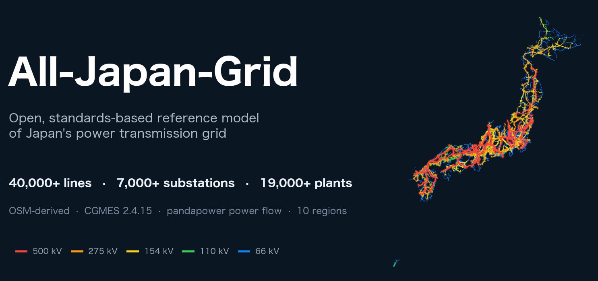
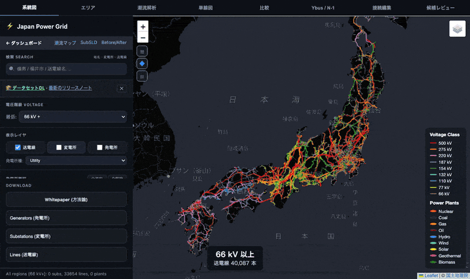
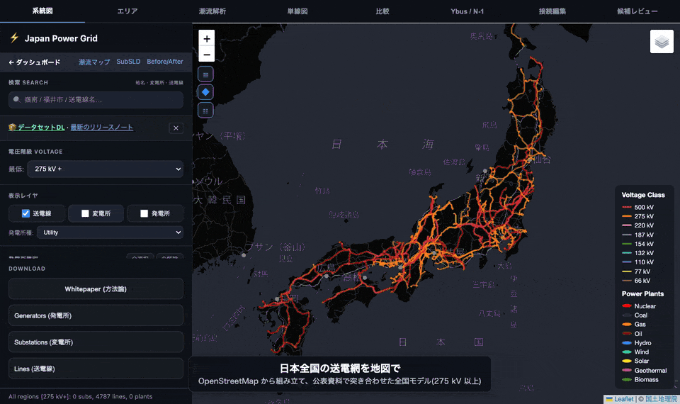
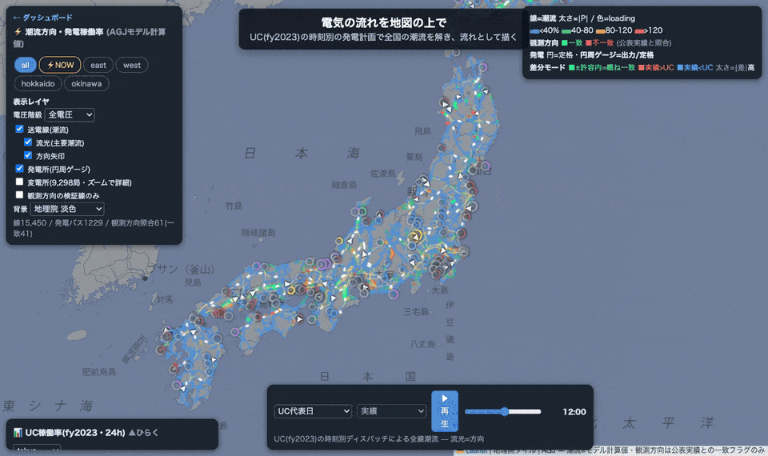
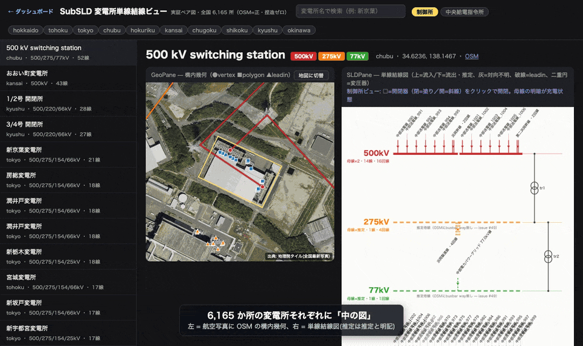
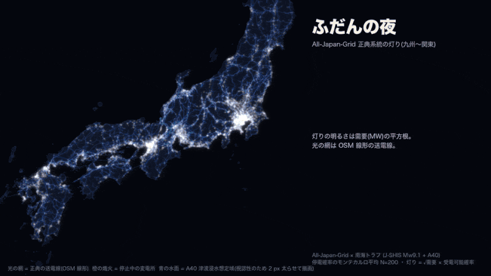
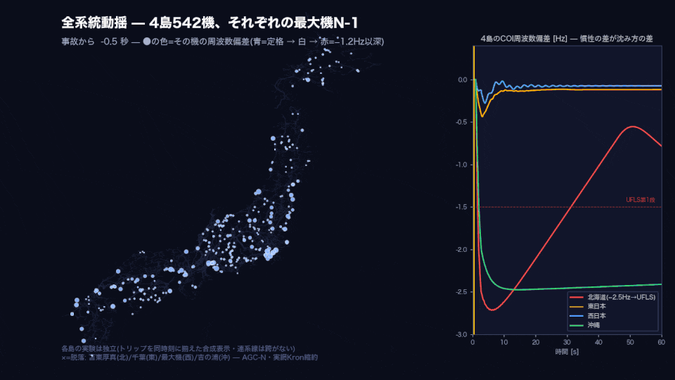
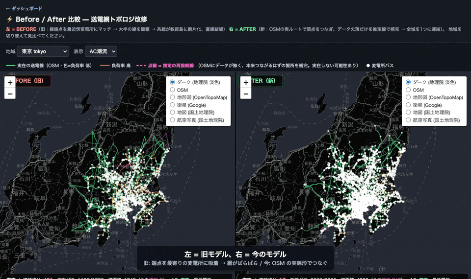
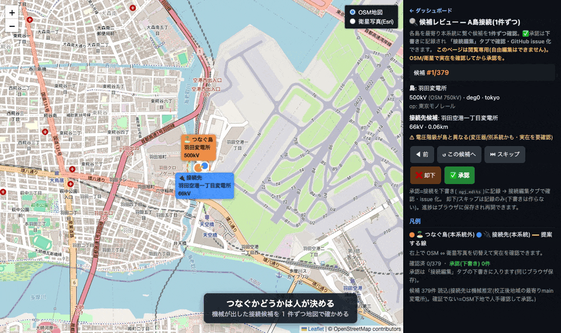
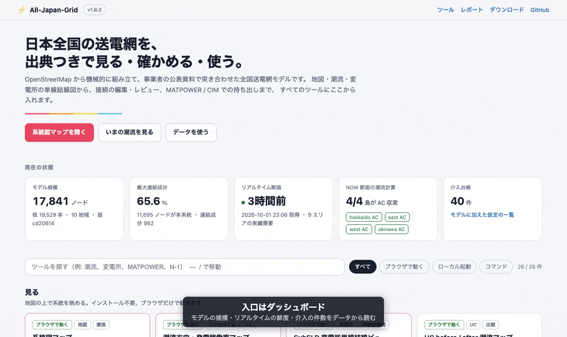

<p align="center">
  
</p>

# All-Japan-Grid

<!-- [[[cog import cog, scripts.readme_numbers as n; cog.out(n.badges()) ]]] -->
[](CHANGELOG.md) [](https://lutelute.github.io/All-Japan-Grid/download.html) [](docs/MODEL_INTERVENTIONS.md) [](https://opendatacommons.org/licenses/odbl/) [](LICENSE)
<!-- [[[end]]] -->

**日本全国の送電網を、出典つきで見る・確かめる・使う。**
OpenStreetMap から機械的に組み立て、事業者の公表資料で突き合わせた全国の送電網モデルです。
地図で眺めるだけでなく、潮流が解け、変電所の中まで描け、災害で何が起きるかを試せます。
どの仮定をどこに置いたかは、すべて台帳で追えます。

**See, check and use Japan's transmission grid — with sources.** An open model of the national grid,
built automatically from OpenStreetMap and checked against what the utilities publish. It renders on a
map, solves power flow, draws every substation, and lets you stress-test it — and every modelling
assumption is listed in a registry you can read.

<p align="center">
  
</p>

| | |
|---|---|
| **ダッシュボード / Dashboard** | **https://lutelute.github.io/All-Japan-Grid/** — すべてのツールの入口 / every tool on one page |
| 系統図マップ / Grid map | https://lutelute.github.io/All-Japan-Grid/map.html |
| 潮流マップ / Flow map | https://lutelute.github.io/All-Japan-Grid/flow_map.html |
| 変電所の単線結線図 / SubSLD | https://lutelute.github.io/All-Japan-Grid/subsld.html |
| ダウンロード / Download | https://lutelute.github.io/All-Japan-Grid/download.html |

<!-- [[[cog cog.out(n.scale()) ]]] -->
**規模** — OSM から抽出: 送電線 40,087 本・変電所 6,962 か所・発電所 19,138 か所(10 地域)。潮流計算に使う正典モデル(`docs/data/built/`)は 17,841 ノード・19,529 枝。モデルに加えた仮定は介入台帳に 44 件。リリース v1.8.0・配布データセット v1.7.0。
/ **Scale** — extracted from OSM: 40,087 lines, 6,962 substations, 19,138 plants across 10 regions. The canonical model used for power flow has 17,841 nodes and 19,529 branches; 44 modelling assumptions are listed in the intervention registry. Release v1.8.0, dataset v1.7.0.
<!-- [[[end]]] -->

---

## できること / What you can do

### 全国の送電網を地図で見る / Explore the national grid

電圧を下げるほど細かい網が現れます。首都圏や関西に寄ると変電所が出て、クリックすれば構内図と
単線結線図へ。系統図・エリア・潮流・単線図・比較・Ybus/N-1・接続編集・候補レビューの 8 タブ。

Lower the voltage threshold and the finer network fills in; zoom in for substations, click through to
their diagrams. Eight tabs: grid, areas, power flow, single-line, compare, Ybus/N-1, editing, review.

<p align="center"></p>

→ [系統図マップを開く / Open the map](https://lutelute.github.io/All-Japan-Grid/map.html) ・ 見どころ: [docs/WHAT_TO_CHECK.md](docs/WHAT_TO_CHECK.md)

### 電気の流れを見る / Watch power flow

UC(fy2023)の時刻別の発電計画で全国の潮流を解き、線の太さ・負荷率の色・流れる向きの光で描きます。
1 日を再生でき、**⚡NOW** では各社「でんき予報」の実績需要に合わせて解き直した今の断面を見られます。

Power flow solved for every hour of a unit-commitment day, drawn as width (|P|), colour (loading) and
moving light (direction). **⚡NOW** re-solves the grid against the utilities' published actual demand.

<p align="center"></p>

→ [潮流マップを開く / Open the flow map](https://lutelute.github.io/All-Japan-Grid/flow_map.html) ・ 仕組み: [docs/REALTIME_OPS.md](docs/REALTIME_OPS.md)

### 変電所の中を見る / Look inside every substation

<!-- [[[cog cog.out(n.subsld_paragraph()) ]]] -->
6,165 か所の変電所それぞれに、航空写真の上の構内図(OSM の実線形と端子)と、その場で描く
単線結線図(母線・回線数・流向・変圧器)を並べます。推定した母線や流向は推定と明記します。
制御所ビューでは開閉器をクリックして開け閉めでき、母線の明暗で充電状態がわかります。
<!-- [[[end]]] -->

Every substation gets an evidence-paired figure: the site on aerial imagery next to a single-line
diagram drawn in the browser. Estimates are labelled as estimates; open a breaker and watch the busbar go dark.

<p align="center"></p>

→ [SubSLD を開く / Open SubSLD](https://lutelute.github.io/All-Japan-Grid/subsld.html) ・ 手法: [docs/SUBSLD_METHOD.md](docs/SUBSLD_METHOD.md)
・ 母線・開閉器・変圧器の巻線を OSM の node ID で結んだ観測の台帳: [docs/STATION_NODE_BREAKER.md](docs/STATION_NODE_BREAKER.md)

### 災害で試す — 南海トラフ / Stress-test it: the Nankai Trough earthquake

J-SHIS の地震動(Mw9.1)と A40 の津波浸水想定から設備の損傷を確率的に引き、周波数・リレー・系統分離の
動的カスケードを経て、復旧の時間推移までをモンテカルロで解きます。夜の灯りが消えて、日ごとに戻っていく映像は
正典(run_v10)の計算結果です。発災直後〜1 日は内閣府の想定と同じ桁ですが、**4 日目以降は内閣府の想定より
約 1 桁多く**、復旧モデルの課題として調べています。

Ground motion (J-SHIS, Mw 9.1) and tsunami inundation (A40) drive sampled equipment damage, a dynamic
cascade (frequency, relays, islanding) and a Monte-Carlo restoration. Day 0–1 matches the Cabinet Office
scenario in magnitude; from day 4 the model is about ten times higher, which is under investigation.

<p align="center"></p>

→ 手法と実行: [hazard/nankai/README.md](hazard/nankai/README.md)

### 動きを解く / Dynamics

AC 運転点から多機の動揺方程式を立て、事故後の周波数・位相の動きを解きます。全系統 4 島 542 機に、
それぞれの島で最大の発電機が脱落したときの周波数の落ち込みと回復。N-1 全枝スクリーニング、SCR による
連系可能量、連続潮流(PV 曲線)もコマンドで回せます。

Multi-machine swing dynamics from the AC operating point; here, the largest unit trips in each of the
four islands (542 machines). N-1 screening, SCR hosting capacity and continuation power flow are CLIs.

<p align="center"></p>

→ コマンドの一覧: [docs/DATASET.md#analysis-tools--解析ツール](docs/DATASET.md#analysis-tools--解析ツール)

### 確かめる・直す / Check it, fix it

旧モデル(端点を最寄りの変電所に吸着して網がばらばら)と今のモデル(OSM の実線形でつなぐ)を地域ごとに
見比べられます。機械が出した接続候補は、地図の上で人が 1 件ずつ承認・却下します(下書き → issue で提案)。

Compare the old fragmented model with the current one region by region, and review machine-proposed
connections one by one on the map (drafts become issues).

<table><tr>
<td width="50%"></td>
<td width="50%"></td>
</tr></table>

→ 手順: [CONTRIBUTING.md](CONTRIBUTING.md) ・ 仮定の台帳: [docs/MODEL_INTERVENTIONS.md](docs/MODEL_INTERVENTIONS.md)

---

## すぐ使う / Quickstart

**ブラウザで / In the browser** — [ダッシュボード](https://lutelute.github.io/All-Japan-Grid/)から。
状態(モデルの規模・リアルタイムの鮮度・介入の件数)はデータから読み、ツールは検索で絞れます。

<p align="center"></p>

**データだけ / Just the data** — [ダウンロードページ](https://lutelute.github.io/All-Japan-Grid/download.html)の
自己完結バンドル(`src`・`config`・データ同梱、clone 不要)で MATPOWER の潮流と Excel → 24 時間 UC が回ります。
pandapower・PyPSA への取り込みは [docs/INTEROP.md](docs/INTEROP.md)、配布の詳細は [dataset/README.md](dataset/README.md)。

**リポジトリから / From the repo** — Python 3.10+

```bash
pip install -e .
ajgrid regions                                        # 10 地域
ajgrid solve okinawa --topology snapped --reconnect   # 組み立て + AC/DC 潮流
ajgrid cim --regions okinawa --verify                 # CIM/CGMES Level 2 を書き出す
ajgrid db ingest                                      # 生の OSM + キュレーションから DB を作り直す
ajgrid coverage                                       # 検証済みと合成の内訳

# ローカルの完全版(接続エディタの検証・反映、ツール実行ダッシュボード)
PYTHONPATH=. uvicorn src.server.app:app --host 127.0.0.1 --port 8088   # → http://localhost:8088/
```

## どこまで信じてよいか / How far to trust it

- **地理トポロジが出発点**です。OSM 由来で、事業者の公式データではありません。線路の所有者(`operator`)も保証しません。
  / It starts from OSM geography, not official utility data; operator attribution is not guaranteed.
- 電気的に解けるようにするための仮定(インピーダンスの標準値、降圧点の補完、回線数、容量の較正など)は
  **[介入台帳](docs/MODEL_INTERVENTIONS.md)** に根拠・帳簿・無効化の方法つきで全件載せています。線ごとの値は仮定を重ねた推定で、個別に引用できる値ではありません。
  / Every assumption needed to make it solvable is in the intervention registry; per-line values are estimates.
- 実績需要に合わせた NOW 断面では 4 つの同期島すべてで AC 潮流が収束します。発電機の無効電力制約を課した東のピーク断面はまだ収束せず、診断中です。
  / AC power flow converges on all four islands for the NOW snapshot; the east peak case with Q-limits does not yet.
- 限界・既知の品質問題・検証の出典: [docs/DATASET.md](docs/DATASET.md#limitations--what-this-data-is-not--本データの限界)・[docs/VALIDATION_SOURCES.md](docs/VALIDATION_SOURCES.md)・[docs/COVERAGE.md](docs/COVERAGE.md)

## ドキュメント / Documentation

| | |
|---|---|
| [docs/README.md](docs/README.md) | **文書の地図**(方法論・データの使い方・設計・運用・記録) |
| [docs/DATASET.md](docs/DATASET.md) | データセットの詳細(形式・CIM/CGMES・出典・限界) |
| [docs/HIGHLIGHTS.md](docs/HIGHLIGHTS.md)・[CHANGELOG.md](CHANGELOG.md) | リリースの要点・全履歴 |
| [WHITEPAPER.md](WHITEPAPER.md)・[papers/](papers/) | 手法・論文原稿 |
| [CONTRIBUTING.md](CONTRIBUTING.md) | データの穴と、OSM を取り直しても失われない貢献の経路 |

## リポジトリの構成 / Repository layout

```
docs/          GitHub Pages(ダッシュボード・各ツール・docs/data)と文書(docs/README.md が地図)
src/           モデル・潮流・UC・動態・CIM・DB・サーバー
scripts/       パイプライン・解析・書き出し・図(scripts/README.md)
hazard/        南海トラフ電力ハザード(hazard/nankai)
dataset/       配布バンドルの入口とチュートリアル
data/ config/  地域別 GeoJSON・DB キュレーション・設定
tests/         pytest
papers/        論文原稿(電気学会・IEEE Access)
dist/          CIM/CGMES などの配布物(サンプルのみ追跡)
```

README の GIF は `python scripts/make_readme_gifs.py` で撮り直し、数字は `cog -r README.md` でデータから書き直します。
/ The animations are re-recorded by `scripts/make_readme_gifs.py`; the numbers above are regenerated from data with `cog`.

## 免責事項 / Disclaimer

本データは公開データ(主に OpenStreetMap)を**機械的に処理**して作ったもので、電力会社・送配電事業者・政府機関の
公式情報ではありません。誤り・欠落を含みうるので、**利用は自己責任**でお願いします。
/ Generated automatically from public data (mainly OpenStreetMap); not official information from any utility or
agency. It may contain errors — **use at your own risk**.

<details>
<summary>全文 / Full text</summary>

> **English:**
> This dataset is generated **automatically by machine processing** of publicly available [OpenStreetMap](https://www.openstreetmap.org/) data. It does **not** reflect official information from any electric power company, transmission operator, or government agency. The data may contain errors, omissions, or inaccuracies inherent to crowdsourced mapping and automated extraction. **Use at your own risk.** The authors assume no liability for any damages, losses, or consequences arising from the use of this data. This dataset is provided "as is" without warranty of any kind, express or implied.

> **日本語:**
> 本データセットは、公開されている [OpenStreetMap](https://www.openstreetmap.org/) のデータを **機械的に自動処理** して生成したものです。各電力会社・送電事業者・政府機関等の公式情報を正確に反映したものでは **ありません**。クラウドソーシングによる地図データおよび自動抽出処理に起因する誤り・欠落・不正確さが含まれる可能性があります。**本データの利用は自己責任** でお願いいたします。本データの利用により生じたいかなる損害・損失・結果についても、作成者は一切の責任を負いません。本データセットは明示・黙示を問わず、いかなる種類の保証もなく「現状のまま」提供されます。

> **⚠ Operator / Ownership Attribution / 事業者・所有者情報について:**
> This dataset is **not** derived from official data published by General Electricity Transmission and Distribution Operators (一般送配電事業者). In OpenStreetMap, the `operator` tag on transmission/distribution lines does not always reflect the actual asset owner. Since all features are extracted automatically from open data **without authoritative ownership information**, the operator attribution of individual lines and substations is **not guaranteed** to be correct. Lines that cross utility service area boundaries, shared facilities, and assets transferred between operators may be particularly inaccurate.
>
> 本データセットは一般送配電事業者が公開する公式データから作成したものでは **ありません**。OpenStreetMap 上の送配電線の `operator` タグは、実際の設備所有者と異なる場合があります。所有者情報を持たないオープンデータから自動的に抽出した処理であるため、個々の送電線・変電所の事業者帰属は **保証されません**。特に、事業者の供給区域をまたぐ線路、共用設備、事業者間で移管された設備などは不正確な可能性が高くなります。

> **Important / 重要:** This dataset provides the **geographic layout** of Japan's transmission infrastructure. It is **not** a ready-to-use electrical model; see [Limitations](docs/DATASET.md#limitations--what-this-data-is-not--本データの限界).
>
> 本データセットは日本の送電インフラの **地理的配置** を提供するものです。そのまま使える電力系統モデルでは **ありません**。詳しくは [本データの限界](docs/DATASET.md#limitations--what-this-data-is-not--本データの限界) を参照してください。

</details>

**機密・NDA のデータはこの公開リポジトリに送らないでください。** / Please never submit confidential or NDA data to this public repository.

## 引用・ライセンス / Citation & License

- 引用 / Cite: [CITATION.cff](CITATION.cff)(GitHub の「Cite this repository」)
- ネットワークデータ / Network data: [ODbL](https://opendatacommons.org/licenses/odbl/)(OpenStreetMap)
- 発電所の権威データ / Plant overlay: 「国土数値情報(発電所データ P03)」(国土交通省, https://nlftp.mlit.go.jp/ksj/)— 派生属性のみ、元の GML は再配布しない / derived attributes only
- 背景地図 / Basemap: 国土地理院タイル(淡色地図・航空写真)
- コード / Code: MIT
