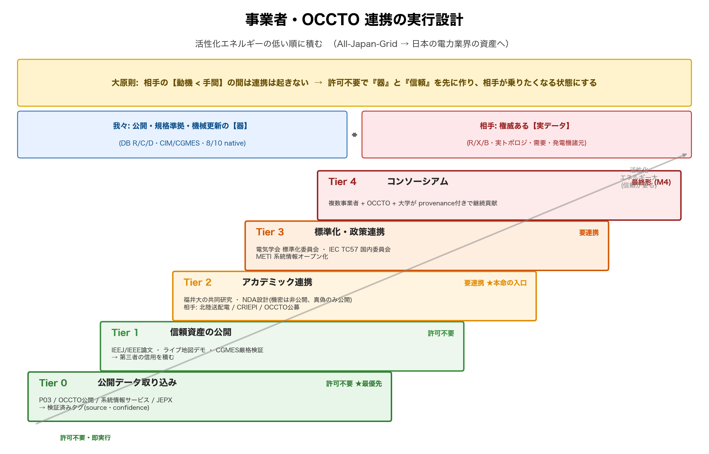

# Engagement — 事業者・OCCTO との連携設計

**位置づけ.** [VISION.md](VISION.md) の最難関 **Pillar 3（地図→検証済み電気モデル）** は、
技術ではなく**権威データへのアクセス＝連携**が律速。本書はその連携を「願望」ではなく
**活性化エネルギーの低い順に積む実行設計**として定義する。

> **大原則 — 非対称性を直視する.** 我々は「公開・規格準拠・機械更新可能な器」を持ち、
> 相手（OCCTO・送配電10社）は「権威ある実データ」を持つ。**相手にとって連携の手間 >
> 見返り**である限り連携は起きない。だから戦略の核は「**連携を待つ間に、連携無しでできる
> ことを最大化し、相手が"乗りたくなる"信頼資産（論文・規格適合・実証・公開デモ）を積む**」こと。
> いきなり「データをください」ではなく、「**入れる器が既にある／公共価値が見える**」状態を作る。

---

## 1. アクター地図 / Who has what, and why they'd engage

| アクター | 持っているもの | 開示の度合い | 連携の動機（こちらの価値提案） |
|---|---|---|---|
| **OCCTO**（電力広域的運営推進機関） | 連系線容量・エリア需要・供給計画・広域系統長期方針(マスタープラン) | **一部公開**（広域系統長期方針/連系線/需給実績）。詳細は非公開 | 公共機関。再エネ大量導入の系統影響評価を外部エコシステムに開く価値。内部のデジタル化(CIM化)と整合 |
| **一般送配電10社**（東京PG・関西送配電 等） | 実トポロジ・R/X/B・定格・変圧器・開閉所 | **限定公開**（系統情報サービス: 空き容量・設備情報の一部、託送約款、設備形成計画） | 機密実データを出さずに外部ツール開発を促す"サンドボックス"。CGMES経由で後から自社モデルに接続可。外部問い合わせ対応負荷の軽減 |
| **METI/資源エネルギー庁** | 政策・開示義務の梃子 | — | GX/DX・系統情報オープン化の公共価値の実証材料 |
| **CRIEPI**（電力中央研究所） | 検証データ・系統解析知見 | 研究協定ベース | 共同研究の解析プラットフォーム |
| **大学・電気学会(IEEJ)** | 研究・標準化・査読の場 | オープン | 引用可能な再現データセット、標準化の参照実装 |
| **IEC TC57 / ENTSO-E** | CIM/CGMES 規格 | オープン | 日本の CGMES 参照実装としての可視性 |
| **国土数値情報(MLIT)・JEPX** | P03発電所・エリアプライス | **完全公開** | 即時取り込み可（許可不要） |

---

  

## 2. 連携ラダー（活性化エネルギーの低い順）

### Tier 0 — 公開データの取り込み【許可不要・即実行】★最優先
連携を1件も結ばずに「権威データで一部を検証済みにする」ところまで進める。これが信頼資産の土台。
- **国土数値情報 P03（発電所）** — 既に `enrich_plants_p03`/`enrich_p03` 実装済み。GML取得のみ。
- **OCCTO 公開データ** — 連系線容量、エリア需要実績、供給計画、広域系統長期方針の公開図表。
- **系統情報サービス（送配電各社）** — 空き容量マップ・設備情報の公開分。
- **JEPX** — エリアプライス（負荷/経済性の傍証）。
- 取り込んだ属性は DB の C 層に **`source=p03`/`occto`/`occto_public` + `confidence`** で記録し、
  合成値と峻別。**「検証済みタグ」が増えるほど、相手に見せられる説得材料になる。**
- ※具体的データの公開範囲・ライセンスは取得前に要確認（本書は構造、URLは別途検証）。

### Tier 1 — 信頼資産の公開【許可不要・並行】
相手が"乗りたくなる"状態を作る。
- **論文**（電気学会 `papers/ieej.tex` を投稿/発表）+ **IEEE Access 版**。査読＝第三者の信用。
- **「データギャップと貢献方法」ページ**（`CONTRIBUTING` + 本書）— 何が欠けていて、誰がどう
  助けられるかを明示。誤接続・実値の投稿経路（DB の `manual`/`external` source）を整備。
- **公開デモ**（GitHub Pages のライブ地図 + CGMES往復 + 8/10 native 収束）— "動く器"の可視化。
- **CGMES 厳格検証通過**（CIMverter 等）— 規格適合の客観的証明。

### Tier 2 — アカデミック連携【協定ベース・本命の入口】★福井大学の梃子
**所属（福井大学 工学部 電気電子情報工学科）が最大の連携資産。** 個人の「データください」は
通らないが、**大学の共同研究・データ利用契約**なら筋が通る。
- **共同研究の提案先**: 送配電1社（地域的に北陸電力送配電が距離的・関係的に現実的）、CRIEPI、
  OCCTO の研究公募。
- **提案の型**: 「貴社の検証データで、この**公開・規格準拠モデルの一部区間を検証する**共同研究。
  成果は規格適合の参照実装として公開、機密実データは出さない（検証は区間単位の可否のみ公開）」。
- **NDA設計**: 機密データは**公開リリースに入れない**。検証結果（"この区間は実測と整合"の真偽）
  のみ `confidence` タグとして公開。データそのものは agreement-tier に隔離（§4）。
- **指導教員・研究室経由**で電力会社/CRIEPI とのチャネルを開く（学会・OB・地域連携）。

### Tier 3 — 標準化・政策連携【中長期・信用が積み上がってから】
- **電気学会の標準化委員会 / IEC TC57 国内委員会** に「日本系統 CGMES 参照実装」として提示。
- **OCCTO のデジタル化（CIM/広域連系系統の標準化）** と整合させ、外部参照モデルとして位置づけ。
- **METI の系統情報オープン化政策** に、本プロジェクトを"公共の器"の実例として提供。

### Tier 4 — コンソーシアム/業界連携【最終形・M4】
複数事業者・OCCTO・大学が provenance 付きで継続貢献する運営体。M2/M3 の信頼が前提。

---

## 3. 価値提案の言語化（相手別・1行）
- **OCCTO**: 「再エネ・GX の系統影響を、外部エコシステムが**規格準拠で**検討できる公共の器」。
- **送配電10社**: 「**機密を出さずに**外部ツール開発を促し、CGMES で後から自社モデルに繋がる
  サンドボックス。外部問い合わせ対応の肩代わり」。
- **大学/CRIEPI**: 「引用可能・再現可能・標準準拠の日本系統。教育と研究の共通基盤」。
- **METI**: 「系統情報オープン化の公共価値を、動く実装で示す実例」。

## 4. 法務・ガバナンス（連携の前提条件）
連携は信頼が通貨。データの取り扱いを間違えると一発で失う。
- **ライセンス層別**: データ ODbL（OSM）/ コード MIT。権威データは**属性単位で出典ライセンスを
  保持**（DB の `enrichments.source` が既にこれを担う）。混在を避ける。
- **機密ファイアウォール**: agreement-tier の機密データは**公開リポジトリ/Release に絶対に入れない**。
  公開されるのは「検証済み真偽 + confidence」のみ。物理的に別ストア（DB の source/visibility で分離）。
- **来歴と再現性**: 全属性に source/confidence/取得日。誰が・いつ・どの権威で補正したか追跡可能。
- **免責の継続**: 「地図 ≠ 運用モデル」「合成値 vs 検証値」の明示を続ける（誇張の防止が公共価値）。

## 5. 具体アクションプラン（次の一歩）
| 順 | アクション | 連携要否 | 担い手 |
|---|---|---|---|
| 1 | P03 GML 取得 → `scripts/db/enrich.py --p03` でサーバー実行、検証済みタグ付与 | **不要** | サーバー作業 |
| 2 | OCCTO/系統情報サービスの公開データを ingest し `confidence` タグ化 | **不要** | サーバー作業 |
| 3 | `CONTRIBUTING.md` に「データギャップ・貢献経路」を明文化 | 不要 | ドキュメント |
| 4 | IEEJ/IEEE 論文を投稿・発表（第三者信用） | 不要 | 執筆 |
| 5 | 指導教員と共同研究先（北陸送配電/CRIEPI/OCCTO公募）を相談、NDA設計（§2 Tier2） | **要** | 大学チャネル |
| 6 | 電気学会標準化委員会 / IEC TC57 国内委員会へ参照実装として提示 | 要 | Tier3 |

**結論**: 連携の律速は「相手の動機 < 手間」。だから **Tier 0–1（許可不要のデータ取り込み＋信頼資産の
公開）で"入れる器がある／公共価値が見える"状態を先に作り**、その上で **Tier 2（福井大学の共同研究）**を
本命の入口にする。器（DB・CIM・機械更新）は既に M0 で完成しているので、次の投資は**信頼の可視化**である。
