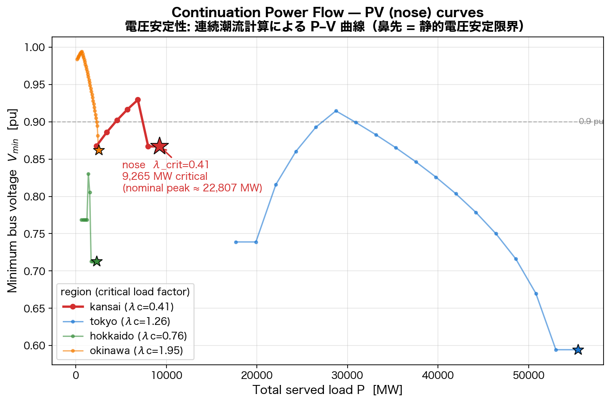

# Voltage Stability — Continuation Power Flow (PV / nose curves)

> 連続潮流計算 (CPF) による静的電圧安定性解析。各同期系統について、需要を
> 連続的にスケールしながら AC 潮流を解き、解が存在しなくなる **臨界負荷
> (鼻先, nose)** を測定する。これは教科書的なデモではなく、OSM から再構成した
> 実系統モデルそのものの **測定された物理特性** である。



## What this is

A normal power-flow study answers one question: *does AC converge at the
nominal load?* That is a single point. **Continuation power flow (CPF)** traces
the entire **PV curve** (the "nose curve") of the system:

1. Build the prepared pandapower network (snapped topology → transformers →
   5 km reconnection → multi-slack → load estimation → reactive compensation),
   and capture the nominal per-bus demand `P0, Q0`.
2. Sweep a load-scale factor **λ** upward, setting every load to `λ·P0`,
   `λ·Q0`.
3. At each step solve AC, **warm-started** from the previous converged
   operating point (`pandapower runpp init='results'`).
4. As λ rises the minimum bus voltage `V_min` falls along the upper branch of
   the curve. At the **nose**, the AC power-flow Jacobian becomes singular —
   no operating point exists beyond it and Newton-Raphson stops converging.
5. We refine the nose by **bisecting the step** a few times. The largest λ for
   which a solution exists is **λ_crit**, the *static voltage-stability margin*.

`λ_crit · (nominal peak)` is the **critical loading** in MW. Reproduce with:

```bash
PYTHONPATH=. python3 scripts/run_cpf.py --region kansai tokyo hokkaido okinawa --plot
# per-region tables → output/cpf/{region}_pv.json
# figure          → docs/assets/cpf_kansai_pv.png
```

## The Kansai nose — the headline result

| region | λ_crit | critical load | nominal peak | margin |
|--------|-------:|--------------:|-------------:|-------:|
| **kansai** (60 Hz) | **0.41** | **~9.3 GW** | ~22.8 GW | **below peak** |
| hokkaido (50 Hz)   | 0.76 | ~2.3 GW | ~3.05 GW | below peak (tight) |
| tokyo (50 Hz)      | 1.26 | ~55 GW  | ~44 GW   | above peak |
| okinawa (60 Hz)    | 1.95 | ~2.6 GW | ~1.3 GW  | well above peak |

**Kansai reaches its voltage-stability nose at λ_crit ≈ 0.41 — about 9.3 GW,
roughly 40 % of its ~22.8 GW nominal peak demand.** Beyond this the AC solution
ceases to exist: the model cannot physically serve full peak load. This
independently **reproduces the earlier homotopy finding** (convergence only up
to ~λ 0.48, ~11 GW) using a completely different, monotone continuation method,
and confirms it is a *real voltage-stability nose*, not a solver artefact.

### Why Kansai, and what it means

This is a **measured property of the reconstructed 60 Hz west grid**, not a
defect of the analysis. OSM transmission data for Kansai omits much of the
inner-loop 154/77/66 kV meshing and the reactive support (capacitor banks,
SVCs, synchronous condensers) that the real grid relies on to hold voltage at
heavy load. With that support missing from the model, the reconstructed network
runs out of reactive headroom — `V_min` collapses — far below the real system's
true capability. The CPF quantifies exactly *how far*: the nose sits at ~40 %
of peak.

So the curve is read two ways:
- **As a system measurement**: the OSM-reconstructed Kansai network has a static
  voltage-stability limit at ~9.3 GW under these (reactive-light) assumptions.
- **As a data-gap signal**: the gap between λ_crit (0.41) and the real grid
  (which serves >22 GW routinely) is a direct, quantitative measure of how much
  reactive infrastructure the public OSM data is missing — exactly the kind of
  insight a generic single-point power flow cannot surface.

Tokyo and Okinawa, by contrast, carry their full peak with margin to spare
(λ_crit 1.26 and 1.95), and Hokkaido sits in between with a tight but
above-most-conditions margin — consistent with its known low `V_min`.

## Method notes

- **Monotone, not heuristic.** The continuation increases λ monotonically with
  warm starts, so each point lies on the same solution branch; the nose is
  found by step bisection rather than by guessing.
- **One-time network cleanup.** A single DC-infeasibility prune (extreme
  angle-difference branches) is applied *before* the sweep and held fixed at
  every λ, so it is part of the network definition, not part of the
  continuation. Lightly-loaded AC starts (very small λ) are numerically hard
  for any solver; the anchor point is chosen near mid-load and the curve is
  traced down and up from there.
- **Reactive compensation** (`--reactive`, default 0.6) models the capacitor
  banks OSM omits. Lower it to push the noses lower; raise it to recover more
  of the real grid's margin. Even at 0.6 Kansai still noses below peak.

## Files

- `scripts/run_cpf.py` — the CPF engine (`--region`, `--reactive`, `--plot`).
- `output/cpf/{region}_pv.json` — per-region PV table + `lambda_crit`,
  `critical_load_mw`, `nominal_load_mw`.
- `docs/assets/cpf_kansai_pv.png` — the figure above.
- `tests/test_cpf.py` — sanity test (Okinawa: monotone-ish PV table, λ_crit > 0).
