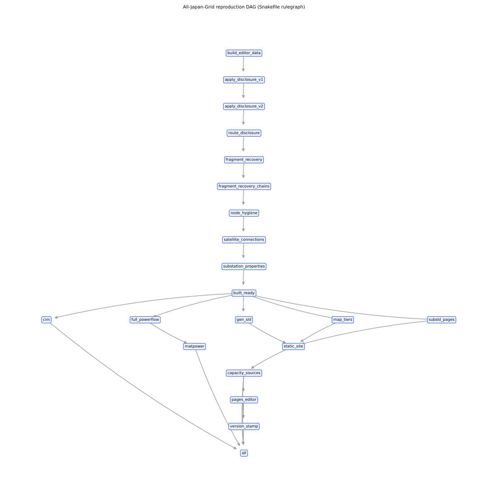

# 再現手順 — Reproducibility Recipe

fresh clone から本プロジェクトの全ヘッドライン数値を再現する完全レシピ。
**正本はDB**（`ajgrid db ingest` が raw + キュレーション資産を完全復元）であり、
潮流パイプラインはファイルを介さず DB から直接再現できる。

## 0. セットアップ

```bash
git clone https://github.com/lutelute/All-Japan-Grid && cd All-Japan-Grid
python -m venv .venv && source .venv/bin/activate
pip install -e ".[dev]"
python -m pytest -q          # 950 passed が基準線
```

## 1. DB再構築（機械的更新の起点）

```bash
ajgrid db ingest             # data/*.geojson + data/db/enrichments.jsonl(キュレーション正本)
                             # → data/grid.db (66,177 features + 232k curated rows)
ajgrid coverage              # 来歴カバレッジ（検証済 vs 合成の正直な内訳）
```

## 2. 潮流計算（DBのみから再現）

```bash
ajgrid solve kansai --reconnect --source db --backbone   # AC収束・vm≥0.86
ajgrid solve tokyo  --reconnect --source db              # フルモデル
```

`--source db` はファイル構築と**完全同一**の網を構成する
（回帰テスト `tests/test_db_source_build.py` が同一性をpin）。

## 3. KPI・回帰（改善はすべてこの物差しで測る）

```bash
ajgrid validate --topology --all --solve --backbone \
    --json /tmp/now.json --baseline docs/reports/topology_backbone_stack_2026-06-11.json
```

ヘッドライン（**2026-06-11 当時値**・当時の committed JSON と一致するはず。現状値は §8 の検証行列と `docs/reports/uc_pf_built_*_2026-09-02.json` を正とする）:
backbone/フル両モデル **AC 10/10**・backbone vm_min ≥0.86・合成線率 関西2.0%。

## 4. 外部データ（再配布不可 → 各自取得、コマンドは下記）

```bash
# 関西送配電 空容量CSV（毎日更新）
curl -L -o data/external/kansai_td/154kv_more_line.csv \
  https://www.kansai-td.co.jp/interchange/takusou/pdf/154kv_more_line.csv
# 東電 潮流実績（FY2024通年・基幹）: zipはCP932名 → scripts参照 or 手動展開
curl -A "Mozilla/5.0" -o data/external/tepco/tyouryu_kikan.zip \
  https://www.tepco.co.jp/pg/consignment/system/pdf/tyouryu_kikan.zip
# 国土数値情報 P03（発電施設GML; zip内部名はCP932→python zipfileで展開)
curl -A "Mozilla/5.0" -o /tmp/P03-13.zip https://nlftp.mlit.go.jp/ksj/gml/data/P03/P03-13/P03-13.zip
# → data/external/P03-13/P03-13-g.xml に展開後:
PYTHONPATH=. python scripts/db/enrich.py --p03 data/external/P03-13/P03-13-g.xml
# OCCTO 公表API（30分値・保持~14ヶ月）
python scripts/fetch_occto_kohyo.py --from 2025-04-01 --to 2026-06-09
# 開示集計のDB化（境界回廊の実測重み付け & --from-db 検証が有効になる）
PYTHONPATH=. python scripts/db/calibrate.py   # → measured_line_stats + measured_bus_loads
# 国勢調査2020 1kmメッシュ人口（e-Stat、出典明記で利用可。残余需要のspatial=population用）
python scripts/fetch_estat_mesh.py            # → data/external/estat/ (関東12メッシュ)
```

## 5. 外部検証（誠実指標）

```bash
python -m src.validation.external_match kansai \
    --csv data/external/kansai_td/154kv_more_line.csv      # 名前recall等
python -m src.validation.external_tepco                    # 帯別接続recall(trunk/154/66)
python -m src.validation.external_tepco --flows --backbone 0   # 3層内部ρ(フルモデル)
python -m src.validation.external_tepco --flows --backbone 0 --from-db
                                # ↑calibrate済DBから同じ物差しを再現(CSV直読み不要)
```

注意: 外部CSVは更新され続けるため、recall/ρは取得日でわずかに変動する。
committed スコアカード（docs/reports/external_*_2026-06-1*.json）が当時値の正本。

## 6. 成果物の再生成

```bash
bash scripts/regen_powerflow_snapped.sh --promote   # ライブマップ(docs/data/powerflow)
PYTHONPATH=. python scripts/export_cim_level2.py --verify   # CIM L2 + cim2pp往復
PYTHONPATH=. python scripts/validate_cgmes.py --all --dir dist/cim_level2
PYTHONPATH=. python scripts/gen_cim_national_pf.py  # 国家PF図(需要スケール無し)
PYTHONPATH=. python scripts/export_other_freq_layer.py      # 他周波数参考レイヤ
ajgrid solve national                                # 全国ゾーナル(westはDC)
```

## 7. 決定論の注意

- ビルダー・ディスパッチ・縮約は全て決定論（乱数不使用）。同一入力→同一網
- 唯一の非決定要素は**外部データの取得日**（OSM再fetch・各社CSV・OCCTO窓）。
  キュレーションは enrichments.jsonl（git追跡）に在るため再fetchでも保全される
- 各改善の判断根拠とKPI変化は `docs/reports/IMPROVEMENT_LOG.md`（モデル名つき台帳）

## 8. ワンコマンド再現DAG（Snakemake・2026-09-02）

`regenerate_all.py` の STEPS を**ファイル/センチネル依存の DAG**として `Snakefile` に
宣言し直した（21 ルール・ロジックの再実装はせず既存スクリプトを呼ぶだけ）。
介入適用群（#28/#29/#34/#35/#36 …）は `docs/data/built/all.json` を in-place で
変異させるため、ファイル時刻では依存を表現できず `.stamps/` のセンチネルで順序を固定する。

```bash
uv run --with snakemake --no-project snakemake -n --cores 1     # dry-run（実行計画・21ジョブ）
uv run --with snakemake --no-project snakemake light --cores 1  # 軽い再現: editor + static のみ
uv run --with snakemake --no-project snakemake --cores 1        # 全再生成（重い・数十分）
uv run --with snakemake --no-project snakemake --rulegraph --cores 1 \
  | PYTHONPATH=. python3 scripts/ci/render_rulegraph.py --out docs/figures/dag.svg
```



- 図は `graphviz(dot)` 無しで描く（`scripts/ci/render_rulegraph.py`・networkx+matplotlib）。
  `dot` がある環境なら `snakemake --dag | dot -Tsvg` でも同じ。
- **含めないもの（正直に）**: raw OSM の再取得（Overpass）。`data/osm_raw/` の断面
  （下記 §9）を基底とし、再取得は明示操作。変異チェーンの途中だけの `--forcerun` は
  中間状態になるため非推奨（`build_editor_data` から作り直すのが正）。
- 形の回帰: `tests/test_repro_dag.py`（rule の存在・センチネル連鎖の順序・輸出の built_ready 依存）。

## 9. OSM 断面時刻（osm3s・2026-09-02）

Overpass 生レスポンス（`data/osm_raw/*.json`）の `osm3s.timestamp_osm_base` を走査し、
`docs/data/MODEL_VERSION.json` と `datapackage.json` に `osm_snapshot` として刻印する。

```bash
PYTHONPATH=. python3 scripts/record_osm_snapshot.py --check   # 表示のみ
PYTHONPATH=. python3 scripts/record_osm_snapshot.py           # 両ファイルに刻印（冪等）
```

刻印済みの値（2026-09-02 実測）: **2026-06-15T13:35:44Z 〜 14:25:30Z**、
時刻が読めたファイル 76 / 読めなかったもの 2（`n_files_without` に計上）。

**被覆の限界**: これは在庫の生レスポンスが写した断面時刻であって、基底
`data/*_lines.geojson` が抽出された瞬間そのものではない（geojson 変換時に osm3s が
落ちるため、過去の抽出時刻は復元できない）。以後の OSM 再取得で「生レスポンスを
`data/osm_raw/` に保存してから変換する」運用を守れば、本スクリプトの再実行だけで更新される。

## 10. 検証行列 CI（`.github/workflows/verify.yml`・2026-09-02）

`ci.yml`（pytest 1,260 本）は単体のピンを守るが、「正典から**フル AC 潮流が実際に解けるか**」は
2026-06-27〜09-01 の 2 か月間、誰も見ていなかった（08-16 基底刷新で北海道 cap 318% が
CI の赤の中に埋もれた教訓）。`verify.yml` は毎 push（realtime/flow_map/papers/md は除外）・
PR・週次で **okinawa と hokkaido のピーク断面フル AC** を解き、
`scripts/ci/verify_matrix.py` が閾値でゲートする。east/west フルは重いので載せない。

```bash
PYTHONPATH=. python3 scripts/uc_to_pf_built.py --islands hokkaido okinawa --out out/verify_matrix.json
PYTHONPATH=. python3 scripts/ci/verify_matrix.py --report out/verify_matrix.json
```

| 島 | 断面 | 実測（2026-09-02 @55482eb） | 閾値 |
|---|---|---|---|
| hokkaido | h18 ピーク | AC conv・vm_min 0.8555・slack 820.8 MW・served 1.0（831 バス） | vm_min ≥0.83・slack ≤1,200・served ≥0.99・solver==ac |
| okinawa | h11 ピーク | AC conv・vm_min 0.9611・slack 111.2 MW・served 1.0（100 バス） | vm_min ≥0.94・slack ≤200・served ≥0.99・solver==ac |

手元の所要時間: UC 求解 + 2 島構築 + 潮流で **51 秒**（M4 Max）。CI には銘板
（`data/structures/`・gitignore）が無く hokkaido の銘板 1 基がヒューリスティック容量へ
戻るが、閾値はその差も余裕の内（下記 §10.1）。`dc_fallback` は不合格（solver==ac 必須）。
結果 JSON と Markdown 要約は artifact `verify-matrix-<sha>` に 30 日保存。

### 10.1 CI 同等条件（銘板無し）の実測

`data/structures/` を読まない条件（`run_full_powerflow_from_db._NAMEPLATES_CACHE = {}`）で
同じ 2 島を解いた結果（2026-09-02 @55482eb）:

| 島 | 銘板 | 結果 | 差分 |
|---|---|---|---|
| hokkaido h18 | 0 基（1 基がヒューリスティックへ） | AC conv・vm_min 0.8555・slack **824.1** MW | slack +3.3 MW・vm_min 不変 |
| okinawa h11 | 0 基（元から 0） | AC conv・vm_min 0.9611・slack 111.2 MW | 不変 |

ゲートは両条件で PASS。閾値を更新するときは、この表と committed JSON の両方を根拠に
「余裕」を明示すること（実測値そのものを閾値にすると基底更新のたびに赤くなる）。
