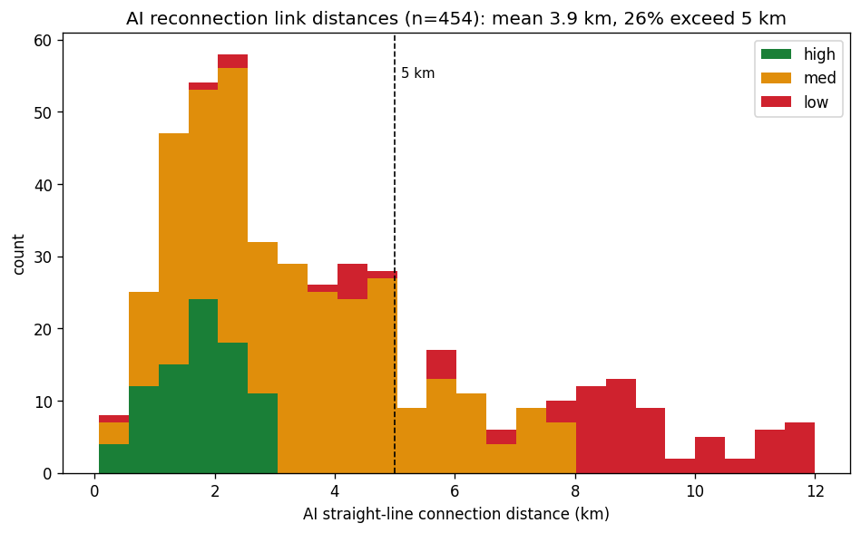
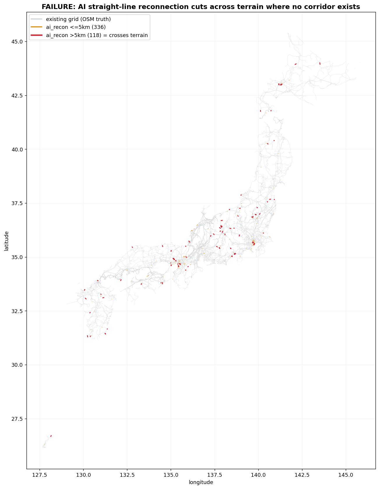

# 島の「繋ぎ方」検証史と AI直線再接続の失敗記録（2026-06-25）

**ステータス: 失敗した手法の記録（不採用）。学術的負の結果として保全。**

> 方針: 失敗も極力記録する。学術的には失敗こそ価値ある資産になりうる(オーナー指示 2026-06-25)。

---

## 1. 背景 — 島の連結問題

All-Japan-Grid は OSM から機械復元した送電網。全国 17,333ノード中の主系統は約66%、残り約1,090成分が島(孤立)。原則は OSM=接続の一次根拠(真)・捏造禁止。島の「繋ぎ方」は設計問題で、複数手法を検証してきた。

## 2. 「繋ぎ方」の検証史（失敗と成功の系譜）

| 手法 | 結果 | 評価 |
|---|---|---|
| 最近傍 drop 法(旧) | 端点を最寄り変電所にマッチ→大半の線を破棄・数百島に断片化 | 失敗(compare.html BEFORE) |
| polygon_bind(現) | 変電所ポリゴンに接する線だけ束縛=OSM忠実。誤束縛 3,365本→0 | 成功(現builderの土台) |
| 島スイープ(10地域) | osm_gap451+isolated309 全数照合→端点一致で繋げる分は枯渇 | 大半が真のOSM欠落 |
| hokuriku 2本(OSM線名根拠) | 「松本市~竜島~新信濃線」等、線名が接続を主張→採用、島61→57 | 成功(唯一の正当連結・公開済) |
| AI直線再接続(本件) | 最寄り電圧整合ノードへ直線→454接続・島1089→720 | 失敗(本書で詳述) |

要点: 「繋ぐ」の成功は OSM/実データに根拠がある時だけ(polygon_bind, hokurikuの線名)。根拠なく幾何だけで繋ぐと破綻する。

## 3. AI直線再接続 — 方法と結果

方法: 各島変電所について、12km以内の最寄り「電圧整合」主系統ノードへ直線の合成線を張る。鉄道(き電/JR等)除外、12km内に候補が無い遠隔離島も除外(海峡を捏造しない)。距離と電圧整合から confidence(high/med/low) を付与し synthetic=true, inference=ai_recon で明示ラベル。

定量結果(454接続):
- 島成分 1,089 → 720(−369)、接続454、鉄道除外40、遠隔除外364
- confidence: high 84 / med 294 / low 76
- 接続距離: 平均 3.94 km・中央値 3.08 km・5km超 118本(26%)・8km超 56本(12%)

## 4. 失敗分析（検証図）

図1: 接続距離分布。本物のリードイン間隙は通常 <1km(例 hokurikuの80m/148m)。だが本手法は平均3.94km・1/4が5km超=「間隙を埋めた」のでなく「離れた点を無理に直線で結んだ」。

図2: 灰=既存網(OSM真実)、赤=5km超のAI接続(118本)。中央部(日本アルプス 36-37N/137-139E)に赤い直線が山を跨いで集中。既存網に線が無い所を直線が貫く=実在しない回廊の捏造。

最悪例(山越え直線):
- 白馬村変電所 → 根上変電所 11.6km(飛騨山脈を直線横断)
- 沼牛変電所 → 深川市変電所_2 12.0km
- 安曇野市変電所 → 安曇野市変電所_3 11.6km(同名だが別の谷)

オーナー検証(地図拡大)の結論: 信頼できる接続が一つも無かった。confidence high でも「3km以内の直線」に過ぎず地形を無視する。

## 5. なぜ失敗したか（本質）

欠けているのは「実際の送電線の通り道(回廊/ROW)」のデータそのもの。AIは点と点を直線で結べても、実在しない線路の本当のルート(山を迂回するか・谷を通るか・そもそも繋がっているか)は変電所の点座標からは推論できない。confidence は距離と電圧の代理指標で、ルートの実在性を担保しない。gap それ自体がデータであり、直線幾何では復元できない。

## 6. 学術的教訓（失敗は資産）

1. 点座標＋直線幾何からは欠落送電線を再構築できない。「最近傍drop法」の失敗と同根で、根拠なき幾何接続は破綻する、を定量(平均3.94km/26%>5km)＋可視化(図2)で再確認。
2. 正しい道は2つだけ: ①OSMの当該線を実データで補強(mapper貢献・衛星/現地確認)、②OCCTO等公式トポロジを出典付きで取込。いずれも「実在の回廊データ」を入れる行為でAI推論の代替にならない。
3. 負の結果の価値: 「AIで繋げる」は直感的に魅力的だが、本検証でそれが捏造に直結することを実証データで示せた。今後この方向を再検討する者への道標。
4. 誠実性の一線: 残る島は正直なOSMデータ欠落として残す。捏造で埋めない=本プロジェクトの原則。

## 7. 成果物・再現
- 検証図: docs/reports/figs/fig_recon_distance_hist.png / fig_recon_failure_map.png
- 失敗手法のコード(不採用・参考): jobs tmp の airecon/airecon_build.py(本番に入れない)
- 診断器(誠実化済): scripts/island_classify.py(周波数フィルタ済)が島の正体(osm_gap/isolated/railway)を分類し、OSM補強候補を出力=正しい次の一手の入口。
