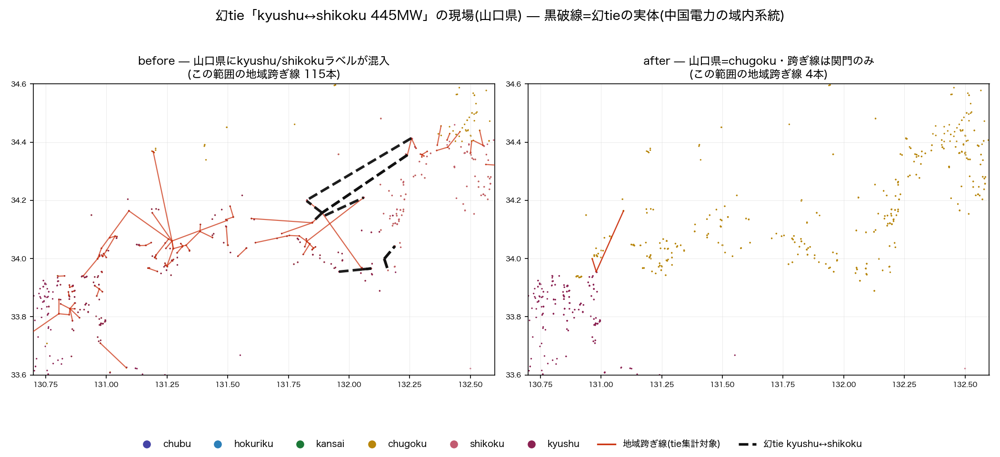
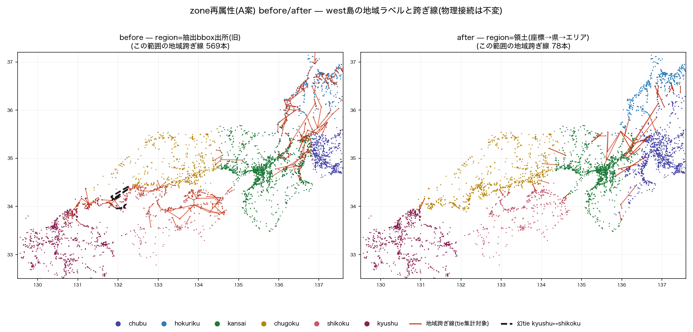

# 失敗事例: 幻の連系線「kyushu↔shikoku 445MW」 — モデルが実在しない設備を主張していた

- **日付**: 2026-07-07 / **モデル**: Claude Fable 5 / **発端**: オーナー指示
  「過去にこういうことをしてしまったという事例として記録しておいて」
- **位置づけ**: OSMから電力系統モデルを構築する際の**失敗の教材**（[[feedback_record_failures]]:
  失敗は学術的資産）。`2026-06-10_fable5_osm_case_studies.md`（関西・北陸・東京の例題）の続編。
  関西・北陸が「OSMデータ自体の品質問題」の例題であるのに対し、本件は
  **我々のパイプラインが自ら誤りを作り込んだ**例題である点が異なる。



## 1. 何をしてしまったか

2026-07-05のUC vs PF連系線フロー突合で、潮流モデルの地域跨ぎ集計に
**九州—四国間の連系線潮流 445MW** が現れた。現実にこの連系線は存在しない
（OCCTOの連系線10本にも無い）。モデルは約1ヶ月間（buildパイプライン稼働以来）、
実在しない設備を静かに主張し続けていた。

実体は**山口県内の中国電力の実在系統2本**（500kV幹線の一部＋220kV田布施—古開作）だった。
両端のノードが kyushu / shikoku とラベルされていたため、域内の線が「地域間連系線」として
集計されていた。

## 2. なぜ起きたか（誤りの連鎖 — どこにも「バグ」はない）

1. **地域抽出bboxの重なり**: kyushu抽出（lon≤132.1）と shikoku抽出（lon≥132.0）が、
   どちらも山口県南東部（中国電力の領土）に食い込んでいた。抽出時点では「広めに取る」のは
   安全側の判断に見える。
2. **per-region抽出の越境**: 山口県エリアのノードが kyushu.json に64個・shikoku.json に
   82個・chugoku.json に120個 — 同じ物理設備が最大3ファイルに重複して存在。
3. **マージがdedupしない**: 全国ビュー生成（built_view_all）は地域ビューを連結し
   `region=出所ファイル名` を刻むだけ。重複統合はどの段にも無い。
4. **出所ラベルが意味ラベルに化ける**: 潮流構築（build_island_net）が `zone = region` として
   需要配賦・UC注入・tie集計に使用。**「どのファイルから来たか」が「どの electricity 会社の
   領土か」として消費された** — ここが本質。個々の段は合理的で、単体テストでは検出できない。

## 3. 被害範囲（幻tieは氷山の一角だった）

発覚を機に全量計測（`diagnose_zone_contamination.py`）した結果、zone汚染は系統的だった:

| 影響 | 規模（west・修正前） |
|---|---|
| ① tie集計の汚染 | 地域跨ぎ線613本（実連系の回廊は数十本のはず）。chubu↔hokuriku 225本など全ペア |
| ② 実tieの不可視化 | **本四連系線（瀬戸大橋500kV）が集計に1本も現れない** — 両端が同一ラベルの重複コピー2組として存在し、各々「域内線」化 |
| ③ 物理枝の二重生成 | 関門ルートが chugoku コピー（par=4）と kyushu コピー（par=6）で並走 |
| ④ 需要の地理誤配置 | 同一座標に複数zoneのバスが並存 1,623箇所 — 九州の需要が山口の変電所に配られる |
| ⑤ 発電所の二重計上 | 同名重複 west 750件超（下関火力が kyushu既定容量+chugoku 575MWの二重付与等） |

**公表済み結果への波及**: 07-05のwest UC vs PF tie突合表（chugoku→shikoku方向逆転
-3,098MW等）は、この汚染された集計の産物であり**連系線比較として無効**と訂正した。
一方で「west slack 7.44%」は⑤の重複発電が見せかけの受け皿になって**人工的に良く見えていた**
— 修正（dedup）直後は13.92%へ一旦悪化し、正しい較正を経て2.14%に到達した。
**誤りは指標を悪くするとは限らない。良く見せることがある** — これが本件の最重要教訓。



## 4. どうやって発覚したか

**外部の正解との突合**でしか発覚し得なかった。UC側はOCCTO実在の連系線10本で融通を解いており、
PF側のzone跨ぎ集計と並べたとき「UC側に存在しないペア」として浮いた。
内部整合性チェック（収束・電圧・Ybus対称性等）はすべて通っていた —
**内部的に無矛盾なモデルは、実在しない設備を平然と含み得る**。

## 5. 対処（2026-07-07 実施済み）

- **A案=領土再属性**: 座標→県ポリゴン→エリアで region を再割当（物理接続不変・
  周波数跨ぎは禁止・`region_src`に旧値退避）。幻tie消滅・本四復活・並存1,623→10
  （`zone_reattribution_2026-07-07.md`）
- 発電所の osm_id dedup（領土地域コピー優先）
- 診断器 `diagnose_zone_contamination.py` を常設（`--no-territory`で旧挙動と比較可能）

## 6. 教訓（一般化 — 論文・講義・レビュー用チェックリスト）

1. **出所メタデータを意味属性として使わない**。「どのファイル/バッチ/タイルから来たか」は
   来歴であって、領土・所属・分類ではない。使うなら明示的な変換（本件では座標→県→エリア）を
   一段挟み、変換の限界（周波数境界・飛騨等）を開示する。
2. **タイル分割・bbox抽出には必ず重複解決を対にする**。「広めに取る」抽出は安全側でも、
   dedupなしのマージは二重計上とラベル汚染を必ず生む。
3. **負の不変条件をテストせよ**。「存在すべきものがある」だけでなく
   **「存在しないはずのものが無い」**（実在しない地域ペアの跨ぎ線=0本）を検証する。
   本件の再発ピン: `tests/test_region_attribution.py`（境界座標19件）。
4. **内部整合性は実在性を保証しない**。収束・対称性・ゲートが全部通っても、
   モデルは幻の設備を含み得る。外部正解（OCCTO・公式開示）との突合を検証階層に必ず入れる。
5. **誤りは指標を良く見せることがある**（⑤の見せかけ受け皿）。改善が「数字の悪化」として
   現れる局面（7.44→13.92%）で怯まない。正直化→較正の順で進める。
6. **集計キーの由来を疑う**。集計結果（tie表）が不自然なら、集計ロジックより先に
   **キー（zone）の由来**を疑う — 本件でロジック（tie_flows_by_pair）は終始正しかった。
7. **もっともらしさの罠（オーナー指摘 2026-07-07）**: 「専門知識がないと、つながったと
   信じ込んでしまう」。445MWという値は物理的に自然で、収束した潮流解の一部として
   出力された — 疑う手がかりは**ドメイン知識（九州—四国間に連系線は存在しない）だけ**
   だった。本プロジェクトは接続を作る・値を埋める・配分を置く介入を多数実装しており、
   その合成が成果物を「実在の観測」らしく見せる。この構造的リスクへの恒久対応として
   **全介入の台帳 `docs/MODEL_INTERVENTIONS.md`** を制定した（介入は①根拠②帳簿
   ③無効化手段の3点セットで登録・帳簿なき介入は新規に認めない・成果物を引用する
   ときの注意も同書に集約）。

## 7. 再現・参照

```bash
# 汚染の計測(旧挙動)と修正後の比較
PYTHONPATH=. .venv/bin/python scripts/diagnose_zone_contamination.py --island west --no-territory
PYTHONPATH=. .venv/bin/python scripts/diagnose_zone_contamination.py --island west
# 本事例の図の再生成
PYTHONPATH=. .venv/bin/python scripts/plot_zone_reattribution_figs.py
```

- 解剖の正本: `phantom_tie_zone_contamination_2026-07-07.md`（座標つき全リスト）
- 修正の正本: `zone_reattribution_2026-07-07.md`（A案実装・tie突合やり直し）
- 発見の経緯: `slack_tie_diagnosis_2026-07-05.md` §3
- 図: `figs/fig_zone_reattr_yamaguchi.png` / `figs/fig_zone_reattr_west_before_after.png`
