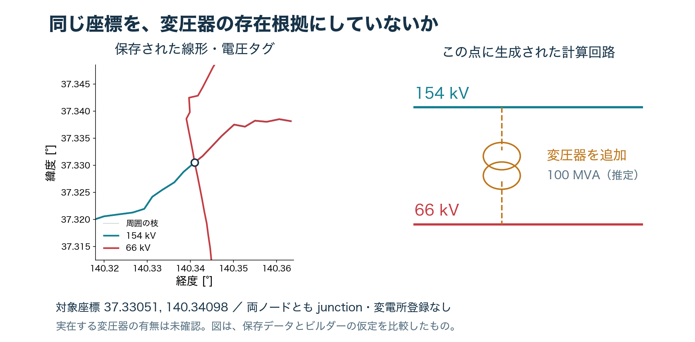
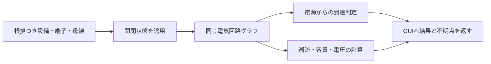

# ネットワークモデルの品質改善：検討結果

2026-09-12。**改善余地は大きい。最初に効くのは、線路電圧・接続先・変圧器の存在根拠を一緒に検証し、その同じ回路をGUIと潮流計算で使うこと。** 全国の計算回路を実際に組み直し、変電所構造DB、元の電圧タグ、GUIの開閉器判定を照合した。

今回追加したのは、再現可能な読み取り専用の品質監査と比較図である。正典の線路・変圧器を変更せず、潮流ビルダーやGUIの既定動作も変更していない。以下の件数はモデル内部の問題・確認候補であり、実系統の誤設備件数ではない。

## 今回、実測できた改善対象

| 対象 | 実測 | 何を改善できるか |
|---|---:|---|
| 異なる公称電圧のバスを直接結ぶ通電中のline | **457本** | 不明電圧と端点解決の扱い。通常の線路モデルとして整合させる |
| 変電所ノードの裏付けがない生成変圧器 | **102台** | 座標一致・電圧不一致だけで設備を作る経路の見直し |
| 元の線路タグと接続先階級が異なる構造DB端子 | **104レコード** | 頂点共有を優先するときにも電圧制約を検査する |
| ベイと接続母線の既知電圧が異なる構造DBリンク | **53レコード** | 構内接続の電圧整合ゲート |
| 複数の母線区間を持つ構造DBサイト | **505サイト** | 母線分割・連絡・回線開放を計算へ引き継ぐ |
| 構造DBの開閉器候補／生成したPFのswitch | **8,386／0** | 表示上の開閉状態と電気回路を同じデータで扱う |
| 所属島を無視したmain判定の誤伝播 | **3ノード** | 島別の所属判定を返り値から利用側まで統一する |

構造DBの件数は地域レコード単位で、地域重複を含む。104端子をサイト幾何ハッシュと端子番号で整理すると91組になるが、これも現場で同定済みの実設備数ではない。8,386の開閉器はすべて `inferred-bay` で、開閉器の実在・型式・平常状態を全件観測したものではない。

## 1. 最優先：不明電圧を66 kVとして通すと、回路の前提が崩れる

`build_island_net` は電圧不明ノードを一旦66 kVで作り、線の端点に一致する階級がなければ同座標の先頭ノードを選ぶ。その後、既知の線路電圧には暗黙降圧補完が入るが、不明線路 `kv_class=0` はその検査対象から外れる。

結果として、北海道4本・東日本62本・西日本391本、計457本の通電中lineで、両端バスの公称電圧が異なった。**457本すべての記録線路電圧は0だった。** 例として、東日本の山田川線には「西群馬開閉所500 kV → 電圧不明由来の66 kV junction」が残る。これは現在のモデルの選択結果であり、山田川線の実電圧をここで認定するものではない。

pandapowerの通常のlineは両端の公称電圧が同じであることを前提とする。異電圧を結ぶには変圧器または適切な別要素が必要だが、**計算形式を合わせるために変圧器の存在を推定する前に、そもそもの接続先を確かめる必要がある。** [pandapower公式：Lineの電気モデル](https://pandapower.readthedocs.io/en/latest/elements/line.html)

不明線路だけの連結部分について、元ノードの観測電圧と接続済みの既知線路電圧を集める試作判定も行った。暫定66 kVや、追加母線の元になった上位バス電圧は観測値として使わない。

| 境界の電圧証拠 | 不明線路の成分 | 含まれる不明線路 | うち両端不整合 |
|---|---:|---:|---:|
| 1種類にそろう | 338 | 609 | **230** |
| 複数種類が衝突する | 128 | 352 | **227** |
| 観測電圧の手掛かりがない | 226 | 339 | 0 |

230本は、現在の端点接続が正しいことを確認したうえで、電圧伝播を試せる候補である。227本は異電圧の証拠が衝突しているため、線形の追跡、母線への入り方、変圧器・変換設備の有無を個別に確かめる。ここを一律に最大電圧や66 kVへ置き換えてはいけない。

実装案は `observed_kv`、`inferred_kv`、`voltage_evidence` を分け、線と端子と母線の制約がそろった場合だけ計算用電圧を確定すること。未解決は明示的に残し、解析対象・負荷・給電率への影響も併記する。

## 2. 同じ座標にある交差点から、変圧器を作っていた



図の対象は `(37.33051, 140.34098)`。保存データには154 kVと66 kVのjunctionが同じ座標にあり、両方とも `sub=0`。ビルダーはそこに100 MVAの変圧器を生成した。100 MVAは既定の推定値で、銘板の観測値ではない。

さらに、154 kVと66 kVのjunctionだけを置いた小さな入力でも、線路や変電所を入力しなくても変圧器が1台作られることを再現した。原因は、同座標の電圧階級を高い順に連結するループに変電所・設備の存在確認がないこと。

実データの計算回路には、変電所ノードの裏付けがない生成変圧器が102台あった。68台は座標別の階級連結、34台は暗黙降圧補完から生じている。元データに変電所が欠けただけの可能性もあるため、102台をすべて誤りと断定せず、所在・線名・電圧・構内幾何を確認する。

これらを**グラフの複製だけから除く**と、接続状態は次のように変わる。

| 同期島 | 確認候補の変圧器 | 成分数：現行→候補を除いた場合 | 最大成分のバス数 |
|---|---:|---:|---:|
| 北海道 | 0 | 22→22 | 799→799 |
| 東日本 | 27 | 220→231 | 5,831→5,814 |
| 西日本 | 74 | 279→318 | 7,494→7,398 |
| 沖縄 | 1 | 7→7 | 94→94 |

これは「切れば改善する」という結果ではなく、**現在の接続性がこの仮定に依存している範囲**を示す。連結成分が変わらない候補でも、並列経路や潮流は変わり得る。今回は負荷・発電・slackを追加しておらず、損失やAC収束の改善率を計測したわけではない。

推奨は、変圧器に `site_id` と両端の電圧階級・母線の証拠を要求すること。junctionでの自動生成は未解決候補へ送り、元線路の誤接続と変電所欠測を分けて調べる。

## 3. SubSLDの「頂点共有」にも回路上の制約を加える

構造DBと元の地域別GeoJSONを、同じ幾何キーで照合した。対象は7,239サイト・47,979端子で、元wayが引けない端子は0だった。

そのうち104端子では元線路の既知電圧と接続先の既知階級が一致しなかった。例えば、西札幌変電所では66 kVタグの線が187 kVのbayへ、室蘭変電所では187 kVタグの線が66 kVのbayへ束縛されている。複数電圧タグのwayは全クラスを許容したうえでの件数である。別に、ベイと母線の既知階級不一致が53リンクあった。

`extract_structure` は頂点が共有されると、そのbay/busbarの電圧階級を端子へ採用する。幾何の証拠を持っていても、電圧タグ同士の衝突を解消したことにはならない。

改善案は、候補を `compatible / conflicting / unknown` に分け、衝突時には双方のタグと接続先を記録して停止すること。正しい電圧の別母線が存在するならその根拠を追う。タグのどちらが正しいかを自動で断定せず、元要素へのリンクをGUIから開けるようにする。

また、構造DBの変圧器も現在は既知電圧階級を順につなぐ `structural` なラダーである。構造DBへ切り替えるだけで変圧器の実在根拠がすべてそろうわけではない。

## 4. GUIの開閉操作を、実際の接続判定へつなぐ

`docs/subsld.html` の `swToggle` は表示用の `SWSTATE` を更新して再描画する。`energized` は「閉じたfeeder/trafoがある母線」を充電として扱い、上流の電源・外部境界まで到達するかは調べていない。

実際の関数を切り出し、電源情報を与えず「母線1本・閉じた引出1つ」だけを渡すと、母線0がliveになった。[再現結果](gui_energization_repro.json)

開閉器が閉じていること、回路がつながること、電源から給電できることは別の条件である。現在のGUIで点灯しても、計算で充電・給電を確認したことにはならない。また、ループ内にあることだけで、開放後の容量・電圧・N-1成立まで保証することもできない。

改善は次の一続きの処理にする。



pandapowerには開放スイッチを反映するトポロジー処理があり、今回の監査でも開放した母線連絡を通れないことをテストした。[公式のトポロジー例](https://pandapower.readthedocs.io/en/develop/topology/examples.html)

ただし今回組み立てた4島のPFモデルにはswitchが0個だった。構造DBの505サイトにある複数母線区間と8,386の開閉器候補が、この計算経路には引き継がれていない。新多摩の500 kV区画など、母線区間の根拠を照合できる小範囲から試すのが妥当である。全国の推定開閉器を一度に実在機器として適用する方法は採らない。

## 5. main判定の問題を、定義差と分離して確定

前回の監査で見つけたmain問題を、今回は**同じ本番stitch/tie規則**で比較した。各島の最大成分を座標の和集合にすると、本来は自島の本系統外である3ノードがmainとして通る。

- `tohoku_sub_560`：北海道の福島変電所座標にある東北ラベルのコピー。
- `tokyo_jct_36.2016:138.4692:77`
- `tokyo_jct_36.3259:138.3021:0`

保存mainと正しい所属島別判定の不一致は194ノードだが、3件の誤伝播と残りの更新状態を混同しない。返り値を `main_keys_by_island` とし、表示・再構築・回収判定の利用側も所属島込みで照合する修正が必要である。

## 実装の優先順位

| 段階 | 具体的な変更 | 採用するための確認 |
|---|---|---|
| 1 | 今回の回路監査をビルドの品質ゲートにする。mainの島別判定を修正 | 不整合を隠さず毎回同じ入力から再現する。元の設備接続は変えない |
| 2 | 不明電圧の伝播候補230本を、少数の成分から根拠照合する | 端点同定、線形、既知電圧が一致すること。前後の回路制約と給電対象を比較 |
| 3 | junction変圧器と構内電圧衝突を個別に解決 | 変電所欠測、誤端点、タグ誤りを分類。解決方法ごとの証拠を保存 |
| 4 | 選定した変電所で母線・端子・開閉器をPFへ渡す | 開放すると実際に経路が切れ、代替経路・容量・電圧を同じ回路で検証できる |
| 5 | GUIで地理・単線図・生成回路を同時に確認する | 選択した線の両端ID・電圧・根拠・計算上の対応が3画面で一致する |

GUIは、地図上の線を追う作業、母線への接着先の確認、開放前後の経路比較に使うと効果が高い。計算側は、その判断を一意な設備・端子IDに保存し、電気的な制約と同じ運転条件で検証する。Codexで担えるのは、この読図・コード確認・再現実験・検証の反復である。欠けている実設備情報が、見た目や計算収束だけで確定することはない。

## 成果物・再現方法・検証範囲

- [全国の回路監査・入力マニフェスト](model_quality.json)
- [構造DBの電圧衝突一覧](structure_findings.json)
- [東日本の回路監査](circuit_east.json)／[西日本](circuit_west.json)
- [比較図 PNG](coordinate_vs_circuit.png)／[SVG](coordinate_vs_circuit.svg)
- 共通検査：`src/validation/circuit_quality.py`
- 実行器：`scripts/audit_model_circuit_quality.py`
- 図の再生成：`scripts/gen_model_quality_figures.py`
- GUI判定の再現：`scripts/repro_subsld_energization.mjs`（実際のHTMLから関数を切り出して実行）

Gitから新しい作業領域を作る場合、依存を導入したうえで、未追跡の地域別構造DBを先に生成する。`PYTHONPATH=. python3 scripts/build_structures_batch.py --all` は `data/structures/` を更新するため、レビュー用checkoutで実行する。生成日の違いでファイルSHAは変わり得る。保存JSONは監査時点の入力SHA、再生成結果はその入力SHAをそれぞれ記録し、件数だけで同一版と判断しない。

```bash
MPLCONFIGDIR=/tmp/ajg_model_quality/mpl python3 scripts/audit_model_circuit_quality.py
MPLCONFIGDIR=/tmp/ajg_model_quality/mpl python3 scripts/gen_model_quality_figures.py
node scripts/repro_subsld_energization.mjs /tmp/ajg_subsld_repro.json
python3 -m pytest tests/test_circuit_quality.py tests/test_story_connection_audit.py tests/test_connectivity.py -q
```

検証は **22 passed**。異電圧線、変電所証拠、開放スイッチ、複数電圧タグ、暫定66 kV、追加LVバスへの上位電圧の誤継承などを確認した。依存ライブラリのasyncio非推奨警告が1件ある。

ビルダーの既定に相当する設定で4同期島を構築し、`implicit_stepdown=True`、`site_trafos=False`、合成tieの原則非通電、BTB分離、地域再帰属を含む。入力builtのSHA256は `955d6e0b2baf5d18ae44762db4100e1b446f171e8ad16502856281caf2e33b6a`。監査終了時にも不変を確認した。組立コード・設定・構造DB等のハッシュとpandapower版もJSONに保存した。

全国の負荷・発電を与えたAC潮流のA/Bは今回未実施。したがって、電圧精度・損失・供給能力が何%改善するかまでは主張しない。**この検討で確認したのは、修正すべき回路上の不整合、裏付けを要する仮定、その影響範囲、そして検証可能な実装順序である。**
