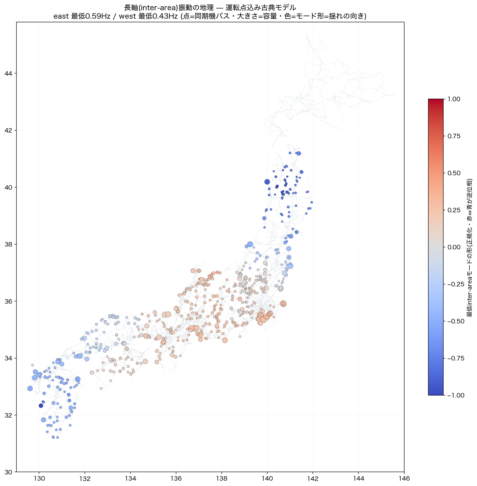

# G_DB / L_DB 並列キャンペーン第1ラウンド 2026-08-17

オーナー指示「両方並列でやります」。判断・実装はAI(Claude Fable 5)+L_DBはサブエージェント委任。

## G_DB: 機械集約で動揺モードが物理帯に着地 ✓

`src/dynamics/machine_agg.py`(新設):
燃料種(net.gen.type)→型式判定 → 同期機は**容量加重H(機械ベース)+xd″並列合成**でバス集約、
インバータ(IBR)は動揺方程式から分離。内部ノード増設+Schur縮約の古典モデル(フラット近似)。

| 島 | 同期集約 | IBR | モード帯 | 電気機械帯(0.2-2.5Hz) |
|---|---|---|---|---|
| west | 421バス | 24.2GVA/8,026機 | **0.375**〜3.38Hz | 79/379 |
| east | 266バス | 17.3GVA/7,821機 | **0.572**〜3.09Hz | 61/251 |
| hokkaido | 64バス | 0.9GVA | 1.30〜3.05Hz | 20/62 |
| okinawa | 6バス | 34MVA | 1.70〜2.90Hz(localのみ) | 2/6 |

**westの最低モード0.37Hz・eastの0.57Hz=教科書のinter-area(長軸振動)帯**。
沖縄にinter-areaが無いのも島の物理として正しい。従来(全機H=5s固定)の
11〜2,284Hz非物理を機械集約が根治した。再現=`scripts/gen_swing_modes.py`。
近似の明示: フラット運転点(帯の推定)。次段=収束PFのδ/EでK再評価・IEEJ標準定数の型式細分。

## L_DB: 地点需要の実測テーブル初出荷 ✓

`scripts/parse_point_demand.py`(サブエージェント作・検証済):
7社の変圧器(バンク)潮流実績44+1ファイル → `normalized/point_demand.csv`
**1,135バンク行/492変電所**(peak/p95/mean/min/n_obs)。

| 社 | バンク行 | 変電所 | peak中央値MW |
|---|---|---|---|
| tohoku | 544 | 169 | 105 |
| chubu | 324 | 145 | 220 |
| kyushu | 92 | 67 | 210 |
| shikoku | 88 | 44 | 81 |
| chugoku | 33 | 27 | 313 |
| okinawa | 32 | 32 | 3.6(配変) |
| hokuriku | 22 | 8 | 551 |

注意: kikan層(500/275バンク)は階級間融通で「需要」ではない(minが負=双方向)。
需要ビューは**二次kV≤22で絞る**。未収録=東京(独自形式・別対応)・北海道(tr公表なし要確認)。

### 取得ログ(再現実行で回収)

- 45ファイル全読・スキップ0・全てcp932
- 除外列: 四国62列+東北51列(n_obs<100)・東北96列(変電所名なし=匿名化◇分)
- **品質発見**: 四国の公表CSV自体に `#VALUE!`(Excel計算エラー・29個)と `*.*`(7個)が混入
  (jisseki_local01/02/04_tr_2024-2025)。公表側の品質観察として記録
- peak_mw<0が2行=年間通して逆潮(発電系バンク)。需要ビューでは除外対象

## 次の一手
1. L_DBの需要ビュー化→allocate_loadsへの接続(観測地点は実測・他は従来配分のハイブリッド)
2. G_DBのユニット分解(OCCTO実績の号機単位)とIEEJ定数の型式細分
3. 運転点込みモーダル(収束PFのδ/E)→参加率で振動の地理を地図化

## 第3の柱: 運転点込みモーダル+長軸振動の地理地図 ✓

収束AC(本番前処理フルセット)のV∠δから機械内部電圧E∠δを構成し、
K_ij=E_iE_j(B_ij cosδij−G_ij sinδij)で運転点込みの同期化トルク行列を評価:

- **west: 最低0.434Hz(409機)** — 九州(青)⇔中部・関西(赤)の逆位相 = 文献の西日本長軸振動そのもの
- **east: 最低0.592Hz(262機)** — 東北北部(青)⇔関東(赤)の逆位相 = 東地域長周期モード
- 再現=`scripts/gen_swing_map.py`。運転点感度も観測(westは配分構成で0.13〜0.45Hz変動=それ自体が知見)

### ハーネス4連発の教訓(罠3追補・メモリ済)
「本番の関数をimport」だけでは足りず**本番argparse既定=採用済み介入群**の踏襲が必要:
#19 pref_gwh / #20 factor0.8(cfg) / #26 zone_src=True / **#24 gen-attach='cap'(関数既定と違う!)**。
#24抜けはeastを594バスの見せかけACにした(発覚=機械数22の異常)。
