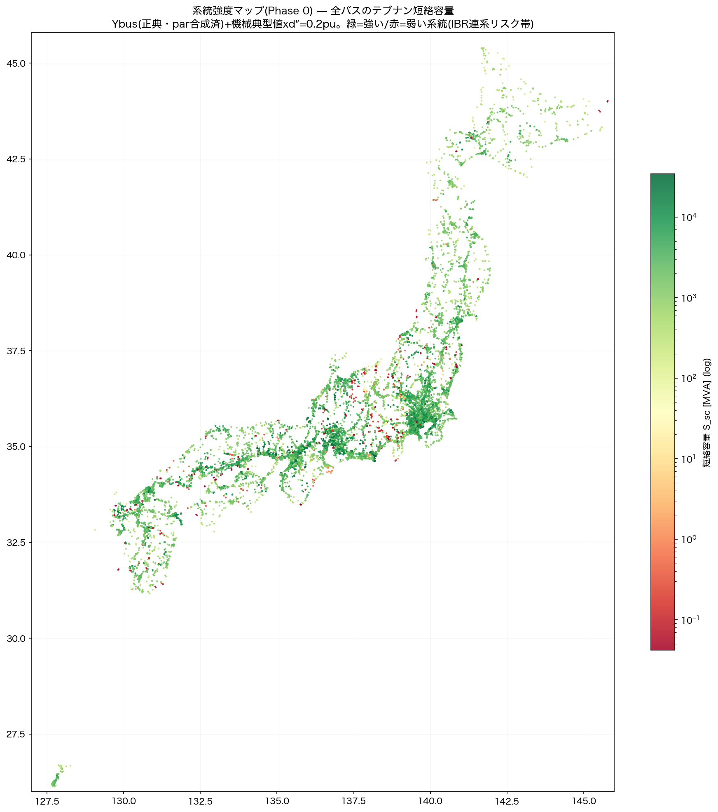

# 系統強度マップ(Phase 0)と動的安定性への入口 2026-08-17

オーナー構想「インピーダンスだけで系統は計算できる。インバータ/負荷モデルを入れると面白い」
「負性インピーダンスや行列から安定性も確認できる」→「実施」への第一弾。
判断・実装はAI(Claude Fable 5)。

## 成果: 全国17,307バスのテブナン短絡容量マップ(オープンモデル初)

- 方法: 正典数値Ybus(par合成済)+全機械(OCCTO/FIT実配置8,000超/島)に典型値xd″=0.2puを
  与え、疎LUで全バスのZth=diag(Y⁻¹)を厳密計算(島あたり数十秒)
- **結果は物理帯に整合**: 66-77kV帯の中央値=北海道896MVA・east 2,207・west 1,666・
  沖縄1,690MVA(実系統の0.5〜2.5GVAと同帯)。EHVハブは数十GVA
- 弱点(赤)は放射状末端と断片に集中=IBR連系のリスク帯の候補。`scripts/gen_grid_strength_map.py`

## 検算で捕まえた2つの問題(記録)

1. **数値Ybus出荷物(npz/mat)の単位バグ**: READMEは「pu, 100MVA base」と書くが実体は
   **pu×base_mva(ちょうど100倍)**で格納されている。1線の手計算照合で確定。
   初回計算は66kVで中央値119GVAという非物理値になり、これで発覚(驚く数値は独立検証の実践)。
   → gen_ybus_numeric出荷系の修正課題(.mat利用者への影響確認要)
2. **PF netの発電機は後段注入**: build_island_netは純ネットワーク。attach_generators(介入#24)
   →allocate_loads→reactive_comp→slacks→balance_by_zoneが本番の完全前処理(罠3)

## モーダル解析(swing_solver)の現状: 機構は完動・数値は要集約

北海道(機械417)・沖縄(28)で状態行列Aの固有値解析を実施 — **不安定モード0**、
機構(線形化・参加率・モード分類)は完動。ただし振動周波数が非物理(11〜2,284Hz):
**FITの極小機(中央値0.05MW)にH=5sを与えた慣性過小のアーティファクト**で、
電気機械モード(0.2〜2.5Hz帯)が埋もれる。**次の一手=発電所単位への機械集約**
(容量加重H・xd″合成)。集約後にIEEJ標準モデルの典型定数を型式別に割当てる路線。

## ロードマップ(検討中の合意事項)

- Phase 0: 本マップ ✓
- Phase 1: ZIP負荷+様式5実R/XでYbus(jω)周波数スキャン→受動性/共振マップ
- Phase 2: GFL/GFMのZ_inv(jω)テンプレートでナイキスト判定(負性インピーダンス安定性)
- Phase 3: RMS動的(機械集約+IEEJ典型定数、ANDES/Dynawo・CGMES資産が入口)
