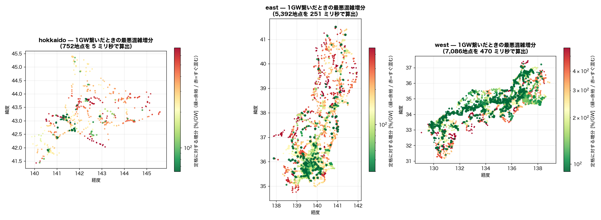

# 地点別の接続可能量 — 感度行列で一度に出す（2026-08-09）

系統に電源を繋ぐとき効くのは、繋ぐ地点そのものより**どの送電線が先に埋まるか**。
PTDF はその関係そのものなので、地点 b に P MW 注入したときの枝 j の潮流変化は `PTDF[j,b]·P`。
枝 j が熱容量に達するまでの注入量は `空き容量_j / |PTDF[j,b]|` で、**その最小値がその地点の接続可能量**になる。

重要なのは、これが**行列の列ごとの割り算**だけで済むこと。全地点を一度に計算できる。

| 島 | 地点数 | PTDF構築 | 全地点の算出 | 同じ答えを潮流の解き直しで得る場合 |
|---|---:|---:|---:|---|
| hokkaido | 753 | 0.01 s | **5 ミリ秒** | 753 回の AC 求解 ≈ **0.0 日** |
| east | 5,393 | 1.53 s | **251 ミリ秒** | 5,393 回の AC 求解 ≈ **4.0 日** |
| west | 7,087 | 3.14 s | **470 ミリ秒** | 7,087 回の AC 求解 ≈ **3.5 日** |
| okinawa | 93 | 0.00 s | **0 ミリ秒** | 93 回の AC 求解 ≈ **0.0 日** |

## 主指標 — 1GW 注入したときの最悪混雑の増分 [%/GW]

接続可能量は基準ケースに 1 本でも過負荷枝があると全地点 0 になり、答えとして使えない
（本モデルは実際そうなっている）。そこで**常に計算できる相対指標**を主軸に置く。
値が小さいほど「繋いでも系統を追い込まない地点」。

| 島 | 中央値 | 良い側10% | 悪い側10% |
|---|---:|---:|---:|
| hokkaido | 333.6 %/GW | 98.5 %/GW | 611.7 %/GW |
| east | 162.6 %/GW | 59.4 %/GW | 379.1 %/GW |
| west | 150.0 %/GW | 89.9 %/GW | 393.0 %/GW |
| okinawa | nan %/GW | nan %/GW | nan %/GW |

## 参考 — 絶対値としての接続可能量

| 島 | 中央値 | 下位10% | 上位10% | 100MW未満の地点 | 1GW超の地点 |
|---|---:|---:|---:|---:|---:|
| hokkaido | 130 MW | 66 MW | 1,180 MW | 31 | 20 |
| east | 3,692 MW | 3,661 MW | 3,723 MW | 0 | 2 |
| west | — | — | — | 0 | 0 |
| okinawa | — | — | — | 0 | 0 |

## 算出できた地点と、できなかった理由

| 島 | 算出できた地点 | 制約対象の枝 | うち既に容量超過 |
|---|---:|---:|---:|
| hokkaido | 170 / 753 | 181 / 868 (154kV以上) | 2 |
| east | 2 / 5,393 | 1,971 / 6,437 (154kV以上) | 175 |
| west | 0 / 7,087 | 3,466 / 8,802 (154kV以上) | 77 |
| okinawa | 0 / 93 | 0 / 114 (154kV以上) | 0 |

接続可能量が 0 になる地点は、**その地点が効く枝の中に既に熱容量を超えているものがある**ことを意味する。
これは系統の実態というより、モデルの潮流と想定した熱容量（√3·V·I の理論値）が噛み合っていない
箇所を炙り出したもの。容量の出典付き値への差し替えが次の課題になる。

## 前提と限界

- 直流近似・熱容量のみ（電圧や安定度の制約は見ていない）。感度 0.001 未満の枝は制約から外した
- 対象は各島の最大連結成分。孤立断片上の地点は算出対象外
- 送電線の熱容量は `√3·V·I` の理論値で、実際の運用容量（`docs/reports/` の出典付き値）とは別物
- **screening であって空き容量の確定値ではない**。候補地の絞り込みに使い、確定は AC と実データで

---
生成: `scripts/sensitivity/hosting_capacity.py`
