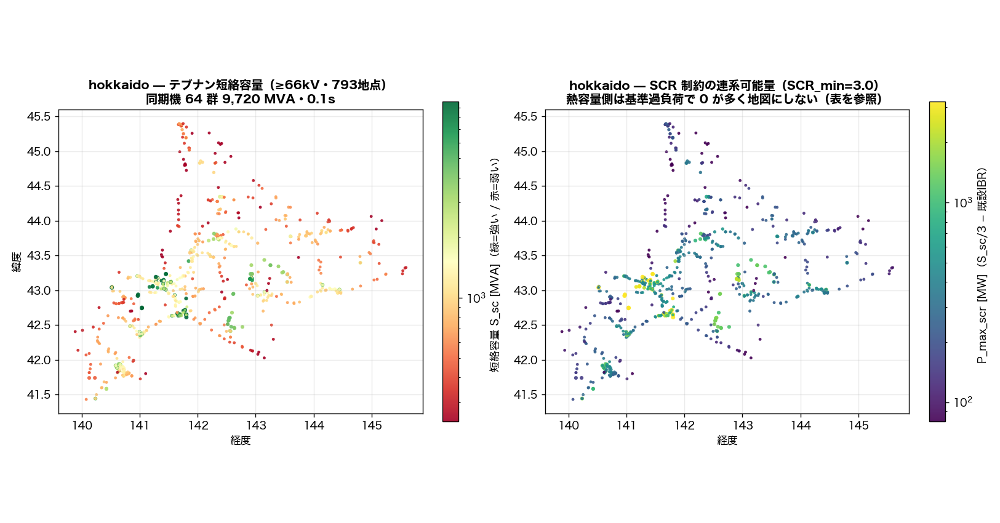
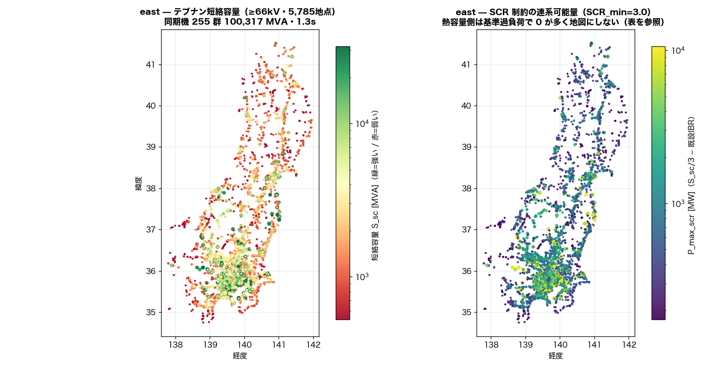
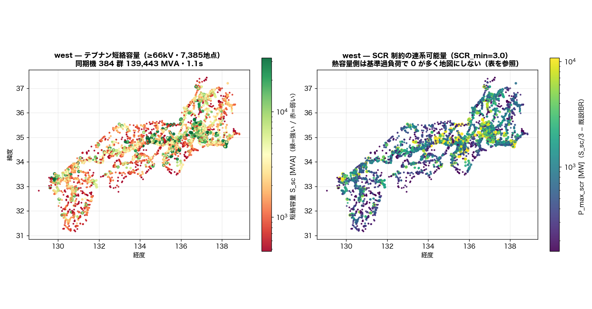
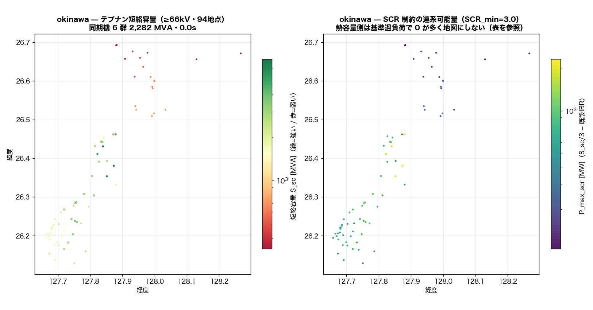

# IBR 連系可能量 — SCR（系統強度）と熱容量の 2 物差し（2026-09-02）

インバータ電源(IBR)を繋ぐとき、送電線が埋まる前に**系統が弱くて制御が不安定になる**地点がある。
その目安が SCR = 短絡容量 S_sc / IBR 容量（IEEE 1204-1997: SCR<3 で弱系統）。
S_sc はテブナン等価 `S_sc = baseMVA·V²/|Z_th|`（`src/powerflow/short_circuit.py`・V=1pu・
線路充電と負荷は無視・同期機は xd'' 典型値を機械ベース→系統ベース換算、IBR と合成 slack は電流源にしない）。

| 島 | 主成分バス | 電源到達 | 同期機群 / MVA | 既設IBR [MW] | S_sc 算出 | 熱容量側 | SCR<3 の既設地点 |
|---|---:|---:|---:|---:|---:|---|---:|
| hokkaido | 793 | 793 | 64 / 9,720 | 854 | **0.1 s** | 13 s | 0 |
| east | 5,785 | 5,785 | 255 / 100,317 | 3,861 | **1.3 s** | 120 s | 0 |
| west | 7,386 | 7,386 | 384 / 139,443 | 4,570 | **1.1 s** | 111 s | 0 |
| okinawa | 94 | 94 | 6 / 2,282 | 34 | **0.0 s** | 1 s | 0 |

## 電圧帯別の系統強度と SCR 連系可能量（主成分・≥min_kv）

| 島 | 帯 | 地点 | S_sc 中央値 | S_sc 下位10% | P_max_scr 中央値 | SCR<3 既設 |
|---|---|---:|---:|---:|---:|---:|
| hokkaido | 66-77kV | 650 | 841 MVA | 330 MVA | 279 MW | 0 |
| hokkaido | 110-154kV | 26 | 1,010 MVA | 673 MVA | 337 MW | 0 |
| hokkaido | 187-275kV | 117 | 4,789 MVA | 2,852 MVA | 1,596 MW | 0 |
| east | 66-77kV | 4,490 | 2,248 MVA | 798 MVA | 749 MW | 0 |
| east | 110-154kV | 837 | 8,518 MVA | 2,938 MVA | 2,839 MW | 0 |
| east | 187-275kV | 314 | 19,403 MVA | 6,938 MVA | 6,454 MW | 0 |
| east | 500kV | 144 | 34,291 MVA | 13,431 MVA | 11,430 MW | 0 |
| west | 66-77kV | 4,662 | 1,783 MVA | 648 MVA | 594 MW | 0 |
| west | 110-154kV | 1,644 | 4,732 MVA | 1,729 MVA | 1,577 MW | 0 |
| west | 187-275kV | 870 | 11,975 MVA | 5,271 MVA | 3,992 MW | 0 |
| west | 500kV | 210 | 33,802 MVA | 16,608 MVA | 11,267 MW | 0 |
| okinawa | 66-77kV | 71 | 1,704 MVA | 414 MVA | 568 MW | 0 |
| okinawa | 110-154kV | 23 | 6,321 MVA | 5,293 MVA | 2,107 MW | 0 |

## binding — 連系可能量を決めた制約

熱容量側(`hosting_capacity`)は**基準ケースに過負荷枝があると 0 になる**(既知の退化)。
その地点は `thermal=0(基準過負荷)` に分けた — 地点の優劣ではなく容量データの噛み合わせ問題の印。

| 島 | scr | thermal(>0) | thermal=0(基準過負荷) | scr(熱容量側 n/a) | n/a | 熱容量側の注記 |
|---|---:|---:|---:|---:|---:|---|
| hokkaido | 2 | 135 | 655 | 1 | 0 | hosting_capacity.run(min_kv=154.0) 再計算・793/793 行を座標+電圧で照合・基準ケース過負荷枝 5 本(過負荷があると熱容量側は 0 になる地点が出る) |
| east | 0 | 2 | 5,782 | 1 | 0 | hosting_capacity.run(min_kv=154.0) 再計算・5785/5785 行を座標+電圧で照合・基準ケース過負荷枝 222 本(過負荷があると熱容量側は 0 になる地点が出る) |
| west | 0 | 4 | 7,380 | 2 | 0 | hosting_capacity.run(min_kv=154.0) 再計算・7385/7386 行を座標+電圧で照合・基準ケース過負荷枝 168 本(過負荷があると熱容量側は 0 になる地点が出る) |
| okinawa | 0 | 0 | 0 | 94 | 0 | hosting_capacity.run(min_kv=154.0) 再計算・94/94 行を座標+電圧で照合・基準ケース過負荷枝 0 本(過負荷があると熱容量側は 0 になる地点が出る) |

## 既設 IBR の SCR が低い地点（弱系統の候補・SCR_min 以上でも上位を開示）

既設 IBR は OSM 由来容量(FIT 全量ではない)なので SCR は**大きめ**に出る。桁外れの既設容量は
OSM の容量タグ誤りの可能性があり、独立検証してから引用すること。

### hokkaido

| バス | 名前 | kV | S_sc [MVA] | 既設IBR [MW] | SCR | P_max_scr [MW] |
|---:|---|---:|---:|---:|---:|---:|
| 291 | 八雲変電所 | 66 | 689 | 102.3 | 6.73 | 127 |
| 578 | 伊達市変電所 187kV | 187 | 3,170 | 351.6 | 9.01 | 705 |
| 586 | 音別町あけぼの一丁目変電所 | 66 | 1,463 | 148.1 | 9.88 | 340 |
| 654 | 三石変電所 | 66 | 413 | 21.0 | 19.65 | 117 |
| 468 | 北桧山変電所 | 66 | 276 | 10.0 | 27.62 | 82 |
| 667 | 顧客変電所 | 66 | 873 | 30.1 | 29.00 | 261 |
| 502 | 白老変電所 | 66 | 767 | 22.8 | 33.65 | 233 |
| 529 | 苫小牧市変電所_5 | 66 | 2,511 | 33.2 | 75.64 | 804 |

### east

| バス | 名前 | kV | S_sc [MVA] | 既設IBR [MW] | SCR | P_max_scr [MW] |
|---:|---|---:|---:|---:|---:|---:|
| 1630 | 菰槌変電所 | 66 | 752 | 121.7 | 6.18 | 129 |
| 5831 | 山方変電所 | 66 | 557 | 62.6 | 8.90 | 123 |
| 5402 | 倉渕変電所 | 66 | 1,661 | 186.1 | 8.92 | 367 |
| 1074 | 字下園変電所 | 66 | 1,037 | 107.5 | 9.64 | 238 |
| 5142 | 浅原変電所 | 66 | 3,169 | 220.1 | 14.40 | 836 |
| 5787 | 大洋変電所 | 66 | 584 | 34.1 | 17.12 | 160 |
| 1886 | 鹿角市変電所_2 | 66 | 444 | 25.6 | 17.29 | 122 |
| 1831 | 軽米変電所 | 66 | 699 | 40.3 | 17.34 | 193 |

### west

| バス | 名前 | kV | S_sc [MVA] | 既設IBR [MW] | SCR | P_max_scr [MW] |
|---:|---|---:|---:|---:|---:|---:|
| 4513 | 新田辺変電所 | 77 | 955 | 111.9 | 8.53 | 206 |
| 2866 | 軽井沢変電所 | 77 | 1,061 | 120.0 | 8.84 | 234 |
| 2836 | 軽井沢東変電所 | 77 | 1,000 | 67.4 | 14.83 | 266 |
| 7184 | 国分変電所 | 66 | 1,156 | 47.9 | 24.13 | 337 |
| 5647 | 新上道変電所 220kV | 220 | 6,330 | 231.4 | 27.35 | 1,879 |
| 5992 | 北条変電所_2 187kV | 187 | 7,061 | 250.0 | 28.24 | 2,104 |
| 2518 | 三国町新保変電所 154kV | 154 | 7,531 | 250.9 | 30.01 | 2,259 |
| 7299 | 志和池変電所 | 66 | 534 | 17.8 | 30.01 | 160 |

### okinawa

| バス | 名前 | kV | S_sc [MVA] | 既設IBR [MW] | SCR | P_max_scr [MW] |
|---:|---|---:|---:|---:|---:|---:|
| 72 | 田港変電所 66kV | 66 | 343 | 10.0 | 34.30 | 104 |
| 39 | Henoko Substation | 66 | 703 | 6.6 | 106.48 | 228 |
| 73 | 川田変電所 | 66 | 1,288 | 12.0 | 107.30 | 417 |
| 99 | 海洋博変電所 | 66 | 314 | 2.3 | 136.51 | 102 |
| 70 | 東変電所 | 66 | 341 | 0.5 | 682.78 | 113 |
| 48 | 渡口変電所 132kV | 132 | 6,294 | 2.0 | 3146.85 | 2,096 |
| 29 | 長毛変電所 | 66 | 981 | 0.2 | 4904.51 | 327 |
| 69 | 佐敷変電所 | 66 | 897 | 0.1 | 8970.11 | 299 |

## 弱系統 — 既設 IBR で SCR が SCR_min を割る地点（島別上位）

### hokkaido（0 地点）

該当なし

### east（0 地点）

該当なし

### west（0 地点）

該当なし

### okinawa（0 地点）

該当なし

## 桁外れの既設 IBR（≥1,000 MW/バス）— 引用禁止・上流の容量出典の誤同定

IBR 型(solar/wind/battery)の OSM 地物に、火力・原子力の**出典付き容量**(`capacity_mw_sourced`)が
同定されている例がある(例: 高浜原子力 3,392MW が群馬の太陽光 8 地物に、姫路第二 4,119MW・松浦火力 2,000MW が
近傍の太陽光地物に)。座標キー同定の誤りであり、これらの地点の SCR/P_max_scr は**使わない**こと。
修正は `apply_capacity_sources.py` / `sourced_capacity_index` 側(容量出典トラック)の仕事。

該当なし

## 検証

- case9_vs_calc_sc_relerr_max: 8.881784197001252e-16
- case9_with_line_charging_relerr_max: 0.11567623343916045
- note: case9 の同期機を等価 ext_grid(s_sc=c·S/xd'')に置換した calc_sc(IEC 60909, c=1.1)と 線路充電無視で一致(相対誤差<1e-12)。線路充電を含めると最大 ~12% ずれる=IEC 60909 が 充電容量を無視する前提の再確認

## 前提と限界

- 三相対称短絡・V=1.0pu（IEC 60909 の電圧係数 c は掛けていない。calc_sc の skss と比べるときは ×1.1）
- 線路インピーダンスは電圧階級別の合成値、機械定数は型式別典型値（`src/dynamics/machine_agg.TYPE_PARAMS`）
- 既設 IBR は OSM 由来容量（介入#25 の太陽光既定 0.10MW を含む）。FIT 実配置の全量ではない
- IBR 自身の短絡電流寄与（定格の 1.0〜1.2 倍程度）は無視＝保守側。合成 slack も電流源にしない
- 対象は各島の最大連結成分。孤立断片上の地点は算出対象外
- **SCR は目安であって接続可否判断ではない**。候補地の絞り込みに使い、確定は系統側の実データで

---
生成: `scripts/sensitivity/ibr_hosting_scr.py`
