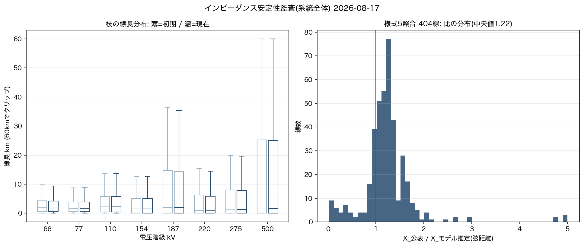

# インピーダンス安定性監査(系統全体) 2026-08-17

オーナー質問「インピーダンスの安定性とかみた？系統全体で」への回答。
判断・実装はAI(Claude Fable 5)。EGGC名称はオーナー確定(「一旦それでいく」)。

## ①枝レベル: 大工事前後で分布は不変(安定)

電圧階級ごとの線長分布(中央値/p95)は初期(2e51f0c)と現在でほぼ一致
(例: 66kV中央値1.86→1.76km・p95 12.2→11.8km。全階級で数%以内)。
X%(1000MVAベース・線種×線長/par)の中央値も±0.4pt以内。
**外れ値**: 66/77kVで80km超=0本(距離ガードが機能)・par>8=15本(頂点スナップの
束ね既知)・20m未満2,375本(敷地内/取付=意図的)。

## ②様式5照合(全国404線): 公表値とスケール整合

両端解決した公表インピーダンス404線について X_公表/X_モデル推定(弦距離下限) の比:
**中央値1.22・IQR 1.03〜1.38・p90 1.65** — 弦距離は実線長の下限なので比>1が自然で、
1.2〜1.4は妥当な迂回率。**系統全体でモデルのインピーダンススケールは公表値と整合**。

要注意35/404(8.7%)の内訳は照合アーティファクトが支配的:
- 北松江松江線(比397)・松江連絡線(比330): 端点が同一地点に解決=弦≈0の照合誤り
- 南福岡線(北陸154kV・比4.7): 公表56.5%が突出(長距離/ケーブル?)。個別調査候補
- 東栄幹1号線(比0.4): 端点解決の疑い

## ③数値的安定性(間接証拠)

PFは全4島AC収束(NR)を大工事後も維持。数値Ybusは同一モデルからmakeYbus
(par=pandapower parallelでR/X合成済)。条件数の直接計測は未実施(次の課題)。

## 結論

**大工事(OSM再抽出+EGGC吸着)はインピーダンス構造を乱していない**。
むしろ吸着分は弦→実線長で公表値との整合方向。残る改善余地:
①照合アーティファクト3件の端点解決修正 ②南福岡線の個別検証 ③Ybus条件数の直接計測。
