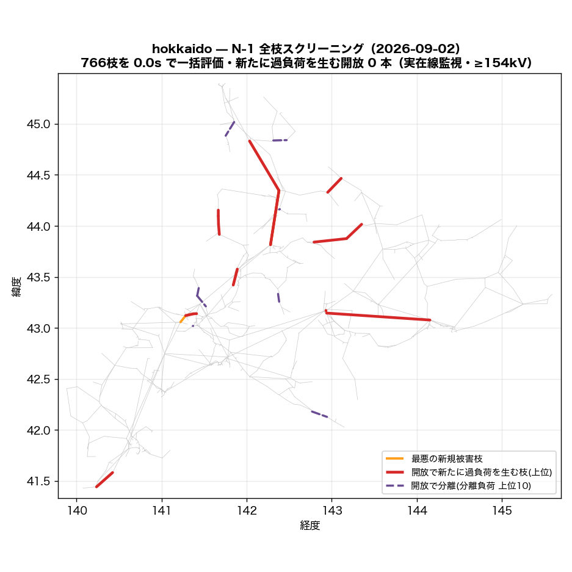
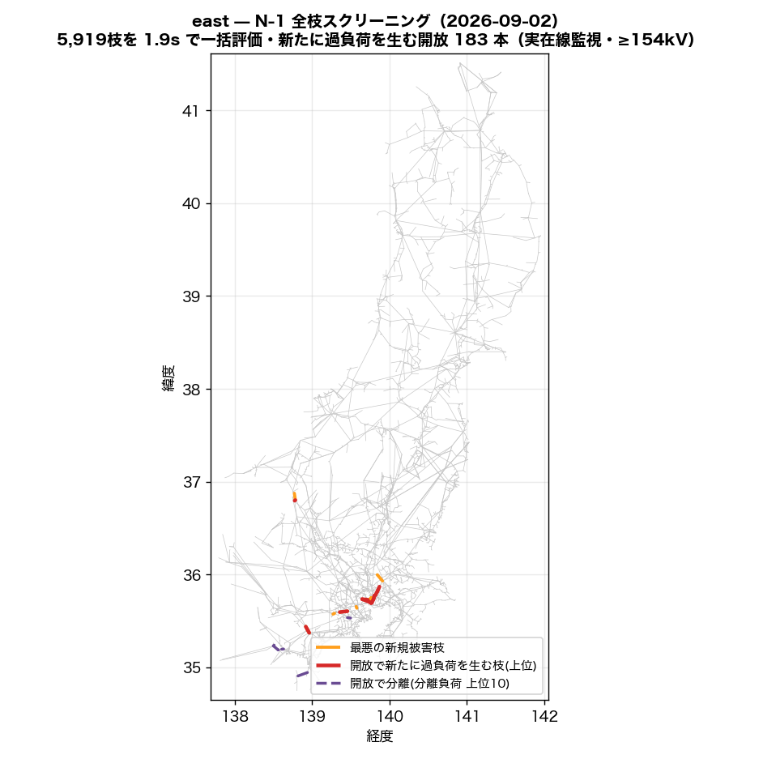
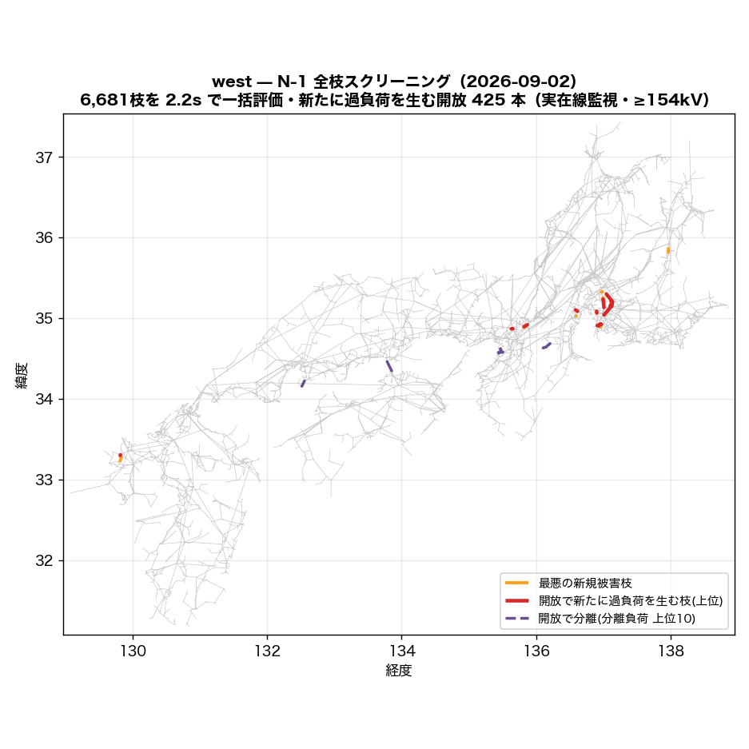
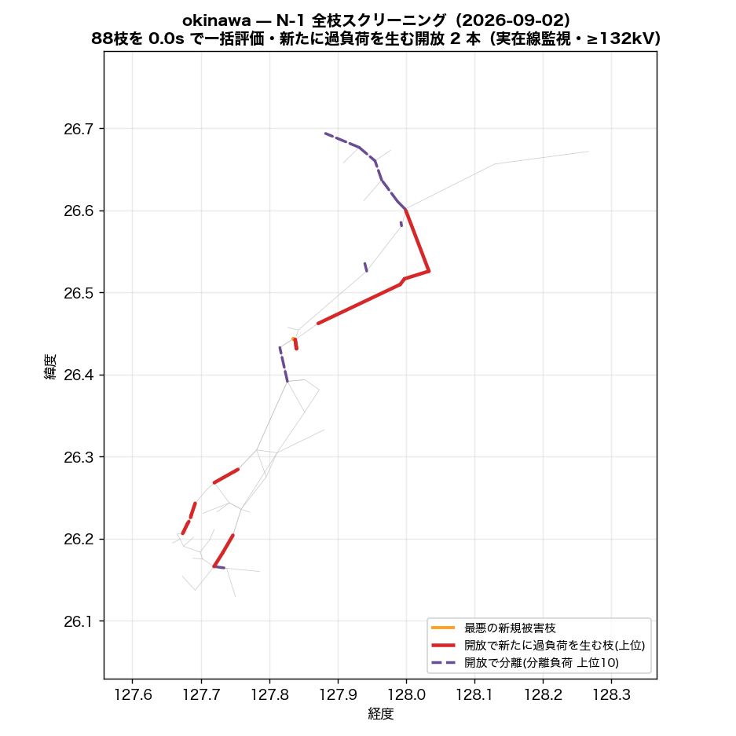

# N-1 全枝スクリーニング — LODF で全枝開放を一括評価（2026-09-02）

枝 k を開放したときの枝 j の潮流は `f_j + LODF[j,k]·f_k`（直流近似）で閉じているので、
全枝分の「開放後の最大負荷率・過負荷本数・最悪被害枝」が行列 1 枚の列演算で出る。
並列回線は **1 回線開放**（残回線容量で評価）、開放で分離する枝（橋）は LODF が定義できないため
**分離側の負荷・発電を別勘定**にした。

**合成定格の錯視を主結果に混ぜない**: 主表は監視枝を「実在線（OSM実線形・回収線・公表接続）＋銘板つき変圧器」に限った順位。
同一敷地タイ（同定）・発電所取付線・推定容量の変圧器などが最悪枝になる開放は別表で開示する。

| 島 | 主成分 | 枝 | 評価した開放 | 橋(分離) | 監視枝(実在/全) | 基準過負荷(実在) | 新規過負荷を生む開放 実在/全 | 新規側 >120% (実在) | 分離負荷≥100MW | PTDF | 一括評価 |
|---|---:|---:|---:|---:|---:|---:|---:|---:|---:|---:|---:|
| hokkaido | 793 | 910 | 766 | 144 | 126/185 | 0 | **0** / 18 | 0 | 0 | 0.0s | 0.0s |
| east | 5,785 | 6,892 | 5,919 | 973 | 1,422/2,109 | 85 | **183** / 501 | 61 | 3 | 2.7s | 1.9s |
| west | 7,386 | 8,802 | 6,681 | 2,116 | 2,436/3,188 | 62 | **425** / 748 | 54 | 38 | 4.2s | 2.2s |
| okinawa | 94 | 115 | 88 | 27 | 23/43 | 0 | **2** / 6 | 0 | 3 | 0.0s | 0.0s |

監視は ≥154kV（最高階級が届かない島はその階級: hokkaido 154kV、east 154kV、west 154kV、okinawa 132kV）・容量係数 1.0（理論値 √3·V·I に対する較正。公表運用容量との比較では約 0.5）。

## hokkaido

要素の内訳: 公表接続(直線) 2、発電所取付線 15、OSM実線 817、OSM実線(回収) 5、同一敷地タイ(同定) 2、変圧器(推定容量) 68、変圧器(銘板) 1

### 実在線監視 — 開放すると新たに過負荷を生む枝（上位 20）

基準ケースで既に >100% の実在監視枝: 0 本（最大 42.1%）。基準の過負荷は開放と無関係に居座るので、指標は**基準で過負荷でない枝の側**で取る（新規過負荷本数 → 新規側の最大負荷率）。新規側が 120% を超える開放: 0 本。

| # | 開放する枝 | 種別 | kV | 回線 | 開放枝の基準負荷率 | 新規過負荷 本数 | 新規側の最大負荷率 | 最大増分 | 最悪の新規被害枝 (種別・基準→開放後) |
|---:|---|---|---:|---:|---:|---:|---:|---:|---|
| 1 | 名寄幹線 | OSM実線 | 187 | 2 | 42.1% | **0** | **81%** | +38pt | 名寄幹線 (OSM実線, 187kV, 42.1→81%) |
| 2 | 滝川幹線 (Takikawa-kansen) | OSM実線 | 187 | 2 | 35.1% | **0** | **64%** | +28pt | 滝川幹線 (Takikawa-kansen) (OSM実線, 187kV, 35.1→64%) |
| 3 | trafo_275/187kV@nameplate | 変圧器(銘板) | 275 | 2 | 34.7% | **0** | **52%** | +17pt | trafo_275/187kV@nameplate (変圧器(銘板), 275kV, 34.7→52%) |
| 4 | 西札幌線 | OSM実線 | 187 | 2 | 25.8% | **0** | **49%** | +24pt | 西札幌線 (OSM実線, 187kV, 25.8→49%) |
| 5 | 西札幌線 | OSM実線 | 187 | 2 | 26.2% | **0** | **47%** | +21pt | 西札幌線 (OSM実線, 187kV, 26.2→47%) |
| 6 | trafo_275/187kV | 変圧器(推定容量) | 275 | 1 | 44.7% | **0** | **46%** | +15pt | trafo_275/187kV@nameplate (変圧器(銘板), 275kV, 34.7→46%) |
| 7 | 泉町一丁目変電所~小平変電所 (Obira Hendensho)線 | OSM実線 | 66 | 1 | 62.8% | **0** | **46%** | +4pt | 名寄幹線 (OSM実線, 187kV, 42.1→46%) |
| 8 | trafo_275/187kV | 変圧器(推定容量) | 275 | 1 | 37.9% | **0** | **46%** | +19pt | 道央北幹線;室蘭西幹線 (OSM実線, 187kV, 27.2→46%) |
| 9 | 北幌延線 | OSM実線 | 187 | 2 | 25.6% | **0** | **45%** | +20pt | 北幌延線 (OSM実線, 187kV, 25.6→45%) |
| 10 | 小平町変電所~小平変電所 (Obira Hendensho)線 | OSM実線 | 66 | 1 | 49.7% | **0** | **45%** | +3pt | 名寄幹線 (OSM実線, 187kV, 42.1→45%) |
| 11 | trafo_275/187kV | 変圧器(推定容量) | 275 | 1 | 54.5% | **0** | **45%** | +19pt | 西札幌線 (OSM実線, 187kV, 26.2→45%) |
| 12 | 日東変電所~丸瀬布西町変電所線 | OSM実線 | 66 | 1 | 71.1% | **0** | **45%** | +5pt | 十勝幹線 (OSM実線, 187kV, 39.8→45%) |
| 13 | 道東幹線 | OSM実線 | 187 | 2 | 9.4% | **0** | **45%** | +5pt | 十勝幹線 (OSM実線, 187kV, 39.8→45%) |
| 14 | 小平町変電所~鬼鹿田代変電所線 | OSM実線 | 66 | 1 | 36.5% | **0** | **44%** | +2pt | 名寄幹線 (OSM実線, 187kV, 42.1→44%) |
| 15 | 吉岡線 (お客さま接続線 JR北海道) | OSM実線 | 187 | 2 | 22.8% | **0** | **44%** | +21pt | 吉岡線 (お客さま接続線 JR北海道) (OSM実線, 187kV, 22.8→44%) |
| 16 | trafo_187/66kV | 変圧器(推定容量) | 187 | 1 | 130.2% | **0** | **44%** | +6pt | 名寄幹線 (OSM実線, 187kV, 42.1→44%) |
| 17 | 日東変電所~丸瀬布西町変電所線 | OSM実線 | 66 | 1 | 58.0% | **0** | **44%** | +4pt | 十勝幹線 (OSM実線, 187kV, 39.8→44%) |
| 18 | 北海道電力ネットワーク 187.0kV線 | OSM実線 | 187 | 1 | 3.9% | **0** | **44%** | +4pt | 十勝幹線 (OSM実線, 187kV, 39.8→44%) |
| 19 | 興部線 | OSM実線 | 66 | 1 | 23.2% | **0** | **44%** | +2pt | 名寄幹線 (OSM実線, 187kV, 42.1→44%) |
| 20 | trafo_187/66kV | 変圧器(推定容量) | 187 | 1 | 117.3% | **0** | **44%** | +8pt | 名寄幹線 (OSM実線, 187kV, 42.1→44%) |

### AC 検証（上位を本番 solve_island で開放して解き直し）

| 開放する枝 | 開放 | DC 新規側最大 (新規本数) | AC | AC 新規側最大 (新規本数) | DC最悪新規枝の AC 負荷率（基準→開放後） | 秒 |
|---|---|---:|---|---:|---|---:|
| 名寄幹線 | 1回線 | 81% (0) | 収束 (給電100%) | 86.9% (0) | 44.6 → 86.9% | 1.1 |
| 滝川幹線 (Takikawa-kansen) | 1回線 | 64% (0) | 収束 (給電100%) | 67.4% (0) | 37.1 → 67.4% | 1.1 |
| trafo_275/187kV@nameplate | 1回線 | 52% (0) | 収束 (給電100%) | 54.2% (0) | 36.3 → 54.2% | 1.1 |
| 西札幌線 | 1回線 | 49% (0) | 収束 (給電100%) | 54.5% (0) | 28.4 → 54.5% | 0.8 |
| 西札幌線 | 1回線 | 47% (0) | 収束 (給電100%) | 51.8% (0) | 28.9 → 51.8% | 0.8 |

AC の負荷率は |P|/容量（直流の定義に揃えた）。1 回線開放は parallel を 1 減らして解き直し、残回線の容量で評価。prune はしごで落ちた枝は比較から除外。

### 別表 — 合成定格の要素が最悪枝になる開放（錯視の開示・上位 20）

| # | 開放する枝 | 種別 | kV | 回線 | 開放枝の基準負荷率 | 新規過負荷 本数 | 新規側の最大負荷率 | 最大増分 | 最悪の新規被害枝 (種別・基準→開放後) |
|---:|---|---|---:|---:|---:|---:|---:|---:|---|
| 1 | trafo_187/66kV | 変圧器(推定容量) | 187 | 1 | 81.6% | **4** | **113%** | +23pt | trafo_187/66kV (変圧器(推定容量), 187kV, 93.4→113%) |
| 2 | trafo_275/66kV | 変圧器(推定容量) | 275 | 1 | 83.3% | **3** | **117%** | +38pt | trafo_187/66kV (変圧器(推定容量), 187kV, 78.5→117%) |
| 3 | trafo_187/66kV | 変圧器(推定容量) | 187 | 1 | 78.5% | **3** | **115%** | +32pt | trafo_275/66kV (変圧器(推定容量), 275kV, 83.3→115%) |
| 4 | 虻田線 | OSM実線 | 66 | 1 | 68.8% | **2** | **102%** | +9pt | trafo_187/66kV (変圧器(推定容量), 187kV, 93.4→102%) |
| 5 | trafo_187/66kV | 変圧器(推定容量) | 187 | 1 | 92.6% | **1** | **137%** | +44pt | trafo_187/66kV (変圧器(推定容量), 187kV, 93.4→137%) |
| 6 | trafo_187/66kV | 変圧器(推定容量) | 187 | 1 | 93.4% | **1** | **136%** | +44pt | trafo_187/66kV (変圧器(推定容量), 187kV, 92.6→136%) |
| 7 | trafo_187/110kV | 変圧器(推定容量) | 187 | 1 | 104.1% | **1** | **126%** | +55pt | trafo_187/110kV (変圧器(推定容量), 187kV, 70.2→126%) |
| 8 | trafo_187/110kV | 変圧器(推定容量) | 187 | 1 | 69.6% | **1** | **121%** | +51pt | trafo_187/110kV (変圧器(推定容量), 187kV, 70.2→121%) |
| 9 | trafo_187/110kV | 変圧器(推定容量) | 187 | 1 | 70.2% | **1** | **108%** | +39pt | trafo_187/110kV (変圧器(推定容量), 187kV, 69.6→108%) |
| 10 | trafo_187/66kV | 変圧器(推定容量) | 187 | 1 | 57.0% | **1** | **107%** | +33pt | trafo_275/66kV (変圧器(推定容量), 275kV, 74.2→107%) |
| 11 | trafo_187/66kV | 変圧器(推定容量) | 187 | 1 | 65.5% | **1** | **107%** | +36pt | trafo_187/66kV (変圧器(推定容量), 187kV, 70.4→107%) |
| 12 | trafo_187/66kV | 変圧器(推定容量) | 187 | 1 | 64.3% | **1** | **107%** | +24pt | trafo_275/66kV (変圧器(推定容量), 275kV, 87.1→107%) |
| 13 | trafo_275/66kV | 変圧器(推定容量) | 275 | 1 | 74.2% | **1** | **106%** | +49pt | trafo_187/66kV (変圧器(推定容量), 187kV, 57.0→106%) |
| 14 | trafo_275/66kV | 変圧器(推定容量) | 275 | 1 | 87.1% | **1** | **105%** | +40pt | trafo_187/66kV (変圧器(推定容量), 187kV, 64.3→105%) |
| 15 | 有珠線 | OSM実線 | 66 | 1 | 48.9% | **1** | **104%** | +27pt | trafo_187/66kV (変圧器(推定容量), 187kV, 76.9→104%) |
| 16 | trafo_187/66kV | 変圧器(推定容量) | 187 | 1 | 62.8% | **1** | **101%** | +31pt | trafo_187/66kV (変圧器(推定容量), 187kV, 70.4→101%) |
| 17 | trafo_187/66kV | 変圧器(推定容量) | 187 | 1 | 70.4% | **1** | **101%** | +35pt | trafo_187/66kV (変圧器(推定容量), 187kV, 65.5→101%) |
| 18 | 虻田線 | OSM実線 | 66 | 1 | 55.6% | **1** | **100%** | +7pt | trafo_187/66kV (変圧器(推定容量), 187kV, 93.4→100%) |
| 19 | 虻田線 | OSM実線 | 66 | 1 | 42.5% | **0** | **99%** | +6pt | trafo_187/66kV (変圧器(推定容量), 187kV, 93.4→99%) |
| 20 | 大野南線 | OSM実線 | 66 | 2 | 64.1% | **0** | **98%** | +5pt | trafo_187/66kV (変圧器(推定容量), 187kV, 93.4→98%) |

### 分離（橋）— 開放で切り離される負荷の大きい枝（上位 20）

橋 144 本（うち数値的な擬似橋 0）。分離側の負荷合計 1,799 MW。放射系の末端はそもそも N-1 で守れない（実系統では配電側の切替で対処）ので、ここは「モデルが放射になっている箇所」の一覧として読む。

| # | 開放する枝 | 種別 | kV | 分離バス数 | 分離側の負荷 | 分離側の発電 |
|---:|---|---|---:|---:|---:|---:|
| 1 | trafo_110/66kV | 変圧器(推定容量) | 110 | 9 | **72 MW** | 0 MW |
| 2 | 望来線 | OSM実線 | 66 | 6 | **54 MW** | 0 MW |
| 3 | trafo_187/66kV | 変圧器(推定容量) | 187 | 9 | **54 MW** | 0 MW |
| 4 | 同一敷地タイ(同定) | 同一敷地タイ(同定) | 66 | 5 | **45 MW** | 88 MW |
| 5 | 厚田線 | OSM実線 | 66 | 5 | **45 MW** | 0 MW |
| 6 | 山部線 | OSM実線 | 66 | 4 | **36 MW** | 11 MW |
| 7 | 浦河東線 | OSM実線 | 66 | 5 | **36 MW** | 5 MW |
| 8 | 天塩線 | OSM実線 | 66 | 6 | **36 MW** | 0 MW |
| 9 | 北海道送電線_53 | OSM実線 | 110 | 7 | **36 MW** | 0 MW |
| 10 | 枝幸線 | OSM実線 | 66 | 4 | **36 MW** | 0 MW |
| 11 | 浜益線 | OSM実線 | 66 | 4 | **36 MW** | 0 MW |
| 12 | 岩知志線 | OSM実線 | 66 | 5 | **27 MW** | 17 MW |
| 13 | 長流線 | OSM実線 | 66 | 4 | **27 MW** | 0 MW |
| 14 | 昆布線 | OSM実線 | 66 | 7 | **27 MW** | 9 MW |
| 15 | 瓜幕線 | OSM実線 | 66 | 3 | **27 MW** | 0 MW |
| 16 | 金山線 | OSM実線 | 66 | 3 | **27 MW** | 11 MW |
| 17 | 昆布線 | OSM実線 | 66 | 5 | **27 MW** | 9 MW |
| 18 | 遠別線 | OSM実線 | 66 | 5 | **27 MW** | 0 MW |
| 19 | 西一条十二丁目変電所~士別市変電所線 | OSM実線 | 66 | 5 | **27 MW** | 0 MW |
| 20 | 頓別線 | OSM実線 | 66 | 3 | **27 MW** | 0 MW |

## east

要素の内訳: 公表接続(直線) 61、発電所取付線 278、OSM実線 5,771、OSM実線(回収) 85、同一敷地タイ(同定) 51、合成連系タイ 1、変圧器(推定容量) 639、変圧器(銘板) 6

### 実在線監視 — 開放すると新たに過負荷を生む枝（上位 20）

基準ケースで既に >100% の実在監視枝: 85 本（最大 551.5%）。基準の過負荷は開放と無関係に居座るので、指標は**基準で過負荷でない枝の側**で取る（新規過負荷本数 → 新規側の最大負荷率）。新規側が 120% を超える開放: 61 本。

| # | 開放する枝 | 種別 | kV | 回線 | 開放枝の基準負荷率 | 新規過負荷 本数 | 新規側の最大負荷率 | 最大増分 | 最悪の新規被害枝 (種別・基準→開放後) |
|---:|---|---|---:|---:|---:|---:|---:|---:|---|
| 1 | 上野線 | OSM実線 | 275 | 1 | 137.8% | **8** | **478%** | +454pt | 上富士線 (公表接続(直線), 154kV, 24.5→478%) |
| 2 | 上野線 | OSM実線 | 275 | 1 | 122.7% | **7** | **504%** | +479pt | 上富士線 (公表接続(直線), 154kV, 24.5→504%) |
| 3 | 上野線 | OSM実線 | 275 | 1 | 121.3% | **7** | **498%** | +474pt | 上富士線 (公表接続(直線), 154kV, 24.5→498%) |
| 4 | 上野水道橋線 | OSM実線 | 275 | 1 | 118.5% | **7** | **487%** | +463pt | 上富士線 (公表接続(直線), 154kV, 24.5→487%) |
| 5 | 上野水道橋線 | OSM実線 | 275 | 1 | 117.1% | **7** | **482%** | +457pt | 上富士線 (公表接続(直線), 154kV, 24.5→482%) |
| 6 | 上野水道橋線 | OSM実線 | 275 | 1 | 114.4% | **7** | **471%** | +447pt | 上富士線 (公表接続(直線), 154kV, 24.5→471%) |
| 7 | 上野水道橋線 | OSM実線 | 275 | 1 | 113.0% | **7** | **466%** | +441pt | 上富士線 (公表接続(直線), 154kV, 24.5→466%) |
| 8 | 上野水道橋線 | OSM実線 | 275 | 1 | 111.6% | **7** | **460%** | +436pt | 上富士線 (公表接続(直線), 154kV, 24.5→460%) |
| 9 | 上野水道橋線 | OSM実線 | 275 | 1 | 110.2% | **7** | **455%** | +430pt | 上富士線 (公表接続(直線), 154kV, 24.5→455%) |
| 10 | 水道橋線 | OSM実線 | 275 | 1 | 46.3% | **7** | **289%** | +265pt | 上富士線 (公表接続(直線), 154kV, 24.5→289%) |
| 11 | leadin | 発電所取付線 | 275 | 1 | 30.7% | **7** | **233%** | +208pt | 上富士線 (公表接続(直線), 154kV, 24.5→233%) |
| 12 | trafo_500/154kV | 変圧器(推定容量) | 500 | 1 | 222.9% | **7** | **131%** | +58pt | 都留線 (OSM実線, 154kV, 77.3→131%) |
| 13 | 上野線 | OSM実線 | 275 | 1 | 173.9% | **6** | **317%** | +292pt | 上富士線 (公表接続(直線), 154kV, 24.5→317%) |
| 14 | 上野線 | OSM実線 | 275 | 1 | 152.7% | **5** | **371%** | +346pt | 上富士線 (公表接続(直線), 154kV, 24.5→371%) |
| 15 | trafo_275/154kV | 変圧器(推定容量) | 275 | 1 | 105.2% | **4** | **102%** | +30pt | 新鶴見線 (OSM実線, 154kV, 99.2→102%) |
| 16 | trafo_275/154kV | 変圧器(推定容量) | 275 | 1 | 203.6% | **3** | **133%** | +37pt | 山中湖村変電所~新富士変電所線 (OSM実線, 154kV, 99.4→133%) |
| 17 | 南多摩線 | OSM実線 | 154 | 2 | 82.8% | **3** | **116%** | +34pt | 南多摩線 (OSM実線, 154kV, 82.8→116%) |
| 18 | trafo_500/275kV | 変圧器(推定容量) | 500 | 1 | 100.6% | **3** | **103%** | +21pt | 東京北線 (OSM実線, 275kV, 82.8→103%) |
| 19 | 浅貝線 | OSM実線 | 500 | 1 | 16.3% | **2** | **232%** | +212pt | 湯宿線 (OSM実線, 500kV, 20.6→232%) |
| 20 | 山中湖村変電所~新富士変電所線 | OSM実線 | 154 | 2 | 99.4% | **2** | **175%** | +76pt | 山中湖村変電所~新富士変電所線 (OSM実線, 154kV, 99.4→175%) |

### AC 検証（上位を本番 solve_island で開放して解き直し）

| 開放する枝 | 開放 | DC 新規側最大 (新規本数) | AC | AC 新規側最大 (新規本数) | DC最悪新規枝の AC 負荷率（基準→開放後） | 秒 |
|---|---|---:|---|---:|---|---:|
| 上野線 | 全回線 | 478% (8) | 収束 (給電100%) | 479.8% (9) | 28.4 → 479.8% | 8.4 |
| 上野線 | 全回線 | 504% (7) | 収束 (給電100%) | 506.7% (9) | 28.4 → 506.7% | 10.4 |
| 上野線 | 全回線 | 498% (7) | 収束 (給電100%) | 501.2% (9) | 28.4 → 501.2% | 4.2 |
| 上野水道橋線 | 全回線 | 487% (7) | 収束 (給電100%) | 490.1% (9) | 28.4 → 490.1% | 10.4 |
| 上野水道橋線 | 全回線 | 482% (7) | 収束 (給電100%) | 484.6% (9) | 28.4 → 484.6% | 9.1 |

AC の負荷率は |P|/容量（直流の定義に揃えた）。1 回線開放は parallel を 1 減らして解き直し、残回線の容量で評価。prune はしごで落ちた枝は比較から除外。

### 別表 — 合成定格の要素が最悪枝になる開放（錯視の開示・上位 20）

| # | 開放する枝 | 種別 | kV | 回線 | 開放枝の基準負荷率 | 新規過負荷 本数 | 新規側の最大負荷率 | 最大増分 | 最悪の新規被害枝 (種別・基準→開放後) |
|---:|---|---|---:|---:|---:|---:|---:|---:|---|
| 1 | 東北東京間連系線 | 合成連系タイ | 500 | 1 | 56.2% | **9** | **136%** | +71pt | trafo_500/275kV (変圧器(推定容量), 500kV, 78.6→136%) |
| 2 | trafo_500/275kV | 変圧器(推定容量) | 500 | 1 | 138.5% | **8** | **103%** | +49pt | trafo_500/154kV (変圧器(推定容量), 500kV, 99.7→103%) |
| 3 | trafo_275/66kV | 変圧器(推定容量) | 275 | 1 | 230.5% | **7** | **122%** | +29pt | trafo_154/66kV (変圧器(推定容量), 154kV, 97.3→122%) |
| 4 | 新京葉変電所~高瀬分岐所線 | OSM実線 | 500 | 1 | 28.7% | **7** | **102%** | +28pt | trafo_500/154kV (変圧器(推定容量), 500kV, 99.7→102%) |
| 5 | trafo_500/275kV | 変圧器(推定容量) | 500 | 1 | 100.6% | **6** | **103%** | +21pt | trafo_500/154kV (変圧器(推定容量), 500kV, 99.7→103%) |
| 6 | 浅貝線 | OSM実線 | 500 | 1 | 16.3% | **5** | **657%** | +564pt | trafo_154/66kV (変圧器(推定容量), 154kV, 92.6→657%) |
| 7 | trafo_275/154kV | 変圧器(推定容量) | 275 | 1 | 105.2% | **5** | **106%** | +30pt | trafo_275/154kV (変圧器(推定容量), 275kV, 86.6→106%) |
| 8 | 東港一丁目変電所_2~北新潟変電所線 | OSM実線 | 154 | 1 | 134.7% | **4** | **141%** | +52pt | trafo_275/154kV (変圧器(推定容量), 275kV, 88.9→141%) |
| 9 | 天竜南線 | OSM実線 | 154 | 1 | 73.9% | **4** | **120%** | +78pt | trafo_154/66kV (変圧器(推定容量), 154kV, 42.0→120%) |
| 10 | trafo_154/66kV | 変圧器(推定容量) | 154 | 1 | 108.2% | **4** | **115%** | +18pt | trafo_154/66kV (変圧器(推定容量), 154kV, 97.3→115%) |
| 11 | trafo_154/66kV | 変圧器(推定容量) | 154 | 1 | 74.9% | **4** | **115%** | +18pt | trafo_154/66kV (変圧器(推定容量), 154kV, 97.3→115%) |
| 12 | trafo_154/66kV | 変圧器(推定容量) | 154 | 1 | 85.8% | **4** | **111%** | +15pt | trafo_154/66kV (変圧器(推定容量), 154kV, 97.4→111%) |
| 13 | trafo_500/66kV | 変圧器(推定容量) | 500 | 1 | 152.3% | **4** | **110%** | +26pt | trafo_154/66kV (変圧器(推定容量), 154kV, 95.4→110%) |
| 14 | trafo_500/275kV | 変圧器(推定容量) | 500 | 1 | 113.1% | **4** | **109%** | +24pt | trafo_500/275kV (変圧器(推定容量), 500kV, 87.7→109%) |
| 15 | 東北送電線_104 | OSM実線 | 66 | 1 | 203.4% | **4** | **108%** | +24pt | trafo_154/66kV (変圧器(推定容量), 154kV, 95.4→108%) |
| 16 | trafo_154/66kV | 変圧器(推定容量) | 154 | 1 | 97.4% | **4** | **108%** | +17pt | trafo_154/66kV (変圧器(推定容量), 154kV, 96.6→108%) |
| 17 | trafo_500/154kV | 変圧器(推定容量) | 500 | 1 | 121.3% | **4** | **108%** | +30pt | trafo_275/154kV (変圧器(推定容量), 275kV, 91.0→108%) |
| 18 | 柿ノ沢線 | OSM実線 | 66 | 1 | 156.1% | **4** | **107%** | +41pt | trafo_154/66kV (変圧器(推定容量), 154kV, 97.3→107%) |
| 19 | trafo_154/66kV | 変圧器(推定容量) | 154 | 1 | 67.3% | **4** | **107%** | +16pt | trafo_154/66kV (変圧器(推定容量), 154kV, 97.4→107%) |
| 20 | 西水戸線 | OSM実線 | 154 | 2 | 151.9% | **4** | **104%** | +125pt | trafo_154/66kV (変圧器(推定容量), 154kV, 97.4→104%) |

### 分離（橋）— 開放で切り離される負荷の大きい枝（上位 20）

橋 973 本（うち数値的な擬似橋 0）。分離側の負荷合計 12,274 MW。放射系の末端はそもそも N-1 で守れない（実系統では配電側の切替で対処）ので、ここは「モデルが放射になっている箇所」の一覧として読む。

| # | 開放する枝 | 種別 | kV | 分離バス数 | 分離側の負荷 | 分離側の発電 |
|---:|---|---|---:|---:|---:|---:|
| 1 | trafo_275/66kV | 変圧器(推定容量) | 275 | 9 | **161 MW** | 0 MW |
| 2 | 東京電力パワーグリッド 66.0kV線 | OSM実線 | 66 | 18 | **117 MW** | 52 MW |
| 3 | trafo_154/66kV | 変圧器(推定容量) | 154 | 3 | **113 MW** | 0 MW |
| 4 | 東京電力パワーグリッド 66.0kV線 | OSM実線 | 66 | 13 | **99 MW** | 52 MW |
| 5 | 中野台二丁目変電所~富士川第一変電所線 | OSM実線 | 66 | 11 | **99 MW** | 52 MW |
| 6 | trafo_154/66kV | 変圧器(推定容量) | 154 | 8 | **93 MW** | 0 MW |
| 7 | trafo_154/66kV | 変圧器(推定容量) | 154 | 8 | **93 MW** | 0 MW |
| 8 | namebind | OSM実線 | 66 | 6 | **82 MW** | 52 MW |
| 9 | 長津田町田線 | OSM実線 | 66 | 5 | **76 MW** | 0 MW |
| 10 | 東京電力パワーグリッド 66.0kV線 | OSM実線 | 66 | 8 | **75 MW** | 0 MW |
| 11 | 東京電力パワーグリッド 66.0kV線 | OSM実線 | 66 | 6 | **75 MW** | 0 MW |
| 12 | tokyo_line_4208 | OSM実線 | 66 | 19 | **74 MW** | 50 MW |
| 13 | 佐野川線 | OSM実線 | 66 | 5 | **65 MW** | 52 MW |
| 14 | 梅木変電所~三福変電所線 | OSM実線 | 66 | 5 | **56 MW** | 0 MW |
| 15 | 伊東市変電所~田方変電所線 | OSM実線 | 66 | 5 | **56 MW** | 0 MW |
| 16 | 衛星判読回収線 sat-001-ojiya66 | OSM実線(回収) | 66 | 6 | **56 MW** | 19 MW |
| 17 | tokyo_line_4210 | OSM実線 | 66 | 18 | **56 MW** | 50 MW |
| 18 | tokyo_line_4225 | OSM実線 | 66 | 5 | **56 MW** | 19 MW |
| 19 | tokyo_line_4228 | OSM実線 | 66 | 14 | **56 MW** | 50 MW |
| 20 | 渋沢二丁目変電所~金子変電所線 | OSM実線 | 66 | 2 | **51 MW** | 1 MW |

## west

要素の内訳: 公表接続(直線) 63、公表接続の取付スタブ 5、発電所取付線 301、OSM実線 7,352、OSM実線(回収) 105、同一敷地タイ(同定) 13、合成連系タイ 5、変圧器(推定容量) 954、変圧器(銘板) 4

### 実在線監視 — 開放すると新たに過負荷を生む枝（上位 20）

基準ケースで既に >100% の実在監視枝: 62 本（最大 385.6%）。基準の過負荷は開放と無関係に居座るので、指標は**基準で過負荷でない枝の側**で取る（新規過負荷本数 → 新規側の最大負荷率）。新規側が 120% を超える開放: 54 本。

| # | 開放する枝 | 種別 | kV | 回線 | 開放枝の基準負荷率 | 新規過負荷 本数 | 新規側の最大負荷率 | 最大増分 | 最悪の新規被害枝 (種別・基準→開放後) |
|---:|---|---|---:|---:|---:|---:|---:|---:|---|
| 1 | 山代変電所~久原変電所線 | OSM実線 | 500 | 1 | 51.3% | **8** | **255%** | +212pt | 山代変電所~九州電力　日宇変電所線 (OSM実線, 220kV, 42.9→255%) |
| 2 | 南柴田町変電所~昭和町変電所線 | OSM実線 | 154 | 1 | 385.6% | **7** | **160%** | +66pt | 春日井変電所~電源名古屋線 (OSM実線, 154kV, 96.7→160%) |
| 3 | 明星町四丁目変電所~喜撰山開閉所線 | OSM実線 | 154 | 1 | 92.8% | **6** | **146%** | +79pt | 宇治市変電所~喜撰山開閉所線 (OSM実線, 154kV, 98.2→146%) |
| 4 | trafo_500/275kV | 変圧器(推定容量) | 500 | 1 | 66.3% | **6** | **138%** | +45pt | 駒ヶ根変電所~田畑変電所線 (OSM実線, 154kV, 96.7→138%) |
| 5 | 梶原六丁目変電所~高槻変電所線 | OSM実線 | 500 | 1 | 225.8% | **5** | **132%** | +79pt | 宇治市変電所~喜撰山開閉所線 (OSM実線, 154kV, 98.2→132%) |
| 6 | trafo_275/154kV | 変圧器(推定容量) | 275 | 1 | 315.5% | **5** | **119%** | +55pt | 南柴田町変電所~東海町六丁目変電所線 (OSM実線, 275kV, 96.8→119%) |
| 7 | 住吉町五丁目変電所~岩滑西町三丁目変電所線 | OSM実線 | 154 | 1 | 215.5% | **4** | **243%** | +144pt | 新居町五丁目変電所~南起変電所線 (OSM実線, 154kV, 99.1→243%) |
| 8 | 中部電力パワーグリッド 275.0kV線 | OSM実線 | 275 | 1 | 154.5% | **4** | **235%** | +157pt | 垂坂町変電所~北勢変電所 (Hokusei Hendensho)線 (OSM実線, 154kV, 78.0→235%) |
| 9 | 一本木町一丁目変電所~住吉町五丁目変電所線 | OSM実線 | 154 | 1 | 186.3% | **4** | **223%** | +124pt | 新居町五丁目変電所~南起変電所線 (OSM実線, 154kV, 99.1→223%) |
| 10 | 一本木町一丁目変電所~住吉町五丁目変電所線 | OSM実線 | 154 | 1 | 178.3% | **4** | **218%** | +119pt | 新居町五丁目変電所~南起変電所線 (OSM実線, 154kV, 99.1→218%) |
| 11 | 新居町五丁目変電所~一本木町一丁目変電所線 | OSM実線 | 154 | 1 | 170.5% | **4** | **213%** | +114pt | 新居町五丁目変電所~南起変電所線 (OSM実線, 154kV, 99.1→213%) |
| 12 | 新居町五丁目変電所~一本木町一丁目変電所線 | OSM実線 | 154 | 1 | 162.6% | **4** | **208%** | +108pt | 新居町五丁目変電所~南起変電所線 (OSM実線, 154kV, 99.1→208%) |
| 13 | 中部電力パワーグリッド 日進変電所~中電猪高変電所線 | OSM実線 | 154 | 1 | 131.7% | **4** | **116%** | +64pt | 中部電力パワーグリッド 154.0kV線 (OSM実線, 154kV, 88.0→116%) |
| 14 | 春日井変電所~中電猪高変電所線 | OSM実線 | 154 | 1 | 123.7% | **4** | **115%** | +60pt | 中部電力パワーグリッド 154.0kV線 (OSM実線, 154kV, 88.0→115%) |
| 15 | 東浦北豊田線 | OSM実線 | 275 | 2 | 192.5% | **4** | **110%** | +94pt | 新居町五丁目変電所~南起変電所線 (OSM実線, 154kV, 99.1→110%) |
| 16 | 大畑町変電所~中部電力八草変電所線 | OSM実線 | 275 | 1 | 45.5% | **4** | **109%** | +42pt | 北豊田変電所 (Kita Toyota Hendensho)~瀬戸変電所線 (OSM実線, 275kV, 97.1→109%) |
| 17 | 大畑町変電所~中部電力八草変電所線 | OSM実線 | 77 | 1 | 498.3% | **4** | **108%** | +39pt | 北豊田変電所 (Kita Toyota Hendensho)~瀬戸変電所線 (OSM実線, 275kV, 97.1→108%) |
| 18 | 岩作色金変電所~瀬戸変電所線 | OSM実線 | 77 | 1 | 366.5% | **4** | **104%** | +50pt | 春日井変電所~電源名古屋線 (OSM実線, 154kV, 96.7→104%) |
| 19 | 電源名古屋~瀬戸変電所線 | OSM実線 | 275 | 2 | 70.2% | **4** | **104%** | +33pt | 春日井変電所~電源名古屋線 (OSM実線, 154kV, 96.7→104%) |
| 20 | 北豊田変電所 (Kita Toyota Hendensho)~瀬戸変電所線 | OSM実線 | 275 | 2 | 97.1% | **3** | **161%** | +64pt | 北豊田変電所 (Kita Toyota Hendensho)~瀬戸変電所線 (OSM実線, 275kV, 97.1→161%) |

### AC 検証（上位を本番 solve_island で開放して解き直し）

| 開放する枝 | 開放 | DC 新規側最大 (新規本数) | AC | AC 新規側最大 (新規本数) | DC最悪新規枝の AC 負荷率（基準→開放後） | 秒 |
|---|---|---:|---|---:|---|---:|
| 山代変電所~久原変電所線 | 全回線 | 255% (8) | 収束 (給電100%) | 254.9% (9) | 46.3 → 254.9% | 11.8 |
| 南柴田町変電所~昭和町変電所線 | 全回線 | 160% (7) | 収束 (給電100%) | 150.5% (7) | 89.9 → 150.5% | 11.0 |
| 明星町四丁目変電所~喜撰山開閉所線 | 全回線 | 146% (6) | 収束 (給電100%) | 146.0% (6) | 97.7 → 146.0% | 15.7 |
| trafo_500/275kV | 全回線 | 138% (6) | 収束 (給電100%) | 136.4% (5) | 94.8 → 136.4% | 12.9 |
| 梶原六丁目変電所~高槻変電所線 | 全回線 | 132% (5) | 収束 (給電100%) | 132.3% (5) | 97.7 → 132.3% | 16.0 |

AC の負荷率は |P|/容量（直流の定義に揃えた）。1 回線開放は parallel を 1 減らして解き直し、残回線の容量で評価。prune はしごで落ちた枝は比較から除外。

### 別表 — 合成定格の要素が最悪枝になる開放（錯視の開示・上位 20）

| # | 開放する枝 | 種別 | kV | 回線 | 開放枝の基準負荷率 | 新規過負荷 本数 | 新規側の最大負荷率 | 最大増分 | 最悪の新規被害枝 (種別・基準→開放後) |
|---:|---|---|---:|---:|---:|---:|---:|---:|---|
| 1 | 梶原六丁目変電所~高槻変電所線 | OSM実線 | 500 | 1 | 225.8% | **11** | **221%** | +140pt | trafo_275/77kV (変圧器(推定容量), 275kV, 81.5→221%) |
| 2 | 大畑町変電所~中部電力八草変電所線 | OSM実線 | 275 | 1 | 45.5% | **7** | **209%** | +134pt | trafo_275/77kV (変圧器(推定容量), 275kV, 74.3→209%) |
| 3 | 大畑町変電所~中部電力八草変電所線 | OSM実線 | 77 | 1 | 498.3% | **7** | **198%** | +124pt | trafo_275/77kV (変圧器(推定容量), 275kV, 74.3→198%) |
| 4 | 中部電力八草変電所~吉野町変電所線 | OSM実線 | 77 | 1 | 355.2% | **6** | **177%** | +103pt | trafo_275/77kV (変圧器(推定容量), 275kV, 74.3→177%) |
| 5 | 溝口変電所~城北変電所線 | OSM実線 | 275 | 1 | 180.9% | **6** | **156%** | +155pt | trafo_275/66kV (変圧器(推定容量), 275kV, 0.8→156%) |
| 6 | 岩作色金変電所~瀬戸変電所線 | OSM実線 | 77 | 1 | 366.5% | **6** | **105%** | +50pt | trafo_275/154kV (変圧器(推定容量), 275kV, 93.0→105%) |
| 7 | trafo_275/154kV | 変圧器(推定容量) | 275 | 1 | 147.9% | **5** | **235%** | +150pt | trafo_154/77kV (変圧器(推定容量), 154kV, 84.6→235%) |
| 8 | 城北変電所~姫路変電所線 | OSM実線 | 275 | 1 | 180.1% | **5** | **186%** | +147pt | trafo_275/66kV (変圧器(推定容量), 275kV, 39.0→186%) |
| 9 | 吉野町変電所~瀬戸変電所線 | OSM実線 | 77 | 1 | 321.0% | **5** | **167%** | +93pt | trafo_275/77kV (変圧器(推定容量), 275kV, 74.3→167%) |
| 10 | 中部電力パワーグリッド 日進変電所~北豊田変電所 (Kita Toyota Hendensho)線 | OSM実線 | 275 | 1 | 88.4% | **5** | **160%** | +86pt | trafo_275/77kV (変圧器(推定容量), 275kV, 74.3→160%) |
| 11 | 宝塚開閉所 (Takarazuka Kaiheisho)~猪名川変電所線 | OSM実線 | 275 | 1 | 53.4% | **5** | **123%** | +32pt | trafo_275/154kV (変圧器(推定容量), 275kV, 90.6→123%) |
| 12 | trafo_500/220kV | 変圧器(推定容量) | 500 | 1 | 87.6% | **5** | **122%** | +45pt | trafo_500/220kV (変圧器(推定容量), 500kV, 76.9→122%) |
| 13 | 宮田変電所~有木変電所線 | OSM実線 | 220 | 1 | 116.1% | **5** | **121%** | +47pt | trafo_220/66kV (変圧器(推定容量), 220kV, 99.1→121%) |
| 14 | trafo_500/220kV | 変圧器(推定容量) | 500 | 1 | 84.7% | **5** | **121%** | +46pt | trafo_500/220kV (変圧器(推定容量), 500kV, 87.6→121%) |
| 15 | trafo_500/220kV | 変圧器(推定容量) | 500 | 1 | 76.9% | **4** | **129%** | +42pt | trafo_500/220kV (変圧器(推定容量), 500kV, 87.6→129%) |
| 16 | 新岡山変電所~高梁市変電所線 | OSM実線 | 220 | 1 | 75.6% | **4** | **129%** | +41pt | trafo_500/220kV (変圧器(推定容量), 500kV, 87.6→129%) |
| 17 | 下小鯖変電所~小郡変電所線 | OSM実線 | 110 | 1 | 147.6% | **4** | **128%** | +52pt | trafo_220/110kV (変圧器(推定容量), 220kV, 76.2→128%) |
| 18 | 新岡山変電所~高梁市変電所線 | OSM実線 | 500 | 1 | 14.6% | **4** | **128%** | +40pt | trafo_500/220kV (変圧器(推定容量), 500kV, 87.6→128%) |
| 19 | 中国電力ネットワーク 110.0kV線 | OSM実線 | 110 | 1 | 138.7% | **4** | **125%** | +49pt | trafo_220/110kV (変圧器(推定容量), 220kV, 76.2→125%) |
| 20 | 南京都奈良線;平城木津線 | OSM実線 | 77 | 1 | 131.7% | **4** | **114%** | +35pt | trafo_154/77kV (変圧器(推定容量), 154kV, 87.3→114%) |

### 分離（橋）— 開放で切り離される負荷の大きい枝（上位 20）

橋 2,116 本（うち数値的な擬似橋 0）。分離側の負荷合計 37,109 MW。放射系の末端はそもそも N-1 で守れない（実系統では配電側の切替で対処）ので、ここは「モデルが放射になっている箇所」の一覧として読む。

| # | 開放する枝 | 種別 | kV | 分離バス数 | 分離側の負荷 | 分離側の発電 |
|---:|---|---|---:|---:|---:|---:|
| 1 | 菰池二丁目変電所~福江町三丁目変電所線 | OSM実線 | 500 | 467 | **4,031 MW** | 4,202 MW |
| 2 | trafo_275/77kV | 変圧器(推定容量) | 275 | 24 | **410 MW** | 0 MW |
| 3 | 関西送電線_129 | OSM実線 | 77 | 18 | **384 MW** | 110 MW |
| 4 | 堺港長曽根線 | 公表接続(直線) | 154 | 24 | **371 MW** | 21 MW |
| 5 | 泉北線〔取付〕 | 公表接続の取付スタブ | 77 | 23 | **341 MW** | 21 MW |
| 6 | 敷津変電所~御崎七丁目変電所線 | OSM実線 | 154 | 15 | **325 MW** | 110 MW |
| 7 | 中勢青山線 | OSM実線 | 77 | 9 | **212 MW** | 19 MW |
| 8 | 青山名張線 | OSM実線 | 77 | 7 | **212 MW** | 19 MW |
| 9 | 大柿線 | OSM実線 | 66 | 6 | **172 MW** | 0 MW |
| 10 | 青山名張線 | OSM実線 | 77 | 5 | **169 MW** | 19 MW |
| 11 | trafo_187/66kV | 変圧器(推定容量) | 187 | 12 | **165 MW** | 19 MW |
| 12 | 熊野川町相須変電所~新宮変電所線 | OSM実線 | 275 | 18 | **162 MW** | 1 MW |
| 13 | trafo_154/77kV | 変圧器(推定容量) | 154 | 7 | **158 MW** | 0 MW |
| 14 | 川口線+川口連絡線 | 公表接続(直線) | 66 | 12 | **157 MW** | 30 MW |
| 15 | 敷津萩之茶屋線 | 公表接続(直線) | 154 | 5 | **148 MW** | 0 MW |
| 16 | trafo_154/77kV | 変圧器(推定容量) | 154 | 6 | **144 MW** | 89 MW |
| 17 | 大柿線 | OSM実線 | 66 | 5 | **138 MW** | 0 MW |
| 18 | 西三国変電所~味生変電所線 | OSM実線 | 154 | 6 | **138 MW** | 0 MW |
| 19 | 南港南二丁目変電所~南港東七丁目変電所線 | OSM実線 | 154 | 8 | **138 MW** | 19 MW |
| 20 | 日和佐支線〔取付〕 | 公表接続の取付スタブ | 66 | 11 | **137 MW** | 0 MW |

## okinawa

要素の内訳: 発電所取付線 8、OSM実線 88、変圧器(推定容量) 19

### 実在線監視 — 開放すると新たに過負荷を生む枝（上位 20）

基準ケースで既に >100% の実在監視枝: 0 本（最大 89.9%）。基準の過負荷は開放と無関係に居座るので、指標は**基準で過負荷でない枝の側**で取る（新規過負荷本数 → 新規側の最大負荷率）。新規側が 120% を超える開放: 0 本。

| # | 開放する枝 | 種別 | kV | 回線 | 開放枝の基準負荷率 | 新規過負荷 本数 | 新規側の最大負荷率 | 最大増分 | 最悪の新規被害枝 (種別・基準→開放後) |
|---:|---|---|---:|---:|---:|---:|---:|---:|---|
| 1 | trafo_132/66kV | 変圧器(推定容量) | 132 | 1 | 133.6% | **1** | **113%** | +49pt | 石川東山一丁目変電所~石川東山二丁目変電所線 (OSM実線, 132kV, 89.9→113%) |
| 2 | trafo_132/66kV | 変圧器(推定容量) | 132 | 1 | 47.8% | **1** | **100%** | +10pt | 石川東山一丁目変電所~石川東山二丁目変電所線 (OSM実線, 132kV, 89.9→100%) |
| 3 | trafo_132/66kV | 変圧器(推定容量) | 132 | 1 | 45.5% | **0** | **100%** | +10pt | 石川東山一丁目変電所~石川東山二丁目変電所線 (OSM実線, 132kV, 89.9→100%) |
| 4 | namebind | OSM実線 | 66 | 2 | 83.6% | **0** | **92%** | +5pt | 石川東山一丁目変電所~石川東山二丁目変電所線 (OSM実線, 132kV, 89.9→92%) |
| 5 | Henoko Substation~名護市変電所線 | OSM実線 | 66 | 2 | 45.3% | **0** | **91%** | +2pt | 石川東山一丁目変電所~石川東山二丁目変電所線 (OSM実線, 132kV, 89.9→91%) |
| 6 | 松田変電所~Henoko Substation線 | OSM実線 | 66 | 2 | 56.1% | **0** | **90%** | +1pt | 石川東山一丁目変電所~石川東山二丁目変電所線 (OSM実線, 132kV, 89.9→90%) |
| 7 | leadin | 発電所取付線 | 66 | 2 | 33.1% | **0** | **90%** | +0pt | 石川東山一丁目変電所~石川東山二丁目変電所線 (OSM実線, 132kV, 89.9→90%) |
| 8 | 松田変電所~Henoko Substation線 | OSM実線 | 66 | 2 | 69.9% | **0** | **90%** | +0pt | 石川東山一丁目変電所~石川東山二丁目変電所線 (OSM実線, 132kV, 89.9→90%) |
| 9 | leadin | 発電所取付線 | 132 | 2 | 8.3% | **0** | **90%** | +0pt | 石川東山一丁目変電所~石川東山二丁目変電所線 (OSM実線, 132kV, 89.9→90%) |
| 10 | 壷川変電所~久茂地変電所線 | OSM実線 | 66 | 1 | 61.2% | **0** | **90%** | +4pt | 石川東山一丁目変電所~石川東山二丁目変電所線 (OSM実線, 132kV, 89.9→90%) |
| 11 | 友寄変電所~南風原変電所線 | OSM実線 | 66 | 1 | 159.2% | **0** | **90%** | +7pt | 石川東山一丁目変電所~石川東山二丁目変電所線 (OSM実線, 132kV, 89.9→90%) |
| 12 | 伊佐一丁目変電所_2~牧港五丁目変電所線 | OSM実線 | 66 | 1 | 142.7% | **0** | **90%** | +6pt | 石川東山一丁目変電所~石川東山二丁目変電所線 (OSM実線, 132kV, 89.9→90%) |
| 13 | trafo_132/66kV | 変圧器(推定容量) | 132 | 1 | 75.3% | **0** | **90%** | +0pt | 石川東山一丁目変電所~石川東山二丁目変電所線 (OSM実線, 132kV, 89.9→90%) |
| 14 | 那覇変電所~壷川変電所線 | OSM実線 | 66 | 1 | 33.7% | **0** | **90%** | +2pt | 石川東山一丁目変電所~石川東山二丁目変電所線 (OSM実線, 132kV, 89.9→90%) |
| 15 | 南風原変電所~与那原変電所線 | OSM実線 | 66 | 1 | 99.2% | **0** | **90%** | +6pt | 石川東山一丁目変電所~石川東山二丁目変電所線 (OSM実線, 132kV, 89.9→90%) |
| 16 | trafo_132/66kV | 変圧器(推定容量) | 132 | 1 | 60.1% | **0** | **90%** | +2pt | 石川東山一丁目変電所~石川東山二丁目変電所線 (OSM実線, 132kV, 89.9→90%) |
| 17 | 曙変電所~久茂地変電所線 | OSM実線 | 66 | 1 | 108.6% | **0** | **90%** | +1pt | 石川東山一丁目変電所~石川東山二丁目変電所線 (OSM実線, 132kV, 89.9→90%) |
| 18 | trafo_132/66kV | 変圧器(推定容量) | 132 | 1 | 76.4% | **0** | **90%** | +4pt | 石川東山一丁目変電所~石川東山二丁目変電所線 (OSM実線, 132kV, 89.9→90%) |
| 19 | 曙変電所~久茂地変電所線 | OSM実線 | 66 | 1 | 81.1% | **0** | **90%** | +1pt | 石川東山一丁目変電所~石川東山二丁目変電所線 (OSM実線, 132kV, 89.9→90%) |
| 20 | trafo_132/66kV | 変圧器(推定容量) | 132 | 1 | 49.4% | **0** | **90%** | +2pt | 石川東山一丁目変電所~石川東山二丁目変電所線 (OSM実線, 132kV, 89.9→90%) |

### AC 検証（上位を本番 solve_island で開放して解き直し）

| 開放する枝 | 開放 | DC 新規側最大 (新規本数) | AC | AC 新規側最大 (新規本数) | DC最悪新規枝の AC 負荷率（基準→開放後） | 秒 |
|---|---|---:|---|---:|---|---:|
| trafo_132/66kV | 全回線 | 113% (1) | 収束 (給電100%) | 131.5% (1) | 95.5 → 131.5% | 0.1 |
| trafo_132/66kV | 全回線 | 100% (1) | 収束 (給電100%) | 106.9% (1) | 95.5 → 106.9% | 0.0 |
| trafo_132/66kV | 全回線 | 100% (0) | 収束 (給電100%) | 106.1% (1) | 95.5 → 106.1% | 0.0 |
| namebind | 1回線 | 92% (0) | 収束 (給電100%) | 97.1% (0) | 95.5 → 97.1% | 0.2 |
| Henoko Substation~名護市変電所線 | 1回線 | 91% (0) | 収束 (給電100%) | 96.7% (0) | 95.5 → 96.7% | 0.0 |

AC の負荷率は |P|/容量（直流の定義に揃えた）。1 回線開放は parallel を 1 減らして解き直し、残回線の容量で評価。prune はしごで落ちた枝は比較から除外。

### 別表 — 合成定格の要素が最悪枝になる開放（錯視の開示・上位 9）

| # | 開放する枝 | 種別 | kV | 回線 | 開放枝の基準負荷率 | 新規過負荷 本数 | 新規側の最大負荷率 | 最大増分 | 最悪の新規被害枝 (種別・基準→開放後) |
|---:|---|---|---:|---:|---:|---:|---:|---:|---|
| 1 | 仲泊変電所~石川東山一丁目変電所線 | OSM実線 | 132 | 1 | 68.4% | **4** | **151%** | +115pt | trafo_132/66kV (変圧器(推定容量), 132kV, 36.3→151%) |
| 2 | 石川東山一丁目変電所~石川東山二丁目変電所線 | OSM実線 | 132 | 1 | 89.9% | **2** | **160%** | +113pt | trafo_132/66kV (変圧器(推定容量), 132kV, 47.8→160%) |
| 3 | 友寄変電所~南風原変電所線 | OSM実線 | 66 | 1 | 159.2% | **1** | **130%** | +54pt | trafo_132/66kV (変圧器(推定容量), 132kV, 75.3→130%) |
| 4 | 伊佐一丁目変電所_2~牧港五丁目変電所線 | OSM実線 | 66 | 1 | 142.7% | **1** | **125%** | +48pt | trafo_132/66kV (変圧器(推定容量), 132kV, 76.4→125%) |
| 5 | 南風原変電所~与那原変電所線 | OSM実線 | 66 | 1 | 99.2% | **0** | **95%** | +26pt | trafo_132/66kV (変圧器(推定容量), 132kV, 75.3→95%) |
| 6 | trafo_132/66kV | 変圧器(推定容量) | 132 | 1 | 60.1% | **0** | **90%** | +15pt | trafo_132/66kV (変圧器(推定容量), 132kV, 75.3→90%) |
| 7 | 恩納村変電所~喜瀬変電所線 | OSM実線 | 66 | 1 | 145.8% | **0** | **76%** | +100pt | trafo_132/66kV (変圧器(推定容量), 132kV, 76.4→76%) |
| 8 | 伊芸変電所~石川東山二丁目変電所線 | OSM実線 | 132 | 1 | 45.4% | **0** | **76%** | +124pt | trafo_132/66kV (変圧器(推定容量), 132kV, 76.4→76%) |
| 9 | 石川東山二丁目変電所~石川東山一丁目変電所線 | OSM実線 | 66 | 1 | 173.3% | **0** | **76%** | +119pt | trafo_132/66kV (変圧器(推定容量), 132kV, 76.4→76%) |

### 分離（橋）— 開放で切り離される負荷の大きい枝（上位 20）

橋 27 本（うち数値的な擬似橋 0）。分離側の負荷合計 1,755 MW。放射系の末端はそもそも N-1 で守れない（実系統では配電側の切替で対処）ので、ここは「モデルが放射になっている箇所」の一覧として読む。

| # | 開放する枝 | 種別 | kV | 分離バス数 | 分離側の負荷 | 分離側の発電 |
|---:|---|---|---:|---:|---:|---:|
| 1 | うるま市変電所~仲泊変電所線 | OSM実線 | 132 | 61 | **873 MW** | 716 MW |
| 2 | 名護市変電所~名護電力所線 | OSM実線 | 66 | 12 | **132 MW** | 8 MW |
| 3 | 沖縄電力 66.0kV線 | OSM実線 | 66 | 9 | **113 MW** | 2 MW |
| 4 | 沖縄電力 66.0kV線 | OSM実線 | 66 | 8 | **94 MW** | 2 MW |
| 5 | 名護電力所~仲宗根変電所線 | OSM実線 | 66 | 6 | **76 MW** | 2 MW |
| 6 | 仲宗根変電所~東変電所線 | OSM実線 | 66 | 4 | **57 MW** | 2 MW |
| 7 | 沖縄電力 66.0kV線 | OSM実線 | 66 | 3 | **38 MW** | 0 MW |
| 8 | 東変電所~海洋博変電所線 | OSM実線 | 66 | 2 | **38 MW** | 1 MW |
| 9 | 沖縄電力 66.0kV線 | OSM実線 | 66 | 1 | **19 MW** | 0 MW |
| 10 | 沖縄電力 66.0kV線 | OSM実線 | 66 | 1 | **19 MW** | 0 MW |
| 11 | 恩納村変電所~喜瀬変電所線 | OSM実線 | 66 | 1 | **19 MW** | 0 MW |
| 12 | 名護電力所~田港変電所線 | OSM実線 | 66 | 2 | **19 MW** | 6 MW |
| 13 | leadin | 発電所取付線 | 66 | 1 | **19 MW** | 0 MW |
| 14 | leadin | 発電所取付線 | 66 | 1 | **19 MW** | 0 MW |
| 15 | leadin | 発電所取付線 | 66 | 1 | **19 MW** | 0 MW |
| 16 | 浦添大名線 | OSM実線 | 66 | 1 | **19 MW** | 0 MW |
| 17 | 友寄変電所~大里変電所線 | OSM実線 | 66 | 2 | **19 MW** | 0 MW |
| 18 | 久茂地変電所~西那覇変電所線 | OSM実線 | 66 | 1 | **19 MW** | 0 MW |
| 19 | leadin | 発電所取付線 | 66 | 1 | **19 MW** | 0 MW |
| 20 | 友寄変電所~佐敷変電所線 | OSM実線 | 66 | 1 | **19 MW** | 0 MW |

## 前提と限界

- 直流近似・熱容量のみ（無効電力・電圧・安定度・保護協調は見ない）。合成インピーダンス（電圧階級の標準定数）上の線形化
- 容量は理論値（線路 √3·V·I·回線数、変圧器 sn·回線数）。公表運用容量ではない（`--cap-factor` で較正）
- 対象は各島の最大連結成分。連系線・FC・非通電の合成タイ（介入#31）は開放候補に入らない
- 発電機の再配分（AGC・予備力）は考慮しない＝開放直後の潮流再配分だけ
- **screening であって運用可否の判定ではない**。順位で候補を絞り、確定は AC・実データ・実系統の定格で

---
生成: `scripts/sensitivity/n1_screening.py`
