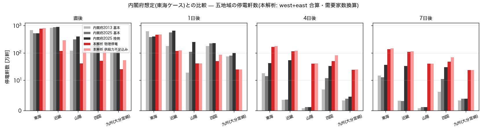
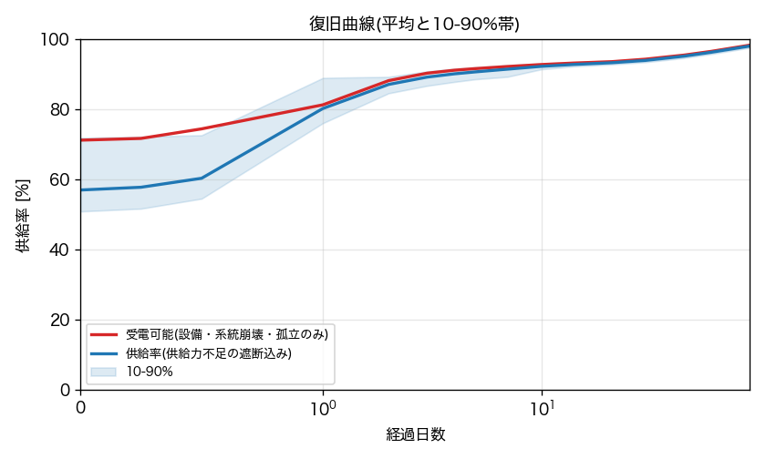
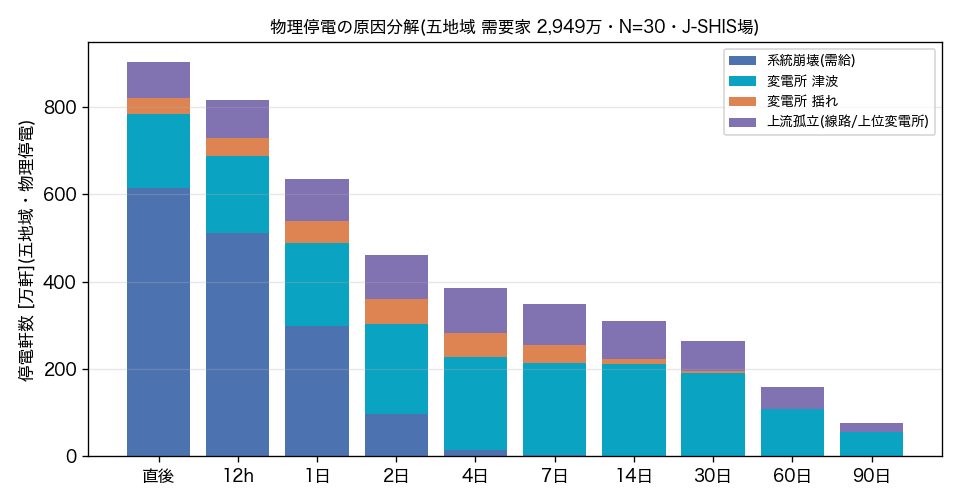
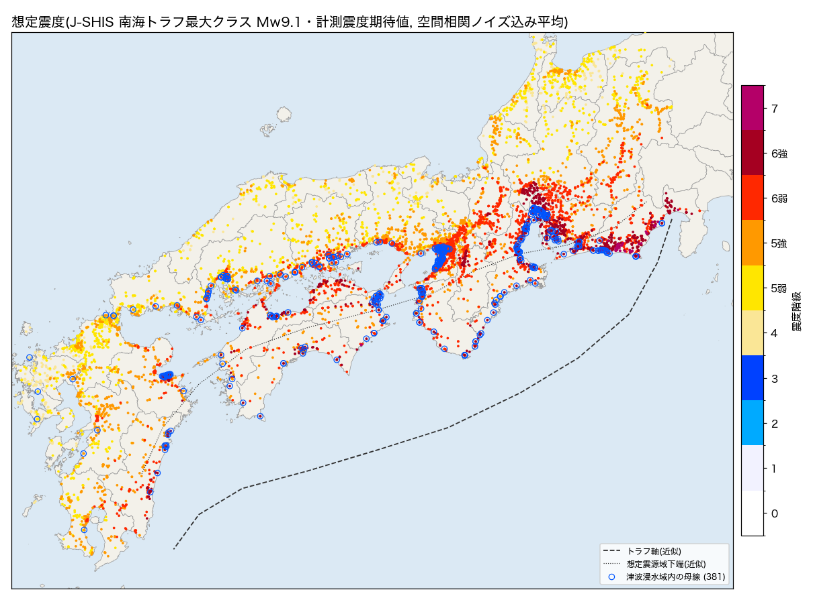
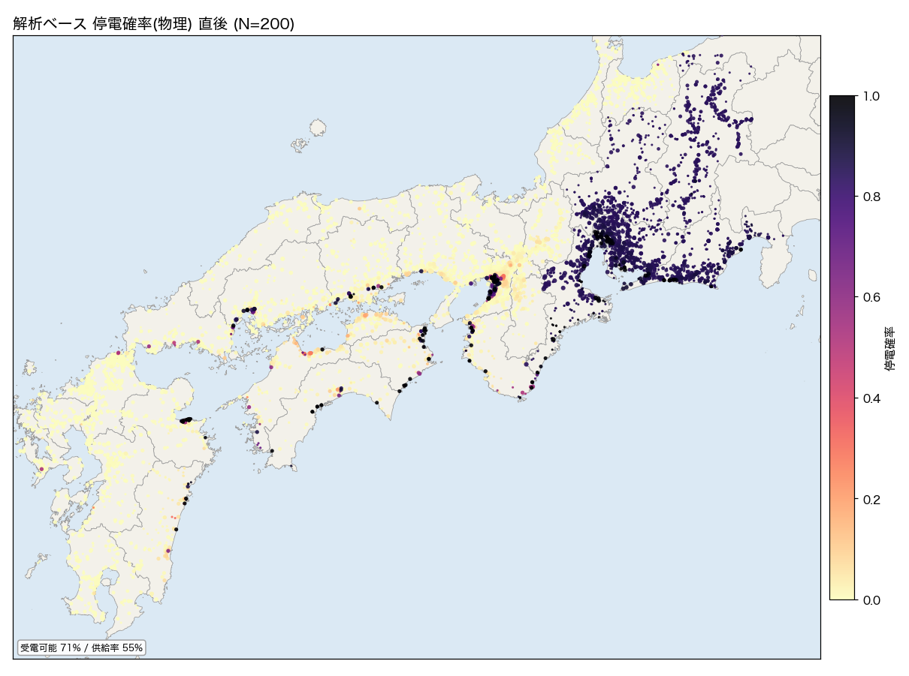
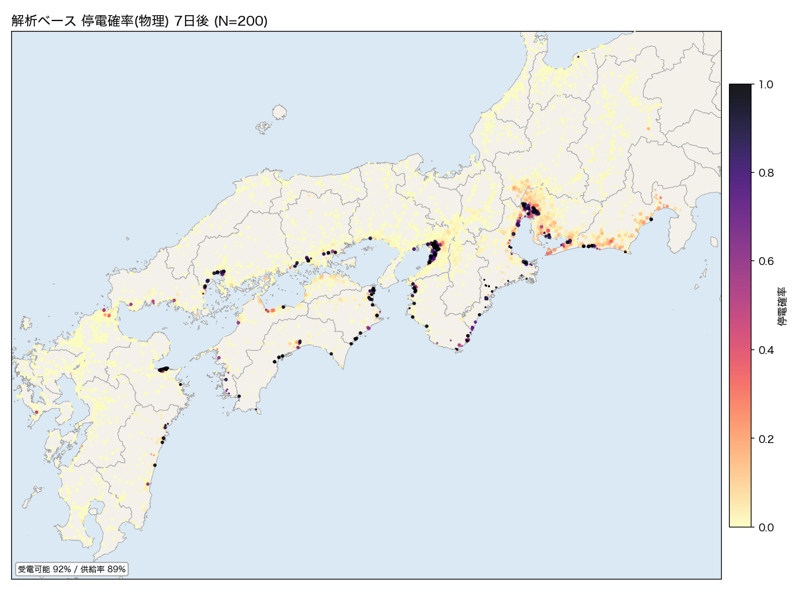
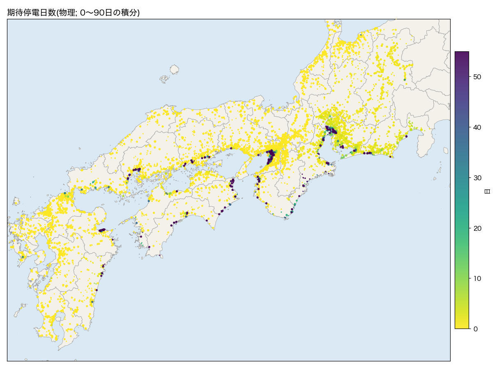
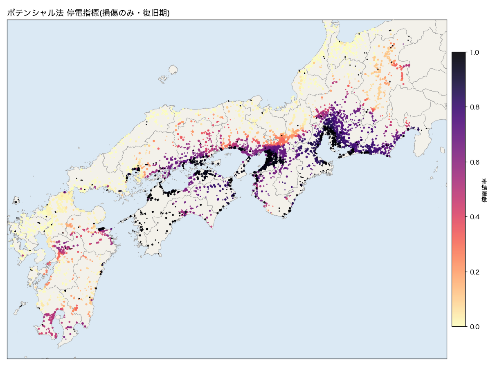
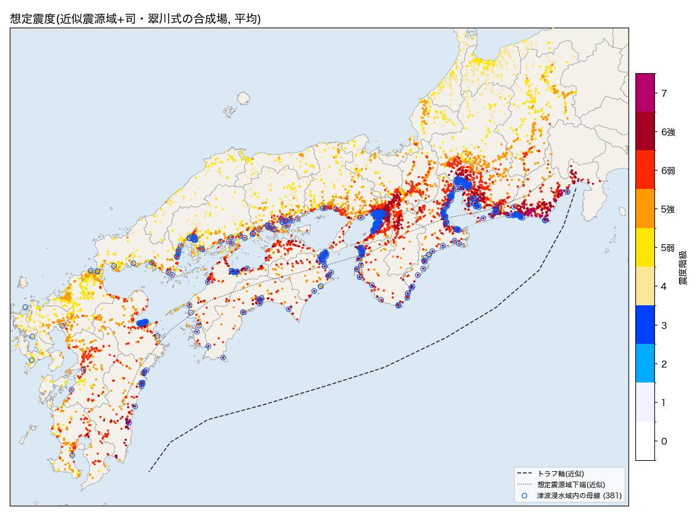
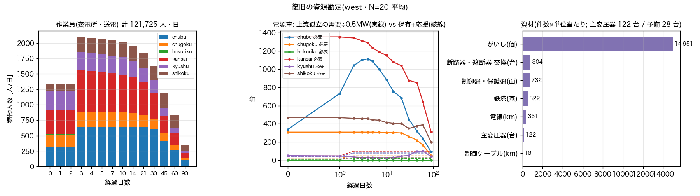

# 南海トラフ巨大地震 電力ハザードマップ v0 — 解析ベース(A)とポテンシャル法(B)

日付: 2026-09-13(深夜作業) / モデル: **Claude Fable 5.1**(サブエージェント3体のモデル名は記録なし) / ブランチ: `feature/nankai-hazard` / 場所: `hazard/nankai/`
オーナー指示(09-12): 「ブランチを作って新たな面白いことをする。南海トラフ地震の電力ハザードマップ。2方向=解析ベース(事故時も復旧も、倒壊も含む)とポテンシャルから推定するやつ」。GIF を作って LINE 報告。

## 0. 要約(結論を先に)

- **できたもの**: 正典モデル(west 7,985 母線 / east 6,253 母線)の上で、地震動→設備損傷→系統評価(連結成分・需給・DC潮流・過負荷連鎖)→復旧(修理時間分布・作業班・優先順)をモンテカルロで回す解析パイプライン(A)と、潮流を解かないポテンシャル指標(B)。地図(PNG)・復旧GIF・自治体別GeoJSON/CSV・単独HTML地図・内閣府想定との比較図を自動生成する。
- **地震動は J-SHIS の「南海トラフ沿いで発生する大地震(最大クラス) Mw9.1」250m メッシュ計測震度(発生を条件とした期待値)** を一次データとし、近似震源域+司・翠川式の合成場を感度ケースにした。津波は国土数値情報 A40(都道府県の最大クラス浸水想定)。脆弱性・復旧・較正目標は一次資料(HAZUS 4.2, 内閣府 2013/2025 想定, 経産省・九州電力の熊本地震被害率, 土木学会の東日本大震災報告 等)から整理した(`hazard/nankai/docs/FRAGILITY_SOURCES.md`)。
- **停電を「物理停電」(設備損傷・系統崩壊・上流孤立)と「供給力不足の遮断」(計画停電相当)に分けて出す**ことにした。内閣府の停電軒数は前者に対応し、後者は 2011 年の計画停電と同様に別勘定である。
- **内閣府想定との整合**: 較正後の既定(J-SHIS 場・HAZUS 変電所曲線×5・zone 供給不足 25% 超で系統崩壊)で、五地域(東海・近畿・山陽・四国・九州2県)の物理停電は **直後 1,003万軒 / 1日後 701万軒 / 4日後 403万軒 / 7日後 362万軒**(内閣府 2025 基本ケース 2,060 / 1,350 / 36 / 32 万軒)。直後〜1日後は同じ桁で、**4日後以降は本解析のほうが1桁多い**。差の中身は原因分解(§4.3)のとおり **津波浸水域の変電所(復旧中央値 60 日)と上流孤立** で、内閣府が復旧対象から津波全壊需要家を除いていること、配電(6.6kV 以下)を本解析が持たないことの両方が効いている。
- **ポテンシャル法(B)** は解析(A)の 2 日後停電確率と需要加重相関 0.56(単純相関 0.43)。「電源までの最良経路の生存率 × 半径 80km の供給余力」だけで、モンテカルロの空間パターンの大半を再現する。指標として使う用途(優先順位付け・スクリーニング)には足りる。
- **負の結果も記録**: 司・翠川式に Mw9.0 を直入れすると遠方が1階級過大(大阪・名古屋が 6強、北陸が 5強)。HAZUS の変電所曲線をそのまま使うと 6強で 7 割の変電所が止まり、熊本・東北の実績(機能停止は数%)と合わない。既定の作業班数では復旧が内閣府より1桁遅い。いずれも `docs/reports/nankai_hazard_2026-09-13/calibration_sweep.md` に残した。

## 1. 何を作ったか(構成)

```
hazard/nankai/
  config/   scenario_nankai.yaml(近似震源域・GMPE)  fragility_default.yaml(実行用・出典転記)  restoration_default.yaml  customers.yaml
            fragility.yaml / restoration.yaml / calibration_targets.yaml(文献整理版=出典台帳)
  src/nankai/ grid.py hazard_field.py fragility.py cascade.py restoration.py montecarlo.py potential.py maps.py aggregate.py
  scripts/  extract_grid_case.py run_pipeline.py calibrate.py compare_naikakufu.py decompose_causes.py
  tests/    7 tests(震度変換の往復・GMPE の距離減衰・連結/需給/過負荷連鎖・作業班スケジューリング・脆弱性の単調性)
  docs/     DATA_MANIFEST.md(A40/N03) HAZARD_DATA_SOURCES.md(J-SHIS) FRAGILITY_SOURCES.md(出典・信頼度)
  data/derived/ grid_<island>_{bus,branch,gen}.parquet(正典から切り出し・コミット)  他は git 管理外(1GB 超の A40 等)
```

### 1.1 解析ベース(A)の流れ

1. **地震動**: `MeshField`(J-SHIS 250m 計測震度の最近傍参照)に空間相関ノイズ(相関距離 25km・σ=0.12 log10)を乗せて 1 サンプル。PGA は PGV から比 6〜14 の粗い換算(仮定)。フォールバックは `GMPEField`(近似震源域 + 司・翠川 1999 + 藤本・翠川 2005, 有効 Mw 8.5 で飽和)。
2. **津波**: A40 浸水想定ポリゴンに母線点を落として浸水深ランク(0〜7)。母線 381 点(west)が浸水域内。
3. **損傷**:
   - 変電所(サイト=同名・1.5km 内の母線群): HAZUS 4.2 Table 8-29(anchored, ≤110kV/154–220kV/≥275kV)の対数正規曲線の中央値を **5 倍**(日本の耐震設計 JEAG 5003・熊本 2016/東北 2011 の機能停止率が数%であることへの較正。文献整理版の推奨 3.0・感度範囲 2〜5 の上限)。extensive 以上で停止、moderate は 30% で停止。津波は浸水深ランク別確率(<0.3m 5% / 0.3–1m 50% / 1–2m 85% / ≥2m 98%)。
   - 送電線: 鉄塔 1 基あたり倒壊 P(PGA)=Φ(ln(PGA/12g)/0.9)×基数(0.35km 間隔)。東日本大震災(M9)でも地震動由来の倒壊は数十基規模だった実績に合わせた仮定。がいし折損等の短期停止(6強 1% / 7 1.5%, 復旧中央値 2 日)。津波は 1 基あたり確率×浸水域内 5 基。
   - 発電所: **内閣府 2025 と同じ「震度階級ごとの停止率の時間推移」**(5弱 8%→3日で 0 / 5強 20% / 6弱・6強 90% が 3 週間 / 7 は 1 年)を火力・太陽光・風力・地熱に適用。原子力は地表 PGA≥0.2g で scram し期間内は復帰しない。水力は停止しない(損傷のみ)。津波浸水 0.3–1m で 90 日・1m 以上で 240 日停止。
4. **系統評価**(`cascade.py`): 生きた母線・枝で連結成分 → 成分ごとに需給(発電上限 vs 残存需要)→ 不足なら比例遮断 → 成分ごとに DC 潮流 → 緊急定格(理論容量×1.25, 基底で既に超えている枝は基底潮流×1.3)超の枝を最大 3 本ずつ停止して反復。フラグメント(基底で 60 母線未満の成分)の仮想電源は「基底の残差容量」で、その母線が損傷すれば失われる。
5. **系統崩壊**: 直後の zone(一般送配電エリア)ごとの不足率 = 1 − (生存供給力 + 連系線受電上限)/残存需要 が **25% 超**なら zone 全体停電、サイトごとに対数正規(中央値 24 時間・β0.7)で復電。若狭の原子力は関西の供給に数える。
6. **需要減**: 被災地の需要は 7: −35% / 6強: −25% / 6弱: −15% / 5強: −5% を 14 日保持し 90 日で回復(2011 年の実績を踏まえた仮定)。供給率は残存需要に対して定義。
7. **復旧**: 損傷要素ごとに対数正規の修理時間(変電所 slight 1 / moderate 3 / extensive 7 / complete 30 日, 津波 60 日; 鉄塔 14 日, 津波 30 日)。zone ごとの作業班(中部 40・関西 50・九州 40・中国 25・四国 15・北陸 12・東京 60)、3 日目から応援で 2 倍、上位電圧→需要大の順。発電所は所有者側で独立。
8. **時系列評価**: t = 0, 6h, 12h, 1, 2, 3, 4, 5, 7, 10, 14, 21, 30, 45, 60, 90 日で 4〜7 を再評価。N サンプルの平均・分位・停電確率(供給率<0.5)・期待停電日数を母線ごとに保存し、自治体(N03)に需要加重で集約。

### 1.2 ポテンシャル法(B)

中央値ハザードでの解析的な故障確率(変電所 p_site・線路 p_line・発電 p_gen)を枝重み w=−ln(1−p) にして、100MW 以上の火力/原子力/水力母線(+フラグメント仮想電源)からの最短路 = 最良経路の生存率 S_path を Dijkstra で一括計算。半径 80km 内の生存供給ポテンシャル/負荷 = A_supply。**P_out = 1 − S_path·A_supply**。直後(トリップ込み)と復旧期(損傷のみ)の 2 通り。潮流も乱数も使わず west 全母線で 0.8 秒。

## 2. データ

| 層 | 採用 | 出典・条件 |
|---|---|---|
| 系統 | 正典系譜 `build_canonical_net`(built + 標準注入, fy2023 需要断面)から parquet に切り出し | `scripts/export_matpower_canonical.py` と同一 |
| 地震動 | J-SHIS `C-V3-ANNKI-AN177` 南海トラフ最大クラス Mw9.1・250m・AVE_SI(3,704,994 メッシュ) | 防災科研 J-SHIS 利用規約(出典明記)・ログイン不要・`docs/HAZARD_DATA_SOURCES.md` |
| 地盤増幅 | J-SHIS `Z-V4-JAPAN-AMP-VS400_M250`(GMPE 感度ケースで使用) | 同上 |
| 津波 | 国土数値情報 A40 津波浸水想定(26 都府県・県ごとに最新年版・浸水深ランク統一) | CC BY 4.0(県別追加条件あり)・`docs/DATA_MANIFEST.md` |
| 行政界 | 国土数値情報 N03 2026 年版 | CC BY 4.0(国土地理院承認注記) |
| 脆弱性・復旧 | HAZUS 4.2 SP3 Table 8-29/8-31/8-27, 内閣府 2025 手法概要(火力停止率), 九州電力 熊本地震被害率, 土木学会 東日本大震災報告, 能島(阪神・熊本・能登・胆振) | `docs/FRAGILITY_SOURCES.md`(high/medium/low の信頼度つき) |
| 較正目標 | 内閣府 2013 第二次報告・2025 新想定の停電軒数(五地域×直後/1日/4日/1週間) | `config/calibration_targets.yaml`(原典 PDF から転記) |
| 需要家数 | 一般送配電の供給地点数の概数(千口) | `config/customers.yaml`・confidence low |

内閣府の 250m 震度分布・浸水深そのもの(G空間情報センター)は**要ユーザ登録**のため未取得。取得すれば `data/derived/` に置くだけで `MeshField` が優先して使う。

## 3. 較正(何を動かし、何に合わせたか)

較正目標は内閣府の五地域停電軒数(直後/1日/4日/1週間)。動かしたのは (i) 地震動場 J-SHIS/GMPE, (ii) 変電所モデル HAZUS×3 / ×5 / 震度階級表, (iii) 系統崩壊しきい値 15%/35%, (iv) 作業班倍率 1/2 の 24 変種(N=10、`calibration_sweep.md`)。

- 直後の桁は **系統崩壊しきい値**が決める(15% で五地域 1,100 万軒、35% で 550 万軒; 内閣府 1,930〜2,170 万軒)。内閣府は「需給バランス不安定→広域停電」を前提にしており、本解析でも zone 供給不足による崩壊を入れないと桁が合わない。25% を既定にした(2018 年北海道は供給の約半分喪失で全域停電、Japan の UFLS 設計を考えると 15% は攻めすぎ)。
- 1 日後は全変種が内閣府の範囲(640〜1,630 万軒)に入る。
- 4 日後以降は **どの変種も内閣府より 1 桁多い**(HAZUS×5 で 416 万 vs 36 万)。変電所モデル(×3→×5→震度表)で 730→416→436 万まで下がるが、それ以上は下がらない。残りは津波と上流孤立(§4.3)。作業班倍率は 7 日以降にしか効かない。
- 内閣府 2012 強震断層モデル編（一次資料）の経験的手法はパラメータ Mw を 8.3 に飽和させ、統計的グリーン関数法の波形計算と「大きい方」を採用している。本レポートの有効 Mw 8.5 は同じ扱い。内閣府 2025 の電力手法（火力の震度別停止率表＝経産省 H26 調査、原子力は全停止、水力は無停止、新エネは火力同等、津波全壊需要家は復旧対象外）は本ノート §9 と技術ノートに対応表を置いた。
- GMPE 合成場は J-SHIS より 1 階級強く(母線平均で +0.3)、すべての時点で 1.3〜2 倍の停電。**J-SHIS は「発生を条件とした期待値」で、内閣府の決定論的ケース(基本/陸側)より滑らか**。内閣府の基本ケースは両者の間にあると見るのが妥当。

採用した既定: `field=J-SHIS`, `substation.japan_adjustment=5.0`, `blackout.deficit_threshold=0.25`, `crew_x=1`(文献値のまま)。

## 4. 結果(既定・N=200・west+east)

### 4.1 内閣府想定との比較(五地域の停電軒数; 本解析は west+east 合算・供給地点数換算 2,949万、内閣府は電灯軒数 2,420〜2,470万)

| 時点 | 内閣府2013 基本 | 内閣府2025 基本 | 内閣府2025 陸側 | 本解析 物理停電 | 本解析 不足込み | (GMPE場 物理) |
|---|---:|---:|---:|---:|---:|---:|
| 直後 | 1,930万 | 2,060万 | 2,170万 | **1,003万** | 1,458万 | 1,076万 |
| 1日後 | 1,074万 | 1,349万 | 1,620万 | **701万** | 820万 | 798万 |
| 4日後 | 33万 | 35万 | 135万 | **403万** | 521万 | 514万 |
| 7日後 | 29万 | 32万 | 105万 | **362万** | 466万 | 446万 |



| 地域(需要家数) | 直後 内閣府2025/本解析 | 1日後 | 4日後 | 7日後 |
|---|---|---|---|---|
| 東海(963万) | 520万 / **766万** | 380万 / **464万** | 14万 / **170万** | 13万 / **137万** |
| 近畿(1,052万) | 870万 / **121万** | 560万 / **120万** | 4万 / **118万** | 3万 / **112万** |
| 山陽(464万) | 310万 / **41万** | 110万 / **41万** | 1万 / **41万** | 1万 / **40万** |
| 四国(300万) | 250万 / **51万** | 220万 / **51万** | 12万 / **50万** | 11万 / **48万** |
| 九州2県(170万) | 110万 / **25万** | 79万 / **25万** | 4万 / **24万** | 4万 / **24万** |

- 直後: 中部エリアは供給不足で系統崩壊(崩壊状態の需要 23%)。関西は若狭の原子力(5弱・scram せず)を数えると不足率がしきい値未満で崩壊しない場合が多く、内閣府の「近畿三府県の約9割」より小さい。山陽・九州は内閣府より小さい(J-SHIS 場では 5弱〜5強)。
- 1日後: 全地域で内閣府 2025 の範囲内(東海は同水準、近畿は下回る)。
- 4日後以降: 本解析が 1 桁多い。原因分解(4.3)のとおり津波浸水域の変電所と上流孤立。内閣府は津波全壊需要家を復旧対象から除外し、電柱被害の復旧(1〜2 週間)を別途見ている。**「4 日で解消」は本解析の設備モデルでは再現できない**というのが今回の主要な負の結果で、配電層と津波除外集計を入れて再評価する必要がある。

### 4.2 復旧曲線(J-SHIS 場・N=200)

| 島 | 指標 | 直後 | 12h | 1日 | 2日 | 4日 | 7日 | 14日 | 30日 | 90日 |
|---|---|---:|---:|---:|---:|---:|---:|---:|---:|---:|
| west(60Hz・73.9GW) | 受電可能(物理) | 71% | 74% | 81% | 88% | 91% | 92% | 93% | 94% | 98% |
| | 供給率(不足込み) | 55% | 58% | 78% | 85% | 88% | 89% | 90% | 94% | 98% |
| east(50Hz・55.3GW) | 受電可能(物理) | 90% | 91% | 93% | 95% | 95% | 96% | 96% | 96% | 98% |
| | 供給率(不足込み) | 81% | 83% | 92% | 94% | 94% | 94% | 95% | 95% | 98% |



west の直後は供給率 55%(受電可能 71%)で、差の 16% が供給力不足による遮断(計画停電相当)。2 日でほぼ消える(需要減と 5強以下の火力復帰)。east は静岡東部・神奈川の一部のみで 81%→92%。

### 4.3 物理停電の原因分解(五地域・J-SHIS 場・N=30)

| 時点 | 系統崩壊(需給) | 変電所 津波 | 変電所 揺れ | 上流孤立 | 計 |
|---|---:|---:|---:|---:|---:|
| 直後 | 615万 | 169万 | 36万 | 83万 | 903万 |
| 12h | 512万 | 177万 | 40万 | 87万 | 816万 |
| 1日 | 298万 | 191万 | 50万 | 95万 | 634万 |
| 2日 | 98万 | 205万 | 57万 | 102万 | 462万 |
| 4日 | 15万 | 211万 | 56万 | 103万 | 385万 |
| 7日 | 2万 | 212万 | 40万 | 96万 | 350万 |
| 14日 | 0万 | 211万 | 13万 | 87万 | 310万 |
| 30日 | 0万 | 191万 | 4万 | 70万 | 265万 |
| 60日 | 0万 | 109万 | 0万 | 49万 | 159万 |
| 90日 | 0万 | 55万 | 0万 | 24万 | 79万 |



系統崩壊は 2 日で消える。**2 日目以降の主役は津波浸水域の変電所(約 212 万軒・復旧中央値 60 日)と上流孤立(約 96 万軒)**、変電所の揺れ損傷は最大 57 万軒で 2 週間で消える。

### 4.4 地図

| | |
|---|---|
|  |  |
| J-SHIS 震度(母線)と津波浸水域内の母線(青丸 381) | 停電確率(物理) 直後: 中部エリア全域が需給崩壊 |
|  |  |
| 7 日後: 沿岸の津波浸水域(大阪湾岸・伊勢湾岸・高知・徳島・広島港・大分・宮崎)に集中 | 期待停電日数(0〜90 日積分) |
|  |  |
| ポテンシャル法(B・復旧期): 電源までの経路生存率×供給余力 | 感度ケース: GMPE 合成場(内閣府基本ケースの目視近似)。J-SHIS より 1 階級強い |

GIF: `nankai_hazard_2026-09-13/restoration_west.gif`(16 フレーム・停電確率(物理)の時間推移 + 復旧曲線)。動画: `nankai_hazard_2026-09-13/nankai_hazard_walkthrough.mp4`。1 手ずつビューア: `nankai_hazard_2026-09-13/steps_viewer.html`(556 手)。公開地図: `nankai_hazard_2026-09-13/hazard_map_artifact.html`。

### 4.5 ポテンシャル法(B) vs 解析(A)

| 島 | 相関(直後, トリップ込み指標 vs 停電確率) | 相関(2日後) | 需要加重相関(2日後) | 相関(期待停電日数) |
|---|---:|---:|---:|---:|
| west | 0.39 | 0.43 | 0.56 | 0.28 |
| east | 0.31 | 0.23 | 0.41 | 0.18 |

需要の大きい母線ほど一致する(需要加重 0.56)。母線単位の相関が 0.3〜0.4 に留まるのは、(i) 経路生存率が経路長に対して積で落ちるため被災域内で 1 に飽和する、(ii) A の「上流孤立」はサンプルごとの組合せで決まり、中央値場の最良経路では捉えにくい、(iii) 系統崩壊(zone 需給)を B が持たない、ため。**用途は優先順位付け・スクリーニング**であり、確率の絶対値は A で読む。

### 4.6 GMPE 合成場との感度

GMPE 場(母線平均で J-SHIS より +0.3)では五地域の物理停電が直後 1,076万・1日後 798万・4日後 514万・7日後 446万(`naikakufu_compare_gmpe.png`)。直後〜1 日は内閣府 2013 基本ケースに近づき、4 日以降の乖離はさらに広がる。地震動場の選択は直後の桁を動かすが、4 日以降の乖離は場の問題ではない。

### 4.7 復旧の資源勘定(人・日/資材/電源車; v0・仮定中心・west・N=20)

系統モデルの復旧スケジュール(§1.1 の 7)から、いつ・どこで・何がどれだけ要るかを積み上げた(`resource_ledger.py`, `config/resources_default.yaml`)。1 班 8 人、資材原単位はジョブ種別ごとの仮定(東日本大震災の東北電力の設備被害数を桁の目安)、電源車は 0.5 MW/台でエリア保有 10〜50 台・2 日目から応援 2 倍(熊本 2016 の 162 台を参考)。

- **人・日**: 変電所・送電の復旧ジョブ 357 件に延べ 121,725 人・日。ピーク稼働は中部 640 人/日、関西 673 人/日で、これは班数の上限(応援後 2 倍)に張り付いている=**人手が律速**。
- **資材**: がいし(個) 14,951、断路器・遮断器 交換(台) 804、制御盤・保護盤(面) 732、鉄塔(基) 522、電線(km) 351、主変圧器(台) 122、制御ケーブル(km) 18。主変圧器 122 台の需要に対し想定予備 28 台。リードタイム 180 日を置くと、complete/津波の変電所は予備品と融通の範囲でしか 30〜60 日では戻らない。
- **電源車**: 上流孤立の需要を 0.5 MW/台で賄うなら、ピークで関西 1354 台・中部 1112 台・四国 468 台が要り、保有+応援(50〜100 台)を 1 桁超える。電源車は局所の生命線には効くが、上流孤立の解消は上位系統の復旧でしか起きない。



いずれも原単位は仮定(low)。次は各社の公表資料(復旧要員・電源車保有・予備変圧器)で原単位を差し替え、電源車を復旧側にフィードバック(孤立需要の一部を仮送電)する。

## 5. 限界と次の一手

- **配電が無い**: 変電所が生きていれば供給されるとみなす。内閣府は電柱被害の復旧に 1〜2 週間を見ている。配電損傷率(震度階級別)を母線に掛ける層を足せば、1〜7 日の停電が増えて内閣府に近づく。
- **フラグメント**: 正典モデルの断片(west 279 成分)は仮想電源で供給されており、その扱いが「上流孤立」の一部を作っている。断片の実接続が進む(第三波・EGGC)ほどこの層は減る。
- **津波の扱い**: A40 は県の最大クラス想定で、内閣府の津波ケース(①〜⑤)とは別物。**香川県は県が国土数値情報への提供に不同意で欠落、奈良県は内陸でデータ無し**(高松沿岸の変電所は津波なし扱いになる)。浸水深ランクは県ごとの自由文字列区分を「区間の下限」で 7 区分に割り当てており控えめ側(`depth_min_m/max_m` が厳密値)。火力の津波停止日数は内閣府表の復旧列(0.3–1m 120 日 / ≥1m 270 日)に本レポート作成後に揃えた(実行時は 90/240 日=90 日以内の結果には影響しない)。変電所の浸水深別停止確率は low 信頼度。津波全壊需要家を復旧対象から除く内閣府方式に合わせた集計(rank≥3 の需要家を除外)は次に入れる。
- **PGA 換算**: J-SHIS は計測震度のみで PGV/PGA が無い。PGV←震度の逆変換と PGV→PGA 比の仮定が HAZUS 曲線の入力を決めており、変電所×5 の較正係数はこの換算と不可分。
- **液状化・斜面崩壊・地殻変動(沈降)** 未考慮。鉄塔倒壊は地震動単独では稀で、2018 年胆振(狩勝幹線 18 基地崩れ)のような斜面由来が主。
- 需要家数は概数(±10%)。停電「軒数」の絶対値はこの誤差を含む。
- 内閣府 250m データ(要登録)の取得、配電層、津波除外集計、west の AC 解での再確認、ポテンシャル法の冗長性(k 経路)項の追加、が次の一手。

## 6. 記録(失敗と判断)

- GMPE に Mw9.0 直入れ → 遠方過大(負の結果)。有効 Mw8.5 で飽和させて目視較正(§3)。
- HAZUS 変電所曲線そのまま → 中央値場で変電所 39% 停止、供給率 13%(負の結果)。文献の日本補正(3.0)でも 4 日後 730 万軒。5.0 を採用。
- 一様な火力トリップ(5弱以上で全停止・24h 復帰) → 東日本(関東)まで直後 52% 停電(負の結果)。内閣府方式の震度別停止率曲線に置換。
- 成分単位の系統崩壊 → west 島全体が 1 つの成分なので発火せず。zone 単位に変更(内閣府の地域別停電率の構造に合う)。
- **DC 潮流の単位バグ(09-13 昼に発見・修正 61c32a1)**: `_dc_flows` が MW 注入で解いた θ にさらに ×100 を掛け、枝潮流を 100 倍にしていた(基底の最大 320 GW = 総発電の 4 倍)。過負荷が大量に誤検出され、毎評価 24 本(反復上限 8×3)の枝を誤停止させていた。発見の契機は「1 手ずつ」トレース(`trace.py`・ステップビューア)で反復 1 回目に過負荷 1,309 本・負荷率 9,942% が表示されたこと。修正後の基底最大 3.2 GW(500 kV 5 回線)、直後の過負荷 45 本・最大 409%。本節の数値は修正後の再計算(run_v1)で置き換えた。物理停電はほぼ不変(五地域 直後 1,001→1,003 万軒)、供給率ベースは 1〜7 日で 1〜3 pt 下がった(実在する 77/110 kV の過負荷連鎖を正しく拾うようになったため)。連鎖は依然 8 反復で打ち切られることが多く(供給率への影響 ≤3.5%)、線路容量が理論値であることと合わせて限界に記す。
- pandapower 3.x の `bus.geo`、正典 CSV の RATE_A=100(容量なし)、座標 NaN 母線 1 点、`DataFrame.rank` との列名衝突、macOS に `timeout` 無し、zsh の `=====`、のハマりは `hazard/nankai/README.md` と memory に記録。

サブエージェントの作業: GIS 取得(A40 32 本 1.1GB・N03 26 県、年版選定は市区町村別の面積比較で決定)、J-SHIS 取得(ExtJS の download-all.js を展開して URL 規則を特定)、脆弱性・復旧・較正目標の文献整理(原典 PDF を取得して転記、信頼度を 3 段で明示)。サブエージェントのモデル名は記録が無いので書かない。
