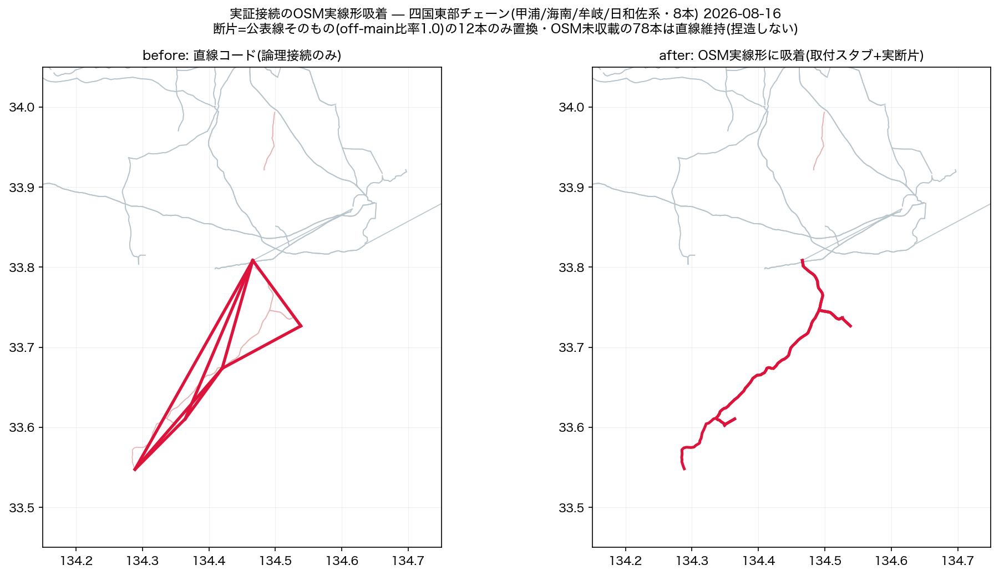

# 重要知見: 実証接続のOSM実線形吸着 — 「線があるものは地形的に辿る」

## 手法名(2026-08-16 命名・オーナー発意「この作業に名前をつけたい。アルゴリズムもあるはず」)

**証拠ゲート付き系統コンフレーション** / **Evidence-Gated Grid Conflation (EGGC)**

「論理接続(公表資料で確定した直線コード)を、物理地図(OSM)の複雑な実線形へ、
証拠条件つきで写像する」手法。単なる最短路吸着と違い、**採否を証拠でゲートする**のが核:

1. **端点スナップ**: コード端点を最寄りの現ノード(≤500m)へ(基底の変動に追従)
2. **経路探索**: OSM枝グラフのDijkstra(kv不適合ペナルティ・合成エッジは除外)
3. **証拠ゲート**: 経路のoff-main(宙に浮いた断片)比率≥0.7のときだけ
   「その断片が公表線そのもの」と認めてコードをスタブ置換。
   別線迂回(比率<0.3)や経路なしは**直線を保持**(OSMに無い線形を捏造しない)

### アルゴリズムの系譜(先行研究)

| 分野 | 代表 | うちとの関係 |
|---|---|---|
| マップマッチング | HMMマップマッチング(Newson & Krumm 2009) | 軌跡(多点)→道路網の吸着。本手法は入力が「端点2点+論理接続」のみの退化ケース |
| 地図コンフレーション | Saalfeld(1988)以来のmap conflation | 同一実体の2地図表現の統合。論理系統図×OSM物理図の統合=本手法の親概念 |
| 経路推定 | path inference(疎なGPS 2点間の経路復元) | 2点間の物理経路推定という問題設定が同型 |
| 電力網×OSM | GridKit(Wiegmans 2016)・SciGRID・osmTGmod・PyPSA-Eur | OSM→トポロジ抽出(逆方向)。外部論理トポロジ→OSM幾何の写像は本手法の新規性 |

**新規性の主張点**: (a)公表資料由来の論理エッジを入力とする点(GridKit系はOSMのみ)
(b)off-main比率という**検証可能な採否基準**で「吸着すべき断片」と「未収載(直線保持)」を
機械判別する点 (c)可逆な台帳駆動(累積マージ・regen再現)。

別名候補(オーナー選択用): コード・コンフレーション法(Chord Conflation) /
Chord-to-Corridor Mapping。実装=`scripts/route_disclosure_edges.py`+
`apply_disclosure_v2.py`の端点スナップ。

---

**オーナー確認済み(2026-08-16)**: 「届いた画像が私のやりたい内容。これは機能としてかなり重要なので
記録、重要知見として残しておいて」。判断・実装はAI(Claude Fable 5)、原則の提示はオーナー。

## 知見の核心

**実証接続(公表資料で確定した論理接続)を直線コードで張ると、実はOSMに宙に浮いて実在する
「その線の実線形」を見落とす。** 人間の目には薄い断片線が「根本的には繋がっている」と見えて
おり、その直観が正しかった。機械は論理接続(A—Bを繋ぐべし)を得た時点で満足し、
物理線形(どの経路で繋がるか)の探索を省いていた。

- オーナー観察: 「細い線もあるかもしれないが、根本的にはOSMの線で繋がっているように見える。
  簡略化すると確かに直線に見えるが、ちゃんと線があるものにおいては地形的に線を辿ってほしい。
  **これは全部に言えること**」
- 実測: 直線コード90本のうち**12本(13%)は、経路が100% off-main断片**=その断片こそ公表線
  そのものだった(四国東部の甲浦/海南/牟岐/日和佐チェーン8本・泉北線・三田弥生が丘線・牛久線)

## 原則([[feedback_osm_trust]]「線中心主義」の実証接続への拡張)

1. **disclosureコードを張る前に、その線の断片がOSMに浮いていないかを先に見る。**
   浮いていれば取付スタブ(≤2km)で断片に接続するのが正 — 断片が実線形のまま本系統に合流する。
2. **判定は経路のoff-main比率で機械化できる**: Dijkstraで両端近傍を結ぶ実経路を探し、
   - off-main比率 ≥0.7 → 断片=公表線そのもの → スタブ置換(12本・全てoff=1.0だった)
   - off-main比率 <0.3 → 既存本系統の**別線**を迂回しているだけ=公表線はOSM未収載 →
     **直線を維持**(33本。無い線形を捏造しない)
   - 経路なし → 未収載(45本。地中線・補完approxノード等) → 直線維持
3. **副次効果**: PF/Ybusのブランチ長が直線近似から実線長になる(甲浦支線33.3→38.9km等)。
   連結性・KPIは不変(同じ接続の表現替え)。

## 実装(恒久機能)

- `scripts/route_disclosure_edges.py` — dry-run既定・`--write`適用・冪等・BAK可逆
- `regenerate_all.py` STEPS の apply_disclosure_v2 直後に組込(regenごとに自動適用)
- 全記録: `docs/reports/routed_disclosure_edges.json`(置換12+直線維持78の理由つき)
- 無効化: STEPSから外す / BAK / git(介入台帳 #29追補5)

## 教材とスライド(2026-08-17 追加)

手法の過程を**実データで**辿れるようにした。判定ロジックは本家スクリプトと共有(乖離したら教材が嘘になる)。

- **教材ページ** `docs/eggc_explainer.html` — 単一ファイル完結。5ステップ(問題→端点スナップ→
  経路探索→証拠ゲート→置換と結果)。**Dijkstraはブラウザ内で実走**し、16ケース全てで
  サーバ判定と route_km・off比率が完全一致することを確認済み。閾値スライダーで
  ゲートを手で開閉でき、before/afterスライダーで直線→実線形のモーフィングを見られる。
  ディープリンク `?case=甲浦&step=4` / `?case=0&step=5&after=1`
- **スライド** `docs/slides/eggc_2026-08-17.html`(11枚・HTML) と
  `docs/slides/EGGC_2026-08-17.pptx`(編集可能・正本は同名 .md)
- **図** `docs/reports/figs/eggc_{before_after,gate_scatter,summary}.png`
- 生成: `export_eggc_trace.py --built docs/data/built/all.json.pre_route.bak` →
  `build_eggc_explainer.py` / `plot_eggc_figs.py` → `build_eggc_slides.py`

### 置換された線の全数(2026-08-17 時点)

台帳 `routed_disclosure_edges.json` の累積 replaced が正。全数を画像化した
(`scripts/plot_eggc_gallery.py` → `docs/reports/figs/eggc_gallery_all.png` ほか)。

| 見出し | 値 |
|---|---|
| 台帳エントリ | **14** |
| ユニークな線 | **13**(下記の二重登録1件を除く) |
| 現行正典で置換が生きている | **13本すべて**(直線コードとして残存しているものは 0 本) |
| 取付スタブ | 12本 / 9線(残る4線は端点が既にOSM頂点でスタブ不要) |
| 線長 | chord 合計 170.0 km → route 208.7 km(**+38.7 km / +23%**) |
| 電圧 | 66kV 11本・77kV 2本(基幹電圧は1本も無い) |
| 伸び率 | 最小 牛久線 +4% ／ 最大 泉北線 +62% |

**地理的にはほぼ2箇所に集中している**(50km で連結する塊):

| 塊 | 本数 | 合計 chord→route |
|---|---|---|
| 四国・甲浦支線周辺(徳島南部〜高知東部の海岸チェーン) | **8** | 133.6 → 164.6 km (+23%) |
| 四国・線番39+38 周辺(高知中部) | 2(うち1件が二重登録) | — |
| 関西(泉北線・三田弥生が丘線) | 2 | 7.6 → 11.6 km |
| 東京管内(茨城: 美野里線・牛久線) | 2 | 14.9 → 16.3 km |

四国東部の8本は、**直線では扇状に張られていたコードが、実線形では1本の海岸線チェーンに
収束する**(`eggc_area_1_*.png`)。EGGC の効果が最も可視化される例。

**台帳の二重登録を発見(要修正)**: 「線番39+38（加枝T分岐経由）」が2エントリある。
端点は 17m / 37m しか違わず、**スナップ先の頂点 vA/vB は完全に一致**(距離 0.000 km)＝
同一の線。台帳の重複排除キーが `frozenset((k5(a), k5(b)))`＝端点の5桁丸めなので、
**端点が数十m違うと同じ線が二重に載る**。実害は件数の水増しのみ(正典側に重複エッジ・
重複スタブは無いことを確認済み)だが、キーは vA/vB 基準にすべき。

### 教材を作って分かったこと(3件)

1. **冪等性の裏返し**: 適用後の正典で再走すると、断片は既にmain化しているので
   証拠ゲートはほぼ閉じる(90本→吸着2本相当)。**手法の姿を見せるには適用前スナップショットが要る**。
   `all.json.pre_route.bak` は .gitignore 対象なので、教材の再生成には正典適用の実行が前提になる。
2. **証拠ゲートは二値に割れていた**: 採用12本すべて off比率=1.00、棄却30本すべて=0.00で
   **中間が存在しない**(`eggc_gate_scatter.png`)。閾値0.7は0.3〜1.0のどこに置いても
   同じ答えになる=**この閾値はまだ検証されていない**。中間値が出る地域を見つけるまで
   「0.7が妥当」とは言えない(限界として教材・スライド双方に明記)。
3. **頂点キーの定義がずれると別の答えになる**: 本家は `e["a"]/e["b"]` の5桁丸めを頂点キーにするが、
   教材の初版は `path` の端点で代用した。両者が厳密一致しないエッジでグラフが分断し、
   甲浦支線で経路が見つからなくなった(4頂点で枯渇)。トレースに `ka/kb` を持たせて解決。
   **同じアルゴリズムの再実装は、まずキー定義を移植すること**。

## なぜ見落としたか(再発防止)

接続キャンペーンの評価軸が「孤立が減ったか(連結性KPI)」だったため、**直線でもKPIは同じだけ
改善する**=幾何の質が指標に現れなかった。発見はオーナーの目視(「遠い赤点」の距離監査に続き
2度目)。**教訓: トポロジ介入の検算には連結性だけでなく「経路の物理妥当性」(off-main断片の
見落とし・線形の実在)を含める。** 罠14(名前pickの距離検算)と対をなす幾何側の検算。
