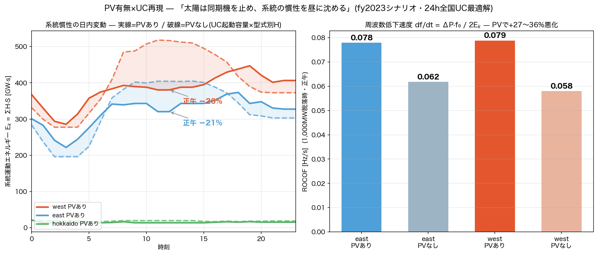

# PV有無×UC×動的比較 — 「太陽は同期機を止め、系統の慣性を昼に沈める」2026-08-17

オーナー発案「これをPV有無で、UCで再現したら凄すぎる」の実施。判断・実装はAI(Claude Fable 5)。

## 方法(全て既存資産の合成)
1. UCシナリオ fy2023 と、solar容量を全地域0にした fy2023_nopv を24h全国UC(MILP)で求解(各14秒・Optimal)
2. (region×fuel×hour)の**起動容量**を抽出 → AGJ機械集約へ起動率としてスケール
   (容量比例ブリッジ=介入#10と同族の近似・UC機とモデル機の1:1対応は存在しないため)
3. 慣性 E_k(h)=ΣH·S_committed、正午の動揺モード・S_sc(66-77kV)を両シナリオで計算

## 結果
| 指標(正午) | PVあり | PVなし | 差 |
|---|---|---|---|
| 起動同期容量(全国) | 144.6GW | 190.6GW | **−46GW** |
| 慣性E_k east | 321GW·s | 404GW·s | **−21%** |
| 慣性E_k west | 380GW·s | 517GW·s | **−26%** |
| ROCOF(1GW脱落) east | 0.078Hz/s | 0.062 | **+27%悪化** |
| ROCOF west | 0.079Hz/s | 0.058 | **+36%悪化** |
| f_min(動揺モード) | 0.305/0.672Hz | ほぼ不変 | — |
| S_sc66中央値 | −1〜2% | — | 微減 |

## 物理の読み(教材ポイント)
- **モード周波数が不変なのは正しい**: f∝√(K/M)で、起動容量の一様減はKとMを同率で
  減らすため周波数不変。効くのは空間再配置分のみ
- **効くのはROCOF**: E_kが直接分母。PV正午に周波数低下速度が3割前後悪化 —
  「慣性低下」問題の全国定量がオープンデータ+UCから出た
- 日内カーブに**夜明け前の慣性最小**(需要最小)と**夕方ランプ**(PVあり19時のwest跳ね上がり=
  ダックカーブの裏面)も現れている

## 誠実性
- H等は型式別典型値。UC→モデル機の橋は(region,fuel)容量比例(開示済の近似)。
  UC側に対応クラスの無い機は起動率0.7既定(コード内明示)
- 再現: `scripts/uc_pv_compare.py` → `scripts/pv_dynamics_compare.py`
