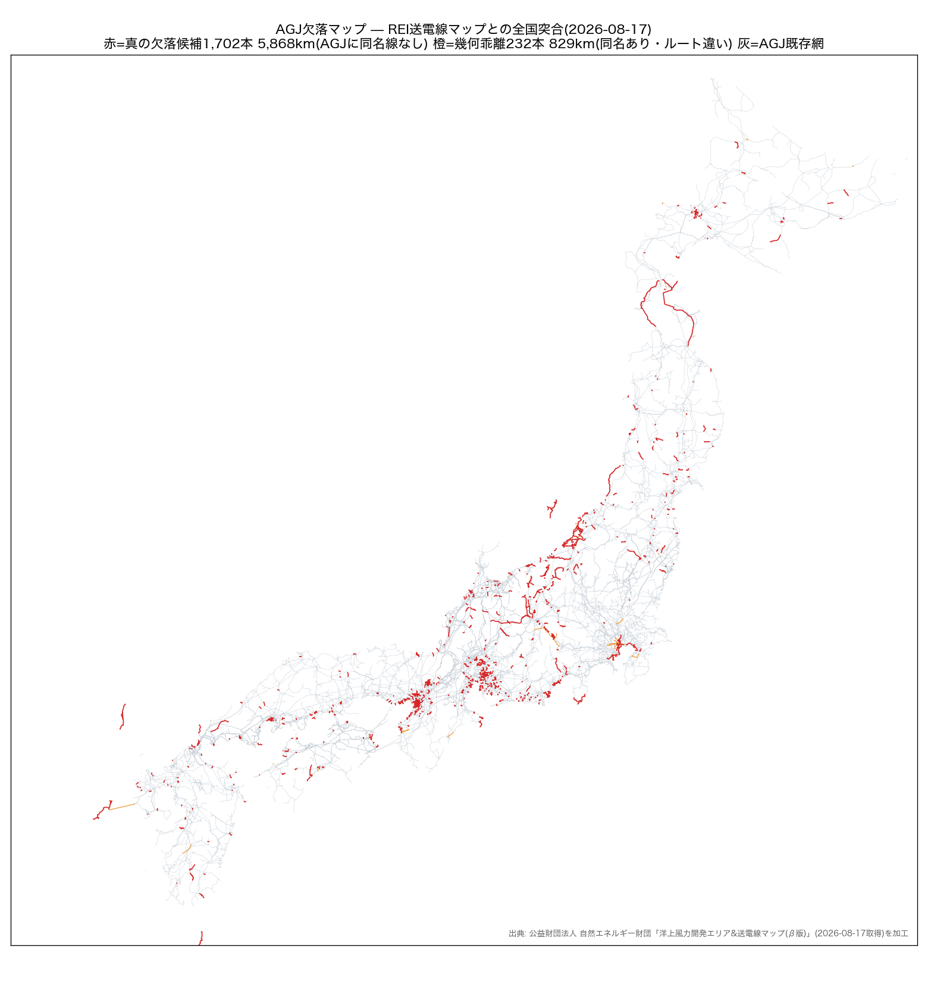

# 大拡張の設計書: REI全国送電線とのコンフレーション計画 2026-08-17

オーナー「もう少し大きい拡張とかはできない?」への回答。REI送電線マップ(41層取得済)と
AGJの全国突合(`rei_gap_scan_2026-08-17.json`)に基づく。判断・実装はAI(Claude Fable 5)。

## 全国突合の結果

| 区分 | 本数 | 延長 | 意味 |
|---|---|---|---|
| REI収載網(dedup) | 13,084本 | 98,345km | 全国66kV以上(REIが位置特定できた線) |
| AGJが被覆 | 11,150本 | 91,648km | **被覆率93.2%(外部データによる独立検証)** |
| **真の欠落候補** | **1,702本** | **5,868km** | AGJに同名線なし+幾何500m以上乖離 |
| 幾何乖離 | 232本 | 829km | AGJに同名線あり・ルート違い(検証素材) |

偽陽性対策: 初回スキャンは天竜東幹線(AGJ実在)を欠落と誤判定 → 線名正規化照合で
「真の欠落」と「幾何乖離」を分離した(驚く数値の独立検証の実践)。

## 欠落の構造(電圧別)

- **DC連系実線形 3本401km**: 北本連系線185.6km・北斗今別直流幹線125.8km・
  飛騨信濃直流幹線89.9km — **介入#31(阿南紀北)の続き**がREI幾何で即座に可能
- **基幹(275/154/110kV) 約200本1,350km**: 刈羽線58.8km(前ラウンドで見送った刈羽!)・
  高瀬川線49.6km・大町線39.0km(長野山岳水力系)・滝越小坂線41.9km — OSM薄弱地域と整合
- **下位網(77/66/33kV) 約1,540本4,590km**: **中部77kVが最大(1,702km)** —
  静岡77kV層欠落(第2ラウンドの発見)の全国定量化。離島系(佐須奈支線=対馬46km・
  奥浦奈良尾線=五島31.7km・松島奈良尾線53.4km)も含む
- 電圧属性なし 187本666km(要判別)

## 取込計画(Tier制・いずれもEGGC韻の証拠ゲート)

- **Tier 1(即効)**: DC実線形3本 — 非通電(#31方式)・by-nameで両端変換所は既存
- **Tier 2(基幹)**: 275/154/110の約200本 — 端点解決(REI線形の両端≤500mのAGJ/REI変電所)
  +線名・電圧・回線数付きで通電取込。解決不能な端点は補完ノード(REI変電所の実名・座標)
- **Tier 3(下位網)**: 77/66kVの約1,500本 — 中部77kVから面的に。L_DB受け皿(中部観測残)と接続
- **Tier 0(並行)**: 幾何乖離232本はEGGCの検証素材(どちらの線形が正しいか個別判定)

**手法上の位置づけ**: これはオーナー発意の**EGGC「候補補完」構想の最初の実装**。
証拠階層を OSM実線形 > **REI幾何** > 直線 と拡張し、REI幾何取込線には
`geometry_source: REI` を刻印して出所を追跡可能にする。

## ライセンス判断(オーナー確認事項)

REIマニュアルは「ダウンロードした図とデータは自由に使用してよい・引用時は出典表記」。
幾何の位置原典は国土地理院(測量法の出典表記で利用可)。**属性(空容量等)の原典は
各社All-Rights-Reservedのため取込対象外(幾何・線名・電圧・回線数のみ)**。
ただし公開リポジトリへの幾何収載は再配布に相当しうるため、方針はオーナー判断:
①出典クレジット明記で取込 ②untracked派生に留める ③REIへ確認後。

## 規模見積もり

Tier 1=0.5日 / Tier 2=1-2日(端点解決の精度次第) / Tier 3=2-3日(段階コミット)。
各Tierでregen+PF検証+before/after図(是正カタログ5要素の型)。
