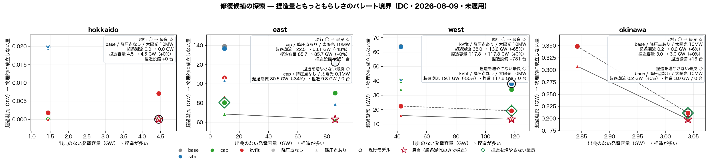

# 修復候補の組み合わせ探索 — 捏造量ともっともらしさのパレート境界（2026-08-09）

診断連鎖が挙げた真因 3 つは**いずれも単独で**測られていた。単独では太陽光の是正は
**悪化**に見え（east 最大 1,668% → 3,371%）、接続電圧の是正は −26%、降圧点の補充は
過負荷 603 → 422 本にとどまる。交互作用のある系で一度に一つしか動かさないのは
古典的な誤りなので、3 軸の全組み合わせ（4×2×2）を回した。

同時に**捏造量を第一級の目的関数**に置いた。`docs/MODEL_INTERVENTIONS.md` の原則
（解けるように見せる介入は全部登録せよ）を探索にも適用し、
「過負荷が減ったか」だけで採点しない。

| 目的（すべて最小化） | 意味 |
|---|---|
| 捏造容量 (MW) | 出典が無く既定値で埋めた発電容量。太陽光の是正はこれを**減らす** |
| 捏造設備 (台) | OSM にも公開系統図にも無い、こちらで足した変圧器 |
| 超過潮流 (MW) | 定格を超えて流れている分＝物理的に成立していない量 |

## hokkaido

| | 接続規則 | 降圧点 | 太陽光既定 | 捏造容量 | 捏造設備 | 過負荷 | 最大負荷率 | 超過潮流 |
|---|---|---|---:|---:|---:|---:|---:|---:|
| 現行 | base | なし | 10 MW | 4,450 MW | 0 台 | 0 (0.00%) | 90.2% | 0 MW |
|  | base | あり | 10 MW | 4,450 MW | 77 台 | 0 (0.00%) | 88.4% | 0 MW |
|  | site | なし | 10 MW | 4,450 MW | 0 台 | 0 (0.00%) | 90.2% | 0 MW |
|  | site | あり | 10 MW | 4,450 MW | 77 台 | 0 (0.00%) | 88.4% | 0 MW |
|  | cap | なし | 10 MW | 4,450 MW | 0 台 | 0 (0.00%) | 86.0% | 0 MW |
| **◆** | cap | なし | 0.1 MW | 1,440 MW | 0 台 | 0 (0.00%) | 87.1% | 0 MW |
|  | cap | あり | 10 MW | 4,450 MW | 77 台 | 0 (0.00%) | 82.4% | 0 MW |
|  | cap | あり | 0.1 MW | 1,440 MW | 77 台 | 0 (0.00%) | 80.2% | 0 MW |
|  | kvfit | あり | 10 MW | 4,450 MW | 77 台 | 0 (0.00%) | 82.0% | 0 MW |
|  | kvfit | あり | 0.1 MW | 1,440 MW | 77 台 | 0 (0.00%) | 79.7% | 0 MW |
|  | kvfit | なし | 0.1 MW | 1,440 MW | 0 台 | 1 (0.12%) | 102.6% | 2 MW |
|  | kvfit | なし | 10 MW | 4,450 MW | 0 台 | 2 (0.25%) | 108.4% | 7 MW |
|  | base | なし | 0.1 MW | 1,440 MW | 0 台 | 1 (0.12%) | 128.8% | 20 MW |
|  | site | なし | 0.1 MW | 1,440 MW | 0 台 | 1 (0.12%) | 128.8% | 20 MW |
|  | base | あり | 0.1 MW | 1,440 MW | 77 台 | 1 (0.12%) | 129.2% | 20 MW |
|  | site | あり | 0.1 MW | 1,440 MW | 77 台 | 1 (0.12%) | 129.2% | 20 MW |

◆ = 3 目的の非劣解（他のどの構成にも全項目で負けていない）

### 現行モデルを全目的で支配する構成

過負荷本数・最大負荷率・超過潮流・捏造容量・捏造設備の**5 つすべて**で
現行を下回る構成。重み付けを要さないので、ここに載るものは
「どの立場から見ても現行より良い」と言える。

| 接続規則 | 降圧点 | 太陽光 | 過負荷 | 最大負荷率 | 超過潮流 | 捏造容量 | 捏造設備 |
|---|---|---:|---:|---:|---:|---:|---:|
| cap | なし | 10 MW | 0 | 86% | 0 MW | 4,450 MW | 0 台 |
| cap | なし | 0.1 MW | 0 | 87% | 0 MW | 1,440 MW | 0 台 |

（現行: 過負荷 0 / 最大 90% / 超過 0 MW / 捏造 4,450 MW・0 台）

**ここはトレードオフではない。** 捏造を減らす方向の是正が、物理的なもっともらしさも同時に改善している。

### 交互作用 — 太陽光の是正は単独では評価できない

太陽光の既定値を 10MW → 0.1MW に正したときの**超過潮流の変化**を、接続規則と降圧点の各組み合わせで見る。

| 接続規則 | 降圧点 | 超過潮流の変化 | 最大負荷率の変化 |
|---|---|---:|---:|
| base | なし | +20 MW | +39 pt |
| base | あり | +20 MW | +41 pt |
| site | なし | +20 MW | +39 pt |
| site | あり | +20 MW | +41 pt |
| cap | なし | +0 MW | +1 pt |
| cap | あり | +0 MW | -2 pt |
| kvfit | なし | -5 MW | -6 pt |
| kvfit | あり | +0 MW | -2 pt |

## east

| | 接続規則 | 降圧点 | 太陽光既定 | 捏造容量 | 捏造設備 | 過負荷 | 最大負荷率 | 超過潮流 |
|---|---|---|---:|---:|---:|---:|---:|---:|
| **◆** | cap | あり | 10 MW | 85,670 MW | 951 台 | 370 (6.04%) | 1407.6% | 63,121 MW |
| **◆** | cap | あり | 0.1 MW | 9,767 MW | 951 台 | 214 (3.50%) | 518.8% | 68,566 MW |
|  | site | あり | 10 MW | 85,670 MW | 951 台 | 424 (6.93%) | 1407.6% | 78,821 MW |
|  | base | あり | 10 MW | 85,670 MW | 951 台 | 422 (6.89%) | 1407.6% | 79,424 MW |
| **◆** | cap | なし | 0.1 MW | 9,767 MW | 0 台 | 303 (4.95%) | 822.8% | 80,529 MW |
|  | kvfit | あり | 0.1 MW | 9,767 MW | 951 台 | 310 (5.06%) | 3261.5% | 86,596 MW |
|  | cap | なし | 10 MW | 85,670 MW | 0 台 | 551 (9.00%) | 1594.7% | 90,360 MW |
|  | site | あり | 0.1 MW | 9,767 MW | 951 台 | 286 (4.67%) | 2436.6% | 103,336 MW |
|  | base | あり | 0.1 MW | 9,767 MW | 951 台 | 288 (4.70%) | 2436.6% | 104,529 MW |
|  | kvfit | あり | 10 MW | 85,670 MW | 951 台 | 461 (7.53%) | 1407.6% | 106,053 MW |
|  | kvfit | なし | 0.1 MW | 9,767 MW | 0 台 | 406 (6.63%) | 871.5% | 106,224 MW |
|  | site | なし | 10 MW | 85,670 MW | 0 台 | 603 (9.85%) | 1667.8% | 121,409 MW |
| 現行 | base | なし | 10 MW | 85,670 MW | 0 台 | 603 (9.85%) | 1667.8% | 122,493 MW |
|  | kvfit | なし | 10 MW | 85,670 MW | 0 台 | 602 (9.83%) | 1594.7% | 126,730 MW |
|  | site | なし | 0.1 MW | 9,767 MW | 0 台 | 386 (6.31%) | 3371.3% | 136,844 MW |
|  | base | なし | 0.1 MW | 9,767 MW | 0 台 | 387 (6.32%) | 3371.3% | 138,960 MW |

◆ = 3 目的の非劣解（他のどの構成にも全項目で負けていない）

最良は **cap / 降圧点あり / 太陽光 10MW** で、現行に対し超過潮流 -59,373 MW（-48.5%）、出典のない容量 +0 MW（+0.0%）、捏造設備 +951 台。

**捏造を増やさない範囲での最良**は **cap / 降圧点なし / 太陽光 0.1MW**: 過負荷 603 → 303 本、最大負荷率 1,668% → 823%、超過潮流 122,493 → 80,529 MW（-34%）、出典のない容量 85,670 → 9,767 MW、**設備の追加はゼロ**。

### 現行モデルを全目的で支配する構成

過負荷本数・最大負荷率・超過潮流・捏造容量・捏造設備の**5 つすべて**で
現行を下回る構成。重み付けを要さないので、ここに載るものは
「どの立場から見ても現行より良い」と言える。

| 接続規則 | 降圧点 | 太陽光 | 過負荷 | 最大負荷率 | 超過潮流 | 捏造容量 | 捏造設備 |
|---|---|---:|---:|---:|---:|---:|---:|
| cap | なし | 0.1 MW | 303 | 823% | 80,529 MW | 9,767 MW | 0 台 |
| cap | なし | 10 MW | 551 | 1,595% | 90,360 MW | 85,670 MW | 0 台 |
| kvfit | なし | 0.1 MW | 406 | 872% | 106,224 MW | 9,767 MW | 0 台 |
| site | なし | 10 MW | 603 | 1,668% | 121,409 MW | 85,670 MW | 0 台 |

（現行: 過負荷 603 / 最大 1,668% / 超過 122,493 MW / 捏造 85,670 MW・0 台）

**ここはトレードオフではない。** 捏造を減らす方向の是正が、物理的なもっともらしさも同時に改善している。

### 交互作用 — 太陽光の是正は単独では評価できない

太陽光の既定値を 10MW → 0.1MW に正したときの**超過潮流の変化**を、接続規則と降圧点の各組み合わせで見る。

| 接続規則 | 降圧点 | 超過潮流の変化 | 最大負荷率の変化 |
|---|---|---:|---:|
| base | なし | +16,467 MW | +1,704 pt |
| base | あり | +25,104 MW | +1,029 pt |
| site | なし | +15,436 MW | +1,704 pt |
| site | あり | +24,515 MW | +1,029 pt |
| cap | なし | -9,832 MW | -772 pt |
| cap | あり | +5,445 MW | -889 pt |
| kvfit | なし | -20,506 MW | -723 pt |
| kvfit | あり | -19,457 MW | +1,854 pt |

**符号が反転する。** 同じ「太陽光を実測中央値に正す」という一つの是正が、接続規則によって最大負荷率を +1,854pt 悪化させたり -889pt 改善させたりする。
膨らんだ太陽光は系統中に薄く広がった注入なので、取り除くと発電は実在の
火力・原子力へ集中する。その集中先が電圧に見合わないバスに繋がっていれば
悪化し、見合っていれば改善する。**一度に一つしか動かさない診断では、この是正は「やってはいけないこと」に見えていた。**

### 残る過負荷（370 本）— 次に疑うべきもの

超過潮流が最小の構成（`gen=cap sd=on solar=10.0`）で残ったもの。

| 電圧階級 | 本数 |
|---|---:|
| 66 kV | 284 |
| 154 kV | 69 |
| 275 kV | 17 |

- 端点が放射状（次数1）: 6 本
- 単回線（parallel=1）: 100 本
- 発電側が優勢: 88 本 / 需要側が優勢: 282 本

## west

| | 接続規則 | 降圧点 | 太陽光既定 | 捏造容量 | 捏造設備 | 過負荷 | 最大負荷率 | 超過潮流 |
|---|---|---|---:|---:|---:|---:|---:|---:|
| **◆** | kvfit | あり | 10 MW | 117,750 MW | 781 台 | 166 (1.99%) | 679.4% | 13,236 MW |
| **◆** | kvfit | あり | 0.1 MW | 42,401 MW | 781 台 | 172 (2.06%) | 440.1% | 15,880 MW |
| **◆** | kvfit | なし | 10 MW | 117,750 MW | 0 台 | 245 (2.93%) | 713.1% | 19,148 MW |
|  | site | あり | 10 MW | 117,750 MW | 781 台 | 203 (2.43%) | 1258.0% | 22,367 MW |
| **◆** | kvfit | なし | 0.1 MW | 42,401 MW | 0 台 | 252 (3.01%) | 725.3% | 22,448 MW |
|  | base | あり | 10 MW | 117,750 MW | 781 台 | 205 (2.45%) | 1257.7% | 22,538 MW |
|  | cap | あり | 10 MW | 117,750 MW | 781 台 | 206 (2.46%) | 688.2% | 22,825 MW |
|  | cap | あり | 0.1 MW | 42,401 MW | 781 台 | 242 (2.89%) | 616.1% | 33,892 MW |
|  | cap | なし | 10 MW | 117,750 MW | 0 台 | 291 (3.48%) | 708.2% | 33,950 MW |
|  | site | なし | 10 MW | 117,750 MW | 0 台 | 282 (3.37%) | 1894.3% | 37,732 MW |
| 現行 | base | なし | 10 MW | 117,750 MW | 0 台 | 285 (3.41%) | 1894.3% | 37,954 MW |
|  | cap | なし | 0.1 MW | 42,401 MW | 0 台 | 302 (3.61%) | 720.0% | 40,253 MW |
|  | site | あり | 0.1 MW | 42,401 MW | 781 台 | 259 (3.10%) | 1617.5% | 40,796 MW |
|  | base | あり | 0.1 MW | 42,401 MW | 781 台 | 260 (3.11%) | 1617.1% | 40,980 MW |
|  | site | なし | 0.1 MW | 42,401 MW | 0 台 | 338 (4.04%) | 2439.3% | 63,696 MW |
|  | base | なし | 0.1 MW | 42,401 MW | 0 台 | 339 (4.05%) | 2439.3% | 63,897 MW |

◆ = 3 目的の非劣解（他のどの構成にも全項目で負けていない）

最良は **kvfit / 降圧点あり / 太陽光 10MW** で、現行に対し超過潮流 -24,719 MW（-65.1%）、出典のない容量 +0 MW（+0.0%）、捏造設備 +781 台。

**捏造を増やさない範囲での最良**は **kvfit / 降圧点なし / 太陽光 10MW**: 過負荷 285 → 245 本、最大負荷率 1,894% → 713%、超過潮流 37,954 → 19,148 MW（-50%）、出典のない容量 117,750 → 117,750 MW、**設備の追加はゼロ**。

### 現行モデルを全目的で支配する構成

過負荷本数・最大負荷率・超過潮流・捏造容量・捏造設備の**5 つすべて**で
現行を下回る構成。重み付けを要さないので、ここに載るものは
「どの立場から見ても現行より良い」と言える。

| 接続規則 | 降圧点 | 太陽光 | 過負荷 | 最大負荷率 | 超過潮流 | 捏造容量 | 捏造設備 |
|---|---|---:|---:|---:|---:|---:|---:|
| kvfit | なし | 10 MW | 245 | 713% | 19,148 MW | 117,750 MW | 0 台 |
| kvfit | なし | 0.1 MW | 252 | 725% | 22,448 MW | 42,401 MW | 0 台 |
| site | なし | 10 MW | 282 | 1,894% | 37,732 MW | 117,750 MW | 0 台 |

（現行: 過負荷 285 / 最大 1,894% / 超過 37,954 MW / 捏造 117,750 MW・0 台）

**ここはトレードオフではない。** 捏造を減らす方向の是正が、物理的なもっともらしさも同時に改善している。

### 交互作用 — 太陽光の是正は単独では評価できない

太陽光の既定値を 10MW → 0.1MW に正したときの**超過潮流の変化**を、接続規則と降圧点の各組み合わせで見る。

| 接続規則 | 降圧点 | 超過潮流の変化 | 最大負荷率の変化 |
|---|---|---:|---:|
| base | なし | +25,942 MW | +545 pt |
| base | あり | +18,442 MW | +359 pt |
| site | なし | +25,964 MW | +545 pt |
| site | あり | +18,428 MW | +360 pt |
| cap | なし | +6,303 MW | +12 pt |
| cap | あり | +11,067 MW | -72 pt |
| kvfit | なし | +3,300 MW | +12 pt |
| kvfit | あり | +2,644 MW | -239 pt |

**符号が反転する。** 同じ「太陽光を実測中央値に正す」という一つの是正が、接続規則によって最大負荷率を +545pt 悪化させたり -239pt 改善させたりする。
膨らんだ太陽光は系統中に薄く広がった注入なので、取り除くと発電は実在の
火力・原子力へ集中する。その集中先が電圧に見合わないバスに繋がっていれば
悪化し、見合っていれば改善する。**一度に一つしか動かさない診断では、この是正は「やってはいけないこと」に見えていた。**

### 残る過負荷（166 本）— 次に疑うべきもの

超過潮流が最小の構成（`gen=kvfit sd=on solar=10.0`）で残ったもの。

| 電圧階級 | 本数 |
|---|---:|
| 77 kV | 102 |
| 66 kV | 35 |
| 154 kV | 20 |
| 110 kV | 5 |
| 275 kV | 3 |
| 220 kV | 1 |

- 端点が放射状（次数1）: 6 本
- 単回線（parallel=1）: 125 本
- 発電側が優勢: 29 本 / 需要側が優勢: 137 本

## okinawa

| | 接続規則 | 降圧点 | 太陽光既定 | 捏造容量 | 捏造設備 | 過負荷 | 最大負荷率 | 超過潮流 |
|---|---|---|---:|---:|---:|---:|---:|---:|
| **◆** | base | あり | 10 MW | 3,040 MW | 13 台 | 5 (5.26%) | 137.3% | 198 MW |
| **◆** | site | あり | 10 MW | 3,040 MW | 13 台 | 5 (5.26%) | 137.3% | 198 MW |
| **◆** | cap | あり | 10 MW | 3,040 MW | 13 台 | 5 (5.26%) | 137.3% | 198 MW |
| **◆** | kvfit | あり | 10 MW | 3,040 MW | 13 台 | 5 (5.26%) | 137.3% | 198 MW |
| **◆** 現行 | base | なし | 10 MW | 3,040 MW | 0 台 | 9 (9.47%) | 165.0% | 211 MW |
| **◆** | site | なし | 10 MW | 3,040 MW | 0 台 | 9 (9.47%) | 165.0% | 211 MW |
| **◆** | cap | なし | 10 MW | 3,040 MW | 0 台 | 9 (9.47%) | 165.0% | 211 MW |
| **◆** | kvfit | なし | 10 MW | 3,040 MW | 0 台 | 9 (9.47%) | 165.0% | 211 MW |
| **◆** | base | あり | 0.1 MW | 2,842 MW | 13 台 | 8 (8.42%) | 165.0% | 308 MW |
| **◆** | site | あり | 0.1 MW | 2,842 MW | 13 台 | 8 (8.42%) | 165.0% | 308 MW |
| **◆** | cap | あり | 0.1 MW | 2,842 MW | 13 台 | 8 (8.42%) | 165.0% | 308 MW |
| **◆** | kvfit | あり | 0.1 MW | 2,842 MW | 13 台 | 8 (8.42%) | 165.0% | 308 MW |
| **◆** | base | なし | 0.1 MW | 2,842 MW | 0 台 | 12 (12.63%) | 174.5% | 348 MW |
| **◆** | site | なし | 0.1 MW | 2,842 MW | 0 台 | 12 (12.63%) | 174.5% | 348 MW |
| **◆** | cap | なし | 0.1 MW | 2,842 MW | 0 台 | 12 (12.63%) | 174.5% | 348 MW |
| **◆** | kvfit | なし | 0.1 MW | 2,842 MW | 0 台 | 12 (12.63%) | 174.5% | 348 MW |

◆ = 3 目的の非劣解（他のどの構成にも全項目で負けていない）

最良は **base / 降圧点あり / 太陽光 10MW** で、現行に対し超過潮流 -13 MW（-6.1%）、出典のない容量 +0 MW（+0.0%）、捏造設備 +13 台。

**捏造を増やさない範囲での最良**は **base / 降圧点なし / 太陽光 10MW**: 過負荷 9 → 9 本、最大負荷率 165% → 165%、超過潮流 211 → 211 MW（+0%）、出典のない容量 3,040 → 3,040 MW、**設備の追加はゼロ**。

### 交互作用 — 太陽光の是正は単独では評価できない

太陽光の既定値を 10MW → 0.1MW に正したときの**超過潮流の変化**を、接続規則と降圧点の各組み合わせで見る。

| 接続規則 | 降圧点 | 超過潮流の変化 | 最大負荷率の変化 |
|---|---|---:|---:|
| base | なし | +137 MW | +10 pt |
| base | あり | +109 MW | +28 pt |
| site | なし | +137 MW | +10 pt |
| site | あり | +109 MW | +28 pt |
| cap | なし | +137 MW | +10 pt |
| cap | あり | +109 MW | +28 pt |
| kvfit | なし | +137 MW | +10 pt |
| kvfit | あり | +109 MW | +28 pt |

### 残る過負荷（5 本）— 次に疑うべきもの

超過潮流が最小の構成（`gen=base sd=on solar=10.0`）で残ったもの。

| 電圧階級 | 本数 |
|---|---:|
| 132 kV | 3 |
| 66 kV | 2 |

- 端点が放射状（次数1）: 0 本
- 単回線（parallel=1）: 5 本
- 発電側が優勢: 3 本 / 需要側が優勢: 2 本

## 測定器の検証

過負荷は pandapower の `loading_percent`（電流基準）で測っているが、この診断系列は
**並列回線数の取り違えを 4 回踏んでいる**ので、`|P| /（max_i_ka × kV × √3 × parallel）`
という電力基準の独立経路でも毎回計算して突き合わせた。

**比較そのものが成立するかも確かめた。** 太陽光の既定値を下げると east の銘板容量は
186,597 → 110,704 MW と 76GW 減る。`balance_by_zone` がゾーン容量に比例して配分する
以上、これが「発電量そのものが減っただけ」なら超過潮流の比較は無意味になる。
実測したところ 4 構成すべてで **総需要 55,250 MW / 総発電 58,013 MW / スラック
−2,763 MW が 1MW 以内で一致**した（`scratchpad/balance_check.py` 相当）。
動いているのは注入の**置き場所だけ**で、量ではない。

初回は hokkaido で **14.58pt の食い違い**が出た。追跡すると原因は混在電圧線
（110/66kV）で、同じ P に対し低圧側の電流が大きく pandapower は max(i_from, i_to) を
採るのに対し、こちらが from 側の電圧で定格を組んでいたため。**測定器の誤りであって
モデルの誤りではない**。両端の低い方の電圧を使うよう直したところ全 815 本で 0.00pt に
一致した。並列回線数・df・電圧基準がすべて正しく扱えていることの裏づけになる。

---
**未適用**。採否は人間判断で、採るなら `docs/MODEL_INTERVENTIONS.md` に
①根拠②帳簿③無効化を登録する。

生成: `scripts/capacity/repair_search.py` → `repair_search_report.py`（DC）
