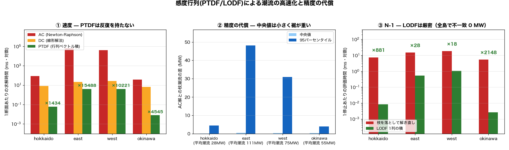
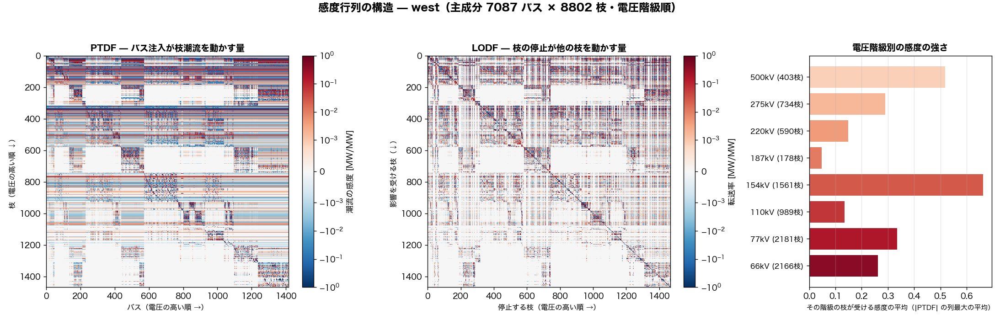
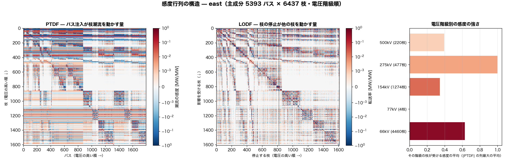
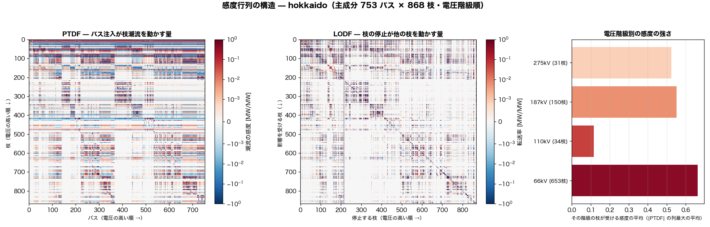
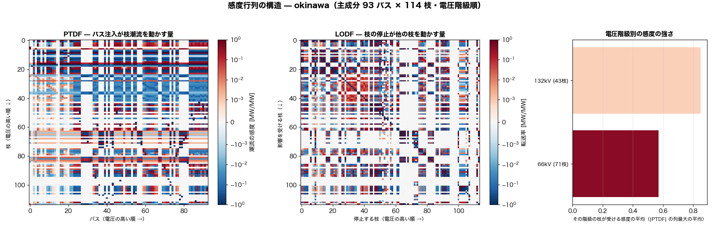

# 感度行列による潮流の高速化と精度比較 — 2026-08-09

PTDF（バス注入 → 枝潮流の線形感度）を一度作れば、潮流は**行列ベクトル積 1 回**で得られる。
LODF（枝停止 → 他枝潮流の感度）を使えば N-1 も解き直しなしで評価できる。
その速度と、線形化で失う精度を実測した。

対象は最大連結成分（PTDF は連結・単一 slack が前提。この成分が需要の約 90% を保持することは
`pf_frontier_2026-08-08.md` で確認済み）。負荷は 24 時間の代表的な日負荷曲線でスケールした。

## 1. 実装の正しさ

PTDF·P が DC 解の枝潮流を再現するかを機械精度で確認した。

| 島 | 主成分バス | 枝 | PTDF構築 | PTDF大きさ | DC解との最大差 |
|---|---:|---:|---:|---:|---:|
| hokkaido | 753 | 868 | 0.01 s | 5 MB | 3.88e-10 MW |
| east | 5393 | 6437 | 2.05 s | 278 MB | 5.61e-09 MW |
| west | 7087 | 8802 | 5.39 s | 499 MB | 9.03e-09 MW |
| okinawa | 93 | 114 | 0.00 s | 0 MB | 1.54e-11 MW |

## 2. 速度

| 島 | AC 1断面 | DC 1断面 | PTDF 1断面 | AC比 | DC比 | 構築コストの回収点 |
|---|---:|---:|---:|---:|---:|---:|
| hokkaido | 89.2 ms | 8.3 ms | **0.0622 ms** | ×1434 | ×134 | 0.1 断面 |
| east | 63828.6 ms | 21.2 ms | **4.1211 ms** | ×15488 | ×5 | 0.0 断面 |
| west | 42174.3 ms | 26.7 ms | **4.1264 ms** | ×10221 | ×6 | 0.1 断面 |
| okinawa | 36.9 ms | 6.5 ms | **0.0081 ms** | ×4545 | ×804 | 0.0 断面 |

「回収点」は PTDF の構築時間が AC 何断面分に相当するか。これを超える断面数を解くなら
感度行列を作った方が速い。年間 8760 断面や大量のシナリオ評価では圧倒的に有利になる。

## 3. 精度の代償

PTDF は直流近似（電圧一定・無損失・小角度）なので、AC 解との差が線形化の代償になる。

| 島 | 平均潮流 | 誤差 中央値 | 誤差 p95 | 誤差 最大 | 相対誤差 p95 | 大潮流枝のみ p95 |
|---|---:|---:|---:|---:|---:|---:|
| hokkaido | 28 MW | 0.21 MW | 4.6 MW | 44 MW | 21.6% | **11.3%** |
| east | 111 MW | 0.63 MW | 48.1 MW | 2738 MW | 59.0% | **39.3%** |
| west | 75 MW | 0.39 MW | 30.9 MW | 1214 MW | 47.4% | **27.6%** |
| okinawa | 55 MW | 0.40 MW | 4.1 MW | 12 MW | 4.8% | **3.8%** |

**中央値は小さく裾が重い**という形をしている。多くの枝では誤差は 1 MW 未満で、
潮流の大きい上位 10% の枝に絞った相対誤差 p95 が実務的な指標になる。
screening（過負荷になりうる枝の洗い出し）には十分だが、確定値としては AC で解き直す必要がある。

## 4. N-1 — LODF は近似ではなく厳密

| 島 | 評価した停止 | 解き直し | LODF | 速度比 | 最大不一致 | 橋（LODF不定） |
|---|---:|---:|---:|---:|---:|---:|
| hokkaido | 40 本 | 0.30 s | 0.337 ms | **×881** | 0 MW | 303 (34.9%) |
| east | 30 本 | 0.46 s | 16.383 ms | **×28** | 0 MW | 2287 (35.5%) |
| west | 30 本 | 0.56 s | 32.157 ms | **×18** | 0 MW | 2905 (33.0%) |
| okinawa | 40 本 | 0.22 s | 0.105 ms | **×2148** | 0 MW | 34 (29.8%) |

**DC の枠内では LODF は近似ではなく厳密**で、解き直しと機械精度で一致する。
ただし**橋**（落とすと網が割れる枝）では LODF が定義できない。本モデルは橋の比率が高く、
そこは個別に解く必要がある。橋の多さ自体が網の弱さの指標でもある。

## 5. 行列そのものの姿

Ybus のスパイ図は非ゼロの位置だけを見れば足りるが、PTDF / LODF は**符号を持つ密行列**なので
発散配色（負=青 / 0=白 / 正=赤）と対数スケールで描く。行と列は電圧階級の高い順に並べ替えた。

PTDF の**濃い横帯**はどこに注入しても動く枝＝基幹の背骨。白い矩形は電気的に切り離された領域。
LODF の**ブロック対角構造**は電気的近傍で、停止の影響がその塊に閉じることを示す。
西日本では **154kV 層の感度が最も強い**（500kV より高い）——1,561 枝でメッシュを組み
実質的な輸送層になっているため。

生成: `scripts/sensitivity/plot_matrices.py`

---
生成: `scripts/sensitivity/benchmark_sensitivity.py` → `plot_sensitivity.py`
