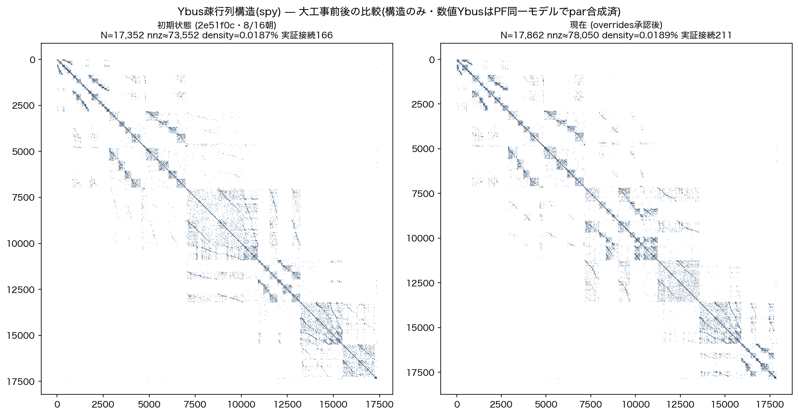

# Ybus構造比較(記録用): 初期状態 vs 大工事後 (2026-08-16)

オーナー指示「初期状態とYBUS比較も見てみたい。記録用」。
比較は本番関数`gen_ybus_from_db.load_graph`を両方に通した(罠3: 同手順)。
初期状態=2e51f0c(8/16朝・セッション開始点)。

| 指標 | 初期(2e51f0c) | 現在 | 差 |
|---|---|---|---|
| ノードN | 17,352 | **17,862** | +510 |
| 結線対(非対角/2) | 28,100 | **30,094** | +1,994 (+7.1%) |
| nnz(概算) | 73,552 | **78,050** | +4,498 |
| density | 0.0187% | 0.0189% | ほぼ不変 |
| エッジ | 19,204 | 19,741 | +537 |
| 実証接続(disclosure) | 166 | **211** | +45 |
| par≥2エッジ | 10,416 | 10,321 | -95(再抽出でway統合) |
| 本系統(main)ノード | 15,660 | **16,079** | +419 |

読み: 大工事(OSM再抽出+治癒+接続拡充)で**結線が7.1%増えたのにdensityが不変**=
規模拡大に対して疎性(系統らしい帯構造)が保たれている。数値YbusはPF同一モデル
(pandapower parallel合成済)からmakeYbusで出るため、回線数(par)はインピーダンスに
反映済み(gen_ybus_numeric)。spy図は構造のみ(並行分は畳む・意図的)。
