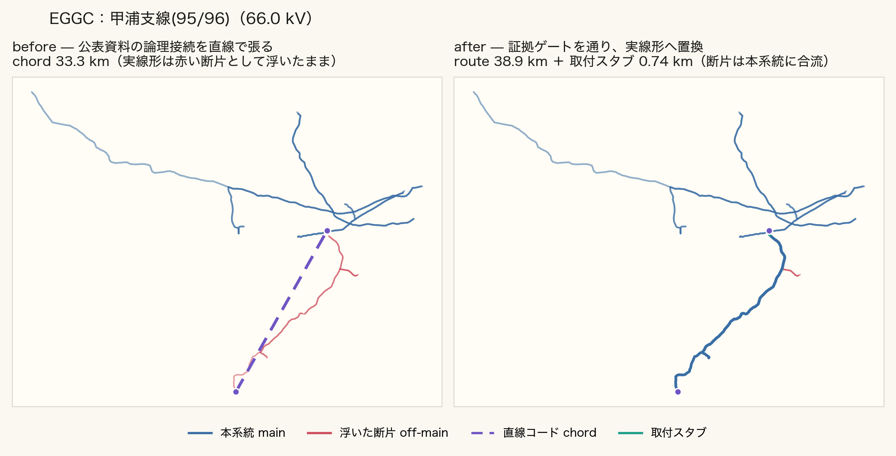
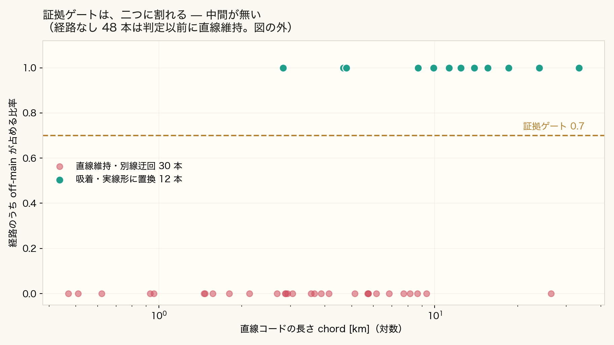
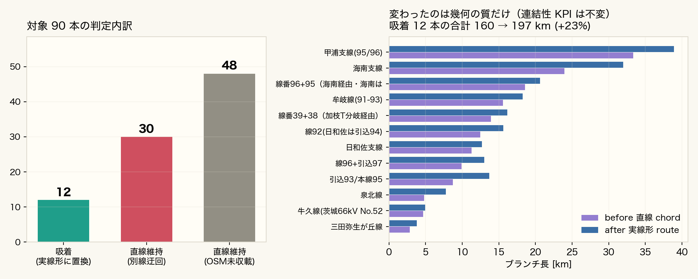

<!-- _class: title -->

# 直線が、地形を辿るまで

## EGGC — 証拠ゲート付き系統コンフレーション

All-Japan-Grid / 2026-08-17

<!-- note: 公表資料から得られるのは論理接続だけ。だから機械は直線を引く。しかしOSMにはその線の実線形が「浮いた断片」として実在することがある。 -->

---

<!-- _class: result -->

# 公表資料は、線形を教えてくれない

系統情報公表の様式や局所系統図から取れるのは、線名と両端の変電所だけ。座標は端点しか無いので、機械は素直に直線（chord＝弦）を引いて満足する。ところが同じ場所のOSMには、本系統に繋がっていない断片が宙に浮いて実在している。

Fig. 1. 甲浦支線（66kV）。左＝直線コード33.3km と脇に浮く実線形（赤）。右＝適用後38.9km

人の目には「根本的には繋がっている」と見えていた。その直観が正しかった。

<!-- note: オーナー観察(2026-08-16)「ちゃんと線があるものにおいては地形的に線を辿ってほしい。これは全部に言えること」 -->

---

<!-- _class: cols-2 -->

# なぜ半年見落としたか

## 指標に現れなかった

評価軸は「孤立ノードが減ったか」＝連結性KPIだった。

直線で繋いでも実線形で繋いでも、**連結性は同じだけ改善する**。

幾何の質はKPIに一切現れない。だから機械は「達成した」と報告し続けた。

## 教訓

**検算の軸を足す**: トポロジ介入の検証に「経路の物理妥当性」を含める。

発見は人の目視。「遠い赤点」の距離監査に続き2度目。

---

<!-- _class: steps -->

# EGGC の4ステップ

  1
  端点スナップ
  コード端点を最寄りのOSM頂点へ（≤2km）。基底が更新されても追従する

  2
  経路探索
  OSM由来のエッジだけで頂点グラフを組み、Dijkstraで最短路を探す

  3
  証拠ゲート
  経路のうち浮いた断片が占める長さの比率が0.7以上のときだけ採用する

  4
  スタブ置換
  コードを削除し取付スタブ2本へ。断片は再計算で本系統に合流する

<!-- note: 「経路が見つかったか」ではなく「何で出来た経路か」で採否を決めるのが、単なる最短路吸着との違い。 -->

---

<!-- _class: result -->

# なぜ「浮いていること」が証拠になるのか

送電網は繋がっているので経路はほぼ必ず見つかる。見つかったこと自体は証拠にならない。浮いた断片＝「まだ誰も本系統に繋いでいない線」がその区間にちょうど在るなら、それがこの公表線である蓋然性が高い。

Fig. 2. 90本の判定。縦軸が証拠、破線が閾値0.7

採用12本すべてが比率1.00、棄却30本すべてが0.00。中間が存在しない。

---

<!-- _class: result -->

# 90本のうち、置き換えたのは12本

残り78本は直線のまま。うち30本は経路が別線の迂回、48本はそもそもOSMに線が無い（地中線・未マッピング）。直線を残すことも成果である。

Fig. 3. 左＝判定の内訳。右＝吸着12本の before / after 線長

直線は「線形は未収載」という正直な表現。無い線形を捏造しない。

---

<!-- _class: table-slide -->

# 変わったのは幾何の質だけ

## 系統規模は1ノードも増えていない

| 指標 | EGGC 適用の影響 |
|------|------|
| 孤立ノード数・連結成分数 | **不変**（同じ接続の表現替え） |
| バス数・発電機数・負荷 | **不変** |
| ブランチ長（吸着12本） | 直線近似 → 実線長（160→197km, +23%） |
| 線路インピーダンス | 実長基準になる |
| 経路の物理的実在性 | OSM幾何で裏が取れる |

**この手法が主張しないこと**: off-main であることは「公表線である」ことの証明ではない。状況証拠にすぎない。

---

<!-- _class: table-slide -->

# この手法は何の仲間か

## 先行研究との関係

| 分野 | 代表 | EGGC との関係 |
|------|------|------|
| マップマッチング | Newson & Krumm 2009 | 軌跡→道路網の吸着。入力が2点だけの退化ケース |
| 地図コンフレーション | Saalfeld 1988 以来 | 論理系統図 × OSM物理図の統合が EGGC |
| 経路推定 | path inference | 2点間の物理経路推定という設定が同型 |
| 電力網 × OSM | GridKit / SciGRID / PyPSA-Eur | いずれも OSM→抽出（逆方向）。写像は例が無い |

**新規性**: 公表資料由来の論理エッジを入力とし、off-main比率という検証可能な基準で採否を機械判別し、可逆な台帳で駆動する。

---

<!-- _class: cols-2 -->

# 取り消せるように作ってある

## 可逆性の3点セット

- **BAK**: 適用前に `all.json.pre_route.bak`
- **台帳**: 採否の全記録。棄却78件の理由も残す
- **無効化**: STEPS から外すだけ。介入台帳 #29 追補5

## 限界

**閾値0.7に強い根拠は無い**。0.3〜1.0のどこでも同じ答えだった＝まだ検証されていない。

**棄却78本が正しい保証も無い**。OSM未収載を確認しただけ。

---

<!-- _class: cols-2 -->

# 触って確かめる

## 教材ページ

`docs/eggc_explainer.html` 単一ファイルで完結。

- 5ステップ誘導で判定を1つずつ観る
- **Dijkstraはその場で走る**。16ケース全てでサーバ判定と完全一致
- 閾値スライダーでゲートを手で開閉
- before/after スライダー

## ディープリンク

`?case=甲浦&step=4`

`?case=0&step=5&after=1`

case は番号か線名の一部、step は1–5。発表中に特定の線へ直接飛べる。

---

<!-- _class: takeaway -->

# キーメッセージ

線があるものは地形的に辿る。無い線は、捏造しない。

<li>EGGC は「繋げる」手法ではなく「繋ぎ方を証拠で選ぶ」手法</li>
<li>ゲートが開けば実線形へ、閉じれば直線のまま。どちらも記録に残り、取り消せる</li>
<li>次に必要なのは、閾値の中間値が出る地域を見つけてゲートを本当に検証すること</li>

<!-- note: 見つけたのは人の目、条件に落としたのは機械。 -->
