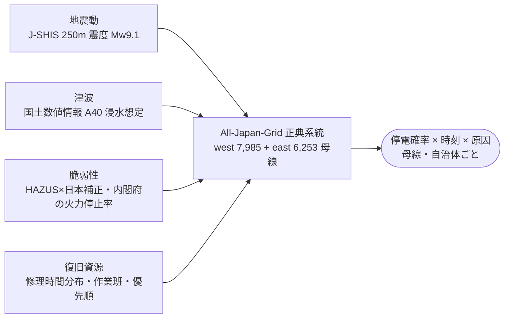

<!-- _class: flow -->

# All-Japan-Grid に 4 つを載せると、南海トラフの停電が計算できるか

## 地震動・津波・脆弱性・復旧資源を、14,238 母線の系統モデルの上で解く

<!-- note: 内閣府の「面と軒数」を「母線と時刻と原因」に下ろす、が狙い。入力はすべて公開データで出典つき。 -->

---

<!-- _class: steps -->

# 系統の上で解くこと — 4 つの手

  1
  壊す
  変電所・鉄塔・発電所の損傷を脆弱性曲線と乱数で 1 つずつ判定（1 サンプル 556 手）

  2
  つながるか・足りるか
  連結成分で上流孤立を数え、エリアの需給不足率から周波数崩壊（UFLS の限界）を判定

  3
  流れるか
  DC 潮流で過負荷を見つけ、保護リレーの動作として停止→解き直しの連鎖

  4
  直す
  修理時間と作業班の待ち行列で復旧時刻を決め、90 日まで再評価。200 回繰り返して確率に

---

<!-- _class: figure-full -->
<!-- source: All-Japan-Grid hazard/nankai run_v1 (N=200), J-SHIS AN177, KSJ A40 -->

# こうなりました — 直後 1,003 万軒、4 日で 4 割が残り、沿岸は 2 か月

---

<!-- _class: kpi -->
<!-- source: 内閣府 2025 被害想定(基本ケース・東海) / 本解析 run_v1 -->

# 直後は内閣府と同じ桁、4 日後からは「誰が残るか」を言える

  1,003万
  直後の停電軒数

  701万
  1日後（内閣府 1,350万）

  362万
  7日後（内閣府 32万）

<!-- note: 直後の内閣府想定は 2,060 万軒(同じ桁)。ポテンシャル法(潮流なし・0.8 秒)との需要加重相関は 0.56。4 日以降の 1 桁差は津波浸水域の変電所(復旧中央値 60 日)と上流孤立。内閣府は津波全壊需要家を復旧対象から除き、配電を別勘定にしている。原子力は内閣府が全停止、本モデルは PGA 0.2g 以上で停止。配電(6.6kV 以下)は未考慮。1 手ずつの可視化で DC 潮流の単位バグを見つけて修正した。 -->
