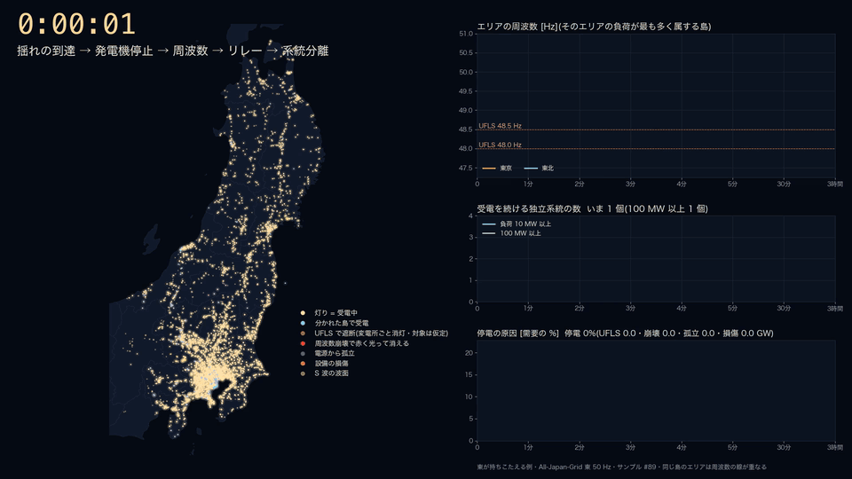
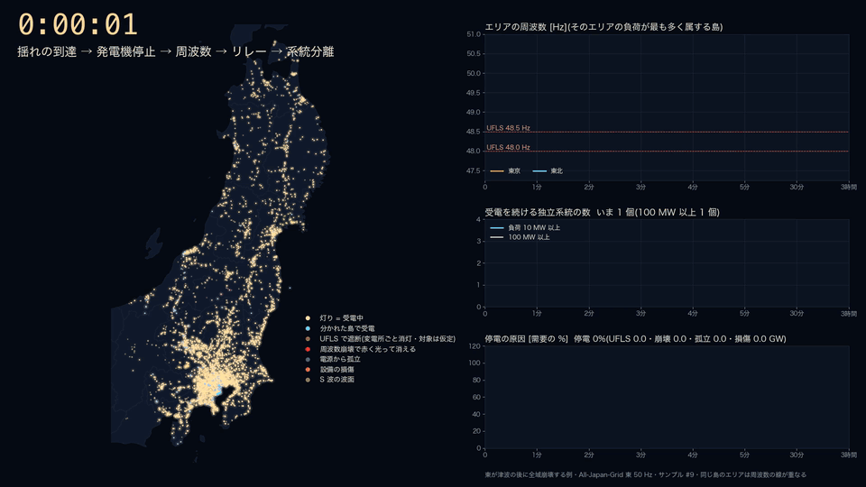
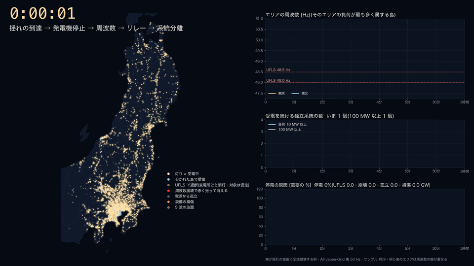

<!-- _class: figure-full -->
<!-- source: hazard/nankai/output/run_v7 東 50 Hz サンプル #89(3 分後の受電が 200 サンプルの中央値に最も近い)/ make_dynamic_cascade_viz.py --style night --late-step 60 -->

# 東が持ちこたえる — 90 分後の 2 度目の衝撃を UFLS が吸収する

<!-- note: 揺れで火力 10.8 GW が止まり、2 分で 48.49 Hz まで下がって UFLS 1 段目が 6.7 GW を遮断、周波数は戻る。90.5 分に津波が鹿島の変電所に届き、鹿島の火力群(運転中 4.6 GW)が本体から切り離されて崩壊する。本体は 4.6 GW を失うが、残っていた UFLS の段が 3.8 GW を遮断して 49.9 Hz で持ちこたえる。3 時間後の受電率 83.6%。 -->

---

<!-- _class: figure-full -->
<!-- source: hazard/nankai/output/run_v7 東 50 Hz サンプル #9(3 時間後に需要の 8 割超が崩壊した 20 サンプルの 1 つ・津波後に崩れる型) -->

# 東が死ぬ(1) — 2 分で UFLS を使い切り、90 分後の津波で全域崩壊

<!-- note: 揺れで火力 17.4 GW が止まり(生きる例の 1.6 倍)、47.91 Hz まで下がって UFLS の 2 段がほぼ全部動く(合計 15.3 GW)。ここまでは受電率 73% で止まる。90.5 分に鹿島の火力群 4.9 GW が切り離されると、UFLS の残りは 2.3 GW しかなく、周波数が 47 Hz 台を割って太陽光・風力 1.4 GW、火力 4.3 GW が周波数低下保護で解列し、91.0 分に本体 33 GW が崩壊する。3 時間後の受電率 5.5%。 -->

---

<!-- _class: figure-full -->
<!-- source: hazard/nankai/output/run_v7 東 50 Hz サンプル #59(揺れの直後に崩れる型) -->

# 東が死ぬ(2) — 揺れで 21.6 GW を失い、2 分で全域崩壊

<!-- note: 揺れで火力 21.6 GW(需要の 39%)が止まる。UFLS 2 段 14.0 GW でも足りず、45.2 Hz まで落ちて水力・火力の周波数低下保護が 6.0 GW を解列、127 秒で 34 GW が崩壊する。200 サンプルのうち全域崩壊は 20 で、揺れの直後(5 分以内)に崩れる型が 3、後で崩れる型が 17。 -->

---

<!-- _class: table-slide -->
<!-- source: cascade_east_*_night_meta.json(事象の記録)/ run_v7 dyn_samples.csv -->

# 分かれ目は「最初に失う火力」と「残っている UFLS の段」

| 項目 | 生きる #89 | 死ぬ(津波後)#9 | 死ぬ(直後)#59 |
|---|---|---|---|
| 揺れで止まった火力 | 10.8 GW | 17.4 GW | 21.6 GW |
| 2 分後の最下点 | 48.49 Hz | 47.91 Hz | 45.20 Hz |
| UFLS の遮断(3 時間の合計) | 6.7 GW | 15.3 GW | 14.0 GW |
| 過負荷リレーで切れた線路 | 19 本 | 12 本 | 4 本 |
| 90.5 分 鹿島の切り離しで失う発電 | 4.6 GW | 4.9 GW | — |
| 周波数低下保護で解列した発電機 | 0 | 5.8 GW | 6.0 GW |
| 全域崩壊 | なし | 91.0 分・33 GW | 2.1 分・34 GW |
| 受電率 10 分 / 1 時間 / 3 時間 | 91 / 93 / 84% | 73 / 74 / 5% | 6 / 6 / 6% |

需要 55.2 GW(東京 + 東北)。UFLS は 48.5 Hz(0.1〜21 秒・15%)と 48.0 Hz(0.1〜6 秒・15%)の 2 段で、島の需要の最大 3 割まで。

---

<!-- _class: sections -->

# 死ぬ(津波後)の経緯 — 4 手

  0〜2 分｜揺れが東京湾岸に届く
  震度 6 弱以上の火力が到達 2 秒後に止まり、合計 ==17.4 GW==(需要の 32%)を失う。周波数は 47.91 Hz まで落ち、UFLS の 2 段(48.5 / 48.0 Hz)がほぼ全部動いて 13 GW を遮断。2 分の過負荷チェックで線路 12 本が開く。

  2 分〜90 分｜受電率 73% で膠着
  UFLS で切った負荷は戻らず、周波数は 49.9 Hz で安定。この間に津波が湾岸へ届くが、湾岸の大型火力はすでに揺れで止まっていて追加の損失は小さい(1.9 GW)。

  90.5 分｜鹿島が切り離される
  津波が鹿島の 275 kV 変電所に届き、鹿島火力・日本製鉄鹿島・鹿島共同(定格 8.7 GW・運転中 4.9 GW)が需要 61 MW の小さな島として本体から離れ、周波数上昇で崩壊。本体は ==4.9 GW== を一度に失う。

  90.7〜91.0 分｜保護が発電機を切り、全域崩壊
  残っていた UFLS は 2.3 GW だけ。周波数が 47 Hz 台を割り、太陽光・風力 1.4 GW(47.5 Hz)と火力 4.3 GW(47.0 Hz)が周波数低下保護で解列。91.0 分に本体 ==33 GW== が 45 Hz を割って全停。以後 3 時間まで受電率 5.5%(残るのは東北の一部の島)。

<!-- note: 時刻は事象の記録どおり(cascade_east_collapse_night_meta.json)。生きる例(#89)は同じ 90.5 分の鹿島の切り離しを、残っていた UFLS 3.8 GW で吸収した。違いは最初に失った火力の量(10.8 GW 対 17.4 GW)で、それは J-SHIS の震度場と火力の停止率曲線を乱数で引いた結果の差。 -->

---

<!-- _class: sections -->

# モデルの中で動いている仕組みと整定値

  周波数｜島ごとに 1 本
  慣性中心の周波数を島ごとに解く。慣性は運転中の同期機の合計、ガバナは上げ代で頭打ち、負荷の周波数特性 2%/Hz、北本・周波数変換所の緊急融通。

  UFLS｜48.5 Hz と 48.0 Hz の 2 段
  時限 0.1〜21 秒(8 本)と 0.1〜6 秒(6 本)の対数間隔、各段 15%。整定は北海道 2018 の比を移した仮定。一度動いた段は再び動かず、切った負荷は 3 時間戻さない(表示は変電所ごとの消灯)。

  発電機の保護｜低周波数・高周波数
  水力 46.0 Hz(0.5 秒・北海道の実績)、火力 47.0 Hz(30 秒・仮定)、太陽光・風力 47.5 Hz(0.2 秒・FRT 下限の仮定)。上昇側は水力 52 Hz、火力 52.5 Hz。

  崩壊と過負荷｜しきい値
  島の周波数が 45 Hz 未満・55 Hz 超、または同期機がほぼ無い(慣性 0.5 秒未満)で崩壊。過負荷は主幹系統の DC 潮流で緊急定格 1.25 倍を超えた枝を 10 秒〜2 時間の決まった時刻に開く。

<!-- note: 設定は hazard/nankai/config/dynamics_default.yaml。設定ファイルの「UFLS 遮断分は 1 時間で再送電」は実装されておらず、計算では 3 時間戻さない(2026-09-16 に確認)。戻して段を再び使えるようにすると、津波後に崩れる型は減る方向。直すかは判断待ち。 -->

---

<!-- _class: pros-cons -->

# 言えること、まだ言えないこと

<li>崩れるかどうかは、揺れで失う火力の量と UFLS の残りで決まる</li>
<li>後で崩れる 17 例のうち 11 例は鹿島の切り離し(4.9〜5.1 GW)が直前の引き金</li>
<li>過負荷リレーの扱いを変えても全域崩壊は 6〜10% で変わらない</li>
<li>同じ乱数で再計算すると事象の時刻まで一致する</li>

<li>UFLS の整定・遮断量は本州分が非公表で、北海道の比を移した仮定</li>
<li>火力の低周波数保護 47 Hz・30 秒は仮定で、崩壊の時刻を左右する</li>
<li>UFLS で切った負荷を 3 時間戻さない(設定の 1 時間再送電は未実装)</li>
<li>運転員の再給電・電源制限・系統安定化装置は入っていない</li>

<!-- note: 動画と静止画は docs/reports/nankai_hazard_2026-09-13/dynamics/cascade_east_{survive,collapse,collapse_early}_night.{gif,mp4,_still_*.png}。GIF は 6 fps・960 px、mp4 は 15 fps・1920 px。PowerPoint には mp4 を貼ると滑らかで、GIF は自動再生。 -->
