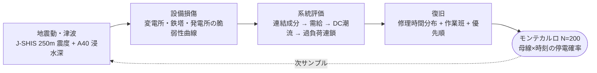
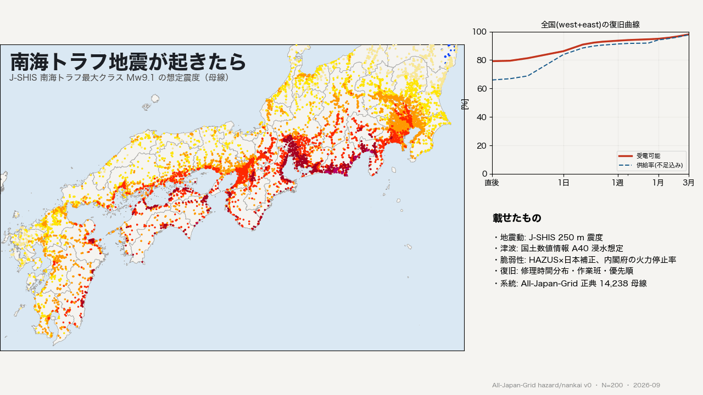
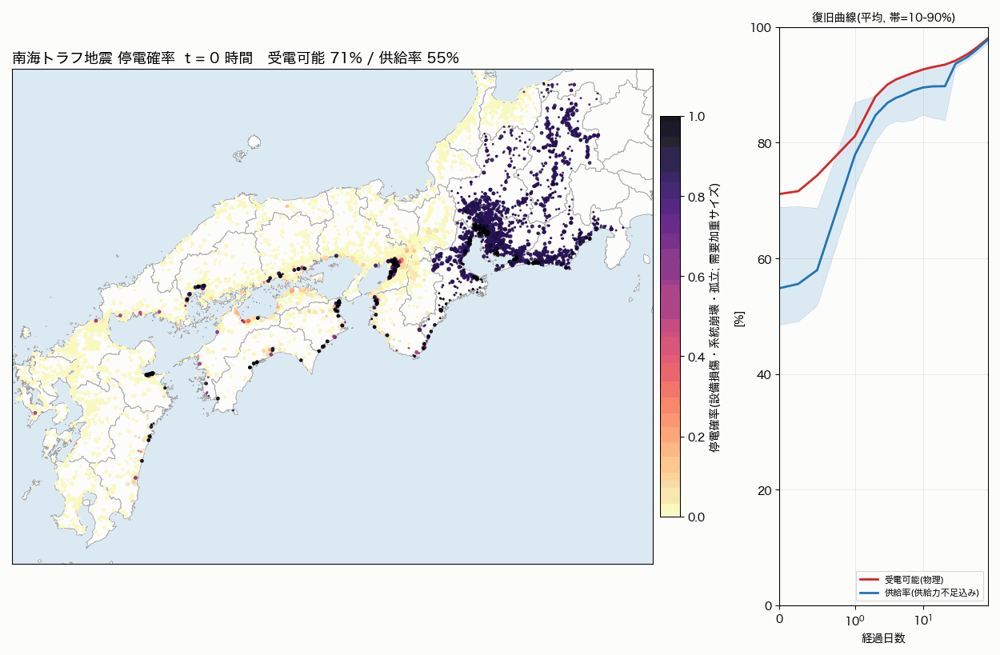
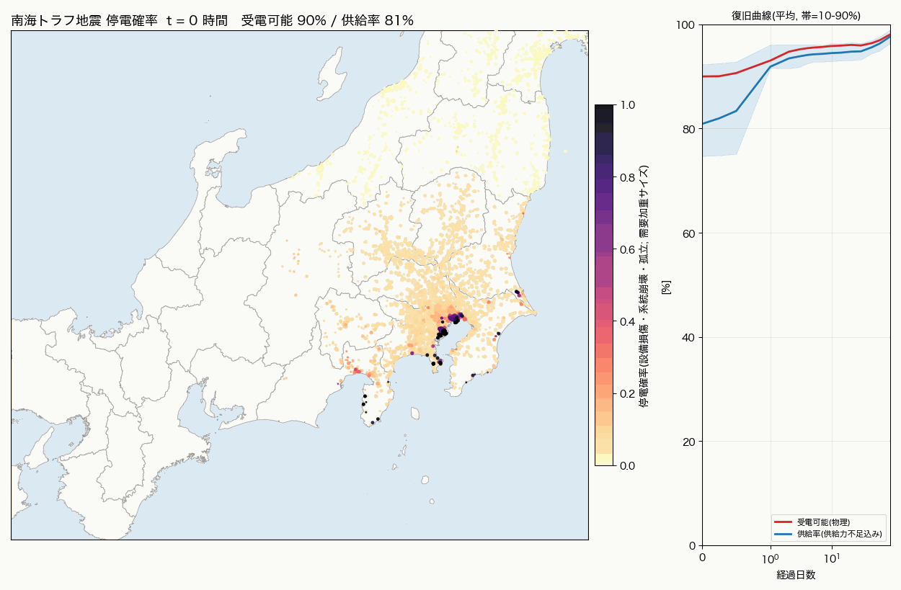

<!-- _class: title-figure -->
<!-- _side: right -->
<!-- source: All-Japan-Grid / hazard/nankai run_v0_jshis (N=200) -->

# 南海トラフ地震 電力ハザードマップ

## 系統モデルがあるから、停電と復旧を「計算」できる

重信 竜人（福井大学） 2026-09-13

図: 発災直後の停電確率（物理）。母線 7,985 点・モンテカルロ 200 サンプルの平均

<!-- note: 昨夜 0 時から 3 時間で組んだ v0 の報告。数字は暫定、構造は本番。 -->

---

<!-- _class: graphical-abstract -->

# 一枚で全体像

## 問い → 課題 → 提案 → 成果

  問い
  南海トラフ巨大地震で **どこが・どれだけ・いつまで** 停電するか。内閣府の「軒数」を、地図と時間の上に置けるか。

  課題
  
  震度→停電率の統計では、上流が落ちて下流が全部落ちることも、供給力不足も表せない。

  提案
  
  地震動 → 損傷 → 系統 → 復旧 → 確率
  系統モデル 14,238 母線の上で ==需給・潮流・リレー== を模す。

  成果
  1,003万
  五地域の直後停電軒数。内閣府 2,060 万と同じ桁

地震動: J-SHIS 南海トラフ最大クラス Mw9.1 250m メッシュ ／ 津波: 国土数値情報 A40 ／ 系統: All-Japan-Grid 正典（west 7,985 + east 6,253 母線）

---

<!-- _class: agenda -->

# 本日の内容

1. 問い — 停電を「地図 × 時間」で出す
2. なぜ系統モデルが要るのか
3. どう作ったか — 5 段のパイプラインとデータ
4. 電力の物理 — 需給・周波数・リレー
5. 結果 — 内閣府想定との比較と原因分解
6. 言えること・言えないこと・次の一手

---

<!-- _class: rq -->

# Research Question

南海トラフ巨大地震のあと、どの変電所の先が、何日間、電気を失うか — を確率で言えるか？

— 内閣府の想定は「軒数」と「地域」まで。本研究は「母線」と「時刻」まで下ろす

---

<!-- _class: statement -->
<!-- bg: dark -->

停電は震度の関数ではない。==系統の状態== の関数である。

---

<!-- _class: zone-compare -->

# 系統モデルの有無で、答えの種類が変わる

  系統モデル無し（震度 → 停電率）
  過去地震の「震度階級ごとの停電率」を当てはめる。速い。だが **供給側が半分止まる**こと、**上流が落ちれば下流が全部落ちる**こと、**復旧の順序**は入らない。答えは面（地域）と軒数。

VS

  系統モデル有り（本研究）
  母線・線路・変圧器・発電機を実座標で持ち、損傷後に **つながっているか・足りているか・流れるか** を解く。答えは母線ごとの停電確率と復旧曲線。何が原因かまで分解できる。

---

<!-- _class: sections -->

# 系統モデルが要る 3 つの理由

  需給｜① 電気は「面」でなく「系統」で釣り合う
  火力が 6弱以上で 9 割止まると、そのエリアの需要は連系線の受電上限（中部 4.6 GW など）まででしか補えない。不足率はエリアごとに違い、崩壊するかどうかもエリアごとに決まる。

  経路｜② 上流が落ちれば、健全な下流も落ちる
  154kV 変電所 1 か所の停止が、その先の 66kV 変電所 10 か所を孤立させる。この「上流孤立」が 7 日後の停電の 3 割を占めた（本結果）。震度だけでは見えない。

  復旧｜③ 直す順番と作業班で曲線が決まる
  同じ損傷でも 500kV から直すか 66kV から直すかで復旧曲線は変わる。作業班数・応援・修理時間分布を系統の上で回すから、内閣府の「1 週間で 95%」と突き合わせられる。

---

<!-- _class: flow -->

# 解析ベース（A）の 5 段パイプライン

## 地震動と津波を「設備の損傷」に変え、系統の上で「供給」と「復旧」を解く

---

<!-- _class: sections -->

# データはすべて公開源泉、出典と信頼度つき

  地震動｜J-SHIS 南海トラフ最大クラス Mw9.1
  250m メッシュ 370 万点の計測震度（発生を条件とした期待値）。ログイン不要。SPA の JS を展開して URL 規則を特定した。内閣府の 250m 震度分布は要登録のため未取得（置けば自動で優先）。

  津波｜国土数値情報 A40 津波浸水想定
  24 県の最大クラス浸水ポリゴン 243 万行（1.5 GB）。年版は市区町村別の面積比較で選定。香川は県が提供不同意、奈良は内陸で欠落。

  系統｜All-Japan-Grid 正典モデル
  west 7,985 母線 / 9,131 枝 / 8,130 発電機、east 6,253 母線。OSM と公表資料で正した系統。線路容量は介入#45 較正込み。

  脆弱性・復旧・較正目標｜一次資料から転記
  HAZUS 4.2 表 8-29/8-31、内閣府 2025 の火力停止率表、九州電力 熊本地震被害率、土木学会 3.11 報告、内閣府 2013/2025 の停電軒数。high / medium / low の信頼度を全パラメータに付けた。

---

<!-- _class: equation -->

# 設備の壊れやすさは対数正規の脆弱性曲線で

$$P(\mathrm{DS} \ge k \mid \mathrm{PGA}) = \Phi\!\left(\frac{\ln(\mathrm{PGA}/\theta_k)}{\beta_k}\right), \qquad \theta_k^{\mathrm{JP}} = 5\,\theta_k^{\mathrm{HAZUS}}$$

  $\mathrm{DS}$
  損傷状態 1 slight / 2 moderate / 3 extensive / 4 complete（extensive 以上で停電）
  $\theta_k$
  中央値 PGA [g]。HAZUS 4.2 変電所 anchored（≤110 / 154–220 / ≥275 kV で別）
  $\beta_k$
  対数標準偏差 0.35〜0.7
  $\times 5$
  日本補正。JEAG 5003 耐震設計と熊本・東北の機能停止率（数%）に合わせて較正
  津波
  浸水深 <0.3m 5% / 0.3–1m 50% / 1–2m 85% / ≥2m 98% で機能停止（仮定・low）

---

<!-- _class: sections -->
<!-- build -->

# 電力の物理 — 需給・周波数・リレーの 3 段

  需給｜発電 = 需要 + 損失 が毎秒成り立つ
  差は回転機の運動エネルギーで埋まり、**周波数**に現れる。西日本 60 Hz と東日本 50 Hz は周波数変換所 210 万 kW でしかつながらない。地震で火力が止まると、この釣り合いが崩れる。

  周波数｜下がれば周波数低下リレー（UFLS）が負荷を切る
  周波数がしきい値を割ると段階的に負荷を遮断して発電を守る。設計範囲を超える不足は、発電機の低周波数保護が働いて ==全域停電== に至る（北海道 2018）。

  潮流｜残った線路に流れが集中し、保護リレーが切る
  線路が落ちると潮流は残りの経路へ付け替わる（LODF）。定格を超えれば過電流・距離リレーが動作し、次の線路へ連鎖する。停電は「壊れた場所」だけで決まらない。

---

<!-- _class: equation -->

# 不足 20% で周波数は毎秒 1.5 Hz 落ちる

$$\frac{2H}{f_0}\,\frac{df}{dt} = P_{\mathrm{gen}} - P_{\mathrm{load}} \;[\mathrm{pu}] \quad\Rightarrow\quad \frac{df}{dt} = \frac{-0.20 \times 60}{2 \times 4} = -1.5\ \mathrm{Hz/s}$$

  $H$
  系統の慣性定数 [s]。回転機の運動エネルギー／定格容量。例として 4 s
  $f_0$
  定格周波数 60 Hz（西日本）
  $P_{\mathrm{gen}}-P_{\mathrm{load}}$
  需給の不足率。火力 9 割停止のエリアでは連系線受電を足しても 2 割前後
  UFLS
  周波数低下リレーは 1 秒以内に段階遮断で追いつく必要がある。本モデルは「エリア不足率 25% 超で崩壊」と仮定
  復電
  ブラックスタート → 系統を分割して立ち上げ。中央値 24 時間・対数正規で母線ごとに復電

---

<!-- _class: steps -->

# 系統崩壊はこう連鎖する — 北海道 2018 が教科書

  1
  発電脱落
  苫東厚真の発電機が地震で停止。供給の約半分を一度に失う

  2
  周波数低下
  50 Hz から 46.13 Hz まで低下。慣性が小さいほど速い

  3
  UFLS 動作
  周波数低下リレーが約 130 万 kW を段階遮断。それでも足りない

  4
  全域停電と復電
  発電機保護で全停。295 万戸。ブラックスタートで 11 時間後に送電再開、2 日で 99%

<!-- note: 出典: 電力広域的運営推進機関 検証委員会 最終報告(2018-12)。本モデルの「エリア不足率>25%で崩壊、復電中央値24h」はこの事例と内閣府の「需給起因の停電は数日で解消」を橋渡しする仮定。 -->

---

<!-- _class: equation -->

# 潮流は DC 近似で解き、過負荷を保護リレーの動作に読み替える

$$B\,\theta = P, \qquad f_{ij} = \frac{\theta_i - \theta_j}{x_{ij}}, \qquad f' = f + \mathrm{LODF}_{\cdot k}\, f_k, \qquad |f_{ij}| > 1.25\,S_{ij} \Rightarrow \text{trip}$$

  $B$
  サセプタンス行列（生きている枝だけで組む）。成分ごとに解く
  $P$
  母線注入 = 発電 − 供給負荷。需給が合わない成分は比例遮断してから解く
  $f_{ij}$
  枝潮流 [MW]。基準潮流と比べて付け替わり量を見る
  $\mathrm{LODF}$
  線路停止分布係数。枝 $k$ が落ちたときの他枝への付け替え（DC の枠内で厳密）
  $1.25\,S_{ij}$
  緊急定格。理論容量×1.25、基底で既に超える枝は基底潮流×1.3。超えた枝を 3 本ずつ切って最大 8 回反復（連鎖）

---

<!-- _class: table-slide -->

# 現象・リレー・モデルの対応表

## 実系統で起きることを、どの計算で肩代わりしているか

| 現象 | 実系統の仕組み | 本モデルでの表現 | 信頼度 |
|---|---|---|:---:|
| 火力の自動停止 | 振動検知・タービン保護 | 震度別「停止率の時間曲線」（内閣府 2025 と同じ表） | ◎ |
| 原子力の停止 | 地震加速度大でスクラム | 地表 PGA ≥ 0.2 g で停止、期間内は復帰しない | ○ |
| 需給不足 | 周波数低下 → UFLS 段階遮断 | エリア不足率で比例遮断。25% 超は崩壊（全停→24h で復電） | △ |
| 過負荷 | 過電流・距離リレー | DC 潮流で緊急定格超を停止し LODF で付け替え | ○ |
| 変電所損傷 | がいし・変圧器・遮断器の破損 | HAZUS 曲線×5、津波は浸水深別 | △ |
| 鉄塔倒壊 | 斜面崩壊・津波 | 1 基あたり中央値 12 g（揺れ単独の倒壊は観測ゼロ） | △ |
| 復旧 | 作業班・応援・優先順 | 対数正規修理時間、エリア別班数、3 日目から応援 2 倍 | △ |

◎ 一次資料の表を転記 ／ ○ 一次資料に根拠のある仮定 ／ △ 本作業で置いた仮定（感度スイープで確認）

---

<!-- _class: figure-full -->
<!-- source: All-Japan-Grid hazard/nankai run_v1 (N=200), J-SHIS AN177, KSJ A40 -->

# 夜の灯りが消え、津波が沿岸を呑み、3 か月かけて戻る

<!-- note: 34 秒。ふだんの夜 → 衝撃波 → 灯りが消える → 津波がトラフ軸から海を渡って A40 浸水想定域を水没 → 引き波 → 日ごとに灯りが戻る(停電中の需要家カウンタ・内閣府 2025 の数字を併記)。灯り = √需要 × 受電可能確率(モンテカルロ平均)。光の網は正典 OSM 線形の送電線。津波の到達順は海上最短経路の演出で伝播計算ではない。浸水域は視認性のため 2 px 太らせている。 -->

---

<!-- _class: figure -->
<!-- source: All-Japan-Grid hazard/nankai run_v1 (N=200) -->

# 14,238 母線の停電確率が日ごとに引く

図. 母線ごとの停電確率（設備損傷・系統崩壊・上流孤立）と全国の復旧曲線。右の軒数は五地域の物理停電。

<!-- note: シネマティックは見せ方、こちらは読み方。色は停電確率、点の大きさは需要。黒点は津波浸水域の変電所で、1 か月たっても残る。 -->

---

<!-- _class: cols-2 -->

# 直後は「エリア崩壊」、1 週間後は「津波の沿岸」が残る

直後: 中部エリアが供給不足で崩壊（確率 0.9）

7 日後: 大阪湾岸・伊勢湾岸・高知・徳島・宮崎の浸水域

---

<!-- _class: figure -->
<!-- source: All-Japan-Grid hazard/nankai run_v1 west (N=200) -->

# 西日本 — 中部の崩壊が 1 日で解け、沿岸の黒点が残る

図. 西日本 7,985 母線。需要加重の受電可能は直後 71%・1 日 81%・7 日 92%・90 日 98%。帯は 10〜90% 分位。

<!-- note: 赤線は物理的につながっているか、青線は供給力不足まで含めた供給率。直後の差 16 pt が「エリアの需給崩壊」。1 日でほぼ重なるのは、系統崩壊の復電中央値を 24 時間と置いたため。 -->

---

<!-- _class: figure -->
<!-- source: All-Japan-Grid hazard/nankai run_v1 east (N=200) -->

# 東日本 — 東京湾岸と伊豆の浸水域が残る

図. 東日本 6,253 母線。需要加重の受電可能は直後 90%・1 日 93%・7 日 96%・90 日 98%。帯は 10〜90% 分位。

<!-- note: 東は震源から遠く、直後の供給率 81% の主因は火力の停止率曲線による供給力不足。物理的な孤立は 1 割にとどまる。 -->

---

<!-- _class: chart -->
<!-- _chart: line -->
<!-- source: hazard/nankai/output/run_v0_jshis/west/timeline_summary.csv (N=200) -->

# 西日本の復旧曲線 — 2 日で 9 割、残り 1 割が長い

| 経過 | 受電可能（物理） | 供給率（不足込み） |
|---|---|---|
| 直後 | 71.1 | 54.8 |
| 12h | 74.3 | 58.0 |
| 1日 | 81.1 | 77.9 |
| 2日 | 88.0 | 84.7 |
| 4日 | 90.9 | 87.8 |
| 7日 | 92.1 | 89.0 |
| 14日 | 93.1 | 89.7 |
| 30日 | 94.2 | 93.7 |
| 90日 | 98.1 | 97.9 |

単位 %（対 残存需要 73.9 GW）。差分が「供給力不足の遮断」= 2011 年の計画停電に相当。内閣府の停電軒数には含まれない勘定。

---

<!-- _class: table-slide -->

# 内閣府想定との比較 — 直後は同じ桁、4 日後から 1 桁ずれる

## 五地域（東海・近畿・山陽・四国・九州 2 県）の停電軒数

| 時点 | 内閣府 2013 基本 | 内閣府 2025 基本 | 内閣府 2025 陸側 | **本解析 物理停電** | 本解析 不足込み |
|---|---:|---:|---:|---:|---:|
| 直後 | 1,930 万 | 2,060 万 | 2,170 万 | **1,003 万** | 1,458 万 |
| 1 日後 | 1,074 万 | 1,349 万 | 1,620 万 | **701 万** | 820 万 |
| 4 日後 | 33 万 | 35 万 | 135 万 | **403 万** | 521 万 |
| 7 日後 | 29 万 | 32 万 | 105 万 | **362 万** | 466 万 |

**4 日後以降の 1 桁の差**は、津波浸水域の変電所（復旧中央値 60 日）と上流孤立で説明できる。内閣府は津波全壊の需要家を復旧対象から除き、配電被害を別勘定にしている。

本解析は west+east 合算・供給地点数換算（五地域 2,949 万）。内閣府は電灯軒数（2,420〜2,470 万）。定義差 約 2 割。

---

<!-- _class: figure -->

# 停電の原因を時間ごとに分解できる — これが系統モデルの効用

図. 五地域の物理停電の内訳（N=30・J-SHIS 場）。系統崩壊は 2 日で消え、以後は津波変電所と上流孤立が主役になる。

---

<!-- _class: zone-compare -->

# 解析ベース（A）とポテンシャル法（B）

  A 解析ベース — 確率の絶対値
  損傷をサンプルして系統を解き直す。1 サンプル 1.5 秒、N=200 で 5 分。停電確率・復旧曲線・原因分解が出る。系統崩壊・上流孤立・連鎖を含む。

VS

  B ポテンシャル法 — 順位づけ
  中央値ハザードの故障確率を枝重みにして、電源までの最良経路の生存率 × 半径 80 km の供給余力で指標化。乱数も潮流も無しで 0.8 秒。A の 2 日後と需要加重相関 0.56。

---

<!-- _class: sections -->

# 負の結果 — 4 つの「そのままでは合わない」

  距離減衰式｜Mw9.0 を直入れすると遠方が 1 階級過大
  司・翠川式は Mw8.3 程度までの回帰。大阪・名古屋が 6強、北陸が 5強になった。有効 Mw8.5 で飽和させたうえで J-SHIS 実データを一次にした。

  HAZUS 曲線｜そのままだと 6強で変電所 7 割停止
  熊本 2016 の運転継続不可率（変圧器 6強 2.9%）、東北 2011 の被害 75/615 と桁が合わない。×3 でも 4 日後 730 万軒。×5 で震度階級表と同水準。

  火力トリップ｜一様「5弱で全停止」は関東まで 52% 停電にする
  2011 年は東京湾岸の火力が数時間〜1 日で復帰した。内閣府 2025 の震度別停止率曲線（5弱 8%・5強 20%・6弱以上 90%）に置換した。

  系統崩壊｜連結成分単位では発火しない
  西日本は 1 つの成分なので不足率が薄まる。一般送配電エリア単位に連系線受電上限を足して判定する形に変えた。内閣府の地域別停電率の構造と一致する。さらに「1 手ずつ」トレースで DC 潮流の ×100 の単位バグを発見し修正した(物理停電は不変)。

---

<!-- _class: pros-cons -->

# 言えること・まだ言えないこと

<li>直後〜1 日後の停電規模は内閣府と同じ桁で、エリア需給崩壊がその主因</li>
<li>7 日後以降の停電は沿岸の津波浸水域と上流孤立に集中する（地図で場所が言える）</li>
<li>供給力不足の遮断（計画停電相当）は 2 日でほぼ消える</li>
<li>ポテンシャル法は優先順位付けに使える（需要加重相関 0.56）</li>

<li>配電（6.6 kV 以下）を持たないので、実際の停電はこれより多い</li>
<li>津波変電所の停止確率と復旧日数は仮定（low）。香川は津波層が無い</li>
<li>PGA は震度からの換算で、変電所×5 の較正係数と不可分</li>
<li>液状化・斜面崩壊・地殻変動は未考慮。需要家数は概数 ±10%</li>

---

<!-- _class: checklist -->

# 次の一手

<li class="done">パイプライン v0（A・B）、GIF、HTML 地図、内閣府比較、レポート</li>
<li class="done">較正スイープ 24 変種と負の結果の記録</li>
<li>配電層（震度別損傷率）を母線に掛けて 1〜7 日の停電を内閣府と再比較</li>
<li>津波全壊需要家（浸水 1 m 以上）を除いた集計で「復旧対象」を揃える</li>
<li>内閣府 250m 震度・浸水データ（要登録）を取得して決定論ケースで再計算</li>
<li>周波数の動的シミュレーション（慣性・UFLS 段階）で「25% 崩壊」の仮定を置換</li>
<li>west の AC 潮流で過負荷連鎖を再確認、ポテンシャル法に冗長経路の項を追加</li>

---

<!-- _class: takeaway -->

# キーメッセージ

出典付きの系統モデルがあれば、地震の停電を「面と軒数」から「母線と時刻と原因」に下ろせる

<li>需給・周波数・リレーの物理を、成分・DC 潮流・しきい値の計算に写した</li>
<li>内閣府想定と直後は一致、4 日後以降の乖離は津波変電所と上流孤立と特定した</li>
<li>合わない部分を隠さず記録した。次は配電層と津波除外集計で詰める</li>

---

<!-- _class: references -->

# References

<ol>
<li>
  防災科学技術研究所 J-SHIS.
  条件付超過確率地図データ C-V3-ANNKI-AN177「南海トラフ沿いで発生する大地震（最大クラス）Mw9.1」.
  全国地震動予測地図 2020 年版, 2021.
</li>
<li>
  国土交通省 国土数値情報.
  A40 津波浸水想定 / N03 行政区域（2026 年版）.
  https://nlftp.mlit.go.jp/ksj/ (CC BY 4.0).
</li>
<li>
  FEMA.
  Hazus Earthquake Model Technical Manual 4.2 SP3, §8.5 Electric Power Systems.
  2020.
</li>
<li>
  中央防災会議 南海トラフ巨大地震対策検討 WG.
  被害想定について（第二次報告）2013 ／ 最大クラス地震における被害想定 2025 ／ 手法の概要 2025.
  内閣府.
</li>
<li>
  九州電力.
  電気設備被害の状況分析と地震対応の評価について（熊本地震）.
  産構審 電力安全小委, 2016.
</li>
<li>
  電力広域的運営推進機関.
  平成 30 年北海道胆振東部地震に伴う大規模停電に関する検証委員会 最終報告.
  2018.
</li>
<li>
  司宏俊・翠川三郎 (1999); 藤本一雄・翠川三郎 (2005).
  距離減衰式 ／ 計測震度と最大速度の関係.
  日本建築学会構造系論文集 / 地域安全学会論文集.
</li>
</ol>

---

<!-- _class: end -->

# ありがとうございました

コード・レポート・地図: All-Japan-Grid `feature/nankai-hazard` / `hazard/nankai/`

docs/reports/nankai_power_hazard_v0_2026-09-13.md
