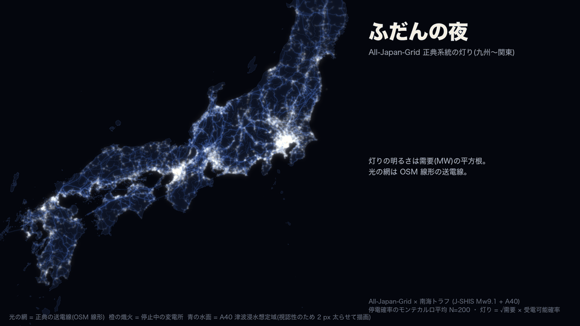
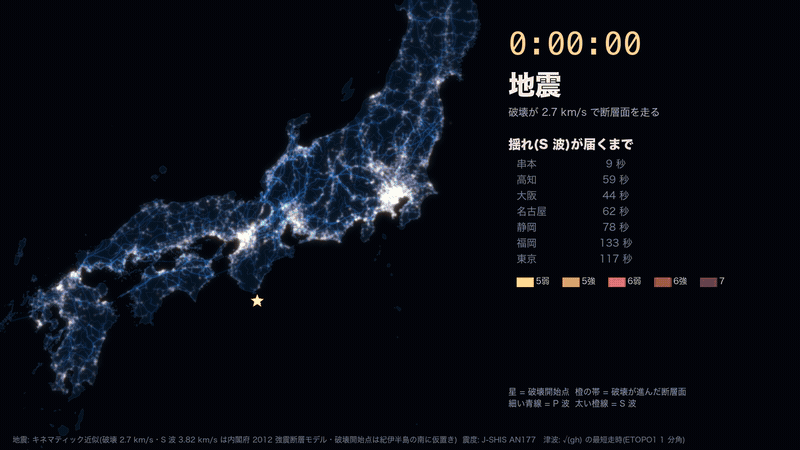
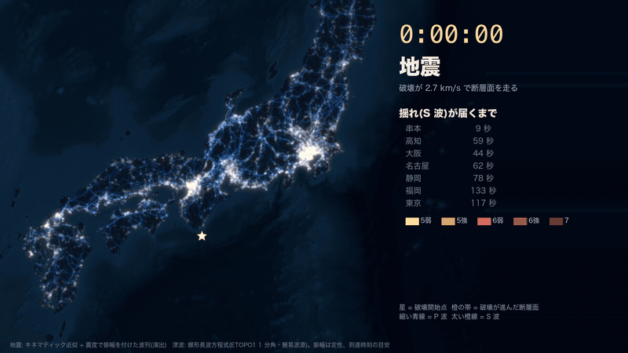
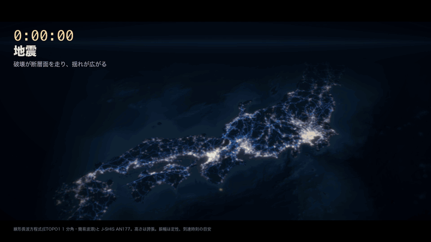
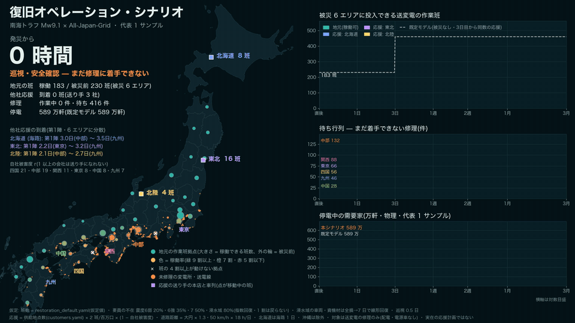
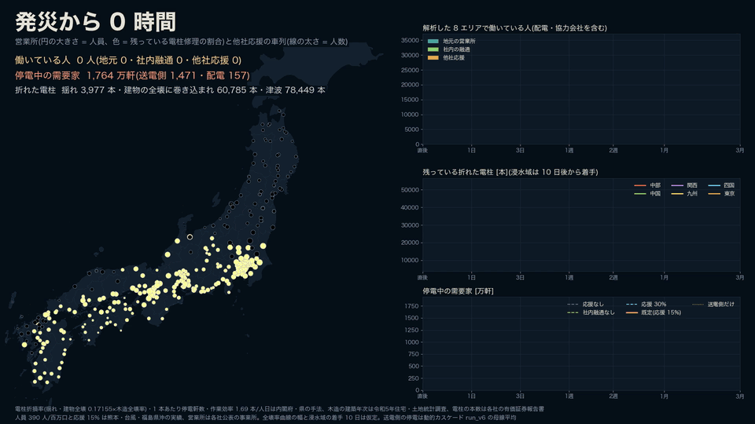
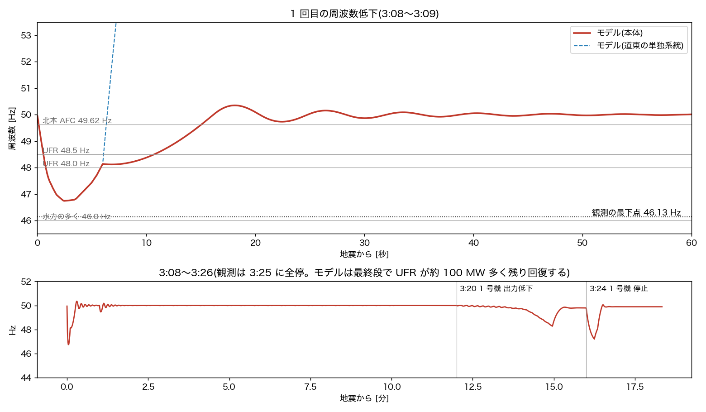
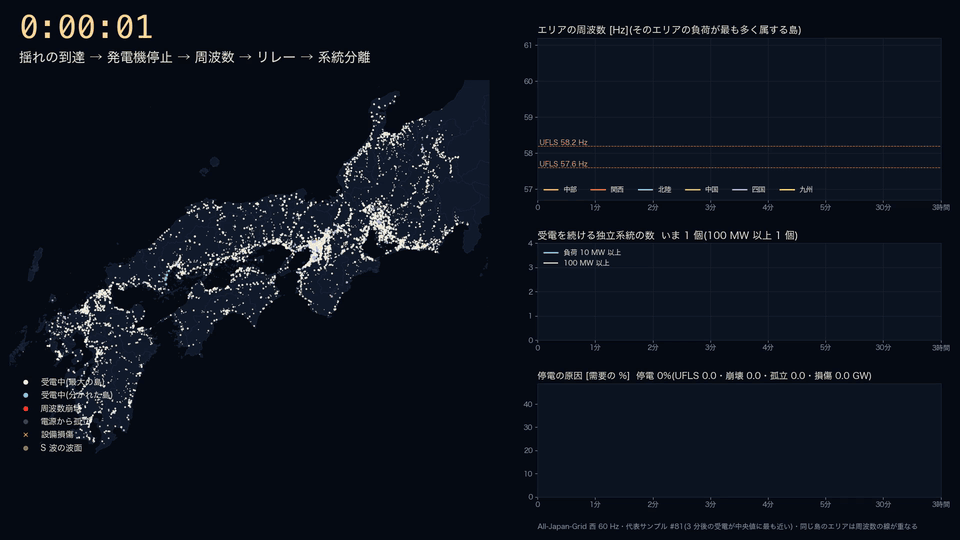
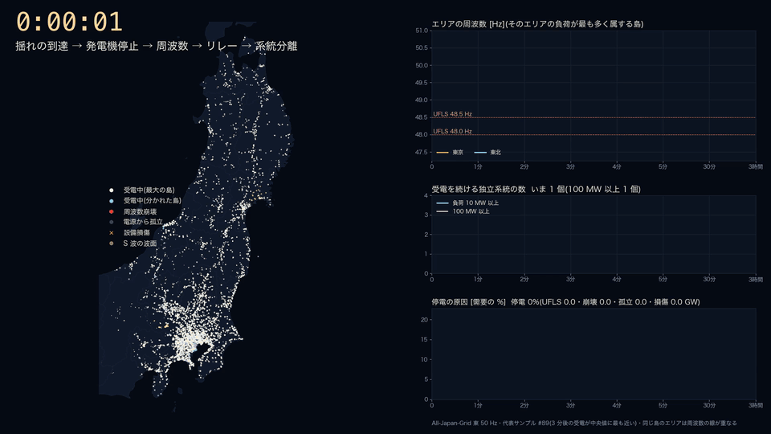
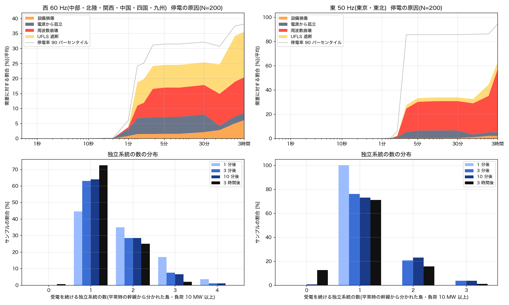

<!-- _class: table-slide -->
<!-- source: 内閣府(2012)強震断層モデル編 / J-SHIS AN177 / NOAA ETOPO1 / 国土数値情報 A40 -->

# 地震と津波の「到達」を 4 段階で見せ分ける

| 案 | 何を計算しているか | 見え方 | 弱点 |
|---|---|---|---|
| 現行 | 断層面からの距離の輪、海上最短経路の順番 | 衝撃波の輪と青い水面 | 物理の時間が無い |
| L1 物理の時計 | 破壊 2.7 km/s と S 波 3.82 km/s の到達時刻、√(gh) の走時 | 実時間の時計、震度の焼き付け、10 分ごとの到達線 | 津波の高さは出ない |
| L2 海面を解く | 線形長波方程式で海面の上下を解く | 赤青の海面、沿岸 4 点の水位変化 | 振幅は定性（1 分角・簡易波源） |
| L3 カメラ | L2 を斜め上から、太平洋から紀伊水道へ寄る | 高さの誇張、霞、寄り | 地図としては読みにくい |

破壊伝播速度 2.7 km/s と S 波速度 3.82 km/s は内閣府 2012 の強震断層モデル。破壊開始点は同資料の「紀伊半島の南」に合わせて仮置き。

---

<!-- _class: figure-full -->
<!-- source: All-Japan-Grid hazard/nankai make_cinematic.py -->

# 現行 — 輪が広がり、海岸が青く塗られる

<!-- note: 残す。衝撃波は断層面からの距離の輪、津波はトラフ軸から海上最短経路の順に A40 浸水域を塗る演出。時間の物差しが無い。 -->

---

<!-- _class: figure-full -->
<!-- source: 内閣府 2012 強震断層モデル / J-SHIS AN177 / ETOPO1 -->

# L1 物理の時計 — 秒と分で到達を刻む

<!-- note: 破壊が紀伊半島の南から 2.7 km/s で断層面を走り、P 波（細い青）と S 波（太い橙）が実時間で広がる。S 波が通った所に J-SHIS の震度が焼き付き、灯りが揺れてから消える。津波は速度 √(gh) の最短走時で 10 分ごとの到達線を刻み、A40 浸水域は到達時刻に満ちる。右の表は沿岸点の到達時刻。 -->

---

<!-- _class: figure-full -->
<!-- source: 線形長波方程式（ETOPO1 1 分角・簡易波源） -->

# L2 海面を解く — 赤は上がる海、青は下がる海

<!-- note: 津波伝播図の慣例どおり、上昇を暖色、下降を寒色で描く。10 cm 未満は描かない。右下は串本・高知・大阪港・名古屋港の水位変化の形で、振幅は定性。大阪湾は紀伊水道を回り込むので 2 時間近く遅れる。 -->

---

<!-- _class: figure-full -->
<!-- source: 線形長波方程式（ETOPO1 1 分角・簡易波源）/ J-SHIS AN177 -->

# L3 カメラ — 太平洋から紀伊水道へ寄る

<!-- note: L2 と同じ物理を斜め上からの眺めにした。海面と陸の高さは誇張。印象は強いが、地名や距離は読みにくいので、発表の冒頭か締めの 1 枚向き。 -->

---

<!-- _class: table-slide -->
<!-- source: 本計算 arrival_physics.py / 内閣府 2025 市町村別一覧表 ケース②「紀伊半島沖」津波高 1 m 最短到達時間 -->

# 遠い湾は内閣府と合い、近い沿岸は数分遅い

| 地点 | 浅水方程式 | 走時 | 内閣府② | 地点 | 浅水方程式 | 走時 | 内閣府② |
|---|---|---|---|---|---|---|---|
| 串本 | 8 | 7 | 2 | 徳島 | 47 | 43 | 43 |
| 尾鷲 | 13 | 14 | 4 | 和歌山 | 49 | 45 | 46 |
| 土佐清水 | 14 | 13 | 5 | 大分 | 71 | 61 | 47 |
| 高知 | 19 | 20 | 10 | 横浜 | 65 | 52 | 75 |
| 宮崎 | 24 | 24 | 19 | 神戸港 | 100 | 88 | 93 |
| 鳥羽 | 29 | 28 | 10 | 名古屋港 | 103 | 89 | 95 |
| 浜松 | 8 | 8 | 7 | 大阪港 | 116 | 101 | 125 |

単位は分。浅水方程式は水位 0.3 m 超え、走時は √(gh) の最短経路、内閣府は市町村の海岸線全体での最短値（高さ 1 m）。

<!-- note: 波源の真上の御前崎・室戸岬は 0 分（内閣府 6 分・4 分）。近い沿岸が遅いのは 1 分角の格子と簡易波源のため。隆起の中心を深くする案も試したが、近地は 0 分に張り付き、湾の真上まで隆起して遠地の誤差が平均 9 分から 11〜25 分に悪化したので採らなかった（負の結果）。 -->

---

<!-- _class: figure-full -->
<!-- source: hazard/nankai/config/restoration_ops_scenario.yaml（仮定を明記）/ run_v1 代表 1 サンプル -->

# 復旧は「人も被災し、応援は遅れて着く」で 1 か月後から差が開く

<!-- note: 試作。被災 6 エリアの地元の送変電作業班は被災前 230 班、発災 3 時間後は 184 班。震度と浸水で人と車両が欠け、日を追って戻る。他社応援は自社被害が小さい北海道・東北・北陸の 3 社だけが送れて計 29 班、第 1 陣の到着は 2.1〜3.5 日（北海道は海路）。東京は自社の被害が大きく送り手になれない。停電軒数は代表 1 サンプルで、既定モデル（被災なし・3 日目から同数の応援）と比べて 30 日で 424 万対 411 万、90 日で 147 万対 119 万。序盤は系統崩壊と長い修理が主因なので差が小さい。班数・不在率・移動速度はすべて仮定で、実在の応援計画ではない。 -->

---

<!-- _class: figure-full -->
<!-- source: make_restoration_workforce.py / run_v6(動的カスケード)/ 令和5年住宅・土地統計調査 第6-3表 / 内閣府 首都直下 手法 資料3 / 各社 有価証券報告書 FY2025 -->

# 折れる電柱の 4 割は、倒れた家に巻き込まれる

<!-- note: 左は営業所(円の大きさが人員、色が残っている電柱修理の割合)と他社応援の車列。右上は働いている人の内訳、右中は会社別の残っている折れた電柱、右下は停電中の需要家を応援の条件で比べたもの。折れた電柱は揺れ 3,977 本、建物の全壊に巻き込まれ 60,785 本、津波 78,449 本。7 日後に働く人は 33,282 人で、地元 20,447 人、社内融通 11,179 人、他社応援 1,656 人。停電中は 716 万軒で、送電側が 463 万軒、配電が 91 万軒。営業所の円は各社が公表する事業所の位置。 -->

---

<!-- _class: sections -->

# 営業所の人が被災し、社内で回し、応援が着く

  電柱｜何本折れるか
  揺れの折損率(震度 7 で 0.8%)に、建物全壊の巻き込み ==0.17155 × 木造全壊率== を足す。木造全壊率は市区町村の建築年次と全壊率曲線から。浸水域は 16.3%。電柱の本数は各社の支持物数から。

  人｜誰が直すか
  各社公表の 350 事業所に 32,799 人(100 万口あたり 390 人・熊本や台風の実績の中央値)。震度と浸水で欠け、1 日で揃う。軽い事業所から半数を重い事業所へ回す。

  応援｜いつ、どこから着くか
  自社の被害が小さい北海道・東北・北陸・九州・東京が動員可能数の 15% を送る。本店から陸路で、北海道は海路で 1 日足す。第 1 陣は 1.5〜1.75 日で着く。

<!-- note: 応援の送り手は災害時連携計画(送配電網協議会)のプッシュ型応援の前提条件「応援事業者の供給区域において設備被害がないまたは、被害予想がされない場合」に合わせ、自社の被害度 r(残作業 / 動員可能数の 7 日分)が 0.25 未満の会社に限った。東京は電柱が需要家あたり 0.19 本と少なく r = 0.17 で送り手になる。前の版(一律 0.25 本・300 人/百万口)では r = 0.29 で外れ、応援は 776 人だった。送り手の判定は仮定の置き方で入れ替わるので、応援の人数は幅で読む。 -->

---

<!-- _class: table-slide -->
<!-- source: make_restoration_workforce.py の感度計算(同じ乱数)/ 内閣府 南海トラフ巨大地震 最大クラス地震における被害想定について【定量的な被害量】令和7年3月 PDF p.17 -->

# 効くのは他社応援より、社内の融通

| 条件 | 建物全壊で折れる電柱 | 配電の停電 1 日後 | 7 日後 | 14 日後 | 他社応援 |
|---|---|---|---|---|---|
| 建物全壊を入れない | 0 本 | 88 万軒 | 86 万軒 | 2 万軒 | 2,085 人 |
| 既定(曲線の幅 σ = 0.4) | 60,785 本 | 153 万軒 | 91 万軒 | 2 万軒 | 1,656 人 |
| σ = 0.3 | 42,928 本 | 134 万軒 | 89 万軒 | 2 万軒 | 1,821 人 |
| σ = 0.6 | 105,696 本 | 200 万軒 | 101 万軒 | 5 万軒 | 950 人 |
| 全建物に対する全壊率と読む | 37,202 本 | 128 万軒 | 87 万軒 | 1 万軒 | 1,824 人 |
| 既定・応援なし | 60,785 本 | 153 万軒 | 93 万軒 | 8 万軒 | 0 人 |
| 既定・社内の融通なし | 60,785 本 | 153 万軒 | 94 万軒 | ==32 万軒== | 1,656 人 |

モデルが置く木造全壊は約 108 万戸。内閣府 2025 の揺れによる全壊は基本ケース約 61 万棟、陸側ケース約 128 万棟で、桁は合う(戸と棟、地震動の想定が違う)。

<!-- note: 応援 30% にしても 14 日後は 0 万軒で、既定の 2 万軒と大差ない。浸水域の電柱 7.8 万本は水が引いて道路が開く 10 日後まで着手できず、そこで復旧の速さが決まる。応援の人数より、着手できる時期と社内の人の回し方が効く。 -->

---

<!-- _class: figure -->
<!-- source: OCCTO 北海道胆振東部地震 大規模停電 検証委員会 最終報告(本文)/ hazard/nankai/scripts/hindcast_hokkaido2018.py -->

# 北海道 2018 の 1 回目は再現、最後の全停は再現できない

図. 最下点は観測 46.13 Hz に対しモデル 46.74 Hz、UFR 遮断は 1,300 MW に対し 1,259 MW。3:25 の全停は、残った UFR が約 100 MW 多く回復してしまう。

<!-- note: 事象の量とリレーの整定は OCCTO 最終報告の値。否定された仮定は、火力 47.0 Hz・2 秒の解列、UFR 時限の等間隔、道東の分離 3 秒、島を分けるたびに UFLS のタイマーを 0 に戻す実装。最終段の全停は約 100 MW の差で分かれ、このモデルの分解能を超える。 -->

---

<!-- _class: figure-full -->
<!-- source: All-Japan-Grid 西 60 Hz・run_v6 代表サンプル #79(3 分後の受電が中央値に最も近い) -->

# 揺れが届き、周波数が落ち、リレーが開き、系統が分かれる

<!-- note: 左は母線の地図。受電中は島ごとに色、赤が周波数崩壊、灰が電源から孤立、橙の×が設備損傷。右上はエリアの周波数と UFLS の段、右中は受電を続ける独立系統の数、右下は停電の原因。この例では約 1 分で四国が周波数崩壊し、本体は 57.6 Hz の段の手前まで下がって UFLS で戻る。2 分の過負荷チェックで線路が切れ、58.2 Hz 付近まで再び下がる。3 分後の停電は需要の 33%。 -->

---

<!-- _class: figure-full -->
<!-- source: All-Japan-Grid 東 50 Hz・run_v6 代表サンプル #89(3 分後の受電が中央値に最も近い) -->

# 東は 48.5 Hz で踏みとどまり、1 つの系統のまま

<!-- note: 東京電力の空容量一覧で変圧器の容量を直した後の東。2 分で東京湾岸の火力が揺れで止まり、周波数は UFLS の 1 段目 48.5 Hz まで下がって戻る。UFLS 2.8 GW と孤立 1.5 GW で 3 分後の停電は需要の 9%。系統は 1 つのまま。 -->

---

<!-- _class: figure -->
<!-- source: hazard/nankai/output/run_v6(N=200×西・東)/ summarize_dynamic.py -->

# 西は 10 分で 2 割強のサンプルが 2 つ以上に分かれる

図. 上: 停電の原因(需要に対する平均)。下: 受電を続ける独立系統の数。西は 10 分後に 2 個以上が 23%(過負荷リレーなしで 18%)、最大 3 個。東は 9%。

---

<!-- _class: sections -->

# 東の 5 GW の潮流は、3 つの誤りが重なっていた

ローカル系統を網のまま解いていた

154 kV 以下は実運用では放射状(北陸電力送配電 設備形成ルール・九州電力 系統運用ルール)。常時開路にし、潮流は主幹系統だけで解く縮約に変えた。

UFLS の時限が等間隔のままだった

北海道 2018 で否定した設定がモンテカルロに残っていた。対数間隔に直し、2022 福島県沖地震の簡易ヒンドキャストで全停しないことを確認。

不足を慣性比で配っていた

2 分後の潮流はガバナの上げ代で決まる。鹿島の火力に出せない約 1.15 GW を上乗せしていた。

<!-- note: 最初に試した「最も近い給電点で区間を切るだけ」の放射状化は、降圧点が少ないため潮流が集中して過負荷が 271 本から 357 本に増えた(負の結果)。潮流を主幹系統に縮約して解決した。 -->

---

---

<!-- _class: sections -->

# 変圧器の欠け、停止時刻の誤り、東京湾の浸水

  データの欠け｜東の変圧器が 1 バンク分
  東京電力の空容量一覧の台数と設備容量で 275 kV 以上の 62 本を置き換えた。500/275 kV は照合できた 19 変電所で ==18.1 GW → 68.7 GW==。鹿島の 275 kV 接続は台帳どおりで欠けではなかった。

  実装の誤り｜揺れで止まる設備を津波まで待たせた
  浸水もある設備は原因が津波に上書きされ、止まる時刻が津波の到達まで遅れていた。東で 1 サンプル平均 10 基・4.2 GW。早い方の時刻で止めるよう直し、西の 10 分後の受電率は 76% から 66% に下がった。

  データの読み｜東京湾の浸水の波源
  A40 の神奈川県の東京湾は県独自の慶長型地震が最大クラスで、南海トラフだけの浸水より大きい可能性がある。湾奥の津波被害を外すと、東の 3 時間後の受電率は 69% から 78% に上がる。

<!-- note: 出典は国土交通省 社会資本整備審議会 河川分科会 第52回 資料2-5「神奈川県沿岸における津波浸水想定」PDF p.14-16。神奈川県は南海トラフ最大クラスでも「相模湾から東京湾内にかけて、2～9メートルの水位」とするので、湾奥を 0 にするのは下限側の感度。台帳の生値は公開しない(git 管理外の補助 DB から読む)。 -->

---

<!-- _class: table-slide -->
<!-- source: run_v6 / run_v6_nool / run_v6_notb / run_v6_notrafo / run_v4_red(同じ乱数・N=200) -->

# 東の崩壊を振らせたのは変圧器の容量の欠け

| 条件 | 島 | 10 分 受電率 | ほぼ全域崩壊 | 10 分で 2 つ以上に分割 |
|---|---|---|---|---|
| 既定(run_v6) | 西 | 66.4% | 3% | 23% |
| 過負荷リレーなし | 西 | 70.3% | 2% | 18% |
| 既定(run_v6) | 東 | 87.0% | 10% | 9% |
| 過負荷リレーなし | 東 | 89.7% | 6% | 8% |
| 東京湾の津波被害なし | 東 | 87.0% | 8% | 9% |
| 変圧器台帳なし | 東 | 61.7% | ==32%== | 26% |
| 旧 run_v4_red | 東 | 66.2% | 34% | 26% |

ほぼ全域崩壊は 3 時間後に需要の 8 割超が崩壊したサンプル。旧 run_v4_red は台帳なし・停止時刻の誤りあり。東の 3 時間後の受電率は東京湾の浸水の読み方で 69〜78%。

