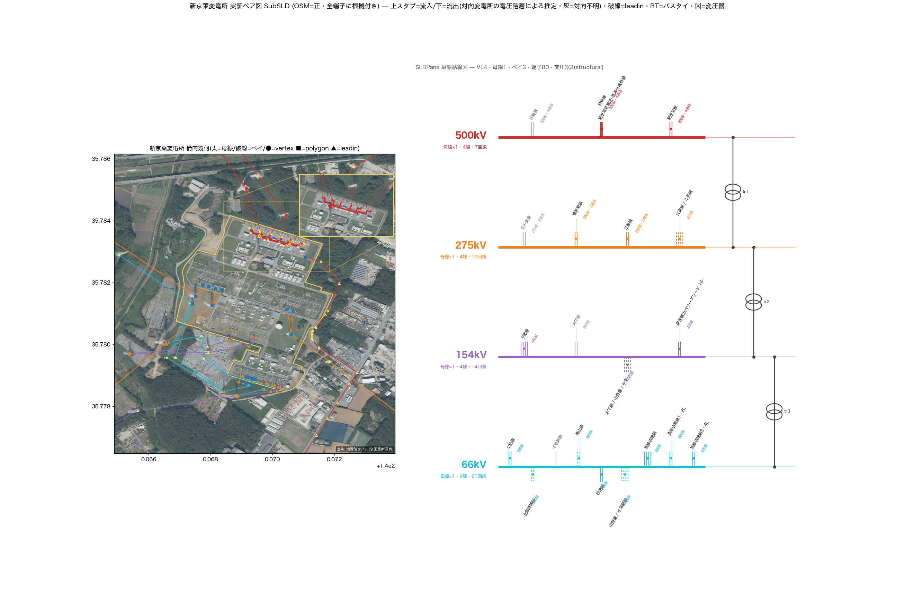
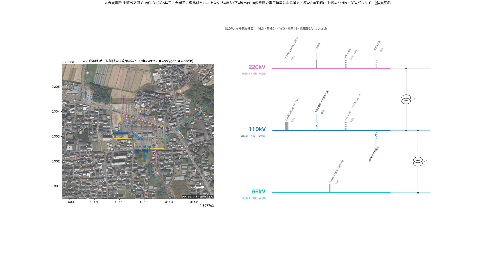

<!-- _class: title -->
# SubSLD法
## 実証ペア図法 — 変電所構成の全国機械生成
All-Japan-Grid / 2026-08-26

---

<!-- _class: agenda -->
# 本日の内容

1. 背景と問い
2. 3段パイプライン
3. 実証ペア図の読み方
4. 実例
5. 不変条件と限界
6. 全所展開

---

<!-- _class: rq -->
# 問い

全国6,956変電所の内部構成（電圧階級・回線・導体・変換）を、公開データだけから機械生成できるか

出発点はオーナーが嶺南変電所で行った手作業実証。その全国機械化がSubSLD法である

---

<!-- _class: quote -->
# 設計方針（2026-07-02）

線は基本変電所に入る。変電所で電圧階級・タップ・回線・導体を接続する。そこから負荷に分配供給されるからである。

オーナー方針 — GridStitch P2 の憲法

---

<!-- _class: zone-flow -->
# 3段パイプライン

1. 抽出

GridStitch P2。OSM実証拠からnode-breaker構造DB。全国4秒

2. 集約

プロパティ層。回線数・導体数を変電所単位に集約

3. 描画

SubSLD。GeoPane×SLDPaneの実証ペア図PNG

---

<!-- _class: cols-2 -->
# 実証ペア図の読み方

<h3>左: GeoPane（構内幾何）</h3>

- 地理院写真の下敷き＋出典
- 敷地=黄縁・母線=電圧色太線
- 端子根拠 ●vertex ■polygon ▲leadin
- 鉄塔マーカー・ズームインセット

<h3>右: SLDPane（単線結線図）</h3>

- 母線=電圧階級別の太い水平線
- 平行ストローク本数=回線数
- 上=流入・下=流出（推定・矢印）
- 二重円=変圧器・BT=バスタイ
- 変圧器なし階級は「スルー」明記

---

<!-- _class: diagram -->
# 実例: 新京葉変電所（500/275/154/66kV）

4階級・80端子・変圧器3。ズームインセットが500kV母線クラスタを自動拡大

---

<!-- _class: diagram -->
# 実例: 人吉変電所（220/110/66kV・九州）

地域を問わず同一パイプラインで生成される（10地域で検証済み）

---

<!-- _class: kpi -->
# 規模と被覆

6,956対象変電所

68%回線数の証拠被覆

約6秒1所の描画時間

---

<!-- _class: summary -->
# 不変条件

- **OSM=正・捏造ゼロ** — 実証拠のみで接続。無タグ値は埋めない
- **全端子に根拠** — vertex-shared / polygon / leadin / name-evidence
- **推定は推定と明記** — 流向（入/出）は対向の電圧階層による推定
- **決定的に再生成可能** — 全生成物はOSM＋構造DBから再現できる

---

<!-- _class: pros-cons -->
# 到達点と限界

<h3>到達点</h3>

- 全国どの変電所も同品質で図化
- 回線数・導体数がプロパティ化
- 衛星＋鉄塔で目視検証が可能

<h3>限界（issue #49）</h3>

- 母線way未記載が全国86%
- 対向欠測の線は流向不明（灰）
- 導体数タグ被覆は13%

---

<!-- _class: steps -->
# 全所展開

1バッチ生成器で全6,956所を描画（実行中・再開可能）

2検索付き全国ギャラリーHTMLで閲覧

3editor統合 — 地図クリックでその場表示

4母線なし所の調査とOSM貢献ループ（issue #49）

---

<!-- _class: takeaway -->
# キーメッセージ

変電所の中身は、公開データと根拠付き抽出だけで全国一括「見える化」できる

---

<!-- _class: end -->
# ご清聴ありがとうございました
docs/SUBSLD_METHOD.md / All-Japan-Grid
