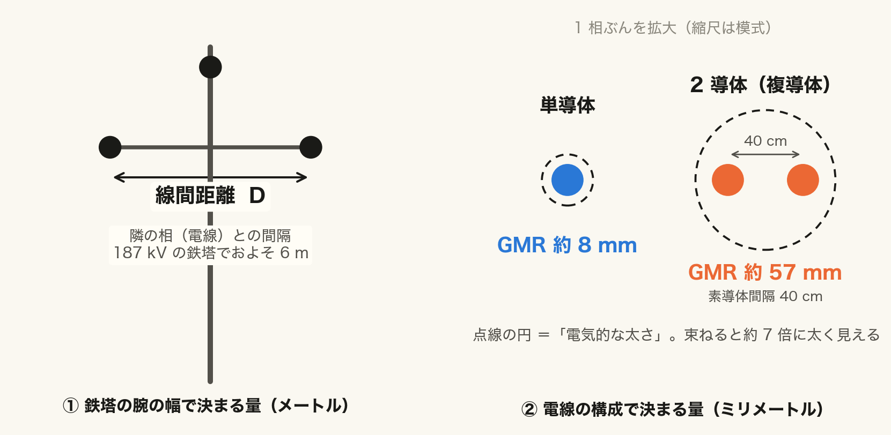
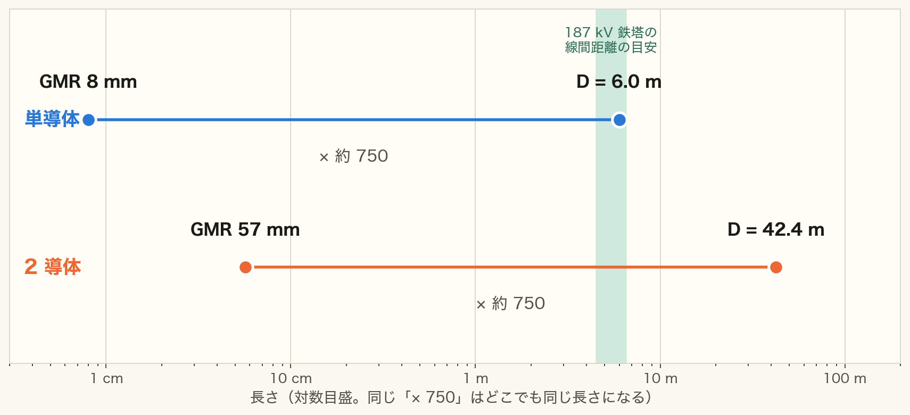
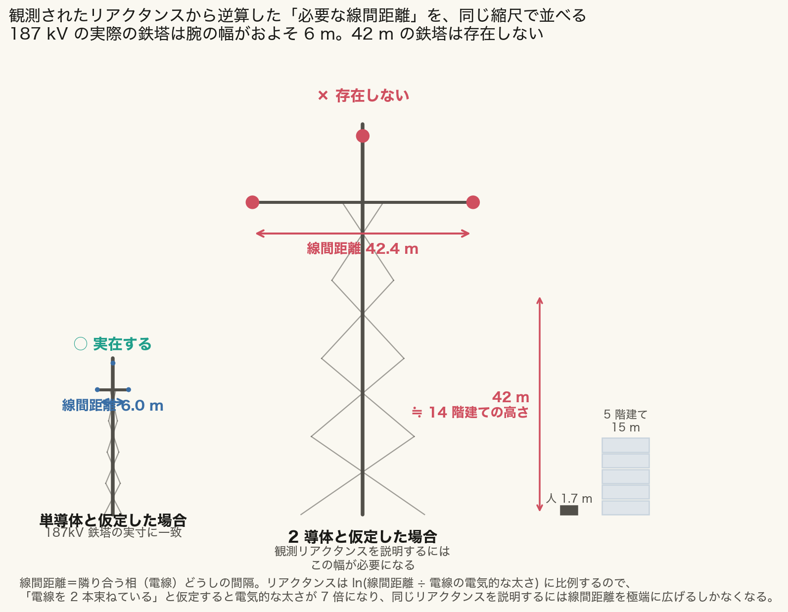
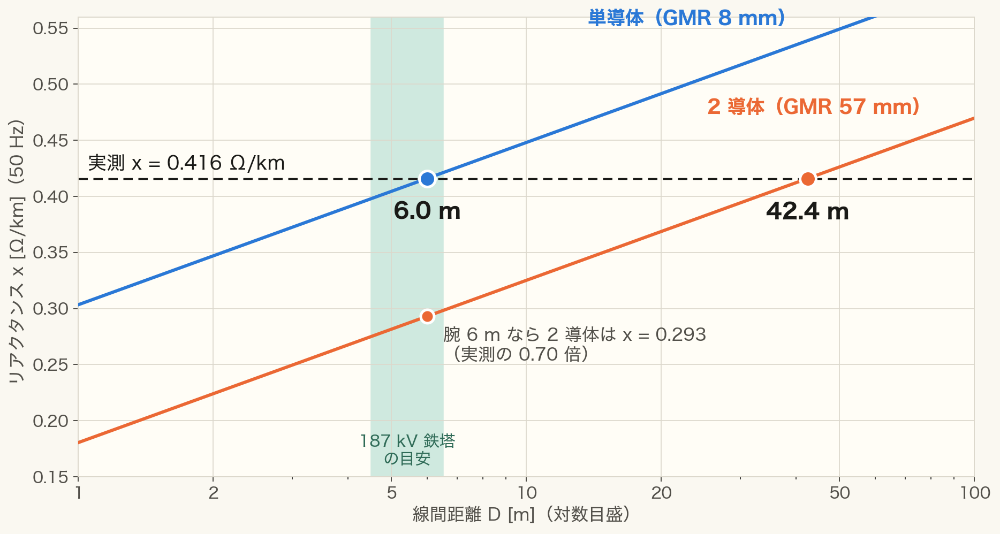
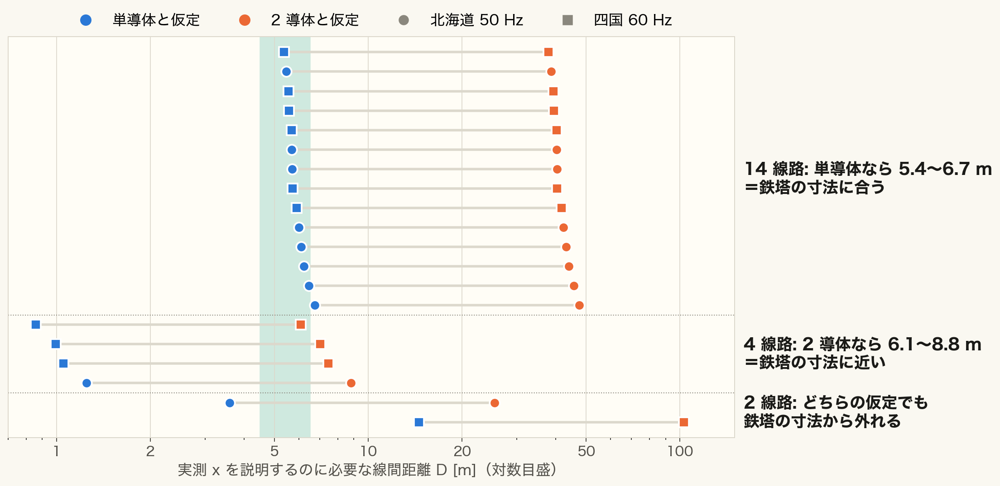

<!-- _class: title -->

# 「42 m」をほどく
## 187 kV は本当に 2 導体（複導体）か

All-Japan-Grid インピーダンス較正の補足

2026-09-17 ｜ 元スライド: impedance_calibration_2026-08-20 の 9 枚目

<!-- note: 元のデッキの「2 導体と仮定すると鉄塔に 42 m の線間距離が必要」を、式の意味から順に読めるように分解した補足。図は scripts/plot_why42m.py で再生成できる。 -->

---

<!-- _class: rq -->

# 確かめたいこと

設定ファイルは 187 kV 線路を「ACSR 330 mm² の 2 導体」と仮定している。実測のリアクタンスは設定の 1.19 倍。この仮定は正しいか？

— 2 導体が正しいなら鉄塔はどんな寸法のはずかを逆算し、実物と比べる

---

<!-- _class: definition -->

# ここでいう「導体数」

導体数（導体方式）＝ 1 相あたりの素導体の条数

ACSR 330 mm² のより線 1 条だけで 1 相を作れば**単導体**。2 条をスペーサで約 40 cm 離して並べれば **2 導体（複導体）**。複導体は電圧の高い線で使われ、電気的に「太い 1 条」として働く。

より線の素線数とは別（ACSR は 1 条でより線）。回線数とも別（2 回線はモデルでは par で扱う）。

---

<!-- _class: figure -->

# 部品は 2 つだけ

左: 鉄塔の腕で決まる線間距離 D（メートル）。右: 1 相ぶんの導体の電気的な太さ GMR（ミリメートル）。

- 2 導体にすると GMR は 8 mm → 57 mm（**約 7 倍**）になる
- 太く見えるぶんリアクタンスが下がる — 高い電圧の線が複導体を使う理由

<!-- note: GMR は幾何平均半径。ここでは断面積 330 mm² から等価円の半径を出し 0.78 倍した近似（約 8.0 mm）。2 導体は √(GMR×素導体間隔 400 mm) で約 57 mm。 -->

---

<!-- _class: equation -->

# リアクタンスは「比」で決まる

$$x = 2\pi f \cdot 2\times10^{-7} \ln\frac{D}{\mathrm{GMR}}$$

  $x$
  作用リアクタンス [Ω/m]
  $f$
  周波数（北海道 50 Hz、四国 60 Hz）
  $D$
  線間距離（鉄塔の腕で決まる）
  $\mathrm{GMR}$
  導体の電気的な太さ（導体数と素導体間隔で決まる）

D と GMR は割り算の形でしか入らない。だから実測 x から分かるのは「D ÷ GMR」という比だけ。

---

<!-- _class: big-number -->
<!-- source: 様式5 公表インピーダンスを実線形長で割った 187 kV の中央値（n=31 線路・介入 #46） -->

# 実測 x が決める比は約 750

  750 倍
  線間距離 D ÷ 導体の電気的な太さ GMR
  x = 0.416 Ω/km（50 Hz）→ ln(D/GMR) = 0.416 ÷ 0.0628 = 6.62 → e の 6.62 乗 ≒ 750

<!-- note: 0.0628 は 2π×50×2×10⁻⁷ を Ω/km に直した値。ここで決まったのは比だけで、D も GMR もまだ決まっていない。次のスライドで GMR を仮定ごとに入れる。 -->

---

<!-- _class: figure -->

# 太さ 7 倍なら、腕も 7 倍

どちらの線も「× 約 750」。対数目盛なので同じ長さに見える。緑の帯は 187 kV 鉄塔の線間距離の目安。

- **単導体**: 8 mm × 750 ＝ **6.0 m** → 鉄塔に収まる
- **2 導体**: 57 mm × 750 ＝ **42 m** → 収まらない。これが「42 m」の正体

---

<!-- _class: figure-full -->

# 42 m は 14 階建ての高さ

同じ縮尺で並べた。2 導体と仮定すると、187 kV 鉄塔の約 7 倍の腕が必要になる。

---

<!-- _class: figure-full -->

# 腕 6 m では、2 導体は実測に届かない

青・橙は導体数ごとの x、破線が実測。腕 6 m なら 2 導体は実測の 0.70 倍。届くのは 42 m の点だけ。

<!-- note: 逆向きの読み方。鉄塔の寸法を先に決めて x を予測すると、単導体は実測と一致し、2 導体は 3 割足りない。線間距離を広げても x は対数でしか増えないので、6 m から少し広げた程度では届かない。 -->

---

<!-- _class: figure-full -->

# 線路ごとに見ても、大半は単導体の寸法

1 行が 1 線路（北海道 10・四国 10、線名は非表示）。青は単導体、橙は 2 導体と仮定したときの必要な線間距離。

<!-- note: 線路ごとの x は公表インピーダンス ÷ モデルの実線形長。周波数は会社ごと（北海道 50 Hz・四国 60 Hz）に分けて逆算した。14 線路は単導体なら 5.4〜6.7 m、2 導体だと 38〜48 m。4 線路は逆に 2 導体なら 6.1〜8.8 m で、単導体だと 1 m 前後＝鉄塔として狭すぎる＝実際に 2 導体の線路である可能性。残り 2 線路はどちらの仮定でも外れる。 -->

---

<!-- _class: table-slide -->

# 周波数を分けても結論は同じ

## 50 Hz と 60 Hz で別々に逆算し直した

| 対象 | 周波数 | 線路数 | x の中央値 | 単導体なら D | 2 導体なら D |
|---|:---:|:---:|:---:|:---:|:---:|
| 北海道 | 50 Hz | 10 | 0.414 Ω/km | 5.8 m | 41 m |
| 四国 | 60 Hz | 10 | 0.493 Ω/km | 5.6 m | 39 m |
| 元の計算（全線 50 Hz 扱い） | 50 Hz | 31 | 0.416 Ω/km | 6.0 m | 42 m |

四国の x が高いのは 60 Hz だから。周波数で割り戻すと、2 社は同じ寸法を指す。

元の計算は四国の線路も 50 Hz として扱っていた。分けると 42 m → 39〜41 m になるが、6 m との桁の差は変わらない。

---

<!-- _class: pros-cons -->

# 言えること・まだ言えないこと

<li>「187 kV は全線 2 導体」は実測と桁で合わない（約 40 m 対 6 m）</li>
<li>周波数の違う 2 社が、別々に同じ寸法を指す</li>
<li>抵抗も同じ向きにずれている（設定の 1.49 倍）</li>

<li>どの線路が 2 導体かは一次資料で確認が要る</li>
<li>抵抗 1.49 倍は「単導体なら 2 倍」に届かない</li>
<li>鉄塔寸法 4.5〜6.5 m は想定値で出典未確認</li>
<li>220・500・66 kV は同じ方法で説明できない</li>

<!-- note: GMR は断面積からの近似（0.78×半径）で、実際の ACSR の鋼心構造は反映していない。ただし単導体と 2 導体の差は約 7 倍あり、この近似の粗さでは結論は覆らない。抵抗の設定値 r=0.038 は単導体理論 0.0918 の 0.41 倍で、それ自体が説明できない値（元デッキ 10 枚目）。 -->

---

<!-- _class: takeaway -->

# 持ち帰ってほしいこと

実測が決めるのは「線間距離 ÷ 導体の太さ」だけ。2 導体で太さが 7 倍なら腕も 7 倍の 42 m が要るので、「全線 2 導体」は捨てられる

<li>単導体なら 6.0 m で、187 kV 鉄塔の寸法にそのまま合う</li>
<li>線路ごとでも 20 線路中 14 線路が単導体の寸法。4 線路は 2 導体の可能性</li>
<li>次の一手: 線路ごとの導体方式を一次資料で集める（issue #56）</li>

<!-- note: 東京エリアには最大 10 導体の線路があるという情報もある（未確認）。電圧階級で一律の導体方式という仮定そのものを見直す課題として issue #56 に登録した。 -->
