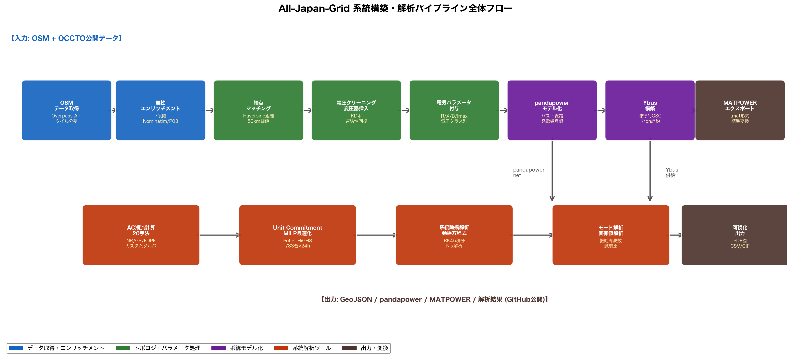
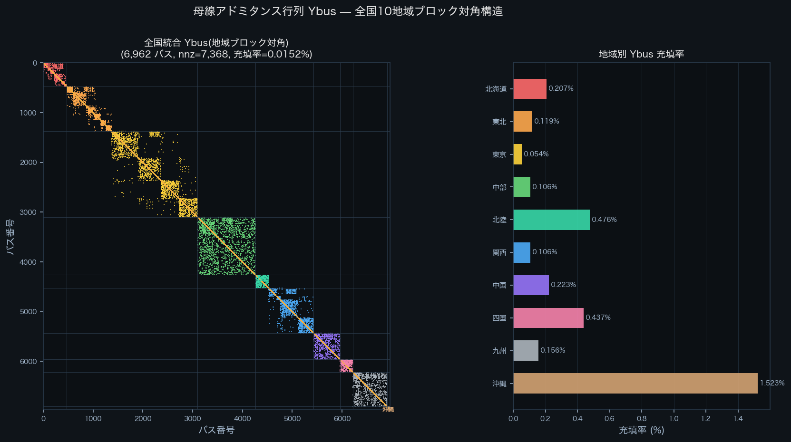
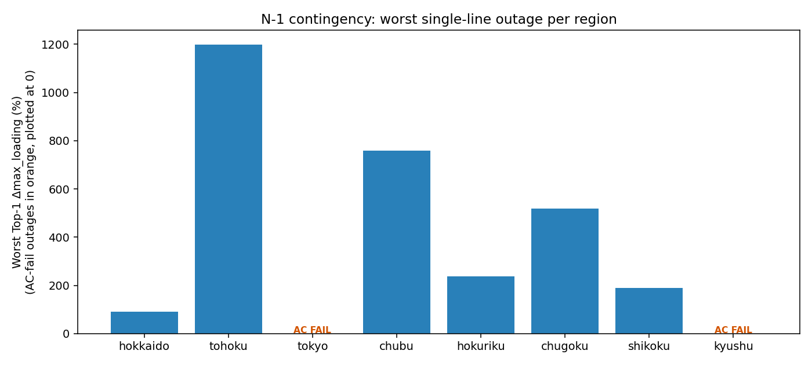
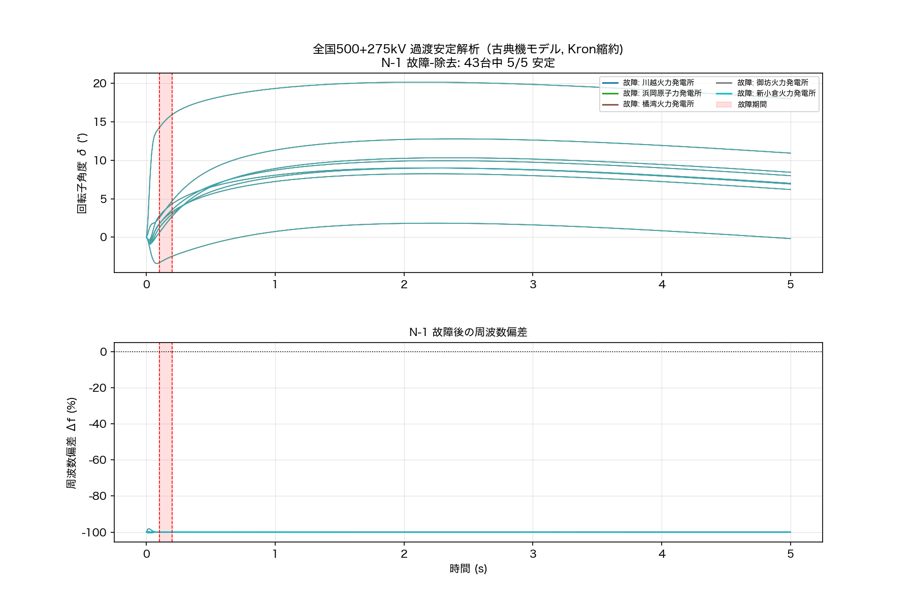

<!-- _class: title -->

# All-Japan-Grid
## — OpenStreetMap から作る日本全国送電網モデル —

公開系統モデルなき日本で、潮流計算を再現可能にする

重信 颯人 $^{1}$, 髙橋 明子 $^{2}$, 伊藤 雅一 $^{1}$

$^{1}$ 福井大学 工学部 電気電子情報工学科 &emsp; $^{2}$ 福井大学 CN推進本部

2026年6月 &ensp;|&ensp; v1.1.0 release

<!-- note: 15分プレゼン。最初の5分で「潮流計算とは」を平易に説明し、聴衆を引き込む。 -->

---

<!-- _class: statement -->

「地図はあるのに、電気的なモデルは存在しない」
— これが日本の系統研究の出発点。

<!-- note: 1枚で本研究の核を提示。詳細は次のスライド以降。 -->

---

<!-- _class: agenda -->

# 本日の流れ

1. **そもそも潮流計算とは？** — 電気を流す数式の世界
2. **日本の現状** — なぜ研究者はモデルを持てないのか
3. **提案：OSM から系統を作る** — All-Japan-Grid
4. **主要な結果** — トポロジ・潮流・N-1・Unit Commitment
5. **発見と限界**
6. **まとめと今後**

---

<!-- _class: divider -->

# Part 1
## そもそも潮流計算とは？

---

<!-- _class: definition -->

# 潮流計算 (Power Flow) とは

電力系統の "いま" を解く計算

送電網の各**母線（バス）** の電圧と、各**送電線**を流れる電力を、
発電・需要・接続から **同時に** 求める。

<li>停電・過負荷・電圧崩壊を未然に予測する基礎</li>
<li>あらゆる系統解析（OPF・UC・安定度）の土台</li>
<li>非線形連立方程式 → 反復法（Newton-Raphson 等）で解く</li>

---

<!-- _class: equation -->

# 潮流方程式（コア）

$$S_i = V_i \sum_{k=1}^{n} Y_{ik}^{*} V_k^{*} \quad= P_i + j Q_i$$

  $S_i$
  母線 $i$ の複素電力（皮相電力）
  $V_i, V_k$
  各母線の複素電圧（振幅・位相）
  $Y_{ik}$
  $\mathbf{Y}_{\mathrm{bus}}$ の要素（系統の電気的接続情報）
  $P_i, Q_i$
  有効電力 / 無効電力

<!-- note: ここで「電気の流れは電圧と接続から決まる」というメッセージを口頭で補足。 -->

---

<!-- _class: cols-2 -->

# AC 潮流 vs DC 潮流

## AC（交流）潮流

- **非線形**な方程式系を解く
- 電圧の振幅 $|V|$・位相 $\theta$ 両方求める
- **収束**が必要（Newton-Raphson）
- 電圧崩壊・無効電力・損失を扱える
- 計算は重い

## DC（直流近似）潮流

- **線形**化（$\sin\theta \approx \theta$ ほか）
- 位相 $\theta$ のみ・電圧は 1 pu 仮定
- 必ず解ける・桁違いに高速
- 潮流の "方向" は分かる
- 電圧・損失は出ない

---

<!-- _class: divider -->

# Part 2
## なぜ日本では困るのか

---

<!-- _class: statement -->

日本では、バスレベルの公開系統モデルが
**存在しない**。

<!-- note: ここで重く区切る。 -->

---

<!-- _class: cols-2 -->

# 海外 vs 日本

## 海外 — モデルがある

- **米国 FERC Form 715** — 送電網全データを公開
- **欧州 ENTSO-E Transparency** — 連系・潮流・需要
- **MATPOWER / PGLIB** — 検証済みベンチマーク
- 研究者・新規参入者が **即座に解析可能**

## 日本 — モデルがない

- 各電力会社のインピーダンス・タップ比は **非公開**
- OCCTO は容量・需要は公開、**バスレベル無し**
- WAMS / PMU データも研究公開なし
- 独立した再現性ある研究は **事実上不可能**

---

<!-- _class: rq -->

# Research Question

非公開の系統データに頼らず、公開地理情報だけから
日本全国の "解析可能な" 送電網モデルを構築できるか？

— OpenStreetMap から自動構築するパイプラインの開発

---

<!-- _class: divider -->

# Part 3
## 提案：All-Japan-Grid

---

<!-- _class: diagram -->

# 7段階の自動パイプライン

Fig. OSM取得 → 属性補完 → トポロジ再構築 → 電気パラメータ付与 → $\mathbf{Y}_{\mathrm{bus}}$ 構築 → 潮流解析 → 可視化。

---

<!-- _class: kpi -->

# データセット規模

  7,962
  変電所

  40,077
  送電線

  19,138
  発電所 (274 GW)

  10
  地域 (50/60 Hz)

---

<!-- _class: big-number -->

# 属性補完の効果

  87%
  欠損属性の削減
  107,383 件 → 約 14,000 件（7段階エンリッチ後）

---

<!-- _class: before-after -->

# トポロジ再構築：旧法 → 新法

  Before（旧：最近傍drop法）
  線端点を最近傍変電所にマッチ。50km 以内に無い線は破棄。実OSMルートを無視した直線結線で、東京は481成分・関西268成分に断片化。

  After（新：vertex-snap + reconnect）
  OSMの実ルートで頂点をつなぎ、データ欠落 5km 以内のみ点線で補完。東京 481→21成分、関西 268→32成分。各地域が単一連結に。

---

<!-- _class: divider -->

# Part 4
## 主要な結果

---

<!-- _class: kpi -->

# 結果1：地域別 AC 潮流収束

  0/10
  旧モデル AC 収束

  9/10
  新モデル AC 収束

  10/10
  DC 潮流収束

  0.30 → 0.81
  hokkaido vm_min (電圧標準化)

---

<!-- _class: diagram -->

# 大元の $\mathbf{Y}_{\mathrm{bus}}$（全国連系）

全国 10 地域 + 連系線統合の母線アドミタンス行列。帯対角＋連系線の弱対角ブロック構造。改修前は数百島に分裂し特異であった。

---

<!-- _class: cols-2-wide-l -->

# 結果2：全国ゾーナル潮流

## 各同期島を1つの系統として解く

- 同期島：**hokkaido / east(50Hz) / west(60Hz) / okinawa**
- 連系線（OCCTO）を AC tie として追加
- west 島 = **約 8,400 バス** の大規模
- pws-160core（160コア）で実行

## 結果

- east, hokkaido, okinawa：**AC 収束**
- west（60Hz, 6地域）：AC **非収束** / DC 収束
- 全 10 地域 DC モデル完成

<!-- note: ライブマップで全国ゾーンを選ぶと自動でDCモードへ切り替わる。 -->

---

<!-- _class: timeline-h -->

# 発見：west AC 非収束の真因を究明

  

    仮説1
    Q 過剰
    
reactive 0〜0.8 を sweep <b>→ 全 FAIL（無関係）</b>

  

  

    仮説2
    極短線
    
4m〜の near-zero-Z を融合 <b>→ FAIL（副次的）</b>

  

  

    仮説3
    負荷/発電偏在
    
関西/九州で発電過小 地域別 re-balance も FAIL

  

  

    真因
    下位網変圧器
    
154kV未満・電圧比最大20:1 非標準22/25/30/33/100kV <b>→ 悪条件 Ybus</b>

  

---

<!-- _class: diagram -->

# 結果3：N-1 コンティンジェンシー解析

各地域 220 kV 以上の幹線（合計 914 本）を1本ずつ脱落 → AC再潮流 → 最悪事故を抽出。tokyo / kyushu に「失うと AC が解けない枢要線」を発見。

---

<!-- _class: table-slide -->

# N-1 結果サマリ（地域別）

| 地域 | 候補線 | base max_load | worst Δload | worst |
|---|---:|---:|---:|---|
| 北海道 | 16 | 109% | +91% | hokkaido_line_60 |
| 東北 | 76 | 135% | +1198% | tohoku_line_112 |
| **東京** | 162 | 605% | **AC FAIL** | tokyo_line_1643 |
| 中部 | 279 | 119% | +758% | chubu_line_186 |
| 北陸 | 68 | 102% | +237% | hokuriku_line_545 |
| 中国 | 105 | 99% | +519% | chugoku_line_371 |
| 四国 | 22 | 98% | +189% | shikoku_line_198 |
| **九州** | 186 | 134% | **AC FAIL** | kyushu_line_173 |

関西は基底 AC 非収束のためスキップ。

---

<!-- _class: kpi -->

# 結果4：Unit Commitment + 動特性

  646
  機（発電機 + 蓄電池）

  9
  連系線（24h MILP）

  ~30秒
  HiGHS 求解時間

  30,911
  N-1〜N-10 ケース全安定 ($\leq 2.66^\circ$)

---

<!-- _class: diagram -->

# 動特性解析（過渡安定）

事故クリア後の同期機ロータ角応答。全 30,911 ケースで安定（最大相差 $2.66^\circ$）。系統接続性の堅牢性を示唆。

---

<!-- _class: divider -->

# Part 5
## 限界と今後

---

<!-- _class: summary -->

# 限界（正直なところ）

<ol class="summary-points">
<li>**電気パラメータは合成値**（電圧クラス別の典型値、実測非）</li>
<li>**端点マッチングは脆弱**（50km 閾値で偽接続が混入、誤接続率 2–3%）</li>
<li>**広域一括 AC は困難**（west 60Hz 島の下位網が悪条件 Ybus、地域分割解析が現実的）</li>
<li>**発電機動特性・負荷モデル**は OCCTO の非公開情報を要し未実装</li>
<li>本データセットは **研究・教育用** — 実系統運用への直接適用は不可</li>
</ol>

---

<!-- _class: takeaway -->

# 今後の方向

OCCTO 等の公開データと組み合わせて段階的に精度を上げる

<li>OCCTO 容量・需要との照合 → インピーダンス推定精度の向上</li>
<li>8760 時間の時系列 UC・連続潮流（CPF）</li>
<li>OPF（最適潮流）と再エネ大量導入シナリオ</li>
<li>動的パラメータ DB の整備 → 過渡安定・小信号本格運用</li>

---

<!-- _class: takeaway -->

# キーメッセージ

日本の系統研究は「モデルが無いから始められない」状態を脱しつつある

<li>OSM から自動構築する完全公開のパイプラインを実装・公開</li>
<li>地域別 AC 9/10 収束・全国 DC 10/10 を達成、誰でも再現可能</li>
<li>west AC 非収束の "真因" を初めて段階的に究明・文書化</li>
<li>N-1 / UC / 動特性まで一気通貫で接続できる基盤を提供</li>

---

<!-- _class: references -->

# References & Links

<ol>
<li>
  All-Japan-Grid v1.1.0
  https://github.com/lutelute/All-Japan-Grid/releases/tag/v1.1.0
</li>
<li>
  Live map (interactive)
  https://lutelute.github.io/All-Japan-Grid/
</li>
<li>
  West-AC root-cause analysis
  docs/WEST_AC_ANALYSIS.md
</li>
<li>
  OCCTO
  広域系統長期方針
  https://www.occto.or.jp
</li>
<li>
  Thurner, L. et al.
  pandapower.
  IEEE TPWRS, 2018.
</li>
<li>
  Zimmerman, R. et al.
  MATPOWER.
  IEEE TPWRS, 2011.
</li>
</ol>

---

<!-- _class: end -->

# Thank you

ライブで触ってみてください: https://lutelute.github.io/All-Japan-Grid/

質疑応答へ
