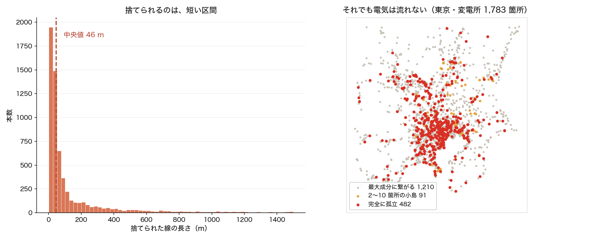
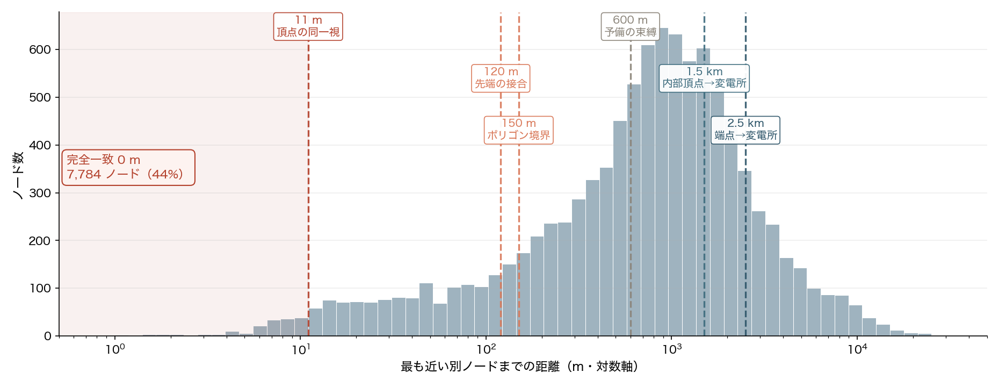
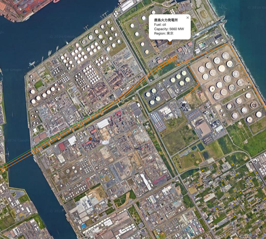
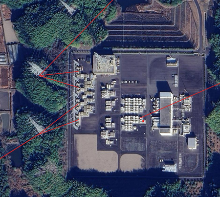
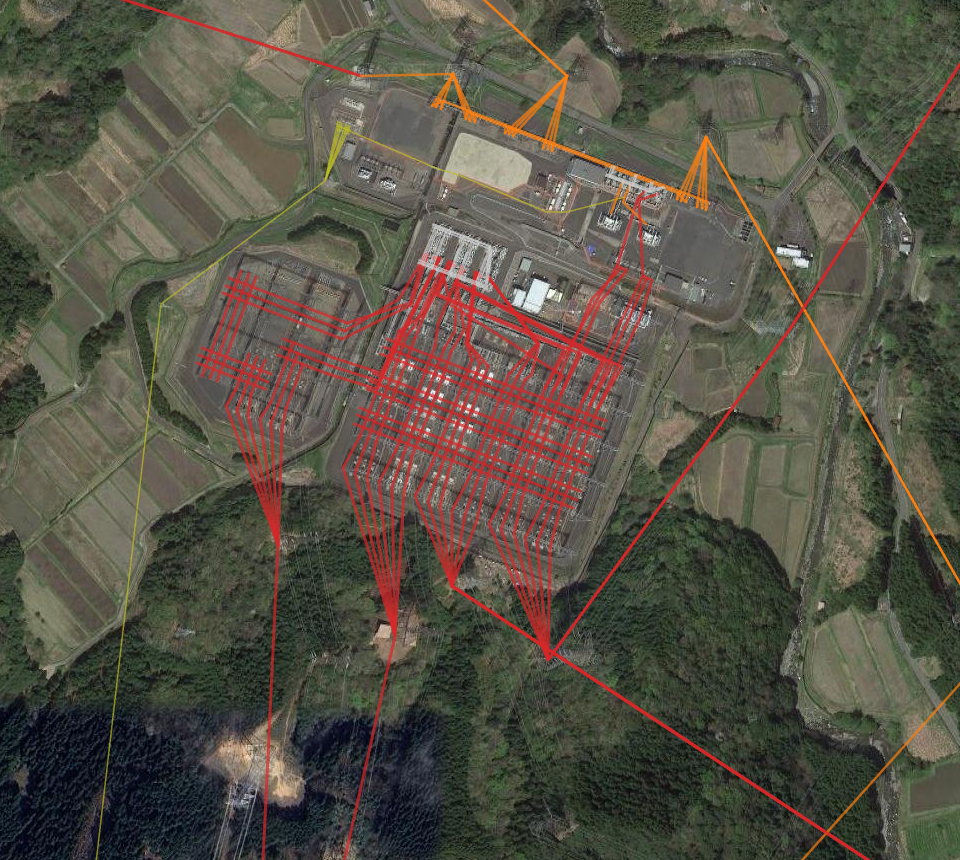

<!-- _class: title -->

# 地図から系統を組み上げる
## — OpenStreetMap をどうやって「計算できる送電網」にしたか —

林 〈名〉・重信 颯人（福井大学 電気電子情報工学科）

All-Japan-Grid &ensp;|&ensp; 2026年9月

<!-- note: 本発表は成果の紹介ではなく、構築プロセスの技術報告。数字の出典は各スライド脚注に「論文」「実装記録」「本発表の実測」を明示する。著者名の〈名〉は要確認。 -->

---

<!-- _class: rq -->

# この発表の問い

地図には線が描いてある。では、その線を「潮流計算できる系統」にするには、何を決めなければならないのか？

— 決めごとの大半は、論文の1行に圧縮されている

<!-- note: 論文では「Haversine距離で最近傍変電所に対応付ける（閾値50km）」の1行。実際にはその下に閾値が8段ある。今日はそこを話す。 -->

---

<!-- _class: sections -->

# なぜ、公開モデルが要るのか

  2025年4月｜イベリア半島の大規模停電
  高い再エネ比率のもとでの慣性不足と広域連系の脆弱性が問題になった。しかし欧州でも、事故後の**独立した学術解析**は系統インピーダンスや PMU 実測値の入手困難が障壁になっている。

  日本｜状況はもっと厳しい
  インピーダンス・変圧器特性・ノード別需要配分は非公開。WAMS データも研究目的では公開されない。一方で 2024 年度末の系統接続済み再エネは約 200 GW。**影響を測る基盤だけが無い。**

  結果として起きていること
  空き容量・連系線混雑・潮流変化を独立に事前評価できない。接続可能性の判断が一部に集中し、脆弱箇所の特定も事故原因の独立検証も時間と費用を要する。論文はこれを ==系統解析の「民主化」の欠如== と呼んでいる。

出典: 論文 1章「まえがき」。

---

<!-- _class: table-slide -->

# OSM が持っているもの・持っていないもの

## 位置はほぼ完璧、電気はゼロ

| 属性 | OSMタグ | 生記録率 | 補完後 |
|---|---|:---:|:---:|
| 地理座標 | `geometry` | ≈100% | 100% |
| 変電所輪郭 | polygon | ≈60% | 重心で補完 |
| 電圧 | `voltage` | ≈70% | ≈85% |
| 架空/地中 | `location` | ≈30% | 未補完 |
| 事業者名 | `operator` | ≈65% | ≈100% |
| 設備容量 | `capacity_mw` | ≈7% | P03照合 |
| **インピーダンス** | — | **0%** | 電圧別参照表 |
| **変圧器特性** | — | **0%** | 電圧比推定 |
| **遮断器** | — | **0%** | 非公開・未補完 |

出典: 論文 表1（全国集計）。太陽光 17,527 箇所のほぼ全てが容量未記録。

---

<!-- _class: sections -->

# 生データは、そのままでは1行も計算できない

  電圧タグ｜約 30% が不正値
  `voltage=0`・空文字・**単位系混在（V と kV）** が全線路の約30%。まず日本の標準電圧（66/110/154/275/500 kV）へスナップして初めて「電圧クラス」という概念が使える。

  属性欠損｜107,383 件
  名称欠損 49,384・事業者欠損 41,563・燃料種未知 334。7段階の補完で **93,297 件（87%）** を埋めた。補完の由来は `_enriched_by:"p03_match"` のように**1件ずつタグで残す**。

  接続情報｜そもそも存在しない
  OSM の送電線は ==座標点列だけ== を持つ。「この線がどのバスに繋がるか」は**どこにも書かれていない**。ここを決めるのが本発表の主題。

出典: 論文 2.1 節。

---

<!-- _class: statement -->

本題はここから。
点と線を、どうやって結ぶのか。

---

<!-- _class: figure -->

# 論文どおりの方法を、そのまま追試してみる

棄却されるのは **本数で 78%**（6,503 本）だが **総延長では 16.3%** — 捨てられるのは中央値 46 m の短い枝。それでも変電所 1,783 箇所は 522 個の断片に割れ、**27% が孤立**する。

<!-- note: ここが今日いちばん言いたいこと。「8割捨てている」は本数の話で、長さでは16%。だから地図を見ても気づけない。気づけるのは連結性を数えたとき。自前再実装1,832本／本番コード1,829本／論文記録6,476本の三つが78%で一致している。 -->

---

<!-- _class: figure -->

# 閾値は、この分布のどこを切るか

最近傍距離（対数軸・n=17,738）。**44% は完全に同一座標**。山は 600 m〜1.5 km にあり、==閾値は谷ではなく山の中を通っている== — だから「半径いくつ」ではなく幾何そのものを根拠にする必要があった。

<!-- note: この図は本発表のために built モデルから直接計算した（scipy cKDTree・平面近似）。閾値の線は実装の既定値。 -->

---

<!-- _class: flow -->

# 頂点グラフ ＋ 許容スナップ

## 捨てずに繋ぐ｜線の形そのものを土台にする

変電所が無い場所でも、2本の線が同じ座標を共有していれば OSM 上の分岐（タップ）として接続する。

---

<!-- _class: table-slide -->

# 閾値は1つではなく、8段ある

## 何を同一視するかで、段ごとに根拠が違う

| 閾値 | 値 | 何に効くか |
|---|---:|---|
| 頂点の同一視 | **11 m** | この精度で座標を共有する線は電気的に接続とみなす |
| 先端の接合 | **120 m** | 行き止まりの先端と別ノード＝同じ鉄塔とみなす |
| ポリゴン境界 | **150 m** | 変電所の敷地境界からこの距離まで束ねる |
| 予備の束縛（内部/端点） | **400 / 600 m** | 点で描かれた変電所・ポリゴン欠損の受け皿 |
| 内部頂点 → 変電所 | **1.5 km** | 近くを通過するだけの回廊を誤融合させない |
| 端点 → 変電所 | **2.5 km** | 端点だけ緩める（次スライド） |
| 旧・端点マッチ | 50 km | 論文に載っている値。上記に置き換えた |
| 孤立成分の橋渡し | 最大 300 km | 最後の手段。KD木で主成分へ |

出典: 実装記録 `build_network_snapped()` の既定値。上6段はすべて m 単位の判断。

---

<!-- _class: before-after -->

# 「重心から半径」をやめ、OSM のポリゴンを根拠にした

  重心＋半径
  変電所を1点（重心）に潰し、半径で束ねる。→ 東京で **3,365 本**の線が、経路が 1 km 以内に近づきもしない変電所に繋がっていた。逆に敷地の広い北総 275 kV は取り残されて次数1のまま。

  ポリゴン束縛
  頂点が変電所の**OSM ポリゴンの内側**、または境界から 150 m 以内にあるときに束ねる —— ==地図自身が描いている基準==をそのまま使う。誤結合 **3,365 → 0**。東電実測との順位相関は幹線 .615 → **.647**、154 kV .095 → **.215**。

出典: 実装記録（東京・A/B 実測、台帳84）。オーナー指示「まずは OSM にちゃんと忠実に系統作ってほしい」による方針転換。

---

<!-- _class: sections -->

# 閾値の根拠は、だいたい物理的な理由がある

  端点だけ 2.5 km に緩めた理由｜「デジタイズが敷地のフェンスで止まる」
  実測すると線路端点の **6〜8%** が変電所から 1.5〜2.5 km の位置にいる。マッパーが送電線を描くとき、変電所の**敷地境界で描画をやめる**ため。2.5 km に緩めて関西 +506、東京 +1,340 端点を回収した。一方**内部頂点は 1.5 km のまま**にする — 緩めると、変電所の脇を通過するだけの回廊が誤って吸い込まれる。

  先端 120 m の接合｜「数メートル先に別のノードがあるなら、それは同じ鉄塔」
  行き止まり（次数1）の先端**だけ**を、同じ電圧クラスの最近傍ノードに繋ぐ。行き止まりに限定し、電圧クラスで守るので、**並行する回廊は触らない**。

出典: 実装記録（2026-06-10 実測）。

---

<!-- _class: sections -->

# 同じ座標にあっても、繋いではいけない場合がある

  多層変電所｜1,535 箇所が座標を完全共有
  変電所は電圧クラスごとにバスを持ち、**座標は完全に同じ**。ここを「座標→1つのID」に潰すと、層間リンク（＝変圧器）が `i == j` で自己ループ扱いされて消える。実際に別スクリプトで **2,180 本の変圧器リンクが図から消えた**ことがある。

  共有鉄塔の交差｜頂点の約 1%
  異なる電圧クラスの2本が同じ鉄塔座標で交差しているだけの場所を繋ぐと、==偽の電気的接続==になる。junction も電圧クラスでキー付けして融合を防ぐ。電圧不明の線だけは、その座標にある最高既知クラスに合流させる。

出典: 実装記録 `src/topology/coords.py`・`multi_voltage` オプション。1,535 箇所は本発表で built から実測（異なる kV を含む共座標の数）。

---

<!-- _class: cols-2 -->

# 電圧タグの穴は、回廊をたどって埋める

## 北陸で起きていたこと

主要 154 kV 回廊の **23% がタグ無し**。タグの無い区間で背骨が切れ、そこを合成線で繋いだ結果、**合成線率 11.1%** という不健全なモデルになっていた。

穴を「推測で埋める」のではなく、**両隣が一致するときだけ**継承する。

合成線は「OSM に無いので引いた線」であり、多いほどモデルは実在から離れる。タグの穴を埋めれば、その多くは**実在する線**で置き換わる。

## 伝播のルール

1. 頂点で見える既知クラスが**すべて1つに一致**するときだけ、そのクラスを継承
2. 2クラスが混在する頂点は**不明のまま残す**
3. タグ無し区間の連鎖を反復で歩き、回廊全体へ伝播
4. 推論した枝は `kv=prop`、タグ由来は `kv=tag` と**来歴を区別して記録**

出典: 実装記録 `propagate_voltage`（北陸ケーススタディ）。

---

<!-- _class: sections -->

# 余談：名前で照合すると、255 km 先に繋がる

  何が起きたか
  公表資料と突き合わせるとき、施設名の部分一致（contains）で対応づけた。ところがモデル側に **`変電所` `発電所` という名前だけのノードが実在**し、`変電所` ⊂ `新小野田変電所` が成立して **255 km 先の別施設**に繋がった。北海道では `宇円別変電所` → `七飯発電所` で **314 km**。

  どうやって気づいたか
  迂回係数（実長 ÷ 端点間直線距離）の中央値が **0.964** になった。送電線が直線より短いことはあり得ない。==数値が物理的にあり得ない== ので気づけた。率だけ見ていたら通っていた。

  直した結果、照合率は下がった
  generic 語を除外し、部分一致は双方 4 文字以上を要求。**照合率 46.0% → 28.8%**。下がった方が正しい — 上がっていた分は偽陽性で、その誤ったインピーダンスが Ybus に入る。**カバレッジより正しさを取った。**

出典: `docs/reports/system_disclosure_survey_2026-08-11.md`。

---

<!-- _class: multi-result -->

# 結果：0/10 だった AC 潮流が、全地域で収束した

  AC 潮流の収束
  10/10
  パイプライン整備前は 0/10。発電機 15,980 台の自動登録・電圧零バスの補完・変圧器 3,956 台の自動挿入・スラック最適選択で到達

  全国系統損失
  1,601 MW
  うち東京が 994 MW（62%）。44 GW 超の負荷を反映した妥当な偏り

  Ybus 充填率
  &lt; 0.01%
  6,962 バス・20,369 非零要素。CSC 疎行列で保持し LU 分解に渡す

出典: 論文 表4・図5。東京単独の連結性は 522 成分・孤立 482 → 275 成分・孤立 117（本発表で両方式を同一データで実測）。

---

<!-- _class: table-slide -->

# おまけ：646 機の UC が 10 秒で解ける理由

## 二値変数 15,264 個・総変数 約 65,000 個

| 要因 | 効き方 |
|---|---|
| LP 緩和ギャップが **< 0.5%** | 経済合理的な起動パターンのため B&B 探索木が浅い |
| HiGHS プリソルブ | 起動バイナリの **40% 以上**が事前に確定・縮約される |
| 制約行列がブロック対角 | 10 地域の結合は 9 リンク × 24 時間 = **216 変数のみ**（充填率 < 0.1%） |
| 24 スレッド並列 B&B | 分枝を並列に展開 |

一般に商用ソルバでも **100 機以下が実用限界**とされる規模。解けたのは構造が素直だったからで、アルゴリズムの勝利ではない。

出典: 論文 3.2 節「646機MILP求解の技術的背景」。

---

<!-- _class: pros-cons -->

# 言えること / まだ言えないこと

<li>線の形（OSM ジオメトリ）を一次根拠にすれば、線を捨てずに繋げる</li>
<li>閾値は m 単位で、段ごとに物理的な根拠を付けられる</li>
<li>束ね方の違いは順位相関で測れる（幹線 .615 → .647）</li>
<li>補完・推論の来歴を1件ずつ残せる（`_enriched_by` / `kv=prop`）</li>

<li>インピーダンス・変圧器定数は合成推定値（OSM にはゼロ）</li>
<li>遮断器情報が無く、機器レベルの事故解析はできない</li>
<li>架空/地中の区分は約 30% しか分からず未補完</li>
<li>端点マッチの誤接続は 2〜3% 残る</li>
<li>運用計画には使えない（研究・教育用のベースライン）</li>

---

<!-- _class: takeaway -->

# 持ち帰っていただきたいこと

「地図を系統にする」の実体は、閾値を1つずつ物理的に正当化していく作業だった

<li>点の 44% は同一座標・最近傍の中央値は 80 m — 判断は m 単位で要る</li>
<li>本数の 78% を捨てても延長では 16%。**連結性を数えて初めて分かる**</li>
<li>照合率が下がる修正が正しいこともある（46.0% → 28.8%）</li>

---

<!-- _class: end -->

# ご清聴ありがとうございました

質疑をお願いします

github.com/lutelute/All-Japan-Grid

---

<!-- _class: gallery-img -->

# 衛星画像に重ねて位置を確かめる

鹿島火力（茨城）— 本体から 500 kV 線が伸びる

阿南周波数変換所（徳島）— 東西連系の引込み線

嶺南変電所（福井）— 若狭湾の 500 kV 集約点

出典: 論文 図4。抽出した座標が実在の設備と合っているかは、最後は目で確かめる。

---

<!-- _class: appendix -->

# 7段階の属性補完

Appendix B

| 段階 | 手法 | 主対象 |
|:---:|---|---|
| 1 | ベースライン監査・欠損分類 | 全体 |
| 2 | Nominatim 逆ジオコーディング | 変電所名 |
| 3 | 国交省 P03 施設データ空間照合 | 発電所 |
| 4 | Overpass タグ一括取得（500件/回） | 属性全般 |
| 5 | Nominatim ジオコーディング（後退） | 発電所 |
| 6 | 最近傍変電所マッチング（50 km 閾値） | 送電線名 |
| 7 | 燃料種別正規化（44 エントリ対応表） | 発電所 |

出典: 論文 表2。全国10地域の取得・補完の所要時間は約2時間。出力は {region}_{substations|lines|plants}.geojson の30ファイル。

---

<!-- _class: appendix -->

# 電圧クラス別の線路パラメータ

Appendix C

| V (kV) | R (Ω/km) | X (Ω/km) | B (µS/km) | I_max (kA) |
|---:|---:|---:|---:|---:|
| 500 | 0.012 | 0.290 | 4.10 | 4.0 |
| 275 | 0.028 | 0.325 | 3.85 | 2.0 |
| 154 | 0.050 | 0.380 | 3.50 | 1.0 |
| 110 | 0.055 | 0.385 | 3.45 | 0.9 |
| 66 | 0.120 | 0.400 | 3.20 | 0.6 |

出典: 論文 表3。変圧器は電圧比 1.5 超の接続を変圧器として解釈し、電圧クラス別の既定値（S_n・v_k・v_kr）を当てる。

---

<!-- _class: table-slide -->

# 全地域 AC 潮流結果

## Appendix D｜パイプライン整備前は 0/10、現在は全地域で収束

| 地域 | バス数 | 発電機数 | 損失 (MW) | V範囲 (pu) |
|---|---:|---:|---:|:---:|
| 北海道 | 471 | 350 | 43.7 | 0.06–1.00 |
| 東北 | 901 | 1,063 | 145.5 | 0.93–1.00 |
| 東京 | 1,726 | 6,484 | 994.1 | 0.90–1.00 |
| 中部 | 1,163 | 3,294 | 120.7 | 0.88–1.01 |
| 北陸 | 267 | 379 | 12.5 | 0.98–1.01 |
| 関西 | 902 | 1,163 | 133.1 | 0.65–1.00 |
| 中国 | 531 | 821 | 38.0 | 0.91–1.01 |
| 四国 | 258 | 496 | 40.3 | 0.88–1.00 |
| 九州 | 684 | 1,908 | 59.1 | 0.89–1.00 |
| 沖縄 | 59 | 22 | 12.3 | 0.94–1.00 |

出典: 論文 表4。合計 6,962 バス・15,980 発電機・損失 1,601 MW。北海道 0.06・関西 0.65 の電圧下限は低圧ポケットの残存を示す。

