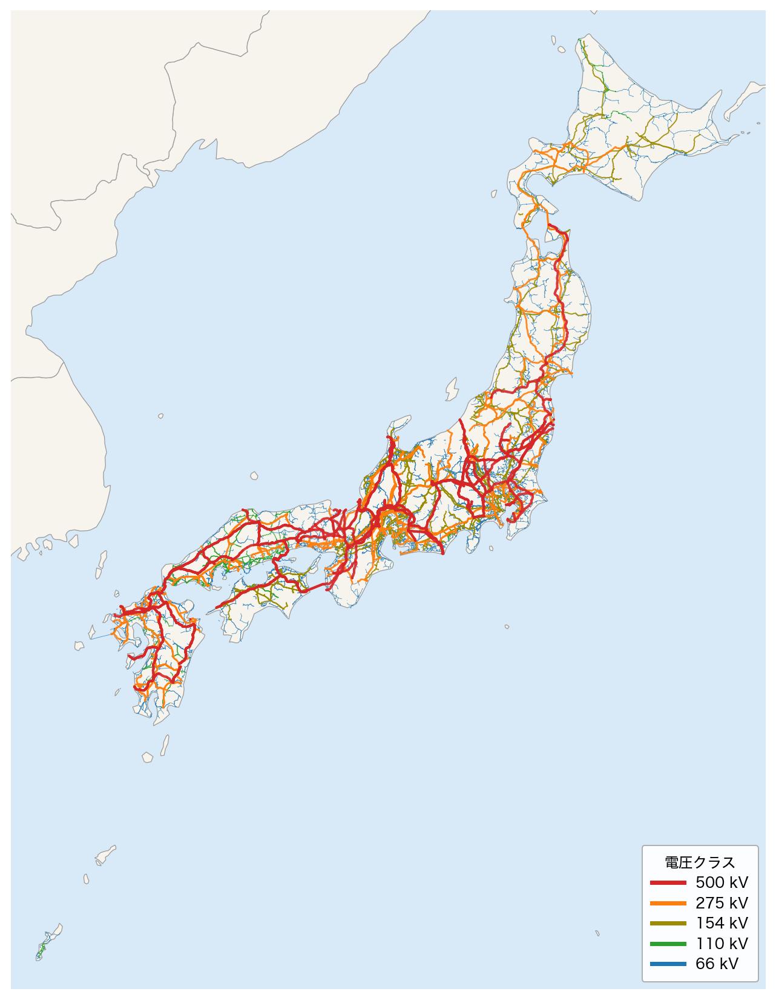
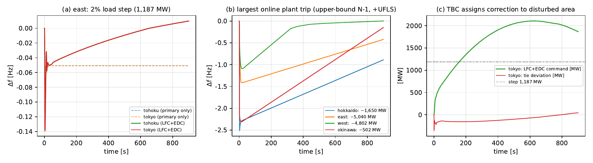
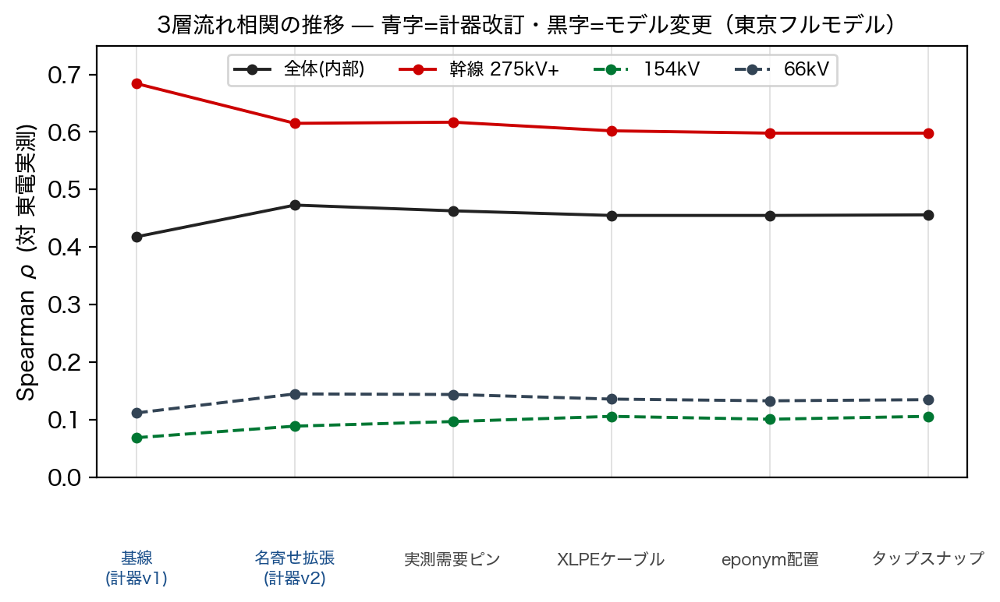

<!-- _class: title -->

# All-Japan-Grid
## — OpenStreetMap から日本全国の送電網を自動抽出する —

林 〈名〉・重信 颯人（福井大学 電気電子情報工学科）

IEEE Open Access 投稿原稿 &ensp;|&ensp; 2026年9月

<!-- note: 著者名の「名」は論文原稿で TBD のまま。発表前に確定させること。15分・質疑込み想定。 -->

---

<!-- _class: graphical-abstract -->

# 本研究の全体像

## 一枚で｜問い → 課題 → 提案 → 成果

  問い
  公開系統モデルが存在しない国で、**誰でも再現できる**系統研究の出発点を作れるか？

  課題
  日本にはバス単位の公開モデルが無い。OSM にあるのは地理だけで、**電気的パラメータが無い**。

  提案
  OSM抽出 → 属性補完 → 接続生成 → 標準形式
  地理トポロジと電気モデルの間を ==自動パイプライン== で埋める。

  成果
  40,077
  10地域・6,962変電所・40,077線路
UC→潮流→AGC を一本で貫通

データ: OpenStreetMap（Overpass API）＋ 国土交通省 P03 ＋ OCCTO 公表値。全10エリア・50/60 Hz。

<!-- note: 表紙の次にここで全体像を渡す。細部は以降のスライドで開く。 -->

---

<!-- _class: rq -->

# 本研究の問い

公開されている地理情報だけから、日本全国の送電網を「計算できるモデル」として組み上げられるか？

— そして、そのモデルはどこまで信じてよいのか

<!-- note: 後半の問い（どこまで信じてよいか）が本発表の後半＝検証パートに対応する。 -->

---

<!-- _class: sections -->

# なぜ日本では系統研究が再現できないのか

  米国・欧州｜モデルは公開されている
  米国は FERC Form 715 が系統モデルの開示を義務づけ、欧州は ENTSO-E 透明性プラットフォームがデータを公開する。研究者は同じ土俵で比較できる。

  日本｜バス単位の公開義務が無い
  OCCTO は連系線容量と需給計画を公表するが、**インピーダンス・変圧器定数・ノード別需要は非公開**。10の一般送配電事業者が 50/60 Hz の二周波数系統を運用しているのに、共通のベースラインが存在しない。

  OSM｜地理はあるが、電気が無い
  OpenStreetMap は変電所の位置・送電線の経路・発電所を持つ。しかし ==どのバスに繋がるか== という接続情報も、R・X・B も持たない。この隙間を埋めるのが本研究。

---

<!-- _class: figure-full -->

# 抽出された全国送電網

全10エリアの抽出結果。色は電圧クラス（500 / 275 / 154 / 110 / 66 kV）。赤い 500 kV が本州の背骨を成し、東西で周波数が変わる。線が薄い地域は OSM 側の記載が薄い地域で、モデルの限界が地図上にそのまま見える。

---

<!-- _class: kpi -->

# データセットの規模

  6,962
  変電所

  40,077
  送電線

  19,138
  発電所

  274 GW
  合計設備容量

<!-- note: 地域別の内訳は補足 Appendix A に表で入れてある。 -->

---

<!-- _class: flow -->

# 構築パイプライン

## 地理から電気へ｜5段階すべてスクリプト化され、再実行で同じ結果が出る

<!-- note: 各段階は独立に再実行できる。ここが「再現可能なベースライン」という主張の根拠。 -->

---

<!-- _class: equation -->

# 接続は距離で決める

$$d = 2R\,\mathrm{atan2}\!\left(\sqrt{a},\ \sqrt{1-a}\right)$$

  d
  線路端点から変電所までの大円距離（R = 地球半径 6,371 km）

a は緯度差・経度差から作る中間量。接続は 50 km 以内の最近傍変電所だけに許す。両端バスの電圧比が 1.5 以上の線路は変圧器として再解釈し、4段階の定数表（800/400/200/100 MVA）を当てる。孤立成分は KD-tree 最近傍探索で最大 300 km まで橋渡しし、連結率 99.7% に到達。自己ループは棄却。

---

<!-- _class: before-after -->

# 生の OSM は、そのままでは使えない

  Before
  名称の空欄 49,384 件・運用者不明 41,563 件・燃料種不明 334 件。送電線はどのバスに繋がるかを持たず、ジオメトリの座標列があるだけ。

  After
  7段階のエンリッチメント（P03 空間結合・Overpass タグ一括取得・逆ジオコーディング・燃料種正規化44項目）で属性欠損を 87% 削減。端点マッチングでバス接続を生成し、連結率 99.7%。

---

<!-- _class: multi-result -->

# 他のツールへ、そのまま持ち出せる

  CGMES 検証
  10/10
  IEC 61970 CIM/CGMES 2.4.15（EQ+TP+SSH+SV+GL）で全10地域が厳密スキーマ検証に合格、dangling 参照ゼロ

  独立実装で往復
  10⁻⁴ p.u.
  pandapower cim2pp という別実装を通した往復で母線電圧が一致。回帰テストで固定済み

  潮流ソルバ
  20 種
  NR・FDPF・GS・連続法など4系統20手法。IEEE 14/118/300 バスで全て収束を確認

出力形式: pandapower / MATPOWER / IEC CIM・CGMES（ネイティブ出力、境界セット付き）。

---

<!-- _class: table-slide -->

# 全国 757 機の起動停止を 10 秒で解く

## 混雑制約を入れると、運用費は +1.40%

| シナリオ | 運用費（十億円/日） | 求解時間 (s) |
|---|:---:|:---:|
| コッパープレート（連系制約なし） | 7.65 | 9.28 |
| 連系線容量を課した場合 | 7.76 | 8.72 |
| **混雑プレミアム** | **+1.40%** | — |

**9本すべての連系線がピーク需要下で 100% 利用率に達する** — MILP（HiGHS）で最適性を保証したうえでの結果

757機・10地域・24時間・9連系線。最小起動停止時間・ランプ率・予備力・蓄電池SOCを制約に含む。

---

<!-- _class: figure-full -->

# 組み上げたモデルは、24時間動かせる

UC の時間別解を潮流計算に流し込んだ全国24時間断面。全4同期島（北海道・東50 Hz・西60 Hz・沖縄）でAC潮流が収束する。

<!-- note: ここはアニメーション。PowerPoint のスライドショーで自動再生される。西島は 7,928 バスで、8本の暫定 infeed を入れた上での収束であることを口頭で補足。 -->

---

<!-- _class: figure-full -->
<!-- source: 本論文 Fig. 1（UC → 潮流 → AGC チェーン） -->

# 需給計画から周波数制御まで、一本で繋ぐ

(a) 東地域の2%負荷ステップ：一次応答は −ΔP/β の理論値に落ち着き、LFC+EDC が周波数を戻す。(b) 島ごとの最大機脱落＋UFLS。(c) TBC により外乱発生エリアの指令だけが伸び、隣接エリアの指令はゼロに戻る。

<!-- note: エリア間同期化係数 T_ab はモデルの実線路から「測って」いる。通常のLFC研究では仮定するしかない量。206 pu/rad の関西–四国が最弱=本四連系を正しく当てている。 -->

---

<!-- _class: big-number -->
<!-- source: 本論文 Table V（島ピーク時・AGC30 標準モデル定数） -->

# 北海道だけが、負荷遮断なしには止まらない

  −2.51 Hz
  最大機脱落時の周波数最下点
  1,650 MW 脱落・慣性 14.3 GW·s・RoCoF −2.88 Hz/s。1,141 MW 遮断で下げ止まる — 2018年の全域停電と構造的に整合

<!-- note: 東は −1.41 Hz、西は −1.09 Hz で遮断なしに吸収する。対比が効くので口頭で必ず言う。定数は公表典型値であり、運用予測ではないことも同時に言う。 -->

---

<!-- _class: sections -->

# どこまで信じてよいか — 3つの独立検証

  実測潮流との順位相関｜ρ = 0.721（東京電力の線路別実測）
  ただし ==これは容量・トポロジの代理指標== であって、潮流量の一致ではない。PyPSA-Eur の ρ=0.96–0.998 は「こう長」を測った別物で、直接は比較できない。合成負荷のAC潮流では内部 ρ≈0.46・幹線 0.60。

  電圧クラスの突合｜関西 37/38 線が一致（97%）
  関西送配電の154 kV以上の公表幹線と照合。限界は、公表182線のうち OSM 幾何と一意に対応づけられたのが 38 線に留まること。一致の主張は電圧クラス水準に限る。

  標準形式の往復｜CGMES 10/10 VALID・独立実装で 10⁻⁴ p.u.
  これは独立パーサに対する自己整合性の確認であり、外部の真値に対する検証ではない。構造スコアは変電所 recall 86%・発電所接続 recall 55%。

---

<!-- _class: pros-cons -->

# 言えること / まだ言えないこと

<li>全10エリア・50/60 Hz の公開ベースラインを再現可能な形で構築</li>
<li>CGMES・pandapower・MATPOWER で他ツールへ持ち出せる</li>
<li>UC → 潮流 → AGC を同一の運用点で貫通させられる</li>
<li>研究・教育・アルゴリズムのベンチマークに使える</li>

<li>インピーダンス・変圧器定数は合成推定値</li>
<li>端点マッチングの誤接続が 2〜3%</li>
<li>西島はスラック 13%・暫定 infeed 8本に依存</li>
<li>AGC 定数は公表典型値（構造の実演であり運用予測ではない）</li>
<li>外部検証は東電・関西の2件のみ（残り8エリアに公開真値が無い）</li>
<li>運用計画には使えない</li>

---

<!-- _class: takeaway -->

# 持ち帰っていただきたいこと

公開データだけで、日本にも「動く」全国系統ベースラインを置けた

<li>6,962 変電所・40,077 線路を抽出し、属性欠損を 87% 削減</li>
<li>CGMES 往復・757 機 UC・4島 AGC を一本で通した</li>
<li>検証の射程を数値と同じ場所に書いた（ρ=0.721 は容量代理）</li>

---

<!-- _class: end -->

# ご清聴ありがとうございました

質疑をお願いします

github.com/lutelute/All-Japan-Grid

---

<!-- _class: appendix -->

# 地域別データセット内訳

Appendix A

| 地域 | 変電所 | 送電線 | 発電所 | Hz |
|---|---:|---:|---:|:---:|
| 北海道 | 471 | 4,136 | 436 | 50 |
| 東北 | 901 | 6,628 | 1,311 | 50 |
| 東京 | 1,726 | 8,295 | 7,207 | 50 |
| 中部 | 1,163 | 6,589 | 3,792 | 60 |
| 北陸 | 267 | 2,296 | 432 | 60 |
| 関西 | 902 | 3,994 | 1,518 | 60 |
| 中国 | 531 | 3,176 | 1,173 | 60 |
| 四国 | 258 | 1,532 | 688 | 60 |
| 九州 | 684 | 3,314 | 2,581 | 60 |
| 沖縄 | 59 | 117 | — | 60 |

合計: 変電所 6,962 ／ 送電線 40,077 ／ 発電所 19,138（設備容量 約 274 GW）。沖縄は OSM 上に発電所レコードが無い。

---

<!-- _class: appendix -->

# 地域間連系線（9本・計 24,050 MW）

Appendix B

| From | To | 容量 (MW) | 種別 |
|---|---|---:|:---:|
| 北海道 | 東北 | 900 | HVDC |
| 東北 | 東京 | 5,550 | AC |
| 東京 | 中部 | 2,100 | FC |
| 中部 | 関西 | 2,530 | AC |
| 中部 | 北陸 | 1,900 | AC |
| 関西 | 中国 | 4,090 | AC |
| 関西 | 四国 | 1,400 | AC |
| 中国 | 四国 | 1,200 | AC |
| 中国 | 九州 | 2,780 | AC |
| **合計** | | **24,050** | — |

---

<!-- _class: appendix -->

# 島別 AGC 結果（島ピーク時・FY2023 シナリオ）

Appendix C

| 島 | 需要 MW | 慣性 GW·s | 最大機 MW | RoCoF | 最下点 | 復帰 s |
|---|---:|---:|---:|---:|---:|---:|
| 北海道 | 4,434 | 14.3 | 1,650 | −2.88 | −2.51 | 240 |
| 東 | 59,353 | 245.6 | 5,040 | −0.51 | −1.41 | 347 |
| 西 | 69,938 | 332.5 | 4,802 | −0.43 | −1.09 | 788 |
| 沖縄 | 1,682 | 6.3 | 502 | −2.39 | −2.31 | 198 |

発電機粒度はプラント単位（P03 由来）のため、脱落シナリオはユニット N-1 の上限値。UFLS は公表典型値の3段ラッチ式。

---

<!-- _class: figure -->

# 検証スコアの推移（東京フルモデル）

（Appendix D）計器改訂とモデル変更を重ねたときの、東京電力実測に対する Spearman 順位相関の推移。幹線（275 kV+）は 0.60 前後で安定する一方、154 kV 以下は低いまま動かない — 下位電圧の網が実測を説明できていないことを示す（出典：リポジトリ同梱の検証スコアカード）。

